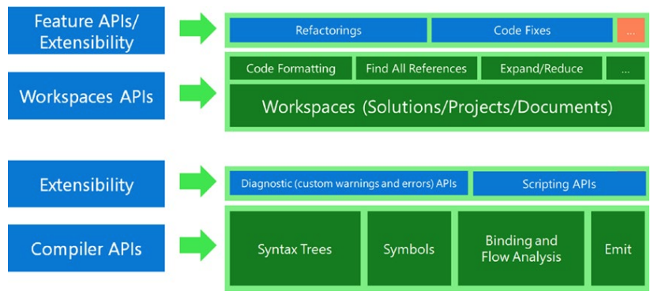

# 기초 입문서
이 장에서는 Visual Studio 확장을 배우고 개발하기 위한 여정의 시작을 표시합니다. 이 길을 닦기 위해 우리는 이 책을 통해 필요하고 Visual Studio 확장을 개발하기 위한 전제 조건을 빠르게 복습할 것입니다. 이 장은 기본 사항에 대한 입문서 역할을 할 것이며 여기에서 다루는 주제에 정통한 독자는 건너뛸 수 있습니다. 기본 사항을 살펴보기 전에 가장 먼저 떠오르는 질문은 "왜 Visual Studio를 확장해야 합니까?"입니다. 그럼 먼저 답을 드리겠습니다.

***
## <font color='dodgerblue' size="6">1) Visual Studio를 확장해야 하는 이유는 무엇인가요?</font>
왜 Visual Studio IDE를 확장해야 합니까?  

나는 이 질문을 여러 번 들었고 수많은 소프트웨어 개발자가 이 매우 적절한 질문을 하는 것을 보았습니다. 그래서, 우리는 여기 왜? Visual Studio는 훌륭한 IDE이며 개발자를 코딩, 개발, 디버깅 및 문제 해결에서 매우 생산적으로 만듭니다. 그렇다면 굳이 굳이 연장을 해야 하는 이유는 무엇일까요? 글쎄요 – 그렇게 하는 데에는 여러 가지 이유가 있습니다. 상위 항목 중 일부는 다음과 같습니다.

* 요구 사항과 환경에 맞게 Visual Studio를 사용자 지정합니다. 
* 반복적이거나 지루한 작업을 피하기 위해. 확장 기능을 사용하면 버튼 하나만 클릭하면 됩니다. 
* 생산성을 높일 수 있으므로 작업을 더 빠르게 수행하십시오. 스니펫, GUID(Globally Unique Identifier) 생성 도구, 코드 분석, 코드 리팩토링 또는 프로젝트 형태일 수 있습니다.
* 고품질 개발 – Roslyn 분석기, StyleCop, FxCop, CodeMaid, Resharper와 같은 몇 가지 훌륭한 확장 프로그램이 있으며 개발자가 코딩 중에 문제를 식별하는 데 도움이 됩니다. 이렇게 하면 향후 불필요한 버그가 방지되고 코드가 코딩 표준을 준수하여 품질이 향상될 수 있습니다. 
* 팀 전체에 정책 또는 설정을 적용합니다. 대규모 팀에서도 코드 일관성과 균일성을 얻는 데 도움이 되는 확장이 있습니다. 예를 들어 체크인 정책 확장은 각 코드 체크인에 연결된 작업 항목이 있고 StyleCop 및 FxCop 위반이 0개 있는지 확인할 수 있습니다. 이것이 없으면 코드는 확인되지 않습니다. 
* 물론, 명성과 재산은 마켓플레이스에서 무료로 훌륭한 확장 프로그램을 공유하여 커뮤니티에 기여할 수도 있고, 이를 수익화하고 소비자에게 사용료를 청구할 수도 있습니다. 훌륭한 확장 프로그램을 만들면 이름과 명성을 얻고 돈도 벌 수 있습니다. 
* 만약 ... Mads Kristensen이 Visual Studio 시장에서 가장 인기 있는 확장 작성자 중 한 명으로 125개의 확장 기능을 보유하고 있습니다. Visual Studio 확장성에 대한 그의 연설 중 하나에서 그는 새로운 Visual Studio 확장에 대해 어떻게 생각하고 그것을 아름답게 표현했는지 설명했습니다.

Visual Studio Marketplace(https://marketplace.visualstudio.com/)에서 사용할 수 있는 개발자 생산성, 품질, 리팩토링, 편집기 및 컨트롤을 개선하기 위한 Visual Studio용 확장이 많이 있습니다. 현재 시장에는 970만 개 이상의 확장 프로그램이 있으며 다운로드 수는 2,500만 개 이상입니다. 이제 기초를 닦는 탐구를 시작하겠습니다.


## <font color='dodgerblue' size="6">2) Compiler</font>
컴파일러의 기본 정의부터 시작하겠습니다. 컴파일러는 고급 언어로 작성된 모든 컴퓨터 프로그램을 저급 언어로 변환하는 소프트웨어입니다. 컴파일러를 더 자세히 이해하기 전에 이 정의에 사용된 용어를 하나씩 이해합시다.

* 소프트웨어: 컴퓨터에서 실행되는 모든 프로그램을 소프트웨어라고 합니다. 
* 프로그램: 무언가를 수행하는 소프트웨어의 모든 서브루틴, 방법 또는 기능을 프로그램이라고 합니다. 모든 프로그램에는 일반적으로 몇 줄의 코드가 있습니다. 
* 고급 언어: 영어와 같이 인간이 이해할 수 있는 언어에 가깝거나 유사한 모든 프로그래밍 언어를 고급 언어라고 합니다. 인간은 저급 언어에 비해 고급 언어를 이해하기가 훨씬 쉽습니다. C# 및 VB는 고급 언어의 예입니다. 
* 저수준 언어: 컴퓨터의 심장이며 컴퓨터가 받는 모든 명령의 실행을 담당하는 마이크로프로세서는 1과 0의 이진 언어만 이해합니다. 컴퓨터가 이해할 수 있는 이 바이너리 언어를 저수준 언어라고 합니다. 마이크로프로세서는 고급 언어를 있는 그대로 이해하지 못합니다.

따라서 사람이 이해할 수 있는 고급 언어 코드를 컴퓨터가 이해할 수 있는 저수준 언어 코드로 변환하려면 컴파일러가 필요합니다. 컴파일러의 주요 작업은 이러한 필수 변환/포팅을 수행하는 것입니다. 따라서 본질적으로 인간이 코드를 작성하고 컴파일러가 이를 컴퓨터가 이해할 수 있는 형식으로 변환한 다음 컴퓨터가 실행합니다. 

이제 CPU 아키텍처라는 또 다른 중요한 것이 있습니다. 명령을 처리하는 CPU는 32비트 프로세서(x86) 또는 64비트 프로세서(x64)일 수 있습니다. 메모리 공간과 명령어 세트는 이 두 아키텍처에 따라 다릅니다. x64 프로세서에는 64비트 주소와 메모리 공간이 있으므로 더 큰 메모리 주소에서 작동할 수 있습니다. 또한 더 빠른 실행을 위한 최적화로 몇 가지 새로운 지침이 있습니다. 따라서 프로세서를 적절하게 활용하려면 올바른 프로세서 특정 기계어 코드를 생성해야 합니다. 이것은 개발자가 한편으로 CPU의 x86 아키텍처에서 코드를 빌드하고 소프트웨어를 제공한다면 x86 기반 시스템과 x64 기반 시스템 모두에서 잘 작동하지만 최적의 사용을 하지 못할 것이라는 문제를 제시합니다. x64 프로세서. 반면에 개발자가 x64 프로세서에서 코드를 빌드하면 x86 프로세서 기반 시스템에서는 작동하지 않습니다. 

C#.NET 기반 응용 프로그램의 경우 모든 .NET 컴파일러가 코드를 프로세서 아키텍처와 독립적인 Microsoft Intermediate Language 또는 MSIL로 컴파일하므로 일반적으로 문제가 되지 않습니다. 처음 실행 시 이 MSIL은 플랫폼 아키텍처별 기계어로 변환됩니다. 이를 활용하기 위해 .NET 프로젝트 플랫폼(프로젝트 속성에서)을 CPU로 선택할 수 있습니다.

C# 코드가 머신에서 실행되는 방식에 대한 높은 수준의 흐름은 그림 1-1에 나와 있습니다.
   
그림 1-1. C# 코드 실행 흐름

예를 들어 콘솔에 메시지를 표시하는 작업을 수행하는 컴퓨터 프로그램이 있습니다. 코드 편집기를 사용하여 C# 언어로 작성되었습니다. 콘솔에 'Hello World!' 텍스트를 출력하는 샘플 프로그램입니다.

```cs
using System;
namespace BasicsPrimer
{
    class Program
    {
        static void Main(string[] args)
        {
            Console.WriteLine("Hello World!");
        }
    }
}
```

이 코드는 컴퓨터에서 실행되는 경우 콘솔에 원하는 텍스트를 인쇄합니다. 우리가 직면하게 될 유일한 문제는 컴퓨터가 이 코드를 이해하지 못한다는 것입니다. 0과 1의 이진 언어만 이해합니다. 따라서 이 프로그램을 컴퓨터가 이해하고 실행할 수 있도록 이진 언어로 변환해야 합니다. 컴파일러는 코드를 MSIL로 변환합니다. 프로그램을 실행할 때 .NET CLR(공용 언어 런타임)은 이 MSIL을 JIT(Just-In-Time) 컴파일을 기계 특정 코드로 수행합니다. 이 컴파일은 마이크로프로세서가 이해한 다음 변환된 기계 코드를 실행하여 그림 1-2와 같이 콘솔 창에서 "Hello World!"를 출력합니다.

   

그림 1-2. 헬로월드

## <font color='dodgerblue' size="6">3) SDK란?</font>
소프트웨어 개발 키트는 이름에서 알 수 있듯이 소프트웨어를 개발하기 위한 키트입니다. 이를 이해하기 위해 먼저 개발 키트에 대해 알아보겠습니다.  

키트는 무엇이든 만드는 데 필요한 도구 세트입니다(예: 목수가 망치, 끌 등과 같은 가구를 만들기 위해 도구 세트가 필요함). 마찬가지로 소프트웨어를 개발하려면 소프트웨어 개발 키트라고 하는 도구 집합 또는 개발 키트가 필요합니다. 약칭은 SDK입니다. 일반적인 SDK는 개발 환경에서 개발을 지원, 지원 및 용이하게 하는 DLL 및 라이브러리로 구성됩니다.   

.NET에서 작동하는 응용 프로그램을 개발해야 한다고 가정해 보겠습니다. 따라서 응용 프로그램을 개발하려면 .NET SDK가 필요합니다. .NET SDK는 다음(이에 국한되지 않음) 구성 요소로 구성됩니다.

* 개발 중 애플리케이션 실행/디버깅에 필요한 CLR(공용 언어 런타임).
* .NET Framework 등의 내장 기능을 사용하기 위한 BCL(Base Class Library) DLL

다른 SDK는 해당 SDK를 사용하여 소프트웨어를 개발하는 동안 개발자가 필요로 하는 내용에 따라 다른 콘텐츠를 갖습니다. 이 책에서 배우고자 하는 주제와 관련된 예를 하나 더 들 수 있습니다. Visual Studio 확장을 개발하려면 Visual Studio SDK(VSSDK)가 필요합니다. Visual Studio 설치 중에 관련 워크로드(다음 장에서 설명)를 추가하면 기본적으로 Visual Studio 확장을 개발하는 데 필요한 SDK를 설치하게 됩니다. 우리는 이 책을 통해 Visual Studio SDK에 대해 논의하면서 확장을 개발하고 필요에 따라 해당 구성 요소를 탐구할 것입니다.  
6장에서는 Roslyn이라고도 하는 .NET 컴파일러 플랫폼을 사용하는 코드 분석기 및 코드 수정 작업 확장을 개발할 것입니다. Roslyn은 "구문 트리"라고 하는 것을 광범위하게 사용하므로 트리 데이터 구조를 빠르게 요약해 보겠습니다. 트리 데이터 구조의 기본 사항에 이미 익숙하다면 이 새로 고침을 건너뛸 수 있습니다.

## <font color='dodgerblue' size="6">4) 트리 데이터 구조 요약</font>
이제 데이터 구조와 알고리즘으로 시작하는 프로그래밍의 몇 가지 기본 사항을 요약해 보겠습니다. 이 주제는 그 자체로 거대합니다. 전체 책이 데이터 구조에 대해 작성되었습니다. 그래서 저는 이 주제에 대한 간략한 요약을 제시하려고 합니다. 이러한 주제에 대한 자세한 내용은 이 책의 범위를 벗어납니다. 이 섹션에서는 트리 데이터 구조를 다시 살펴보겠습니다. 이 리프레셔는 Roslyn 기반 확장으로 작업하는 동안 편리합니다.  

시작하자.  

트리는 소프트웨어 개발 및 프로그래밍에서 많이 사용되는 중요한 데이터 구조입니다. 파일 시스템이나 조직 구조와 같은 모든 계층 구조는 트리 데이터 구조를 사용합니다. 이 장의 뒷부분에서 그리고 확장을 개발하는 동안 보게 될 Roslyn 또는 .NET 컴파일러 플랫폼에는 트리에 대한 지식이 필요합니다. 데이터 구조를 배우기 전에 먼저 추상 데이터 유형(ADT)에 대해 알아야 합니다. ADT는 데이터 구조와 데이터 구조에 대한 모든 가능한 작업의 조합입니다. 우리는 이것을 데이터 구조의 고수준 청사진이라고 부를 수 있습니다.  

따라서 데이터 구조는 본질적으로 ADT의 구현입니다. 예를 들어, 트리는 연결 목록 ADT의 구현인 데이터 구조입니다. 다음은 연결 목록의 ADT 정의입니다. 

"연결 목록은 노드 모음을 보유하고 순차적 방식으로 노드에 액세스하는 메커니즘을 제공하는 추상 데이터 유형(ADT)입니다."

연결 목록의 가장 기본적인 형태는 그림 1-3과 같이 각 노드가 다른 하나의 노드만 가리키는 단일 연결 목록입니다.

   

그림 1-3. 단일 연결 리스트

그림 1-3에서 완전한 각 상자를 노드라고 합니다. 각 노드는 데이터 부분(파란색)과 포인터 부분(노란색)의 두 부분으로 나뉩니다. 포인터 부분에는 연결 목록의 다음 노드에 대한 링크 역할을 하는 포인터(화살표로 표시)가 포함되어 있습니다. 연결 목록의 마지막 노드는 꼬리 노드라고도 합니다. Tail 노드는 다른 노드를 가리키지 않으므로 포인터 부분에 NULL 값이 할당됩니다. 연결 리스트의 첫 번째 노드는 헤드 노드라고도 합니다.  

이제 이 연결 리스트는 노드가 가리키는 노드의 수가 하나 이상이 되면 트리 데이터 구조가 됩니다. 변형을 봅시다.  

먼저 그림 1-4와 같이 수평 연결 리스트를 수직 연결 리스트로 변환합니다.


   
그림 1-4. 변형 단일 연결 리스트

이제 노드당 포인터가 그림 1-5와 같이 노드 중 하나 이상에서 하나 이상이 되도록 노드를 몇 개 추가합니다.

   
그림 1-5. 트리 데이터 구조

그림 1-5에서 원래 연결 리스트의 헤드 노드는 다양한 변형을 거쳐 트리의 루트 노드가 되었습니다. 또한 이 나무는 우리가 현실 세계에서 목격하는 나무와 다릅니다. 거꾸로 된 나무입니다(즉, 진정한 의미에서 거꾸로 된 나무). 그림 1-6에 표시된 실제 트리를 살펴보세요. 그 뿌리는 바닥에 있다.

   
그림 1-6. 트리 한개

이제 이 트리를 거꾸로 만들면 그림 1-7과 같은 트리 데이터 구조가 됩니다.

   
그림 1-7. 거꾸로 된 나무

이제 그림 1-8에 표시된 다이어그램을 사용하여 트리 데이터 구조의 다양한 부분을 이해합시다.

   
그림 1-8. 트리 데이터 구조의 일부

다음은 부품에 대한 설명입니다.

* 노드: 데이터가 저장되는 트리의 요소. 그림 1-8에서 볼 수 있는 채워지거나 비어 있는 모든 원형 원은 트리의 노드입니다. 
* 루트 노드: 트리 맨 위에 있는 노드를 루트라고 합니다. 트리당 하나의 루트만 있고 루트 노드에서 다른 노드로 가는 하나의 경로가 있습니다.
* 부모 노드: 자식이 있는 노드를 자식의 부모 노드(또는 상위 노드 또는 상위 노드)라고 합니다. 노드에는 최대 하나의 부모가 있습니다. 
* 자식 노드: 부모 노드가 있는 노드를 부모 노드의 자식(하위 노드)이라고 합니다. 노드에는 여러 개의 자식 노드가 있을 수 있습니다. 이진 트리(가장 일반적으로 사용되는 트리 유형)의 모든 노드에는 최대 두 개의 자식이 있을 수 있습니다. 
* 내부 노드: 내부 노드(내부 노드, 줄여서 inode 또는 분기 노드라고도 함)는 자식 노드가 있는 트리의 모든 노드입니다. 
* 외부 노드: 외부 노드(외부 노드, 리프 노드 또는 터미널 노드라고도 함)는 자식 노드가 없는 노드입니다. • 리프 노드: 자식 노드가 없는 노드를 리프 노드라고 합니다.
* 형제 노드: 트리에서 같은 수준에 있는 두 개의 노드를 형제라고 합니다. 
* 하위 트리: 하위 트리는 노드의 자손을 나타냅니다. 
* 분기/에지/링크: 트리의 두 노드 사이의 경로를 나무의 가장자리나 가지.

이제 데이터 구조의 다른 부분을 알았으므로 한 노드에서 다른 노드로 이동하는 방법을 살펴보겠습니다.

트리 순회: 트리 순회는 트리의 모든 노드를 순회하는 방법입니다. 트리 순회 동안 트리의 각 노드는 정확히 한 번 방문됩니다. 트리 데이터 구조를 처리하는 동안 아래 나열된 CRUD 작업에 노드 순회가 필요할 수 있습니다.

1. 새 노드를 생성합니다.
2. 노드 읽기/인쇄
3. 노드를 업데이트/수정합니다.
4. 노드 삭제

트리 순회는 다음 세 가지 방법으로 수행할 수 있습니다.

1. 순차 순회,
2. 선주문 순회,
3. 주문 후 순회.

이러한 메커니즘을 하나씩 이해합시다.  

* 순차 순회  
    이 순회 방법에서는 왼쪽 하위 트리를 먼저 방문한 다음 루트, 오른쪽 하위 트리를 차례로 방문합니다. 우리는 모든 노드가 그 자체로 하위 트리를 나타낼 수 있음을 항상 기억해야 합니다. 순서는 왼쪽-루트-오른쪽입니다. 예시를 통해 이해해보자.  

    그림 1-7과 같이 트리를 순서대로 순회할 수 있습니다. 우리는 머리/루트 노드에서 시작하고 그것은 1이다. 순차순회에 이어 왼쪽 서브트리 노드 2로 이동합니다. 이제 노드 2도 in-order로 탐색됩니다. 모든 노드를 방문할 때까지 프로세스가 계속됩니다. 이 트리의 순서 순회 출력은 다음과 같습니다.

    8, 4, 9, 2, 10, 5, 11, 1, 6, 13, 3, 14, 7

    순차순회 알고리즘은 다음과 같다.  
    
        모든 노드가 순회까지 
            재귀적으로 왼쪽 하위 노드를 순회
            루트 노드 방문
            재귀적으로 오른쪽 하위 노드 순회

* 선 주문 순회
    이 특정 순회에서 이름에서 알 수 있듯이 루트를 먼저 방문한 다음 왼쪽 하위 트리를 방문한 다음 오른쪽 하위 트리를 방문합니다. 노드의 모든 하위 트리는 동일한 사전 주문에 따라 순회해야 합니다. 순서는 root-leftright입니다. 더 나은 이해를 위해 예를 들어 보겠습니다.  

    그림 1-7에 표시된 트리의 선주문 순회를 수행할 수 있습니다. 루트 노드인 1에서 시작합니다. 선주문 순회에 이어 루트 노드를 방문한 다음 왼쪽 하위 트리 노드 2로 이동합니다. 이제 노드 2도 선주문으로 순회됩니다. 모든 노드를 방문할 때까지 프로세스가 계속됩니다. 해당 트리의 선주문 순회 출력은 다음과 같습니다.

    1, 2, 4, 8, 9, 5, 10, 11, 3, 6, 13, 7, 14

    선주문 알고리즘은 다음과 같다.  

        모든 노드가 순회까지 
            루트 노드 방문
            재귀적으로 왼쪽 하위 노드를 순회            
            재귀적으로 오른쪽 하위 노드 순회

* 주문 후 순회
    이 순회 방법에서는 왼쪽 서브트리를 먼저 방문한 다음 오른쪽 서브트리를 방문한 다음 루트 노드를 방문합니다. 이전 순회 방법에서 언급했듯이 모든 노드는 하위 트리 자체를 나타낼 수 있습니다. 왼쪽-오른쪽-루트를 기억하십시오. 예를 들어 최종 순회 방법을 이해합시다. 그림 1-7에 표시된 트리의 후위 순회를 수행할 수 있습니다. 루트 노드인 1에서 시작합니다. 후위 순회에 이어 루트 노드를 읽는 대신 왼쪽 하위 트리 노드 2로 이동합니다. 왼쪽 하위 트리가 탐색되면 오른쪽 하위 트리로 이동합니다. 결국 데이터 노드가 1인 루트 노드를 순회합니다. 순회되는 모든 하위 트리는 항상 후순위 방식으로 순회된다는 점을 기억하십시오. 모든 노드를 방문할 때까지 프로세스가 계속됩니다. 논의 중인 트리의 후위 순회 출력은 다음과 같습니다.

    8, 9, 4, 10, 11, 5, 2, 13, 6, 14, 7, 3, 1

    주문 후 알고리즘은 다음과 같다.  

        모든 노드가 순회까지             
            재귀적으로 왼쪽 하위 노드를 순회            
            재귀적으로 오른쪽 하위 노드 순회
            루트 노드 방문

이러한 모든 탐색에서 왼쪽 하위 트리가 오른쪽 하위 트리보다 먼저 탐색된다는 점에 유의해야 합니다. 루트의 순서만 변경됩니다. 이것은 순회를 마음으로 배울 필요가 없다는 점에서 도움이 될 것입니다.                

순서대로 - 루트가 중간에 방문됩니다.  
선주문 - 루트가 먼저 방문됩니다.  
사후 주문 - 루트가 마지막으로 방문됩니다.

우리는 Roslyn에 대해 논의하는 동안 트리 순회와 특정 유형의 노드 찾기에 대해 조금 더 알게 될 것입니다. Visual Studio는 매우 광범위하며 이러한 확장성의 대부분은 Visual Studio에서 MEF라고 하는 확장성 프레임워크를 기반으로 합니다. 이제 MEF로 넘어갑시다.


## <font color='dodgerblue' size="6">5) 매니지드 확장성 프레임워크 : Managed Extensibility Framework (MEF)</font>
MEF(Managed Extensibility Framework)를 이해하려면 이름의 처음 두 부분인 "Managed"와 "Extensibility"를 이해해야 합니다. 다음 용어를 하나씩 이해해 보겠습니다.
    
    * Managed(관리): CLR(공용 언어 런타임) 컨텍스트에서 실행되는 모든 코드를 관리 코드라고 합니다.
    * Extensibility(확장성): 클래스, 구성 요소, 프레임워크, 도구, IDE, 브라우저 등의 기능/동작을 확장하는 방법을 확장성이라고 부릅니다.

이제 공식 Microsoft 문서 페이지에서 가져온 MEF의 공식적인 정의를 살펴보겠습니다.    

    Managed Extensibility Framework 또는 MEF는 가볍고 확장 가능한 응용 프로그램을 만들기 위한 라이브러리입니다. 
    이를 통해 애플리케이션 개발자는 구성 필요 없이 확장을 검색하고 사용할 수 있습니다. 또한 확장 개발자가 코드를 쉽게 캡슐화하고 취약한 
    하드 종속성을 피할 수 있습니다. MEF를 사용하면 애플리케이션 내에서뿐만 아니라 애플리케이션 간에도 확장을 재사용할 수 있습니다.

MEF는 .NET Framework에서 쉽게 추가 기능 또는 플러그인 기반 확장 가능한 응용 프로그램을 만들기 위해 버전 4.0과 함께 .NET Framework 팀에서 제공했습니다. MEF는 .NET Framework 4 이상의 필수적인 부분이며 .NET Framework가 사용되는 모든 곳에서 사용할 수 있습니다. Windows Forms, WPF 또는 기타 기술을 사용하는 클라이언트 응용 프로그램이나 ASP.NET을 사용하는 서버 응용 프로그램에서 MEF를 사용할 수 있습니다.

MEF의 기본적이고 단순화된 이론은 응용 프로그램이 부분으로 구성된다는 것입니다. 따라서 구성할 필요 없이 부품 내보내기, 부품 가져오기 및 부품 구성을 통해 응용 프로그램을 확장할 수 있습니다. MEF는 다음을 제공합니다.

* 확장성에 대한 표준; 
* 선언적 속성 기반 프로그래밍 모델. 
* 런타임 시 구성을 통해 암시적으로 부품 검색을 위한 도구. 
* 풍부한 메타데이터 시스템.

System.ComponentModel.Composition 어셈블리는 MEF를 제공합니다. 이 네임스페이스를 가져오기만 하면 MEF를 사용할 수 있습니다. MEF의 높은 수준의 기본 아키텍처를 살펴보겠습니다(그림 1-9).

   
그림 1-9. MEF 기본구조

부품이라고 하는 MEF 구성 요소는 가져오기라고 하는 종속성과 내보내기라고 하는 해당 기능을 선언적으로 지정합니다. 부품이 생성되면 MEF 컴포지션 엔진은 사용 가능한 다른 부품의 가져오기를 충족합니다. 선언적 모델(속성) 때문에 거의 결합되지 않고 참조되는 어셈블리나 오류가 발생하기 쉬운 구성 파일에 의존하지 않고 런타임에 가져오기 및 내보내기를 검색할 수 있습니다. MEF를 사용하면 애플리케이션이 메타데이터를 통해 부품을 검색할 수 있습니다. MEF를 활용하는 응용 프로그램은 예를 들어 생성자 또는 속성에서 해당 종속성에 대한 가져오기를 선언하고 다른 부분에 서비스를 노출하는 데 사용할 수 있는 내보내기를 선언할 수도 있습니다. 이러한 방식으로 구성 요소도 확장할 수 있습니다.  
MEF의 상위 수준 작업을 나타내는 다이어그램은 그림 1-10에 나와 있습니다. 

호스트 응용 프로그램에는 여러 카탈로그와 부품이 있을 수 있습니다. 카탈로그에는 부품(내보내기 및 가져오기)이 포함됩니다. 디렉토리 카탈로그, 어셈블리 카탈로그, TypeCatalog 등과 같은 여러 유형의 카탈로그가 있습니다.  
각 부품에는 Import 또는 ImportMany 속성으로 장식된 일부 종속성이 있습니다. 이런 식으로 종속성과 요구 사항을 알립니다.  
서비스를 노출시키는 부분이 있습니다. Export 또는 ExportMany 속성으로 장식되어 서비스를 제공하거나 이행합니다.  
그런 다음 MEF 카탈로그를 가져오고 일치하는 내보내기 및 가져오기가 있는 경우 부품을 구성하는 MEF 컨테이너가 있습니다.

   
그림 1-10. MEF 작동 방식

Visual Studio는 확장성이 뛰어나고 MEF를 광범위하게 사용하여 다양한 구성 요소를 확장합니다. 이후 장에서 개발할 모든 편집기 확장, 코드 분석기, 코드 리팩토링 확장 등은 MEF를 사용하며 내보내기 속성 또는 내보내기에서 파생된 기타 속성으로 확장하기 위해 작성하는 클래스를 장식해야 합니다.

MEF에 대한 간략한 요약을 위해 독자들에게 Microsoft의 이 좋은 문서를 읽을 것을 적극 권장합니다.  https://docs.microsoft.com/en-us/dotnet/framework/mef/

확장을 작성하는 동안 XML 파일인 vsixmanifest 파일을 보게 됩니다. 확장 기능을 마켓플레이스에 게시하는 동안 JSON 파일인 publishManifest 파일을 만들 것이므로 신규 및 초보자 개발자를 위해 XML 및 JSON을 간단히 살펴보겠습니다.

## <font color='dodgerblue' size="6">6) XML and JSON</font>
XML과 JSON은 인터넷을 통해 정보를 교환하기 위한 가장 일반적인 두 가지 데이터 형식입니다. 하나씩 요약해 보겠습니다.  
XML은 Extensible Markup Language의 약자입니다. HTML(Hypertext Markup Language)과 같은 마크업 언어입니다. 그것은 본질적으로 자기 설명적입니다. SOA(Service-Oriented-Architecture)에서 사용되는 매우 유명한 SOAP 프로토콜도 XML 형식을 사용하여 WSDL(Web Service Description Language)을 정의합니다. Visual Studio 확장을 개발하는 동안 확장 메타데이터를 정의하는 vsixmanifest 파일이 XML임을 알 수 있습니다. 샘플 XML 파일을 살펴보겠습니다.

```xml
<?xml version="1.0" encoding="utf-8"?>
<PackageManifest Version="2.0.0" xmlns="http://schemas.microsoft.com/developer/vsx-schema/2011" xmlns:d="http://schemas.microsoft.com/developer/vsx-schema-design/2011">
    <Metadata>
        <Identity Id="VarToStrongType..b0eb46a5-106e-44f0-ad4a-bb66f19335a8" Version="1.0" Language="en-US" Publisher="rishabhv"/>
        <DisplayName>VarToStrongType</DisplayName>
        <Description xml:space="preserve">This is a sample code refactoring extension for the .NET Compiler Platform ("Roslyn").</Description>
    </Metadata>
    <Installation>
        <InstallationTarget Version="[14.0,]" Id="Microsoft.VisualStudio.Pro" />
    </Installation>
    <Dependencies>
        <Dependency Id="Microsoft.Framework.NDP" DisplayName="Microsoft .NET Framework" d:Source="Manual" Version="[4.5,)" />
    </Dependencies>
    <Assets>
        <Asset Type="Microsoft.VisualStudio.MefComponent" d:Source="Project" d:ProjectName="VarToStrongType" Path="|VarToStrongType|"/>
    </Assets>
    <Prerequisites>
        <Prerequisite Id="Microsoft.VisualStudio.Component.CoreEditor" Version="[15.0,16.0)" DisplayName="Visual Studio core editor" />
        <Prerequisite Id="Microsoft.VisualStudio.Component.Roslyn.LanguageServices" Version="[15.0,16.0)" DisplayName="Roslyn LanguageServices" />
    </Prerequisites>
</PackageManifest>
```

이것은 Visual Studio 2015 확장(vsixmanifest 파일)의 샘플 XML입니다. XML에 대한 자세한 내용은 Word Wide Web Consortium의 공식 페이지에서 읽을 수 있습니다. – https://www.w3.org/XML/

JSON은 JavaScript Object Notation의 약자입니다. 이 데이터 형식은 프론트엔드/웹 세계에서 처음 도입되었습니다. "JavaScript: good parts"로 유명한 Douglas Crockford는 JSON 형식의 명성 뒤에 있는 사람으로 간주됩니다. 효율적인 데이터 전송 형식이며 XML보다 우수합니다. 현재로서는 모든 백엔드 기술에서 동등하게 사용되고 있습니다. 최신 웹 응용 프로그램을 개발하는 동안 ASP.NET Core를 포함하여 대부분의 응용 프로그램 구성이 이제 JSON 기반임을 알 수 있습니다. Visual Studio 확장 팩을 개발하는 동안 JSON을 사용하는 것을 볼 수 있습니다.

JSON 구문에 대해 알아야 할 핵심 사항은 다음과 같습니다.
* 데이터는 이름/값 쌍에 있습니다.
* 데이터는 쉼표로 구분됩니다.
* 중괄호는 개체를 고정합니다.
* 대괄호는 배열 또는 컬렉션을 포함합니다.
* 값은 다음 데이터 유형 중 하나여야 합니다.

    - 문자형
    - 숫자형
    - 객체(JSON 객체)
    - 배열
    - 불린형
    - 널

일반적인 JSON 형식 데이터는 다음과 같습니다.    
```json
{
    "name":"Sachin",
    "age":46,
    "city":"Mumbai"
}
```

더 잘 이해하기 위해 이 예를 빠르게 해부해 보겠습니다.

    name은 키.
    Sachin은 값.
    "name":"Sachin" 은 튜플

Visual Studio는 직렬화 및 역직렬화를 광범위하게 사용하는 동시에 파일 및 기타 다양한 위치에서 유지합니다. 간단히 요약해 보겠습니다.    

## <font color='dodgerblue' size="6">7) 직렬화와 역직렬화</font>
직렬화 및 역직렬화에 대해 논의하기 전에 우선 이것이 필요한 이유를 이해합시다.  

우리는 컴퓨터가 서로 대화하고 데이터를 공유하는 인터넷 세상에 살고 있습니다. SOAP 또는 REST 프로토콜을 사용하여 웹 서비스의 메소드를 호출하면 일부 데이터가 클라이언트 PC와 서버 간에 공유됩니다. 컴퓨터 간의 이러한 데이터 공유는 네트워크 케이블을 통해 발생합니다. 서로 다른 PC에서 실행되는 두 프로세스 간에 유선을 통해 데이터를 공유하려면 데이터를 유선을 통해 전송할 수 있는 형식으로 변환해야 합니다. 그런 다음 수신자 측에서 이 형식화된 정보를 데이터로 다시 재구성해야 합니다. 이것은 본질적으로 직렬화 및 역직렬화의 개념입니다.

따라서 데이터 저장 또는 데이터 공유의 맥락에서 직렬화는 데이터 구조 또는 개체 상태를 저장하거나 유선을 통해 전송할 수 있는 형식으로 변환하여 나중에 원래 형식으로 재구성할 수 있도록 하는 프로세스입니다.
역직렬화는 직렬화의 반대입니다. 직렬화는 소스 시스템에서 발생합니다. 역직렬화는 원격/대상 시스템에서 발생합니다. 그림 1-11은 직렬화와 역직렬화 과정을 요약한 것입니다.

   
그림 1-9. 직렬화 및 역직렬화

Windows 운영 체제에서 작업하고 시스템을 최대 절전 모드로 전환한 적이 있다면 직렬화의 예이기도 합니다. 최대 절전 모드일 때 운영 체제는 시스템 상태를 직렬화하고 디스크에 유지합니다. 다음에 시스템을 부팅할 때 운영 체제는 디스크를 확인하고 데이터를 역직렬화하여 시스템 상태를 복원하므로 사용자가 떠난 위치에서 다시 시작합니다. JSON 기반 데이터 교환과 관련된 .NET 프로젝트의 경우 프로젝트에서 Newtonsoft.Json NuGet 패키지를 사용하는 것을 고려하십시오. 이 라이브러리에는 도메인 모델 개체에서 JSON 데이터를 직렬화 또는 역직렬화할 수 있는 다양한 클래스가 포함되어 있습니다.

나는 당신이 여기 웹사이트에서 그것에 대해 더 많이 배우도록 권하고 싶습니다– https://www.newtonsoft.com/json/help/html/SerializingJSON.htm

Visual Studio 및 해당 확장은 널리 알려진 디자인 패턴을 광범위하게 사용합니다. 일반적으로 사용되는 디자인 패턴 중 일부는 Roslyn 구문 트리로 작업하는 동안의 방문자 디자인 패턴, 사용자 지정 명령을 초기화할 때의 싱글톤 디자인 패턴, 메뉴의 추상 팩토리 등입니다. 몇 가지 중요한 디자인 패턴을 다시 살펴보겠습니다.

## <font color='dodgerblue' size="6">8) 재방문 방문자, 추상 공장 및 공장 디자인 패턴</font>
- ### a. 디자인 패턴
    디자인 패턴은 소프트웨어 디자인에서 일반적으로 발생하는 문제에 대한 반복 가능한 솔루션입니다. 1994년에 4명의 저자로 구성된 갱단이었기 때문에 이를 GoF(Gang of Four) 디자인 패턴이라고도 합니다. 모든 디자인 패턴은 아래 표 1-1과 같이 세 가지 광범위한 범주로 나뉩니다.

    표1-1 디자인 패턴
    ```
    생성 디자인 패턴        행동 디자인 패턴                    구조적 디자인 패턴
    --------------------    ----------------------------------  --------------------------------
    추상 팩토리             책임의 사슬(Chain of responsibilty) 아답터(Adapter)
    빌더(Builder)           명령(Command)                       브리지(Bridge)
    팩토리 메쏘드           인터프리터                          Composite
    싱글톤                  반복자(Iterator)                    Decorator
    프로토타입(Prototype)   중개자(Mediator)                    Façade
                            Memento                             Flyweight
                            관찰자(Observer)                    Proxy
                            상태(State)
                            전략(Strategy)
                            템플릿 방법(Template method)
                            방문자(Visitor)
    ```
- ### b. 팩토리 디자인 패턴
    팩토리 디자인 패턴(팩토리 메소드 패턴이라고도 함)은 객체 생성과 관련된 생성 디자인 패턴입니다. 객체 생성을 위한 인터페이스를 정의하지만 인터페이스를 구현하는 클래스가 인스턴스화할 클래스를 결정하도록 합니다. 팩토리 메소드를 사용하면 클래스가 인스턴스화를 서브클래스로 연기할 수 있습니다.

    팩토리 메서드에 대한 점점 더 대중적인 정의는 해당 클래스 유형의 개체를 반환하는 클래스의 정적 메서드입니다. 그러나 생성자와 달리 반환하는 실제 개체는 하위 클래스의 인스턴스일 수 있습니다. 생성자와 달리 기존 개체는 새 개체를 만드는 대신 재사용될 수 있습니다. 생성자와 달리 팩토리 메소드는 다르고 더 설명적인 이름을 가질 수 있습니다.

    클라이언트는 그림 1-12와 같이 파생 클래스의 구현 세부 정보에서 완전히 분리됩니다.

       
    그림 1-12. 팩토리 디자인 패턴
    
    이 방대한 목록 중에서 이 책에서 사용할 세 가지 디자인 패턴만 논의할 것입니다.

- ### c. 추상 팩토리 디자인
    추상 팩토리는 또한 생성 디자인 패턴입니다. 즉, 애플리케이션에서 객체가 생성되는 방식과 관련이 있습니다. 구체적인 클래스를 지정하지 않고 관련 또는 종속 개체의 패밀리를 만들기 위한 인터페이스를 제공합니다. 이 패턴은 일반적으로 메뉴 생성에 사용됩니다. 추상 팩토리 패턴 구현은 일반적인 패턴을 따르는 객체를 생성할 수 있는 프레임워크를 제공합니다. 따라서 런타임에 추상 팩토리는 원하는 유형의 객체를 생성할 수 있는 원하는 구체적인 팩토리와 결합됩니다.

    추상 팩토리 패턴에 대해 GoF(Gang of Four)가 제공한 정의를 살펴보겠습니다.

    * AbstractFactory: 추상 제품 객체를 생성하는 작업에 대한 인터페이스를 선언합니다. 
    * ConcreteFactory: 구체적인 제품 객체를 생성하기 위해 AbstractFactory에서 선언된 작업을 구현합니다. 
    * 제품: 해당 구체 팩토리에서 생성될 제품 객체를 정의하고 AbstractProduct 인터페이스를 구현한다. 
    * 클라이언트: AbstractFactory 및 AbstractProduct 클래스에 의해 선언된 인터페이스만 사용합니다.

    따라서 추상 팩토리는 구체적인 클래스를 지정하지 않고 관련 또는 종속 개체의 패밀리를 생성하기 위한 인터페이스를 제공합니다(그림 1-13).

    ```note
    Gang of Four는 1994년에 획기적인 디자인 패턴 책을 출판했습니다. 더 많은 것을 배우기 시작하기에 좋은 곳입니다. Design Patterns: Elements of Reusable ObjectOriented Software (Addison-Wesley, 1994).
    ```

       
    그림 1-13. 추상 팩토리 디자인 패턴

    그림이 12랑 똑같음. 책 오탈자 같음

    클라이언트 소프트웨어는 추상 팩토리의 구체적인 구현을 만든 다음 일반 인터페이스를 사용하여 개체 패밀리의 일부인 구체적인 개체를 만듭니다. 클라이언트는 제품의 일반 인터페이스만 사용하기 때문에 이러한 구체적인 팩토리 각각에서 어떤 구체적인 객체를 가져오는지 알지 못하거나 신경 쓰지 않습니다.
    
- ### d. 방문자 패턴
    방문자 패턴은 행동 디자인 패턴 중 하나입니다.  
    유사한 종류의 객체 그룹에 대해 작업을 수행해야 할 때 사용됩니다. 방문자 패턴의 도움으로 운영 논리를 개체에서 다른 클래스로 이동할 수 있습니다. 방문자 패턴에서 우리가 알아야 할 중요한 부분이 있습니다. 
    1. 방문자가 구현하고 데이터 구조의 모든 요소에 대해 호출되는 "방문"이라는 메소드. 
    2. 방문자를 수락하는 "Accept" 메소드를 제공하는 방문 가능 클래스. 이제 그림 1-14에 표시된 UML 다이어그램을 사용하여 이 패턴과 관련된 다양한 디자인 구성 요소를 이해하겠습니다.

       
    그림 1-13. 방문자 디자인 패턴

    * 클라이언트: 클라이언트 클래스는 방문자 디자인 패턴 클래스의 소비자입니다. 데이터 구조 개체에 대한 액세스 권한이 있으며 적절한 처리를 수행하기 위해 방문자를 수락하도록 지시할 수 있습니다. 
    * 방문자: 모든 유형의 방문 가능한 클래스에 대한 방문 작업을 선언하는 데 사용되는 인터페이스 또는 추상 클래스입니다.
    * ConcreteVisitor: 방문자 유형별로 추상 방문자에 선언된 모든 방문 메소드를 구현해야 합니다. 각 방문자는 다른 작업을 담당합니다. 
    * 요소: 수락 작업을 선언하는 인터페이스입니다. 이것은 방문자 개체가 개체를 "방문"할 수 있도록 하는 진입점입니다. 
    * ConcreteElementA 및 ConcreteElementB: 이 클래스는 Element 인터페이스를 구현하고 "수락" 작업을 정의합니다. 방문자 개체는 "수락" 작업을 사용하여 이 개체에 전달됩니다.

확장 가능한 Visual Studio의 큰 이점은 코드를 다양한 솔루션에 연결하고 이벤트가 발생할 때 조치를 취하도록 이벤트를 빌드할 수 있다는 것입니다. 개발자가 관심을 가질 만한 몇 가지 이벤트는 빌드와 관련이 있습니다. Visual Studio는 백그라운드에서 MSBuild 엔진을 사용하여 코드를 빌드하므로 MSBuild의 기본 사항을 새로 고쳐보겠습니다.

## <font color='dodgerblue' size="6">9) MSBuild 기초</font>
MS 빌드에 대해 이야기하기 전에 먼저 컴파일 프로세스와 빌드 프로세스의 차이점을 이해해야 합니다.

- ### a. 코드 컴파일
    컴파일은 언어 컴파일러가 코드의 구문이 옳든 그르든 유효성을 검사하는 프로세스입니다. 맞으면 컴파일이 괜찮다고 말하거나 컴파일 오류가 발생합니다.

- ### b. 코드를 작성 중이라고 하면 어떻게 되나요?
    빌드는 도구가 컴파일된 코드를 패키징하고 디스크에 출력 파일(예: EXE, DLL 등)을 생성하는 프로세스입니다. 따라서 MSBuild는 .NET 또는 C++ 코드가 각 컴파일러에 의해 성공적으로 컴파일 된 후에 Visual Studio에서 패키징 작업을 수행하는 빌드 도구입니다. 

- ### c. Visual Studio에서 MSBuild를 어떻게 사용하나요?
    매우 간단합니다. Visual Studio에서 지원하는 프로젝트를 열면 그림 1-15의 스크린샷과 같이 Build 메뉴로 이동하여 "Build Solution" 옵션을 클릭합니다. Visual Studio를 통해 코드를 빌드, 다시 빌드 또는 디버그할 때도 마찬가지입니다. 이것이 당신이 해야 할 전부입니다. 그런 다음 Visual Studio는 프로젝트를 컴파일하고 빌드하는 데 필요한 모든 작업을 수행합니다. Visual Studio에서 프로젝트를 빌드할 때마다 아래 언급된 단계에서 발생합니다.

    1.  소스코드 컴파일
    2. 소스 코드 패키징

    Visual Studio(VS)는 이 프로세스에서 오케스트레이터 역할을 합니다. 컴파일러와 MSBuild를 모두 제어합니다. VS는 먼저 현재 코드가 컴파일 가능한지 여부를 컴파일러에 묻습니다. 컴파일러가 예라고 말하면 VS는 빌드 출력 바이너리를 생성하기 위해 빌드 프로세스를 트리거하도록 MSBuild에 요청합니다.

    MSBuild 도구는 Visual Studio를 설치할 때 사전 설치되어 제공되며 사용자 모르게 백그라운드에서 작동합니다. 컴퓨터에 Visual Studio를 설치한 후 명령줄에서 사용할 수도 있습니다.

       
    그림 1-15. Visual Studio 빌드 메뉴

    Visual Studio가 설치되어 있지 않은 경우(예: CI 파이프라인이 확장에 대한 코드를 빌드할 빌드 서버에) .NET SDK(소프트웨어 개발 키트) 또는 Microsoft Build를 설치해야 합니다. MSBuild를 실행하기 위한 시작점인 MSBuild EXE를 가져오기 위해 도구를 별도로 사용합니다. 현재 MSBuild를 사용하여 코드 및 패키지를 빌드하려는 경우에도 Visual Studio Code에서 MSBuild를 확장으로 사용할 수 있습니다.
    
    MSBuild의 내부에 대해 알아보려면 GitHub에서 호스팅되는 오픈 소스 리포지토리를 팔로우하는 것이 좋습니다.  
    – https://github.com/microsoft/msbuild

현대 프로그래밍에서 비동기는 주류 코딩의 일부이며 나중에 생각해서는 안 됩니다. 확장을 작성하는 것도 다르지 않습니다. 확장을 작성하는 동안 패키지의 비동기 로드를 사용하고 스레드를 더 효율적이고 효율적으로 사용하기 위해 비동기 API를 사용합니다. 이를 위해 async await를 다시 살펴보겠습니다.

## <font color='dodgerblue' size="6">10) 비동기 await</font>
Async await는 개발자가 비동기 프로그래밍을 쉽게 수행하는 데 도움이 되는 C# 언어의 언어 기능을 구성합니다. 어떻게? 글쎄, C#은 키워드 async 및 await를 도입하여 개발자가 비동기 메서드를 직접 작성할 수 있도록 했습니다. 키워드를 통해 노출되는 언어 기능이기 때문에 복잡한 코드의 부담은 개발자에서 컴파일러로 전가됩니다. async await 키워드를 사용하여 개발자는 비동기 메서드를 작성할 수 있으며 컴파일러는 배후에서 복잡한 코드를 작성하고 최적화하는 책임을 집니다. 따라서 비동기 대기는 "구문 설탕"이라고도 합니다. async await 키워드를 사용하여 첫 번째 비동기 메서드를 만들고 작동 방식을 이해해 보겠습니다. 그렇게 하려면 먼저 동기 코드를 작성한 다음 비동기 메서드로 변환합니다.

```cs
private static void DownloadData(string url, string path)
{
    // Create a new web client object
    using (WebClient client = new WebClient()) //1
    {
        // Add user-agent header to avoid forbidden errors.
        client.Headers.Add("user-agent", "Mozilla/5.0 (Windows NT10.0; WOW64)"); //2
        // download data from Url
        byte[] data = client.DownloadData(url); //3
        // Write data in file.
        using (var fileStream = File.OpenWrite(path)) //4
        {
            fileStream.Write(data, 0, data.Length); //5
        }
    }
}
```

문자열 유형의 두 인수, 즉 URL과 경로를 허용하는 간단한 DownloadData 메소드가 있습니다. 코드는 주석을 통해 매우 간단하고 자명하지만 비동기 대기의 초석을 다지기 때문에 계속 논의할 것입니다. 위 프로그램의 각 행이 무엇을 하는지 봅시다. (명확성과 일대일 매핑을 위해 프로그램의 각 줄에는 주석으로 줄 번호가 있습니다.) 

새 WebClient 개체를 만듭니다. WebClient는 이름에서 알 수 있듯이 웹 리소스에서 데이터를 보내고 받기 위한 API를 포함하는 클라이언트입니다. HttpRequest를 보내고 HttpResponse를 받는 방식으로 수행합니다. 

다음으로 HttpRequest의 user-agent 헤더 정보를 설정한다. 

클라이언트의 DownloadData 메소드는 URL을 매개변수로 전달하여 호출됩니다. 이 방법은 동기식이며 잠시 동안 실행될 수 있습니다. 이 명령문을 실행하는 스레드는 명령문이 성공적으로 완료되거나 오류가 발생할 때까지 차단하고 기다립니다. 결국 결과가 얻어지고 byte[] 유형의 데이터라는 로컬 변수에 저장됩니다.

URL에서 다운로드한 데이터가 있으므로 이 데이터를 파일 경로에 저장하려고 합니다. 따라서 경로를 매개변수로 전달하여 새 FileStream 객체를 생성합니다.

FileStream 개체에서 Write 메서드를 호출하고 다운로드한 데이터를 파일에 씁니다. WebClient 및 FileStream은 IDisposable을 구현하므로 using 블록 내부에 개체 생성 코드를 래핑하여 개체가 더 이상 사용되지 않으면 GC(가비지 컬렉션)를 통해 CLR에서 이러한 개체의 메모리를 회수합니다. 

C#은 고급 언어입니다. 우리가 C#으로 작성하는 코드는 애플리케이션 계층을 위한 것입니다. 같은 이유로, 그것은 컴퓨터 하드웨어의 유형과 다소 독립적이며 우리가 C#으로 작성하는 모든 것은 CPU가 이해하고 처리하는 어셈블리 언어로 변환되기 전에 여러 번 변환을 거칩니다. C#은 하드웨어와 직접 통신하지 않습니다. DownloadDataAsync 메서드가 있는 비동기 샘플 프로그램에는 작업을 수행하기 위해 컴퓨터 하드웨어와 통신해야 하는 두 가지 인스턴스가 있습니다. 일반적으로 프로그래머는 이 세부 사항을 이해할 필요가 없으며 API를 올바르게 사용하는 방법만 알고 있으면 충분합니다. 그러나 이러한 기본 사항을 이해한다면 비동기 대기가 테이블에 가져오는 것을 더 잘 이해할 수 있을 것입니다.

3행에서 웹 클라이언트 개체에서 동기식인 DownloadData 메서드를 호출합니다. DownloadData 메서드는 바이트 배열의 지정된 URL에서 데이터를 다운로드합니다. URL에서 사용 가능한 데이터, 네트워크 속도 및 기타 컴퓨터 구성 매개변수에 따라 이 방법이 데이터를 다운로드하고 byte[]를 반환하는 데 시간이 걸릴 수 있습니다. 이제 이 메서드가 실행되는 ASP.NET Core 또는 ASP.NET 응용 프로그램이 있다고 상상해 보십시오. 프레임워크는 요청에 대해 이 메서드를 실행하기 위해 ThreadPool 스레드 중 하나를 할당합니다. 스레드는 DownloadData까지 코드를 실행합니다. DownloadData 메서드에서 백그라운드에서 호출은 관리 코드(C# .NET)에서 네이티브 코드로 이동합니다. 네이티브 코드는 하드웨어와 통신하고 지정된 URL에서 데이터를 다운로드하도록 지시합니다. 이 시간 동안 관리 코드에서 ThreadPool이 할당한 스레드는 아무 일도 하지 않고 그저 기다리기만 하면 됩니다. 미래의 언젠가는 하드웨어가 작업을 완료하고 데이터를 네이티브 코드로 반환할 것이며, 이는 차례로 바이트 []의 데이터를 관리 코드로 반환할 것입니다. 스레드의 기본 작업이 작업을 기다리는 작업인 작업은 I/O 바인딩 작업입니다. 이것은 실제로 I/O 바운드 작업입니다. 내부적으로 CLR 스레드 풀은 I/O 포트를 사용하여 I/O 작업을 위한 스레드를 예약합니다. 이러한 스레드를 IOCP(I/O Completion Port) 스레드라고 합니다.

5번 줄에서도 비슷한 일이 발생합니다. 여기에서 데이터는 I/O 작업인 컴퓨터의 하드 디스크 드라이브에 기록되고 이 시간 동안 관리되는 스레드도 유휴 상태로 대기 중입니다!

코드가 웹 애플리케이션에서 실행되기 때문에 요청 버스트가 서버에 도착하는 시나리오를 예상하는 것이 일반적입니다. ThreadPool은 요청당 스레드를 할당하므로 요청 수에 따라 이 코드를 실행하려는 많은 스레드가 있을 수 있습니다. 위에서 보았듯이 이러한 모든 스레드가 데이터가 다운로드되어 다시 반환될 때까지 기다리기만 하면 되는 기간이 있습니다. 나중에 데이터를 가져와 스레드로 반환합니다. 이 경우에도 서버의 코어 수에 따라 기껏해야 많은 스레드가 동시에 실행될 수 있고 다른 스레드는 컨텍스트 전환이 일어나기만을 기다립니다. 컨텍스트 전환은 비용이 많이 들기 때문에 위의 코드에서 매우 값비싼 관찰을 따랐습니다.

    * 요청당 스레드를 불필요하게 할당하고 있습니다. (스레드는 비용이 많이 듭니다.)
    * 스레드는 아무 것도 하지 않고 I/O 작업이 완료되기를 기다리는 데 상당한 시간을 소비합니다. (자원 낭비.)
    * 데이터가 반환되면 많은 스레드(CPU보다 코어), 스레드는 컨텍스트 전환이 일어나기 위해 경쟁합니다. 추가 처리를 계속합니다. (컨텍스트 스위치는 비싸다.)
    * 이러한 자원 낭비는 메소드에서 두 번 발생합니다. 라인 참조 #3 및 라인 #5.

위의 이유로 동기 I/O 작업은 확장할 수 없으며 리소스를 최적으로 낭비하거나 활용하지 않아 곧 메모리 및 CPU 제한에 도달할 수 있습니다. 이것은 ThreadPool에 충분한 스레드가 있다고 가정하거나 ThreadPool 조절로 인한 스레드 고갈과 같은 다른 심각한 문제가 있을 수 있다고 가정합니다.
또는 HttpRequest가 대기열에 추가됩니다. 이러한 문제는 디버깅에 대한 나중 장에서 논의할 것입니다. async await를 통해 비동기식 메서드를 활용하면 이 문제를 해결하고 확장성이 뛰어난 솔루션을 만들기 위한 경로를 활성화하는 방법을 살펴보겠습니다. 위 코드의 비동기 버전에 대해 알아보기 전에 콘솔 앱에서 위 코드를 호출하는 방법을 빠르게 살펴보겠습니다.    

```cs
static void Main(string[] args)
 {
    ServicePointManager.SecurityProtocol = SecurityProtocolType.Tls12;
    // Set the url to a website from which content needs to be    downloaded.
    string url = " https://www.apress.com/in/apress-open/apressopen-titles";
    // Path where downloaded data needs to be saved.
    string path = "C:\\Rishabh\\download.txt";
    // Ensure that the directory of the file path exists.
    var directory = System.IO.Path.GetDirectoryName(path);

    if (!Directory.Exists(directory))
    {
        Directory.CreateDirectory(directory);
    }
    // Call the method.
    DownloadData (url, path);
    // Prevent the program from exiting unless you press enter.
    Console.ReadLine();
 }
```

이 코드를 실행하면 데이터가 지정된 URL에서 다운로드되고 지정된 위치의 download.txt 파일 이름으로 덤프됩니다. 이 코드는 간단하고 동기적으로 실행됩니다.

async await 키워드를 활용하여 DownloadData 메서드를 비동기 메서드로 변환해 보겠습니다. 재작성된 메서드는 다음과 같습니다.
```cs
private static async Task DownloadDataAsync(string url, string path)
 {
    // Create a new web client object
    using (WebClient client = new WebClient()) //1
    {
        // Add user-agent header to avoid forbidden errors.
        client.Headers.Add("user-agent", "Mozilla/5.0 (Windows NT10.0; WOW64)"); //2
        // download data from Url
        byte[] data = await client.DownloadDataTaskAsync(url); //3
        // Write data in file.
        using (var fileStream = File.OpenWrite(path)) //4
        {
            await fileStream.WriteAsync(data, 0, data.Length); //5
        }
    }
 }
```

아주 간단합니다. 이 재작성된 비동기 메서드에서 다음 변경 사항에 주목할 가치가 있습니다. 

항상 그런 것은 아니지만 메서드의 동기 버전에서 코드 줄 수에는 변경 사항이 없습니다.  
메서드 정의에 새로운 액세스 한정자 async가 추가되었습니다. 메서드의 반환 유형은 void에서 Task로 변경되었지만 반환 유형을 void로 유지하면 컴파일됩니다. 그러나 그런 식으로 코딩하는 것은 매우 권장되지 않습니다. 예외 처리에 대한 논의의 뒷부분에서 이에 대해 논의할 것입니다. 이 메서드가 비동기식임을 나타내기 위해 메서드 이름을 DownloadData에서 DownloadDataAsync로 변경했습니다. 이와 같이 엄격하고 빠른 규칙은 없지만 API 소비자와 유지 관리 및 가독성을 위해 비동기식 메서드 이름에 async 접미사를 사용하는 것이 좋습니다. 데이터를 다운로드하고 다운로드한 데이터를 파일에 쓰는 두 가지 중요한 작업은 이제 호출 전에 await 키워드를 가지며 동기 메서드 대신 비동기 버전 메서드를 사용합니다. 

이러한 몇 가지 변경 사항으로 동기 방식이 비동기 방식으로 변경되었습니다. 이것은 async await 키워드의 USP로, 그 어느 때보다 쉽게 ​​비동기 메서드를 작성할 수 있습니다. 뒤에서 많은 일이 발생하고 개발자와 추상화되어 있지만 컴파일러는 모든 어려운 부분을 수행하고 개발자의 삶을 쉽게 만듭니다.

이 설명을 기반으로 동기식 메서드를 비동기식 메서드로 변환하는 간단한 단계별 기술을 고안할 수 있으며 다음과 같습니다. 메서드 정의에 async 키워드를 도입합니다. 표 1-2에 따라 메서드의 반환 유형을 교체합니다.

표1-2 async 메쏘드의 리턴 타입

```
동기 메쏘드 리턴 타입       비동기 메쏘드 리턴 타입
--------------------        ------------------------------------------------------------------
T                           Task<T>
void                        Task
void                        void(오직 최상위 이벤트 핸들러를 위한 경우. 버튼 클릭같은)
```

메서드 이름에 async 접미사를 추가하여 메서드가 비동기식임을 세상에 선언합니다.  
메서드 내에서 사용 가능한 비동기 버전이 있는 메서드 호출을 찾습니다(비동기로 끝나고 작업 기반 반환 형식이 있음). 그렇다면 await 키워드와 함께 비동기 버전을 사용하십시오.  

괜찮아! 메서드의 비동기 버전이 있습니다. 그러나 이전에 본 방법의 동기 버전보다 나은 점은 무엇입니까? 이를 이해하기 위해 코드를 한 줄씩 실행해 보겠습니다. 이전과 마찬가지로 코드의 각 줄에 접미사로 줄 번호가 추가되었습니다. 새로운 WebClient 객체를 생성합니다. WebClient는 이름에서 알 수 있듯이 웹 리소스에서 데이터를 보내고 받기 위한 API를 포함하는 클라이언트입니다. HttpRequest를 보내고 HttpResponse를 받는 방식으로 수행합니다. (동기 버전과 동일합니다.) 다음으로 HttpRequest의 user-agent 헤더 정보를 설정합니다. (동기 버전과 동일합니다.) 

URL을 매개변수로 전달하여 클라이언트의 DownloadDataTaskAsync 메소드가 호출됩니다. 이 메서드는 비동기식이며 await 키워드가 접두사로 붙습니다. 여기에서 컴파일러가 역할을 합니다. 단순화하고 포괄적으로 만들기 위해 이 코드를 실행하는 스레드는 wait 키워드를 만나면 호출자 메서드로 돌아갑니다. GUI 응용 프로그램이고 최상위 이벤트 처리기에서 메서드가 호출되면 메인 스레드가 메시지 펌프를 처리하기 위해 돌아가므로 UI가 응답하는 상태를 유지합니다. 서버 측 코드 및 ThreadPool인 경우 스레드가 실행 중이면 이 스레드는 호출자 함수로 돌아가서 추가 처리를 위해 계속 사용할 수 있습니다(그 자리에 앉아서 기다리는 대신!). 앞으로 DownloadDataTaskAsync 메서드가 작업을 완료하고 byte[]의 데이터를 반환할 때 ThreadPool은 같은 위치에서 메서드를 다시 시작하고 나머지 코드를 계속하기 위해 같거나 다른 스레드를 할당할 수 있습니다. 이런 의미에서 async await를 사용하면 ThreadPool 스레드가 호출자 메서드로 돌아가고(최상위 대기는 스레드를 풀로 반환할 수 있음) 메서드를 여러 번(await가 나타나는 횟수만큼) 입력할 수 있습니다.

```tip
async await의 기본을 이해하려면 await 키워드를 ContinueWith 구조로 생각하는 것이 좋습니다. 컴파일러는 ContinueWith 구문 내에서 await 문 뒤의 코드를 변환합니다. await 키워드가 발생하는 즉시 실행 스레드는 호출자에게 반환됩니다. 해당 문이 완료되면 스레드는 ContinueWith 구조 내부에 래핑된 코드를 실행합니다. 이는 각각 ConfigureAwait(false)가 사용되는지 여부에 따라 다른 스레드 또는 동일한 스레드에 있을 수 있습니다. 이것은 모든 wait 문에 대해 발생합니다.
```

URL에서 다운로드한 데이터가 있으므로 이 데이터를 파일 경로에 저장하려고 합니다. 따라서 경로를 매개변수로 전달하여 새 FileStream 객체를 생성합니다. (동기 버전과 동일합니다.) FileStream 개체에서 WriteAsync 메서드를 호출하고 다운로드한 데이터를 파일에 쓸 때까지 기다립니다. 이것은 3단계에서 논의한 것과 동일한 동작을 갖습니다. 기본적으로 컴파일러는 async await를 사용하는 메서드를 스레드가 여러 번 들어갈 수 있는 상태 머신으로 변환합니다. 이 방법으로 스레드는 최적으로 사용되기 때문에 자유롭게 유지됩니다. 대기 문을 만나면 해제되고 호출자에게 반환되며 다른 곳에서 사용할 수 있으므로 확장성이 증가하고 리소스 낭비가 최소화됩니다. 따라서 async await를 사용하는 메서드는 코드의 확장성을 높이고 UI 응답성을 유지하기 위해 GUI 기반 응용 프로그램과 서버 측 응용 프로그램에서 사용하는 것이 좋습니다. async await를 사용하여 다음 코드를 살펴보겠습니다. 번호가 지정된 단계에 특히 주의하십시오.

   
그림 1-13. Async await 제어 흐름

그림 1-16에는 실행 흐름의 상위 수준 단계가 표시되어 있습니다. 제어 흐름을 이해하기 위해 이러한 단계에 대해 논의해 보겠습니다. Main 메서드 정의에 async 한정자를 추가했기 때문에 Main 메서드가 비동기라는 것을 알고 있습니다. 다음 섹션에서 볼 수 있듯이 메서드가 async 한정자로 표시되면 컴파일러는 메서드의 코드를 상태 머신을 구현하는 유형으로 변환합니다. 그리고 스레드는 await가 발생할 때까지 실행된 다음 호출자에게 반환됩니다. 따라서 메인 스레드는 Main 메서드(진입점)에 들어가 코드 실행을 시작하고 2단계로 표시된 await 문을 만날 때까지 모든 코드를 실행합니다. 메인 스레드는 URL 및 경로 매개변수를 전달하고 DownloadDataAsync를 호출합니다. , 이것은 다시 비동기 방식이며 대기 중입니다. DownloadDataAsync 메서드는 내부적으로 Task 개체를 만들고 Main 메서드로 반환합니다. 이 시점에서 await 키워드는 이 반환된 Task 개체에 콜백 메서드 ContinueWith를 연결하고 상태 시스템을 다시 시작하는 메서드를 전달한 다음 메인 스레드가 Main 메서드에서 반환합니다.

DownloadDataAsync 메서드는 첫 번째 await 문을 만날 때까지 기본 스레드에서 실행됩니다. 이것은 Thread.CurrentThread를 인쇄하여 볼 수 있습니다. Main 및 DownloadDataAsync 메서드에서 await 문 전후의 ManagedThreadId입니다. await 문, await 클라이언트 DownloadDataTaskAsync가 발생하면 Task 개체가 생성되어 DownloadDataAsync 메서드로 다시 반환됩니다. await 키워드는 Task 개체의 콜백 메서드 ContinueWith를 연결하고 스레드는 DownloadDataAsync로 다시 돌아갑니다. 얼마 후 HttpClient는 URL에서 데이터 다운로드를 완료하고 ThreadPool 스레드는 Task 개체에 알립니다. 그러면 콜백 메서드 ContinueWith가 활성화되고 스레드는 await 문에서 메서드를 다시 시작합니다. 이제 HttpClient의 DownloadDataTaskAsync 메서드가 작업을 성공적으로 완료했거나 네트워크 오류가 발생했을 수 있습니다. 이러한 모든 상태 검사는 뒤에서 컴파일러 생성 코드에 의해 수행되며 메서드 실행은 ThreadPool 스레드에서 계속되며, 이 스레드는 FileStream을 만들고 해당 WriteAsync 메서드를 호출합니다. 다시 await 연산자는 메서드를 재개하기 위해 콜백 메서드 이름을 전달하는 WriteAsync 메서드에서 반환된 작업 개체에 대해 ContinueWith를 호출하고 스레드는 DownloadDataAsync 메서드에서 다시 반환됩니다. 잠시 후 쓰기 작업이 완료됩니다. ThreadPool 스레드는 완료를 알리고 스레드는 완료될 때까지 DownloadDataAsync 메서드를 재개하고 Main 메서드로 돌아갑니다. 컴파일러는 Main 메서드가 DownloadDataAsync 메서드가 이제 완료되었고 더 이상 await 문이 없다는 것을 알도록 코드를 생성합니다. 이것은 DownloadDataAsync 메서드에서 반환된 Task의 상태를 Completed로 표시하여 수행됩니다. 그런 다음 스레드는 콘솔에서 기다립니다. 사용자가 콘솔을 종료하기 위해 입력하기를 기다리는 ReadLine(). 이것으로 async wait에 대한 빠른 리프레시를 마칩니다. 다음 섹션에서는 .NET Compiler 플랫폼(6장에서 사용할)을 다시 살펴보고 이 장을 마무리합니다.

## <font color='dodgerblue' size="6">11) .NET 컴파일러 플랫폼(로슬린)</font>
얼마 전까지만 해도 C# 및 VB 컴파일러는 개발자를 위한 블랙박스였습니다. .NET 컴파일러 플랫폼(Roslyn)의 출현으로 이것이 변경되었으며 이제 개발자는 서비스로서의 컴파일러를 갖게 되었으며, 이를 사용하여 컴파일러를 확장하고 사용자 지정 경고 및 오류를 표시하고 놀라운 개발자 도구를 빌드할 수 있습니다. .NET 컴파일러 플랫폼은 여러 API 및 서비스를 기반으로 합니다. 코드 수정, 리팩토링 및 전구 스타일 코드 작업을 위한 Visual Studio 확장성은 .NET 컴파일러 플랫폼에서 제공됩니다.

   
그림 1-17. .NET 컴파일러 플랫폼 아키텍처

그림 1-17은 .NET 컴파일러 플랫폼의 상위 수준 아키텍처를 보여줍니다. .NET 컴파일러 플랫폼에는 세 가지 기본 계층이 있습니다.

* 컴파일러 API - 이 계층은 컴파일러 파이프라인의 각 단계에서 노출되는 구문 및 의미 체계 정보를 보유하는 개체 모델을 제공합니다. 이 계층은 변경할 수 없는 구문 트리, 기호, 코드 파일, 옵션을 노출합니다. 및 어셈블리 참조. 
* Workspaces API - 이 레이어는 솔루션 정보를 보유하고 있는 객체 모델을 노출합니다. Workspaces API를 사용하여 솔루션 전체에서 형식을 지정하고 코드 분석을 수행할 수 있습니다.
* 기능 API - 이 레이어는 API를 노출하여 코드 분석 수정 및 리팩토링을 수행합니다.

.NET 컴파일러 플랫폼은 다음과 같은 수많은 기회를 제공합니다.

* 모범 사례 및 표준 시행. 예: StyleCop, FxCop 및 코드 분석기. 
* 코드 인식 라이브러리. 
* 코드 생성. 
* 스크립팅(Visual Studio의 대화형 창은 예시입니다).

또한 Visual Studio 2019가 .NET Compiler 플랫폼을 사용하고 코드 편집기가 .NET Compiler 플랫폼을 기반으로 구축되었음을 알려야 할 때입니다. 프로젝트에서 .NET 컴파일러 플랫폼을 활용하려면 모든 어셈블리의 상위 집합인 NuGet 패키지 Microsoft.CodeAnalysis를 추가해야 합니다. 이것은 거대한 주제이며 완전한 정의를 내릴 수 있는 책 그 자체로 가치가 있습니다. 여기에서는 독자가 .NET 컴파일러 플랫폼을 이해하고 시작할 수 있도록 간략한 개요만 제공합니다. 

코드에서 수행할 수 있는 분석에는 주로 두 가지 유형이 있습니다.

* 구문 분석 – 이 경우 컴파일러 API를 사용합니다. 소스 코드를 구문 분석하고 Microsoft.CodeAnalysis.SyntaxTree로 표시되는 구문 트리를 얻습니다. 이것은 코드의 어휘 및 구문 구조를 나타냅니다. 구문 트리가 있으면 컴파일 단위 루트와 그 하위 노드인 다른 모든 노드를 얻을 수 있습니다. 
* 의미 체계 모델 – 의미 체계 모델은 소스 코드에 대한 의미 체계 정보를 나타내며 Microsoft에서 나타냅니다. CodeAnalysis.SemanticModel. 이는 기호 작업에 유용합니다. 표현식의 결과 유형을 평가하고, 기호 참조를 찾고, 흐름 분석을 수행하고, 코드 수정 및 리팩토링에도 유용합니다.

Visual Studio에는 소스 코드에서 구문 트리를 보는 데 사용할 수 있는 구문 시각화 도우미라는 확장이 함께 제공됩니다. 이는 그림 1-18에 나와 있습니다.

   
그림 1-18 Syntax Visualizer에 의해 왼쪽 영역에서 소스코드의 트리형태로 보여지고 있다


구문 트리는 변경할 수 없습니다. 사실, .NET Compiler 플랫폼에서 노출되는 대부분의 형식은 변경할 수 없습니다. 이것은 스레드 안전을 위한 설계를 통해 의도적으로 수행되므로 잠금을 획득할 필요 없이 이러한 유형을 편집/업데이트할 수 있습니다. 따라서 유형을 수정/업데이트할 때마다 기존 유형 개체가 수정되지 않은 상태로 유지되는 새 유형 개체를 얻게 됩니다. 

Syntax Visualizer는 .NET Compiler 플랫폼에서 작업하는 모든 개발자가 SyntaxTree의 어떤 노드가 코드와 매핑되는지 배우고 이해하기 위해 반드시 사용해야 하는 도구입니다. SyntaxTree 창은 편집기의 코드와 동기화된 상태를 유지합니다. 코드를 클릭하면 구문 시각화 도우미의 노드에 초점이 맞춰지고 그 반대의 경우도 마찬가지입니다. 이것은 우리가 찾을 수있는 곳입니다
클래스 선언은 트리의 ClassDeclarationSyntax에 매핑되고 메서드는 MethodDeclarationSyntax에 매핑되는 식입니다.
또한 그림 1-19와 같이 구문 시각화 도우미의 구문 트리에서 모든 노드의 방향 구문 그래프를 시각화할 수 있습니다.

   
그림 1-19 유방향 구문 그래프

이미지를 통해 API의 사용법을 빠르게 살펴 보겠습니다.
   
그림 1-20 워크스페이스 API

그림 1-20은 구조에 대한 높은 수준의 개요와 작업 공간 API로 할 수 있는 작업을 보여줍니다. 먼저 구조를 보시죠. Visual Studio와 같은 호스팅 환경에는 작업 공간이 있습니다. Workspace에는 하나 이상의 프로젝트를 포함할 수 있는 솔루션이 있습니다. 각 프로젝트를 컴파일할 수 있습니다. 각 프로젝트에는 하나 이상의 문서가 있을 수 있습니다. 각 문서에는 구문 트리가 있습니다.

작업 공간 API를 사용하여 문서/프로젝트 또는 솔루션을 편집/업데이트할 수 있습니다.
이러한 모든 유형은 변경할 수 없으므로 솔루션을 편집할 때 새로운 솔루션을 얻을 수 있으며 계속 진행할 수 있습니다. 변경이 완료되고 변경 사항을 적용하면 솔루션이 작업 공간에서 업데이트됩니다.

   
그림 1-21 Syntax Tree API

그림 1-21은 세 가지 흥미로운 사항을 보여줍니다.

* 왼쪽에는 C라는 클래스의 최소 클래스 정의와 void를 반환하는 M이라는 단일 메서드가 있는 샘플 C# 코드가 있습니다. 
* 맨 아래 부분에는 코드를 구문 트리로 구문 분석하는 코드가 있습니다. 코드를 문자열로 읽고 SyntaxFactory.ParseText를 호출하여 구문 트리를 가져옵니다. 
* tree는 이미지 오른쪽의 블록으로 표시됩니다.

이 방법으로 SyntaxTree API를 사용하여 코드를 구문 분석한 다음 테스트, 검증 또는 진단을 수행할 수 있습니다. 이 책의 뒷부분에서 코드 분석기를 작성하기 위해 SyntaxTree API를 사용할 것입니다. 코드를 SyntaxTree로 구문 분석하고 클래스, 메서드, 속성 및 필드를 인쇄하는 좋은 시작 코드가 그림 1-22에 나와 있습니다. 코드는 잘 문서화되어 있으며 자명합니다.

   
그림 1-22 Syntax Tree 작업

공백은 SyntaxTrivia로 표시되고 중괄호는 SyntaxTree에서 SyntaxToken으로 표시됩니다. SyntaxTrivia 및 SyntaxTokens는 그림 1-23 및 1-24에 표시됩니다.

   
그림 1-23 Syntax Trivia

   
그림 1-23 Syntax 토큰

Roslyn에 대해 알아가기 위한 좋은 리소스는 문서입니다.
- https://github.com/dotnet/roslyn/wiki/Roslyn%20Overview.

독자들에게 SyntaxTree 및 SemanticModel API를 사용하여 코드 분석기, 코드 수정 및 리팩토링을 편안하게 개발할 수 있도록 적극 권장합니다.

## <font color='dodgerblue' size="6">12) 챕터 요약</font>
이 장에서는 Visual Studio 확장에 관심을 가져야 하는 이유를 이해하여 Visual Studio 확장성을 이해하고 개발하는 여정을 시작했습니다. 다음으로, 재방문 퀘스트를 시작하고 컴파일러, SDK, 트리 데이터 구조, 순회, MEF, Visual Studio, XML, JSON, 직렬화, 역직렬화, 디자인 패턴, MSBuild, async await 및 .NET 컴파일러 플랫폼(Roslyn ). 

다음 장에서는 Visual Studio 확장의 구조를 배우고 확장이 어떻게 검색되고 로드되는지 알아봅니다.

다음 활동을 통해 이 장에서 논의한 기본 사항을 깊이 이해할 수 있습니다.

1. 이 장에서 논의된 트리의 순회를 수행하는 프로그램을 작성하거나 당신이 선택한 다른 나무.
2. 이 장에서 논의된 트리의 선주문 순회를 수행하는 프로그램을 작성하거나 당신이 선택한 다른 나무.
3. 이 장에서 논의된 트리의 후위 순회를 수행하는 프로그램을 작성하거나 당신이 선택한 다른 나무.
4. 디자인을 생각하는 .NET 프레임워크의 몇 가지 예를 생각해 보십시오. 패턴은 .NET 개발 팀에서 사용했을 것입니다. 디자인 나열
패턴과 클래스.
5. 추측한 후에는 내부 구현을 볼 수 있습니다. .NET에서 클래스를 만들고 추측이 맞는지 확인하십시오. .NET 코드
다음 위치에서 공유 소스 코드로 사용할 수 있습니다. https://referencesource.microsoft.com.
6. 공식 Roslyn 문서를 읽고 숙지하십시오.
https://github.com/dotnet/roslyn/wiki/Roslyn%20개요.
7. 소스 코드의 SyntaxTree 및 SemanticModel을 가져오는 콘솔 앱 작성 콘솔에 대한 입력으로 제공됩니다.