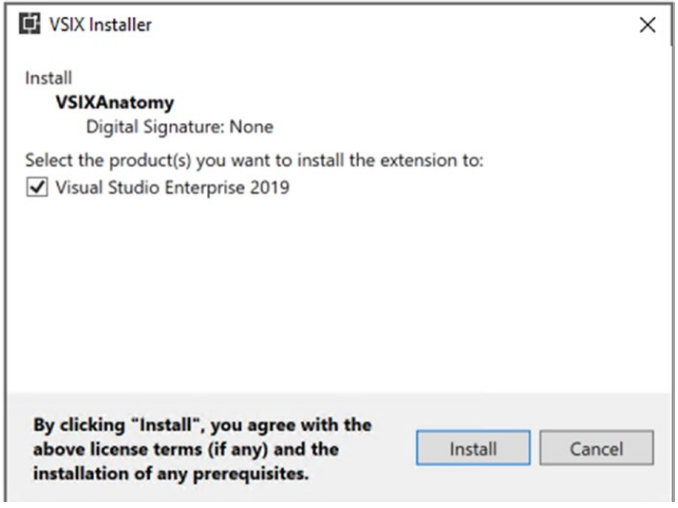

# 시작하기
이 장에서는 Visual Studio 확장성의 기초부터 시작합니다. 아무 작업도 수행하지 않는 최초의 Visual Studio 2019 확장을 만드는 것으로 시작합니다. 그런 다음 이 생성된 확장을 분석하고 구조, 형식 및 Visual Studio 확장을 구성하는 파일을 이해합니다. 다음으로 샘플 Visual Studio 확장의 코드 연습을 보고 기본 Visual Studio 상용구 템플릿 코드와 함께 제공되는 각 파일의 목적을 이해합니다. Visual Studio에서 확장을 검색하고 로드하는 방법을 확인하여 이 장을 마무리합니다. 다루어야 할 것이 많으니 공을 굴려봅시다!


## <font color='dodgerblue' size="6">1) 첫 번째 Visual Studio 2019 확장 만들기</font>

Visual Studio 확장을 개발 및 빌드하기 위해 선택한 필수 워크로드와 함께 Visual Studio 2019가 설치되어 있습니다. 그림 2-1을 참조하여 Visual Studio 설치에 대해 원하는 워크로드를 선택할 수 있습니다. "Workloads" 탭의 "Other Toolsets" 섹션에서 찾을 수 있습니다.


   
그림 2-01 Visual Studio 설치 화면

우측 창에 보이는 'IntelliCode' 컴포넌트를 체크하는 것을 권장합니다. 첫 번째 확장을 만들어 보겠습니다. 이것은 "시작하기" 확장 프로그램이므로 이 확장으로 달성한 것이 아니라 기본 사항을 배우는 것이 목적입니다. 첫 번째 Visual Studio 2019 확장을 만드는 단계별 프로세스를 살펴보겠습니다.

1. Visual Studio 2019를 엽니다. 
2. 새 프로젝트를 만듭니다. 
3. 그러면 새 프로젝트를 만드는 데 활용할 수 있는 모든 프로젝트 템플릿이 표시됩니다. 우리는 C#으로 작업할 것이기 때문에 언어를 C#으로 선택합니다. 그러나 VB에 익숙하다면 VB(Visual Basic)를 선택할 수도 있습니다. 
4. 프로젝트 유형 드롭다운 값을 "확장"으로 선택합니다. 그러면 그림 2-2와 같이 프로젝트 템플릿이 필터링됩니다.

       
    그림 2-02 Visual Studio 확장을 위한 새 프로젝트 생성

    ```tip
    Visual Studio 2019가 올바른 워크로드와 함께 설치된 경우에만 확장 프로젝트 템플릿이 표시됩니다. 설치 중 필요한 작업 부하를 선택하려면 그림 2-1을 참조하십시오. VSIX 프로젝트 템플릿이 표시되지 않으면 Visual Studio 2019를 수정해야 합니다. 공식 권장 사항은 "설치 프로그램"을 검색하는 것입니다.
    ```

5. VSIX 프로젝트를 선택하고 다음 버튼을 클릭합니다. 
6. 다음으로 "새 프로젝트 구성" 화면이 표시됩니다. 프로젝트 이름에 확장에 부여할 이름을 입력하고 파일 시스템에서 이 프로젝트를 생성할 위치를 위치에, 솔루션 이름을 솔루션 이름에 입력합니다. 샘플에서 제공한 값은 그림 2-3에 나와 있습니다.

       
    그림 2-03 새 프로젝트 구성

7. "만들기" 버튼을 클릭합니다. 그게 다야! 첫 번째 Visual Studio 확장에 대한 코드는 Visual Studio에서 생성됩니다. 그림 2-4는 Visual Studio에서 솔루션 탐색기 보기(보기 ➤ 솔루션 탐색기 또는 Ctrl Alt L 조합 누름)의 모양입니다.

       
    그림 2-04 솔루션 탐색기 뷰

8. 프로젝트를 빌드합니다. 성공적으로 빌드해야 합니다. 이것은 VSIX 프로젝트 템플릿과 함께 패키지로 제공되는 상용구 코드이므로 설치가 올바르게 완료되면 제대로 빌드될 것입니다. 이 책의 뒷부분에서 프로젝트 및 항목 템플릿을 만드는 방법을 배웁니다.

    ```tip
    위에서 논의한 화면의 흐름은 Visual Studio 2019에만 해당됩니다. Microsoft는 사용자 피드백을 진지하게 받아들이고 최종 사용자의 요구 사항에 맞게 사용자 인터페이스를 실험하고 수정할 수 있습니다. 따라서 위에서 논의한 화면 흐름과 화면은 향후 변경될 수 있지만 기본 단계는 동일하게 유지됩니다.
    ```

9. 이제 솔루션 탐색기 보기에서 프로젝트 속성을 확인하여 확장 출력이 생성될 출력 디렉터리를 알아보겠습니다. 이를 보려면 속성 ➤ 빌드를 클릭하고 출력 경로에서 값을 확인하십시오. 프로젝트를 빌드한 후 Visual Studio의 출력 창을 보면 출력 디렉터리를 볼 수도 있습니다. Visual Studio의 출력 창은 보기 ➤ 출력을 클릭하거나 Ctrl Alt O의 키 조합을 사용하여 키보드로 시작할 수 있습니다.

10. 이제 출력 디렉토리를 알았으므로 확장의 빌드 출력을 확인하겠습니다. 그림 2-5는 내 컴퓨터에서 어떻게 보이는지입니다.

       
    그림 2-05 출력 결과

    출력에서 많은 파일을 볼 수 있습니다. 그러나 가장 중요한 것은 VSIXAnatomy.vsix 파일입니다. 이것은 Visual Studio 확장입니다.

11. 이 파일을 더블 클릭하면 설치됩니다. 그림 2-5에 표시된 .vsix 파일을 두 번 클릭하여 이 설치를 수행해 보겠습니다. 이렇게 하면 VSIX 설치 프로그램이 시작되고 그림 2-6과 같이 시작 화면에 요약이 표시됩니다.

       
    그림 2-06 VSIX 설치

    VSIX 설치 프로그램은 이름에서 알 수 있듯이 컴퓨터에 VSIX를 설치(제거 및 제거)하므로 Visual Studio가 다음에 시작될 때 확장을 검색할 수 있습니다. WPF로 개발되었으며 수년에 걸쳐 개선되어 정교해졌습니다. Visual Studio가 시작되면 실행하고 작업을 수행하기 위해 수많은 서비스를 시작하고 호스팅합니다. 이러한 서비스가 파일 또는 폴더를 잠그면 확장 설치(또는 제거)가 실패하거나 제대로 작동하지 않을 수 있습니다. 이 상황을 피하기 위해 설치 프로그램은 성공적으로 설치하기 위해 종료되어야 하는 프로세스를 표시합니다.

12. VSIX 설치 프로그램 화면에서 설치를 클릭합니다. 제 경우에는 이 확장을 만들고 빌드한 Visual Studio 2019가 여전히 실행 중이므로 확장 설치를 방해할 수 있는 특정 프로세스를 종료하도록 요청하는 그림 2-7의 화면이 표시됩니다.

       
    그림 2-06 VSIX 설치 완료 절차

    작업 끝내기를 클릭하면 이러한 프로세스가 종료되고 확장이 설치됩니다. 진행률 표시줄은 사용자에게 설치 진행률을 최신 상태로 유지하기 위해 표시됩니다. 일반적으로 매우 빠르게 완료되므로 진행 상황이 짧은 시간 동안 표시될 수 있습니다. 설치가 완료되면 그림 2-8과 같은 설치 완료 화면이 표시됩니다.

       
    그림 2-08 VSIX 설치 완료 절차

    왼쪽 하단에 View Install Log 링크가 있습니다. 이 링크는 설치 문제가 발생할 경우 확장 설치를 디버그하는 데 사용할 수 있습니다. 또한 이 로그 파일을 사용하여 확장이 설치된 위치를 볼 수 있습니다. 우리는 이후 장에서 이것을 볼 것입니다. 

    설치 로그 보기를 클릭한 후 열린 로그 파일(정확하게는 로그 파일의 마지막 줄)에서 내 컴퓨터의 다음 경로에 확장 프로그램이 설치되어 있음을 알았습니다.

    C:\Users\rishabhv\AppData\Local\Microsoft\VisualStudio\16.0_237209d6\Extensions\ns3dm44l.m1a

    이 경로는 Visual Studio가 시작하는 동안 찾을 경로 중 하나입니다. 확장은 VSIX 설치 프로그램이 이 경로에 설치하므로 Visual Studio에서 이미 인식하고 있기 때문에 이렇게 말할 수 있습니다. 이 경로는 아래와 같이 세 부분으로 나눌 수 있습니다.

    * C:\Users\rishabhv\AppData\Local\ 
    * Microsoft\VisualStudio\16.0_237209d6\Extensions\ 
    * ns3dm44l.m1a

    첫 번째 부분은 로그인한 사용자에게만 해당되며 시스템마다 다릅니다. 이 경로는 사용자의 로컬 Appdata 폴더이며 환경 변수 %LOCALAPPDATA%에서 직접 액세스할 수 있습니다.

    두 번째 부분은 확장이 설치된 상대적인 부분입니다. 경로는 Microsoft로 시작하는 폴더 구조로 구성되며, 여기에는 VisualStudio라는 폴더와 Visual Studio 버전에 따라 달라지는 Visual Studio 버전이 포함됩니다.

    세 번째이자 마지막 부분은 VSIX 설치 프로그램이 확장을 고유하게 유지하기 위해 생성하는 폴더 이름입니다. 이 폴더 이름은 이후 장에서 설명합니다.

이 폴더 안에는 무엇이 있을까?  
이 폴더 안에는 Visual Studio를 확장하는 파일들이 있습니다. 그림 2-9는 개발 및 배포할 일반적인 확장 프로그램에 표시되는 기본 최소 파일을 보여줍니다.


   
그림 2-09 설치된 확장

폴더에 6개의 파일이 있습니다.  
이 장의 뒷부분에서 확장의 구조에 대해 논의할 때 이러한 파일에 대해 설명합니다. 설치 완료 화면(그림 2-8)은 또한 이 확장을 로드할 수 있도록 Visual Studio를 다시 시작해야 한다고 알려줍니다. 우리의 확장은 아무 것도 하지 않기 때문에 의미 있는 것을 개발할 때까지 이 연습을 건너뛸 것입니다. 그러나 지금은 기본을 파악하기 위해 첫 번째 확장을 만들고 배포했습니다. 이 장의 끝 부분에서 이 코드를 수정하고 확장 코드를 통해 메시지를 표시합니다. VSIX는 OPC라고도 하는 Open Packaging Convention을 따릅니다. VSIX 파일과 해당 구조를 더 잘 이해하려면 이에 대해 아는 것이 중요합니다. 살펴보겠습니다.

## <font color='dodgerblue' size="6">2) Open Packing Convention</font>