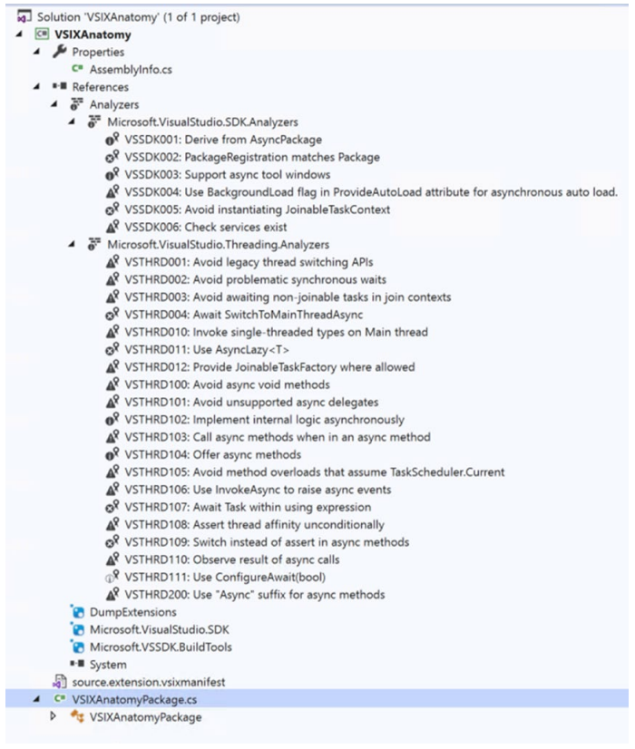

# 시작하기
이 장에서는 Visual Studio 확장성의 기초부터 시작합니다.  

아무 작업도 수행하지 않는 최초의 Visual Studio 2019 확장을 만드는 것으로 시작합니다. 그런 다음 이 생성된 확장을 분석하고 구조, 형식 및 Visual Studio 확장을 구성하는 파일을 이해합니다. 다음으로 샘플 Visual Studio 확장의 코드 연습을 보고 기본 Visual Studio 상용구 템플릿 코드와 함께 제공되는 각 파일의 목적을 이해합니다. Visual Studio에서 확장을 검색하고 로드하는 방법을 확인하여 이 장을 마무리합니다. 다루어야 할 것이 많으니 공을 굴려봅시다!


## <font color='dodgerblue' size="6">1) 첫 번째 Visual Studio 2019 확장 만들기</font>

Visual Studio 확장을 개발 및 빌드하기 위해 선택한 필수 워크로드와 함께 Visual Studio 2019가 설치되어 있습니다.  
그림 2-1을 참조하여 Visual Studio 설치에 대해 원하는 워크로드를 선택할 수 있습니다. "Workloads" 탭의 "Other Toolsets" 섹션에서 찾을 수 있습니다.


   
그림 2-01 Visual Studio 설치 화면

우측 창에 보이는 'IntelliCode' 컴포넌트를 체크하는 것을 권장합니다. 첫 번째 확장을 만들어 보자. 이것은 첫단계인 "시작해보기" 확장 프로그램이므로 완전한 기능의 확장이 아닌 기본 사항을 배우는 것이 목적. 첫 번째 Visual Studio 2019 확장을 만드는 단계별 프로세스를 살펴본다.

1. Visual Studio 2019를 엽니다. 
2. 새 프로젝트를 만듭니다. 
3. 그러면 새 프로젝트를 만드는 데 활용할 수 있는 모든 프로젝트 템플릿이 표시됩니다. 우리는 C#으로 작업할 것이기 때문에 언어를 C#으로 선택합니다. 그러나 VB에 익숙하다면 VB(Visual Basic)를 선택할 수도 있다. 
4. 프로젝트 유형 드롭다운 값을 "확장"으로 선택합니다. 그러면 그림 2-2와 같이 프로젝트 템플릿이 필터링됩니다.

       
    그림 2-02 Visual Studio 확장을 위한 새 프로젝트 생성

    ```tip
    Visual Studio 2019가 올바른 워크로드와 함께 설치된 경우에만 확장 프로젝트 템플릿이 표시됩니다. 설치 중 필요한 작업 부하를 선택하려면 그림 2-1을 참조하십시오. VSIX 프로젝트 템플릿이 표시되지 않으면 Visual Studio 2019를 수정해야 합니다. 공식 권장 사항은 "설치 프로그램"을 검색하는 것입니다.
    ```

5. VSIX 프로젝트를 선택하고 다음 버튼을 클릭합니다. 
6. 다음으로 "새 프로젝트 구성" 화면이 표시됩니다. 프로젝트 이름에 확장에 부여할 이름을 입력하고 파일 시스템에서 이 프로젝트를 생성할 위치를 위치에, 솔루션 이름을 솔루션 이름에 입력합니다. 샘플에서 제공한 값은 그림 2-3에 나와 있습니다.

       
    그림 2-03 새 프로젝트 구성

7. "만들기" 버튼을 클릭합니다. 그게 다야! 첫 번째 Visual Studio 확장에 대한 코드는 Visual Studio에서 생성됩니다. 그림 2-4는 Visual Studio에서 솔루션 탐색기 보기(보기 ➤ 솔루션 탐색기 또는 Ctrl Alt L 조합 누름)의 모양입니다.

       
    그림 2-04 솔루션 탐색기 뷰

8. 프로젝트를 빌드해본다. 성공적으로 빌드되어야 하고 이것은 VSIX 프로젝트 템플릿과 함께 패키지로 제공되는 기본 구조이므로 설치가 올바르게 완료되면 제대로 빌드될 것이다. 이 책의 뒷부분에서 프로젝트 및 항목 템플릿을 만드는 방법을 배웁니다.

    ```tip
    위에서 논의한 화면의 흐름은 Visual Studio 2019에만 해당됩니다. Microsoft는 사용자 피드백을 진지하게 받아들이고 최종 사용자의 요구 사항에 맞게 사용자 인터페이스를 실험하고 수정할 수 있습니다. 따라서 위에서 논의한 화면 흐름과 화면은 향후 변경될 수 있지만 기본 단계는 동일하게 유지됩니다.
    ```

9. 이제 솔루션 탐색기 보기에서 프로젝트 속성을 확인하여 확장 출력이 생성될 출력 디렉터리를 알아보겠습니다. 이를 보려면 속성 ➤ 빌드를 클릭하고 출력 경로에서 값을 확인하십시오. 프로젝트를 빌드한 후 Visual Studio의 출력 창을 보면 출력 디렉터리를 볼 수도 있습니다. Visual Studio의 출력 창은 보기 ➤ 출력을 클릭하거나 Ctrl Alt O의 키 조합을 사용하여 키보드로 시작할 수 있습니다.

10. 이제 출력 디렉토리를 알았으므로 확장의 빌드 출력을 확인해보자. 그림 2-5는 내 컴퓨터에서 어떻게 보이는지입니다.

       
    그림 2-05 출력 결과

    출력에서 많은 파일을 볼 수 있습니다. 그러나 가장 중요한 것은 VSIXAnatomy.vsix 파일입니다. 이것은 Visual Studio 확장입니다.

11. 이 파일을 더블 클릭하면 설치됩니다. 그림 2-5에 표시된 .vsix 파일을 두 번 클릭하여 이 설치를 수행해 보겠습니다. 이렇게 하면 VSIX 설치 프로그램이 시작되고 그림 2-6과 같이 시작 화면에 요약이 표시됩니다.

       
    그림 2-06 VSIX 설치

    VSIX 설치 프로그램은 이름에서 알 수 있듯이 컴퓨터에 VSIX를 설치 및 제거하므로 Visual Studio가 다음에 시작될 때 확장을 검색할 수 있습니다. WPF로 개발되었으며 수년에 걸쳐 개선되어 정교해졌습니다. Visual Studio가 시작되면 실행하고 작업을 수행하기 위해 수많은 서비스를 시작하고 호스팅합니다. 이러한 서비스가 파일 또는 폴더를 잠그면 확장의 설치 및 제거가 실패하거나 제대로 작동하지 않을 수 있습니다. 이 상황을 피하기 위해 설치 프로그램은 성공적인 설치를 위해 종료되어야 하는 프로세스를 표시합니다.

12. VSIX 설치 프로그램 화면에서 설치를 클릭합니다. 제 경우에는 이 확장을 만들고 빌드한 Visual Studio 2019가 여전히 실행 중이므로 확장 설치를 방해할 수 있는 특정 프로세스를 종료하도록 요청하는 그림 2-7의 화면이 표시됩니다.

       
    그림 2-06 VSIX 설치 완료 절차

    작업 끝내기를 클릭하면 이러한 프로세스가 종료되고 확장이 설치됩니다. 진행률 표시줄은 사용자에게 설치 진행률을 최신 상태로 유지하기 위해 표시됩니다. 일반적으로 매우 빠르게 완료되므로 진행 상황이 짧은 시간 동안 표시될 수 있습니다. 설치가 완료되면 그림 2-8과 같은 설치 완료 화면이 표시됩니다.

       
    그림 2-08 VSIX 설치 완료 절차

    왼쪽 하단에 View Install Log 링크가 있습니다. 이 링크는 설치 문제가 발생할 경우 확장 설치를 디버그하는 데 사용할 수 있습니다. 또한 이 로그 파일을 사용하여 확장이 설치된 위치를 볼 수 있습니다. 우리는 이후 장에서 이것을 볼 것입니다. 

    설치 로그 보기를 클릭한 후 열린 로그 파일(정확하게는 로그 파일의 마지막 줄)에서 내 컴퓨터의 다음 경로에 확장 프로그램이 설치되어 있음을 알았습니다.

    C:\Users\rishabhv\AppData\Local\Microsoft\VisualStudio\16.0_237209d6\Extensions\ns3dm44l.m1a

    이 경로는 Visual Studio가 시작하는 동안 찾을 경로 중 하나입니다. 확장은 VSIX 설치 프로그램이 이 경로에 설치하므로 Visual Studio에서 이미 인식하고 있기 때문에 이렇게 말할 수 있습니다. 이 경로는 아래와 같이 세 부분으로 나눌 수 있습니다.

    * C:\Users\rishabhv\AppData\Local\ 
    * Microsoft\VisualStudio\16.0_237209d6\Extensions\ 
    * ns3dm44l.m1a

    첫 번째 부분은 로그인한 사용자에게만 해당되며 시스템마다 다릅니다. 이 경로는 사용자의 로컬 Appdata 폴더이며 환경 변수 %LOCALAPPDATA%에서 직접 액세스할 수 있습니다.

    두 번째 부분은 확장이 설치된 상대적인 부분입니다. 경로는 Microsoft로 시작하는 폴더 구조로 구성되며, 여기에는 VisualStudio라는 폴더와 Visual Studio 버전에 따라 달라지는 Visual Studio 버전이 포함됩니다.

    세 번째이자 마지막 부분은 VSIX 설치 프로그램이 확장을 고유하게 유지하기 위해 생성하는 폴더 이름입니다. 이 폴더 이름은 이후 장에서 설명합니다.

이 폴더 안에는 무엇이 있을까?  
이 폴더 안에는 Visual Studio를 확장하는 파일들이 있습니다. 그림 2-9는 개발 및 배포할 일반적인 확장 프로그램에 표시되는 기본 최소 파일을 보여줍니다.


   
그림 2-09 설치된 확장

폴더에 6개의 파일이 있습니다.  
이 장의 뒷부분에서 확장의 구조에 대해 논의할 때 이러한 파일에 대해 설명합니다. 설치 완료 화면(그림 2-8)은 또한 이 확장을 로드할 수 있도록 Visual Studio를 다시 시작해야 한다고 알려줍니다. 우리의 확장은 아무 것도 하지 않기 때문에 의미 있는 것을 개발할 때까지 이 연습을 건너뛸 것입니다. 그러나 지금은 기본을 파악하기 위해 첫 번째 확장을 만들고 배포했습니다. 이 장의 끝 부분에서 이 코드를 수정하고 확장 코드를 통해 메시지를 표시합니다. VSIX는 OPC라고도 하는 Open Packaging Convention을 따릅니다. VSIX 파일과 해당 구조를 더 잘 이해하려면 이에 대해 아는 것이 중요합니다. 살펴보겠습니다.

## <font color='dodgerblue' size="6">2) Open Packing Convention</font>
OPC(Open Packaging Convention)는 ECMA 376 표준의 구현을 나타내는 파일 기술을 나타냅니다. 특정 파일 형식은 없지만 공유 기반 아키텍처로 파일 형식을 설계하는 데 사용되는 파일 기술입니다. 따라서 OPC는 새로운 파일 형식을 만들기 위한 ISO 및 ECMA 업계 표준입니다. OPC 파일 형식은 압축된 컨테이너에 XML 및 비 XML 파일을 저장하기 위해 Microsoft에서 만들었습니다. Microsoft 제품에서 지원하는 많은 새로운 형식은 OPC를 패키징의 기본 기술로 사용합니다. 

OPC 파일 자체를 패키지라고 합니다. 이러한 OPC 기반 패키지는 zip 아카이브, zip 기반 컨테이너입니다. 즉, zip 파일 확장자로 이름을 바꾸고 파일 시스템으로 압축을 풀어 패키지 내용을 볼 수 있습니다. 패키지 내부에 포함된 파일을 부품이라고 합니다. 이러한 개별 부품은 관계를 통해 패키지 또는 외부 파일의 다른 부품과 관련될 수 있습니다. 관계 유형은 다음과 같습니다.

* 패키지 수준 관계(Package-level relationships) : 패키지 자체와 해당 부분 중 하나(패키지 내의 파일) 또는 외부 리소스 또는 파일과의 관계를 정의
* 부품 수준 관계 (Part-level relationships): 패키지의 부품과 패키지 또는 외부 리소스 또는 파일의 다른 부품 간의 관계를 정의.

일상적인 사용에서 볼 수 있는 OPC의 몇 가지 일반적인 예는 OPC 파일 기술을 활용하는 Word(.docx), Excel(xlsx) 및 PowerPoint(pptx) 파일입니다. 이러한 형식은 OPC 파일 기술을 기반으로 공유하지만 패키지 파일에 포함된 데이터는 특정 형식에 따라 다르며 형식에 따라 패키지마다 다를 수 있다는 점을 지적하는 것이 좋습니다. OPC는 최고의 zip, xml 및 웹 기술을 개방형 산업 표준으로 결합하여 애플리케이션 데이터를 구조화, 저장 및 전송하는 것을 정말 간단하게 만듭니다. 그림 2-10은 우리가 흔히 볼 수 있는 다양한 OPC 패키지를 보여줍니다.

   
그림 2-10 OPC

간단한 예를 통해 OPC 패키지의 파일 구조를 이해하고 시도해보자. 랩톱에서 Microsoft Office 파일을 만듭니다. 이 데모를 위해 바탕 화면에 Word 파일을 생성하겠습니다. 데이터 손실의 위험이 있으므로 완전히 새 파일을 만들거나 선택한 Office 파일을 백업했는지 확인하십시오. 다음 단계를 순서대로 따르십시오. 
1. 파일을 열고 텍스트를 입력하고 저장합니다. 
2. Office 파일의 파일 확장명을 .zip으로 바꿉니다. 제 경우에는 Demo.docx라는 이름의 새 워드 파일을 만들었습니다. 이름을 바꾼 후 Demo.docx.zip이 되었습니다. 
3. 파일을 마우스 오른쪽 버튼으로 클릭하고 이 zip 파일의 내용을 추출합니다. 이 추출된 폴더는 그림 2-11과 같이 보입니다.

   
그림 2-11 추출된 docx package 

3개의 폴더와 XML 파일이 있는데 OPC를 이해하는데 중요한 파일과 폴더만 다루도록 하겠습니다. 루트 수준에는 _rels 폴더가 있습니다. 이 폴더에는 .rels라는 파일이 포함되어 있습니다. 이 파일은 XML 파일이며 이 패키지의 패키지 수준 관계를 정의합니다. 다음은 .rels 파일의 XML 코드입니다.

```xml
<?xml version="1.0" encoding="UTF-8" standalone="yes"?>
<Relationships xmlns="http://schemas.openxmlformats.org/package/2006/relationships">
    <Relationship Id="rId3" Type="http://schemas.openxmlformats.org/officeDocument/2006/relationships/xtended-properties" Target="docProps/app.xml"/>
    <Relationship Id="rId2" Type="http://schemas.openxmlformats.org/package/2006/relationships/metadata/core-properties" Target="docProps/core.xml"/>
    <Relationship Id="rId1" Type="http://schemas.openxmlformats.org/officeDocument/2006/relationships/officeDocument" Target="word/document.xml"/>
    <Relationship Id="rId4" Type="http://schemas.openxmlformats.org/officeDocument/2006/relationships/custom-properties" Target="docProps/custom.xml"/>
</Relationships>
```

word라는 폴더 안에는  document.xml.rels 파일을 포함하는 파일이 포함된 또 다른 _rels폴더를 가진다. 이 파일은 XML 파일이기도 하며 부품 수준 관계를 정의합니다. 이것은 패키지 내부의 관계 구성을 설명합니다. 다음은 파악해야 할 중요한 사항입니다.

* 관계는 XML 파일에 정의됩니다. 
* 패키지 수준 관계는 루트 수준 _rels 폴더에 정의됩니다. 
* 부품 수준 관계는 패키지의 다른 폴더 안에 있는 다른 _rels 폴더에 정의됩니다.

또 다른 중요한 파일은 루트 폴더에 있는 [Content_Types].xml입니다. 이 파일은 패키지에 포함된 다양한 파일 형식을 정의합니다. 특정 부품의 유형은 파일 유형에 대한 기본 태그를 재정의하는 재정의 태그를 사용하여 재정의될 수 있습니다. 이것은 이 XML 파일에 정의된 두 개의 태그입니다. 이 XML 파일의 내용은 다음과 같습니다.

```xml
<?xml version="1.0" encoding="UTF-8" standalone="yes"?>
<Types xmlns="http://schemas.openxmlformats.org/package/2006/content-types">
    <Default Extension="rels" ContentType="application/vnd.openxmlformatspackage.relationships+xml"/>
    <Default Extension="xml" ContentType="application/xml"/>
    <Override PartName="/word/document.xml" ContentType="application/vnd.openxmlformats-officedocument.wordprocessingml.document.main+xml"/>
    <Override PartName="/word/styles.xml" ContentType="application/vnd.openxmlformats-officedocument.wordprocessingml.styles+xml"/>
    <Override PartName="/word/settings.xml" ContentType="application/vnd.openxmlformats-officedocument.wordprocessingml.settings+xml"/>
    <Override PartName="/word/webSettings.xml" ContentType="application/vnd.openxmlformats-officedocument.wordprocessingml.webSettings+xml"/>
    <Override PartName="/word/footnotes.xml" ContentType="application/vnd.openxmlformats-officedocument.wordprocessingml.footnotes+xml"/>
    <Override PartName="/word/endnotes.xml" ContentType="application/vnd.openxmlformats-officedocument.wordprocessingml.endnotes+xml"/>
    <Override PartName="/word/fontTable.xml" ContentType="application/vnd.openxmlformats-officedocument.wordprocessingml.fontTable+xml"/>
    <Override PartName="/word/theme/theme1.xml" ContentType="application/vnd.openxmlformats-officedocument.theme+xml"/>
    <Override PartName="/docProps/core.xml" ContentType="application/vnd.openxmlformats-package.core-properties+xml"/>
    <Override PartName="/docProps/app.xml" ContentType="application/vnd.openxmlformats-officedocument.extended-properties+xml"/>
    <Override PartName="/docProps/custom.xml" ContentType="application/vnd.openxmlformats-officedocument.custom-properties+xml"/>
</Types>
```

OPC 패키지 파일은 관계형 구조를 포함하고 웹에서 액세스할 수 있는 콘텐츠를 패키지화할 수 있는 유연성을 제공합니다. 패키지를 디지털 방식으로 서명하는 기능을 제공하여 더 많은 보안과 견고성을 제공합니다. 이 기능은 진정성을 보장하고 서명 후 콘텐츠가 변경되지 않았는지 확인합니다. 

요약하면 다음은 패키징에 OPC를 사용할 때의 몇 가지 장점입니다.

* Zip 기반 컨테이너 시스템, 
* 웹 액세스 가능한 콘텐츠, 
* 관계형 데이터 구조, 
* 견고성, 
* 컴팩트한 크기, 
* 웹 액세스 가능성, 
* ISO 및 ECMA 업계 표준 승인. OPC에 대한 자세하고 더 나은 이해를 위해 독자들이 다음 링크를 방문하는 것이 좋습니다.

OPC에 대한 자세하고 더 나은 이해를 위해 독자들이 다음 링크를 방문하는 것이 좋습니다.  
https://docs.microsoft.com/en-us/previous-versions/windows/desktop/opc/open-packaging-conventions-overview

## <font color='dodgerblue' size="6">3) VSIX</font>
VSIX는 Visual Studio 통합 확장(Visual Studio Integration Extension)을 나타냅니다.

```note
Visual Studio 확장성 팀은 Visual Studio 확장의 약어를 의도하지 않았습니다. 그들은 Visual Studio Installer를 의미하는 VSI를 원하지 않았습니다. 마이크로소프트에서 만든 모든 파일 확장자에 docx, pptx, xlsx 등의 x를 붙이거나 표시하던 시절이라 확장명 vsix가 나왔다. vsx(Visual Studio 확장을 의미할 수 있기 때문에)를 사용할 생각이 있었습니다. 그러나 Visio는 이미 이 파일 확장자를 사용했습니다.
```

VSIX 패키지는 하나 이상의 Visual Studio 확장이 포함된 .vsix 파일입니다. 패키지는 Visual Studio가 확장을 분류하고 설치하는 데 사용하는 메타데이터도 포함하므로 자체 설명적입니다. 매니페스트 및 [Content_Types].xml 파일에는 이 메타데이터 정보가 포함되어 있습니다. VSIX 패키지에는 다음 중 하나 이상이 포함될 수도 있습니다. 
* 확장을 현지화하기 위한 .vsixlangpack 파일, 
* 종속성을 설치하기 위한 VSIX 패키지, 
* 확장의 핵심 기능이 포함된 바이너리 파일. 

VSIX 파일은 Visual Studio의 기본 배포 단위입니다. Visual Studio 설치 관리자는 이 확장을 인식하고 시작 및 로드할 때 Visual Studio에서 검색 및 로드할 수 있는 위치에 설치합니다.

```note
VSIX 패키지에 포함된 파일 이름에는 공백이 포함되지 않아야 합니다. URI(Uniform Resource Identifier)에 예약된 문자는 VSIX 패키지에 포함된 파일 이름에도 허용되지 않습니다. 이것은 [RFC2396]에 정의되어 있습니다.
```

## <font color='dodgerblue' size="6">4) 보일러 플레이트 확장의 구조 그로킹</font>
이제 VSIX의 기본 사항을 알았으므로 기본 VSIX 템플릿과 함께 제공되는 초기 코드와 해당 구조를 설명한다. 기본 VSIX 프로젝트 템플릿의 솔루션 구조에는 다음 파일이 포함되어 있습니다.

- ### a. VSIXAnatomyPackage.cs 파일
    이 파일의 이름은 {프로젝트이름}Package.cs 형식이다. 이 클래스는 이 프로젝트를 빌드하여 만든 어셈블리에 의해 노출될 패키지를 구현한다.

    이제 유효한 Visual Studio 패키지를 구성하는 요소에 대한 질문이 떠오른다. IVsPackage 인터페이스를 구현하고 Visual Studio 셸에 등록하는 모든 클래스는 유효한 Visual Studio 패키지로 간주되는 최소 기준을 충족한다.  
    Microsoft.VisualStudio.Shell.Package는 유효한 패키지를 만들기 위해 파생된 추상 클래스였다. 패키지를 로드하고 초기화하면 디스크 I/O가 발생할 수 있으며, 이것이 UI 스레드에서 발생하면 메인 UI 스레드가 UI 응답성을 유지하는 대신 I/O를 수행하므로 응답성 문제가 발생할 수 있다. 이것은 이 클래스의 단점이며 자동 로드 확장에 대한 Visual Studio의 시작 성능을 저하시킨다.

    이를 개선하기 위해 Visual Studio 2015에서 Package클래스에서 파생된 Microsoft.VisualStudio.Shell.AsyncPackage 추상 클래스를 도입했다.  
    이 클래스를 활용하여 확장의 비동기식 로드를 선택하고 성능 비용을 줄이고 UI의 응답성을 유지할 수 있게 되었다. Visual Studio 2019에서는 UI 스레드가 덜 엄격하게 사용되므로 Visual Studio가 더 빨리 시작되고 실행 중에 더 잘 수행되도록 확장의 동기 로드가 기본적으로 해제되어 있다.  
    그러나 이전 확장을 작동 상태로 유지하려면 그림 2-12와 같이 확장의 동기 로드를 항상 활성화할 수 있다.

       
    그림 2-12 동기로딩 허용

    그러나 비동기 로딩을 사용하도록 확장을 개발/업데이트해야 하므로 이 옵션을 사용하지 않는 것이 좋다. 또한 확장은 사용자별로 또는 모든 사용자에 대해 설치할 수 있으므로 "사용자별 확장" 및 "모든 사용자 확장"에 대한 두 개의 작은 섹션에 대해 유의하자.

    다음은 패키지 클래스가 정의되는 방법입니다.
    
    [ComVisible(true)]  
    [PackageRegistration]  
    public **abstract** class **Package** : **IVsPackage**, OLE.Interop.IServiceProvider,IOleCommandTarget,  
        IVsPersistSolutionOpts, IServiceContainer,System.IServiceProvider, IVsUserSettings, 
        IVsUserSettingsMigration,IVsUserSettingsQuery
        , IVsToolWindowFactory, IVsToolboxItemProvider
    {
        //// 간결함을 위해 표시되지 않은 생성자, 속성 및 기타 멤버.
    }
    

    ```cs
    [ComVisible(true)]
    [PackageRegistration]
    public abstract class Package : IVsPackage, OLE.Interop.IServiceProvider,IOleCommandTarget, IVsPersistSolutionOpts
        , IServiceContainer,System.IServiceProvider, IVsUserSettings, IVsUserSettingsMigration,IVsUserSettingsQuery
        , IVsToolWindowFactory, IVsToolboxItemProvider
    {
        //// 간결함을 위해 표시되지 않은 생성자, 속성 및 기타 멤버.
    }
    ```

    AsyncPackage의 정의 및 중요 멤버는 다음과 같이 정의된다.

    ```cs
    [ComVisible(true)]
    public abstract class AsyncPackage : Package, object, object, IAsyncServiceProvider, AsyncServiceContainer
    {
        // Summary:
        // 이 패키지에 의해 시작된 비동기 작업에 사용할 팩토리를 가져옵니다.
        // Returns:
        // The factory.
        public JoinableTaskFactory JoinableTaskFactory { get; }
        // Summary:
        // Microsoft.VisualStudio.Threading을 가져옵니다.
        JoinableTaskCollectionof asynchronous
        // 이 패키지에 의해 시작된 작업.
        //
        // Returns:
        // The task collection.
        protected JoinableTaskCollection JoinableTaskCollection { get; }
        //// 간결함을 위해 표시되지 않은 기타 생성자, 속성 및 기타 멤버.
    }
    ```

    이제 패키지의 기본 사항이 준비되었으므로 이 파일과 함께 제공되는 코드를 살펴보겠습니다. 코드가 잘 주석 처리되어 있으므로 InitializeAsync 메서드를 효과적으로 사용해야 하는 방법을 이해하려면 주석을 읽으십시오.

    VSIXAnatomy 네임스페이스
    ```cs
    {
        [PackageRegistration(UseManagedResourcesOnly = true,AllowsBackgroundLoading = true)]
        [Guid(VSIXAnatomyPackage.PackageGuidString)]
        public sealed class VSIXAnatomyPackage : AsyncPackage
        {
            public const string PackageGuidString = "94eea500-2b7b-4701-bf8e0f6cd169f9ff";
            /// <summary>
            /// 패키지 초기화 이 메서드는 패키지가 사이트화된 직후에 호출되므로 VisualStudio에서 제공한다.
            /// 서비스에 의존하는 모든 초기화 코드를 넣을 수 있습니다.
            /// </summary>
            /// <param name="cancellationToken">VS가 종료될 때 발생할 수 있는 초기화 취소를 모니터링하기 위한 취소 토큰입니다.</param>
            /// <param name="progress">진행 상황 업데이트 제공자.</param>
            /// <returns>패키지 초기화의 비동기 작업을 나타내는 작업 또는 없는 경우 이미 완료된 작업입니다. 이 메서드에서 null을 반환하지 마십시오.</returns>
            protected override async Task InitializeAsync(CancellationToken cancellationToken, IProgress<ServiceProgressData> progress)
            {
                // 비동기식으로 초기화되면 현재 스레드가 이 시점에서 백그라운드 스레드일 수 있습니다. 응답성을 유지하려면 UI 스레드로 전환하기 전에 백그라운드에서 최대한 많은 작업을 수행하십시오.
                // UI 스레드로 전환한 후 UI 스레드가 필요한 초기화를 수행하십시오. 이것을 기다립니다.JoinableTaskFactory.SwitchToMainThreadAsync(cancellationToken);
                //// JoinableTaskFactory 및 Visual Studio와 관련된 기타 스레딩 구성에 대해서는 이후 장에서 논의할 것입니다.
            }
        }
    }
    ```

    클래스 상단의 [PackageRegistration] 특성은 Visual Studio Shell에 패키지를 등록하는 역할을 합니다. 이 속성은 또한 pkgdef 생성 유틸리티에게 빌드 중에 생성된 결과에서 .pkgdef에 넣을 데이터를 알려줍니다. AllowBackgroundLoading 플래그를 사용하면 패키지 서비스를 백그라운드에서 로드할 수 있으며 결과 .pkgdef 파일에도 이 정보가 포함됩니다. GUID(Globally Unique Identifier) 특성은 고유 식별자를 패키지에 연결합니다. 클래스에 있을 수 있는 몇 가지 다른 속성이 있으며 확장 및 패키지를 만드는 동안 사용할 때 설명합니다. 분석기와 함께 상용구 확장 템플릿에서 생성된 파일들은 그림 2-13에 나와 있습니다.


       
    그림 2-13 솔루션탐색기에서 보일러플레이트 코드

- ### b. Source.extension.vsixmanifest 파일
    이것은 그림 2-12에서 볼 수 있는 또 다른 중요한 파일입니다. 확장 프로그램에 필요한 모든 메타데이터 정보(예: 제품 식별자, 제품 이름, 제품 작성자, 버전, 제품 설명), 기능 및 사용 위치, 지원되는 언어, 최종 사용자에 대한 라이선스 정보, 아이콘 마켓플레이스에서 빠르게 검색할 수 있는 관련 태그, 릴리스 정보, 시작 가이드, 제품의 웹 사이트 URL 등 또한 확장의 설치 유형 및 대상, 즉 제품 배포 여부를 정의합니다. Visual Studio 확장 또는 확장 SDK로. 이것은 이 제품에 대해 지원되는 Visual Studio 버전을 정의하는 파일이기도 합니다. 여기에 지정된 버전 범위에 따라 귀하의 제품은 Visual Studio 2019 또는 다른 버전의 Visual Studio에서도 작동할 수 있습니다. 이 외에도 제품에 필요한 기타 종속성, 전제 조건 및 자산을 여기에서 지정할 수 있습니다. 그림 2-14는 Visual Studio에서 매니페스트 편집기의 메타데이터 보기를 보여줍니다.

       
    그림 2-14 매니페스트 편집기

- ### c. 참조
    이는 다른 프로젝트 유형에서도 볼 수 있는 일반 참조입니다. 여기서 주목해야 할 몇 가지 사항은 기본 상용구 템플릿이 다음 패키지에 대한 NuGet 참조와 함께 제공된다는 것입니다.

    * DumpExtensions
    * Microsoft.VisualStudio.SDK
    * Microsoft.VSSDK.BuildTools

    시스템 어셈블리에 대한 참조도 있습니다. 참조 외에도 SDK 및 스레딩 코드에 대한 여러 분석기를 볼 수 있으므로 SDK 및 스레딩 코드가 올바르게 수행되도록 합니다. 우리는 실제 의미 있는 확장을 작성하는 동안 나중 장에서 이러한 분석기에 대해 논의할 것입니다.

- ### d. 속성
    다른 프로젝트와 마찬가지로 속성을 클릭하면 프로젝트 속성이 표시됩니다. 어셈블리 이름, 버전, 회사 이름 등과 같은 어셈블리 정보가 지정된 AssemblyInfo.cs 파일이 있습니다.  
    코드 연습이 완료되면 이 프로젝트를 빌드하여 생성되는 VSIX를 이해해 보겠습니다.

## <font color='dodgerblue' size="6">5) 확장 해체해보기</font>
앞에서 설명한 것처럼 VSIX는 OPC를 따르며 파일 확장자를 .vsix에서 .zip으로 변경하여 내용을 볼 수 있으므로 이 장의 앞부분에서 생성된 VSIX 파일에서 이 변경을 수행해 보겠습니다.

따라서 VSIXAnatomy.vsix 파일의 이름을 VSIXAnatomy.vsix.zip으로 바꾼 다음 이 zip 파일의 내용을 추출합니다. 추출 후 그림 2-15는 추출된 폴더의 모양을 보여줍니다.


   
그림 2-15 확장 해체

여기에는 총 7개의 파일이 있습니다. 위의 그림 2-8과 비교하면 설치된 확장 프로그램에 파일이 있고 이 경우 6개의 파일이 있습니다. 이 6개의 파일은 모두 이 폴더에 있으며 논의한 대로 이 확장에 포함된 파일을 정의하는 추가 [Content_Type].xml 파일이 있습니다.

- ### a. 파일 조사
    이 7개의 파일 각각에 대해 논의하고 그 목적을 이해합시다.

    - [Content_Types].xml     
        OPC 섹션에서 위에서 설명한 것처럼 [Content_Types].xml 파일은 .vsix 파일 또는 패키지에 포함된 파일 형식을 식별합니다. Visual Studio 설치 프로그램은 패키지를 설치하는 동안 [Content_Types].xml을 사용하지만 설치하지는 않습니다. 이것이 위의 설치 디렉토리에서 이 파일을 보지 못한 이유입니다.

        ```xml
        <?xml version="1.0" encoding="utf-8"?>
        <Types xmlns="http://schemas.openxmlformats.org/package/2006/content-types">
            <Default Extension="vsixmanifest" ContentType="text/xml" />
            <Default Extension="dll" ContentType="application/octet-stream" />
            <Default Extension="pkgdef" ContentType="text/plain" />
            <Default Extension="json" ContentType="application/json" />
        </Types>
        ```

    - Catalog.json  
        빌드 시 VSIX 내부에 생성 및 패키징된 JSON 파일입니다. 이 JSON 파일에는 확장에 대한 매니페스트 및 패키지 정보가 포함되어 있습니다. 매니페스트 섹션은 매니페스트의 유형, ID 및 버전을 정의하는 반면 패키지 섹션은 버전, 식별자, 종속성, 현지화 정보, 확장 디렉터리 등과 같은 구성 요소 및 vsix 세부 정보를 정의합니다. 일반적인 catalog.json은 다음과 같습니다.

        ```xml
        {
            "manifestVersion": "1.1",
            "info": {
                "id": "VSIXAnatomy.17600b3d-4a32-4f55-b50b-2103571d0d2b,version=1.0",
                "manifestType": "Extension"
            },
            "packages": [
                {
                    "id": "Component.VSIXAnatomy.17600b3d-4a32-4f55-b50b-2103571d0d2b",
                    "version": "1.0",
                    "type": "Component",
                    "extension": true,
                    "dependencies": {
                        "VSIXAnatomy.17600b3d-4a32-4f55-b50b-2103571d0d2b": "1.0",
                        "Microsoft.VisualStudio.Component.CoreEditor": "[16.0,17.0)"
                    },
                    "localizedResources": [
                        {
                            "language": "en-US",
                            "title": "VSIXAnatomy",
                            "description": "Empty VSIX Project." // Put your description here.
                        }
                    ]
                },
                {
                "id": "VSIXAnatomy.17600b3d-4a32-4f55-b50b-2103571d0d2b",
                "version": "1.0",
                "type": "Vsix",
                "payloads": [
                    {
                        "fileName": "VSIXAnatomy.vsix",
                        "size": 57586
                    }
                ],
                "vsixId": "VSIXAnatomy.17600b3d-4a32-4f55-b50b-2103571d0d2b",
                "extensionDir": "[installdir]\\Common7\\IDE\\Extensions\\2ehhvwis.2ng",
                "installSizes": { "targetDrive": 52459 }
                }
            ]
        }
        ```

        Visual Studio 2019 이전의 확장을 Visual Studio 2019로 마이그레이션하는 방법을 배울 때 이후 장에서 Catalog.json 구조에 대해 자세히 설명합니다.

    - DumpExtensions.dll  
        솔루션 구조에서 프로젝트에 이름이 DumpExtensions인 패키지에 대한 NuGet 참조가 있음을 확인했습니다. 이것은 프로젝트에 대한 종속성으로 추가되므로 빌드 출력과 vsix에 있습니다. DumpExtension은 실제로 개발자가 Visual Studio에서 디버깅하는 동안 개체의 시각적 덤프를 볼 수 있도록 도와주는 타사 라이브러리입니다. 이것은 또한 NuGet 패키지 종속성이 VSIX에 포함되어 있음을 알려줍니다. 디버깅에 대한 장에서 이것이 실제로 작동하는 것을 볼 것입니다.

    - Extension.vsixmanifest  
        이 파일에는 설치할 확장에 대한 정보가 포함되어 있으며 VSX 스키마를 따릅니다. VSIX 매니페스트는 VSIX 파일에 포함될 때 extension.vsixmanifest로 이름을 지정해야 합니다.

        ```xml
        <PackageManifest Version="2.0.0" xmlns="http://schemas.microsoft.com/developer/vsx-schema/2011">
            <Metadata>
                <Identity Id="VSIXAnatomy.17600b3d-4a32-4f55-b50b-2103571d0d2b" Version="1.0" Language="en-US" Publisher="Rishabh Verma" />
                <DisplayName>VSIXAnatomy</DisplayName>
                <Description>Empty VSIX Project.</Description>
            </Metadata>
            <Installation>
                <InstallationTarget Id="Microsoft.VisualStudio.Community" Version="[16.0, 17.0)" />
            </Installation>
            <Dependencies>
                <Dependency Id="Microsoft.Framework.NDP" DisplayName="Microsoft .NET Framework" Version="[4.5,)" />
            </Dependencies>
            <Prerequisites>
                <Prerequisite Id="Microsoft.VisualStudio.Component.CoreEditor" Version="[16.0,17.0)" DisplayName="Visual Studio core editor" />
            </Prerequisites>
            <Assets>
                <Asset Type="Microsoft.VisualStudio.VsPackage" Path="VSIXAnatomy.pkgdef" />
            </Assets>
        </PackageManifest>
        ```
    - Manifest.json  
        이것은 빌드 시 VSIX 내부에서 생성되고 패키징된 또 다른 JSON 파일입니다. 이 JSON 파일에는 JSON 형식의 매니페스트 정보가 포함되어 있습니다. 이것은 새로운 확장 스키마에서 존재하게 되었습니다. 파일 목록과 종속성을 포함하는 상용구 확장의 샘플 JSON이 아래에 나와 있습니다.
        
        ```xml
        {
            "id": "VSIXAnatomy.17600b3d-4a32-4f55-b50b-2103571d0d2b",
            "version": "1.0",
            "type": "Vsix",
            "vsixId": "VSIXAnatomy.17600b3d-4a32-4f55-b50b-2103571d0d2b",
            "extensionDir": "[installdir]\\Common7\\IDE\\Extensions\\2ehhvwis.2ng",
            "files": [
                {
                    "fileName": "/extension.vsixmanifest",
                    "sha256": null
                },
                {
                    "fileName": "/VSIXAnatomy.dll",
                    "sha256": null
                },
                {
                "fileName": "/DumpExtensions.dll",
                "sha256": null
                },
                {
                    "fileName": "/VSIXAnatomy.pkgdef",
                    "sha256": null
                }
            ],
            "installSizes": { "targetDrive": 52459 },
            "dependencies": { "Microsoft.VisualStudio.Component.CoreEditor":
            "[16.0,17.0)" }
        }
        ```

    - VSIXAnatomy.dll  
    이것은 VSIX에 의해 노출된 Visual Studio 패키지를 포함하는 바이너리입니다. 여기에는 우리가 코딩하는 모든 기능이 포함됩니다. Visual Studio용 템플릿이나 도구 상자 항목 또는 기타 확장을 개발할 수 있습니다. 기본 바이너리는 항상 그에 대한 코드를 포함합니다.

    - VSIXAnatomy.pkgdefs  
        .pkgdef 파일은 쉽게 편집, 배포 및 배포 가능한 형식으로 구성 정보를 캡슐화합니다. Visual Studio 2008부터 존재했습니다. 다음은 IDE에서 Visual Studio 패키지로 작성된 VSIXAnatomy 클래스를 등록하는 빌드 중에 생성된 .pkgdef 파일의 스니펫입니다.

        ```cs
        [$RootKey$\Packages\{94eea500-2b7b-4701-bf8e-0f6cd169f9ff}]
        @="VSIXAnatomyPackage"
        "InprocServer32"="$WinDir$\SYSTEM32\MSCOREE.DLL"
        "Class"="VSIXAnatomy.VSIXAnatomyPackage"
        "CodeBase"="$PackageFolder$\VSIXAnatomy.dll"
        "AllowsBackgroundLoad"=dword:00000001
        ```

        레지스트리 작업을 하는 사람들은 종종 이 콘텐츠와 Windows의 레지스트리 편집기 도구에서 내보낸 .reg 파일 간의 유사성을 볼 수 있습니다. 그러나 HKEY_LOCAL_MACHINE 또는 HKEY_CURRENT_USER 또는 레지스트리의 기타 루트 값 대신 HKEY_LOCAL_MACHINE\SOFTWARE\ \Microsoft\VisualStudio\<Version>\을 나타내는 $RootKey$로 추상화되어 있다는 점에서 눈에 띄는 주요 차이점이 있습니다. <버전>은 Visual Studio 버전에 따라 다릅니다. Visual Studio 2019의 경우 이 값은 16.0입니다. 다른 버전의 경우 표 2-1에 버전 값이 나와 있습니다.  

        표2-1 Visual Studio 버전과 이름 매핑
        ```
        Version     이름
        ----------  ----------------------
        8.0         Visual Studio 2005
        9.0         Visual Studio 2008
        10.0        Visual Studio 2010
        11.0        Visual Studio 2012
        12.0        Visual Studio 2013
        14.0        Visual Studio 2015
        15.0        Visual Studio 2017
        16.0        Visual Studio 2019
        ```

        토큰을 사용하면 .pkgdef 파일을 여러 애플리케이션에 재사용할 수 있고 쉽게 배포할 수 있습니다. 이것이 컴퓨터의 Visual Studio 설치 위치에서도 .pkgdef 파일을 찾는 이유입니다. .pkgdef 파일을 사용하여 패키지를 등록하므로 "pkgdef"라는 이름을 사용했습니다. 이 장의 뒷부분에서 Visual Studio가 확장을 검색하고 로드하는 방법을 볼 때 pkgdef 파일에 대해 더 자세히 논의할 것입니다.

- ### b. 확장의 다른 부분 조사해보기
    위의 샘플 확장에서 본 파일 외에도 VSIX 패키지에는 다음이 포함될 수도 있습니다.

    - 언어 팩
        VSIX 패키지에는 설치 중에 지역화된 텍스트를 제공하기 위해 한 번 이상의 Extension.vsixlangpack 파일이 포함될 수 있습니다.

    - 의존성과 다른 참조
        VSIX 패키지는 참조 또는 종속성으로 다른 VSIX 패키지를 포함할 수도 있습니다. 이러한 다른 패키지 각각에는 자체 VSIX 매니페스트가 포함되어야 합니다.  

        사용자가 종속성이 있는 확장을 설치하려고 하면 설치 프로그램이 필요한 어셈블리가 컴퓨터에 설치되어 있는지 확인합니다. 필요한 어셈블리가 없으면 누락된 어셈블리 목록이 표시됩니다. 다중 프로젝트 솔루션의 프로젝트에 동일한 솔루션의 다른 프로젝트에 대한 참조가 포함된 경우 VSIX 패키지에는 해당 프로젝트의 종속성이 포함됩니다. 프로젝트에서 참조하는 NuGet 패키지도 종속성으로 포함됩니다.

        VSIX는 시스템의 모든 사용자 또는 특정 사용자에 대해서만 설치할 수 있습니다. VSIX 설치 관리자가 %LocalAppData% 아래의 디렉터리 구조에 확장을 설치했다는 VSIX 설치 관리자 로그 파일의 이전 장을 보았습니다. 따라서 기본적으로 현재 사용자에 대해서만 설치가 수행됩니다.  
        그러나 매니페스트에서 "The VSIX is installed for all users" 확인란을 설정하면(그림 2-16 참조) 확장은 ..\<VisualStudioInstallationFolder>\Common7\IDE\Extensions 디렉터리에 설치됩니다. 컴퓨터의 모든 사용자가 사용할 수 있습니다.

           
        그림 2-16 모든 사용자용 설치 옵션

    Visual Studio에서 확장을 검색하고 로드하는 방법을 살펴보겠습니다.

## <font color='dodgerblue' size="6">6) Visual Studio는 확장 프로그램을 검색하고 로드하는 방법</font>            

Visual Studio는 다음 두 가지 기술을 사용하여 Visual Studio 확장을 배포합니다.
* Pkgdef 파일 
* VSIX 파일.

레지스트리는 Windows 운영 체제의 제품 배포에서 중추적인 역할을 합니다. Visual Studio 확장/패키지 배포도 다르지 않습니다. 그러나 pkgdef 파일 덕분에 Visual Studio 패키지는 레지스트리에 직접 쓸 필요가 없습니다. pkgdef의 등록 정보는 설치 하위 시스템을 통해 레지스트리의 적절한 위치에 이 정보를 저장합니다.

```tip
Sysinternals의 Process Monitor라는 훌륭한 도구가 있습니다. 호기심 많은 독자는 이 도구를 실행하고 모니터링하려는 프로세스를 시작할 수 있으며 파일 시스템, 네트워크 I/O, 레지스트리, 쓰레드, 프로세스 등에서 어떤 활동이 발생하는지에 대한 깊은 통찰력을 얻을 수 있습니다. 또한 이러한 활동 중 프로세스 세부 정보, 로드된 모듈 및 스택 추적을 볼 수 있습니다. 도구를 다운로드할 수 있으며 이 도구에 대한 세부 정보는 다음에서 읽을 수 있습니다.  
https://docs.microsoft.com/en-us/sysinternals/downloads/procmon
```

Visual Studio를 실행하면 설치된 프로그램 메뉴에서 Visual Studio 아이콘을 클릭하여 <VsInstallRootFolder>\Common7\IDE에 있는 devenv.exe라는 프로세스를 실행합니다. devenv.exe는 먼저 명령줄 구문 분석 및 Watson 통합 초기화(충돌 관리를 위한 기술)와 같은 중요한 단계를 실행합니다.


   
그림 2-17 pkgdef 초기화

PkgDef 관리 로직은 devenv.exe와 같은 디렉토리에 있던 devenv.pkgdef 파일을 읽어서 초기화한다. 그러나 Visual Studio 2019에서는 상태가 "NAME NOT FOUND"로 변경된 것으로 보입니다. 그리고 이 파일은 같은 디렉토리에 존재하지 않습니다. master.pkgdef는 대신 devenv.pkgdef를 찾은 직후에 읽습니다. master.pkgdef 파일은 Visual Studio가 설치된 VSIX 확장뿐만 아니라 다른 pkgdef 파일을 찾아야 하는 위치를 정의합니다. devenv.exe가 포함된 디렉토리의 내용을 보면 master가 표시됩니다. 그림 2-18과 같이 pkgdef(devenv.pkgdef 아님).

   
그림 2-18 devenv.exe와 master.pkgdef의 위치

master.pkgdef 파일을 열어 내용을 살펴보겠습니다(그림 2-19).

   
그림 2-19 mater.pkgdef 내용

표 2-2는 마스터 PkgDef 파일에서 볼 수 있는 변수를 설명합니다.

표2-2 변수와 사용용도
```
변수                            설명
----------------------------    -----------------------
ApplicationExtensionsFolder     시스템 전체 VSIX가 배포되는 루트 폴더입니다.
                                매니페스트에서 "VSIX는 모든 사용자에 대해 배포됨" 확인란이
                                있는 확장이 선택됩니다.
PkgDefSearchPath                pkgdef 파일을 찾을 폴더 목록입니다. 
                                이 목록에는 pkgdef 파일도 포함될 수 있습니다.           
UserExtensionsRootFolder        사용자별 VSIX가 배포되는 루트 폴더입니다.
RegistryRoot                    사용자 설정 및 구성이 저장되는 루트 레지스트리 위치입니다.
ImageManifestSearchPath         이미지 매니페스트에서 찾을 폴더 목록입니다.
```

PkgDef 관리의 주요 작업은 pkgdef 파일을 찾아 로드하고 레지스트리에 저장된 나머지 구성 데이터와 병합하는 것입니다. PkgDefSearchPath에 나열된 폴더 및 pkgdef 파일은 재귀적으로 스캔되고 이러한 경로 아래에 있는 PkgDef 파일이 로드됩니다. 그런 다음 PkgDef 관리는 UserExtensionsRootFolder 아래의 확장 폴더에서 시작하여 재귀적으로 검색하고 활성화된 확장에 속하는 PkgDef 파일만 로드합니다. 확장을 활성화할 수 있습니다


   
그림 2-20 확장 관리

확장 관리를 클릭하면 설치된 확장을 볼 수 있을 뿐만 아니라 마켓플레이스 또는 기타 확장 갤러리에서 온라인으로 새 확장을 다운로드 및 설치할 수 있는 확장 관리 화면이 열립니다. 기존에 설치된 확장 프로그램과 로밍 확장 프로그램 관리자를 업데이트하는 섹션이 있습니다. 우리는 시장 레이스에 확장을 게시하고 개인 확장 갤러리를 호스팅하는 것에 대해 논의할 때 나중 장에서 이에 대해 자세히 볼 것입니다. 그림 2-21은 Manage Extensions의 UI 모습입니다.

   
그림 2-21 확장 관리

확장을 선택하면 활성화/비활성화 버튼이 표시됩니다. 이 버튼에서 확장 기능을 활성화하거나 비활성화할 수 있습니다. 또한 오른쪽 패널에 VSIX의 확장 메타데이터가 만든 사람 및 버전과 같이 표시됩니다. "이 확장을 자동으로 업데이트" 확인란이 선택되어 있습니다. 

Visual Studio가 로드될 때 활성화된 확장의 pkgdef 파일만 로드합니다. 모든 Visual Studio 구성 데이터가 로드되고 병합된 후 레지스트리에 캐시됩니다. 이제 Visual Studio는 이 캐시된 구성 데이터를 사용하여 핵심 서비스를 초기화하고 UI를 빌드할 수 있습니다. 이것은 어떻게 작동하고 연결되는지에 대한 매우 높고 단순화된 개요입니다. Visual Studio는 기본적으로 확장을 검색하고 사용하기 위한 확장성 프레임워크인 MEF(Managed Extensibility Framework)를 광범위하게 사용합니다. Visual Studio가 시작되면 여러 핵심 서비스가 시작됩니다. 이러한 서비스 중 하나를 SVsExtensionManager 서비스라고 합니다. 이 서비스는 ApplicationExtensions 폴더(master.pkgdef에 정의됨)를 재귀적으로 찾습니다. 이 폴더 아래에서 검색된 모든 확장은 MEF를 통해 Visual Studio에서 사용할 수 있습니다. 다음으로 사용자별 확장이 설치된 UserExtensionsFolder 경로가 재귀적으로 검색됩니다. 이것은 조건부 단계이며 사용자가 컴퓨터의 관리자가 아니고 Visual Studio를 관리자로 실행하지 않는 경우에만 발생합니다. 이 경우 사용자별 확장을 로드하려면 도구 ➤ 옵션 ➤ 확장에서 관리자로 실행할 때 사용자별 확장 로드 확인란을 선택해야 합니다. 변경 후 이 변경 사항을 적용하려면 Visual Studio를 다시 시작해야 합니다. 이는 그림 2-22에 나와 있습니다.

   
그림 2-22 사용자별 확장 로딩

이러한 모든 변경 사항은 시작 시 한 번만 처리되기 때문에 필요합니다. 이것은 높은 수준에서 Visual Studio가 확장을 검색하고 로드하는 방법입니다.

## <font color='dodgerblue' size="6">7) 요약</font>            
이 장에서는 템플릿에서 가져온 기본 코드인 Visual Studio 확장의 기본 사항을 배웠습니다. 우리는 OPC와 VSIX에서 OPC를 활용하는 방법과 이를 사용하여 Visual Studio 확장을 더 쉽게 배포하고 배포하는 방법에 대해 논의했습니다. 기본 Visual Studio 패키지를 구성하는 요소와 확장을 로드하는 동안 Visual Studio의 응답성을 유지하기 위해 AsyncPackage를 활용하는 방법에 대해 배웠습니다. 우리는 Visual Studio의 작동과 그것이 어떻게 확장을 발견하고 로드하는지에 대한 몇 가지 중요한 복잡성을 보았습니다. 다음 장에서는 Visual Studio 확장성 모델에 대해 논의하고 Visual Studio 확장을 시작합니다.

***
연습

다음 활동을 통해 이 장에서 논의한 기본 사항을 깊이 이해할 수 있습니다.

* OPC 사양을 온라인으로 자세히 읽어보십시오.
    https://docs.microsoft.com/en-us/previous-versions/windows/desktop/opc/openpackaging-conventions-overview
* Word, Excel 및 PowerPoint 파일을 각각 가져 와서 .zip으로 이름을 바꾸고 추출하여 해부학 및 세부 정보를 확인하십시오. 결과 파일의 텍스트를 편집하거나 추가한 다음 원래 형식으로 다시 변환할 수 있습니까? 
* 해당 장에 공유된 링크에서 Process Monitor(procmon)를 다운로드하여 설치합니다.
* VSIX를 설치하는 동안 procmon에 표시되는 활동을 관찰하고 추론합니다.
* Visual Studio를 시작하는 동안 procmon에 표시되는 활동을 관찰하고 추론합니다. 
* Visual Studio 2019의 UI, 도구 및 옵션을 살펴보고 Visual Studio 2019에서 새로 발견된 상위 10가지 사항을 나열합니다.

