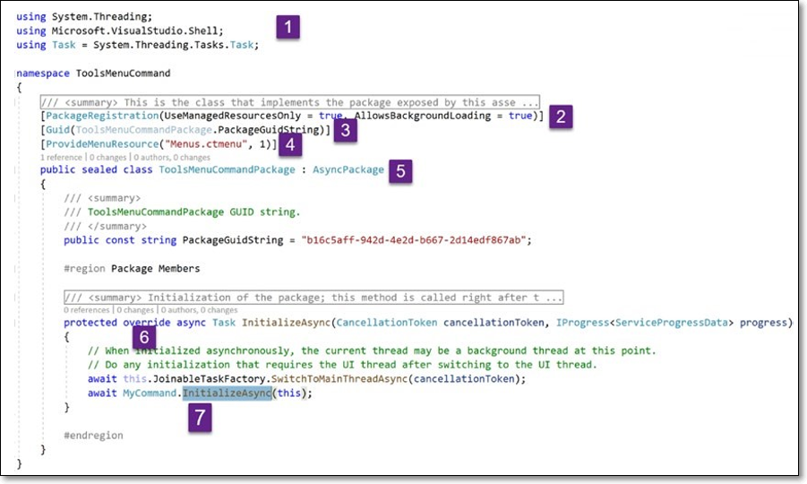
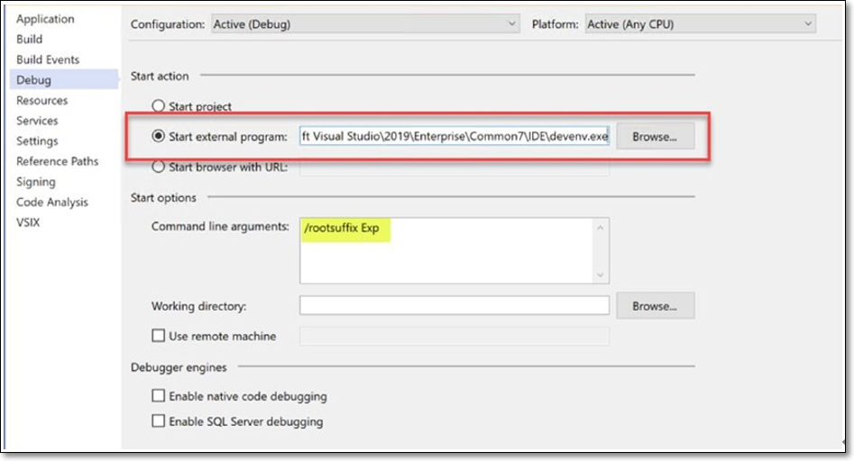

# Visual Studio 기능 확장하기
이 장에서는 Visual Studio의 확장성 모델에 대해 배웁니다. 이를 위해 Visual Studio 사용자 인터페이스와 해당 SDK(소프트웨어 개발 키트)를 살펴보고 사용 가능한 확장성 지점을 확인합니다. 그런 다음 사용자 지정 명령에 대한 기본 확장을 개발하고 코드 창, 도구 메뉴 및 솔루션 탐색기에 통합할 수 있는 방법을 살펴봅니다. 우리는 명령 확장성에 관한 몇 가지 잠재적인 질문에 대해 논의함으로써 이 장을 마무리합니다. 이 장의 끝에서 우리는 Visual Studio 확장성의 기초를 이해하고 우리가 사랑하는 IDE를 위한 실제 확장을 만들기 위한 견고한 토대를 제공하는 기본 확장을 개발할 것입니다.

***
## <font color='dodgerblue' size="6">1) IDE 알아보기 - Visual Studio 유저 인터페이스</font>
확장을 시작하기 전에 Visual Studio의 사용자 인터페이스(UI)를 알아야 합니다. Visual Studio의 UI는 그림 3-1과 같습니다.

   
그림 3-01 Visual Studio 유저 인터페이스

이렇게 하면 Visual Studio의 명명법과 레이아웃을 알 수 있을 뿐만 아니라 확장하려는 확장성 지점과 구성 요소를 알 수 있습니다. 그림 3-1은 이 장을 작성하는 시점의 Visual Studio 2019의 사용자 인터페이스(UI)를 보여줍니다. UI의 여러 섹션에는 번호가 매겨져 있어 쉽게 식별하고 간략하게 논의할 수 있습니다. 그림에서 번호가 매겨진 순서대로 이러한 다양한 구성 요소를 살펴보겠습니다.

1. 메뉴/메뉴바: 비주얼 스튜디오와 자주 사용하는 메뉴 항목으로 구성.  
    a. 파일 - 이 메뉴에는 파일, 프로젝트 및 솔루션의 생성, 열기 및 저장 명령이 포함되어 있습니다.  
    b. 편집 - 코드의 수정, 리팩터링, 잘라내기, 붙여넣기 삭제등의 명령을 포함  
    c. 보기 - Visual Studio IDE의 창을 보기 등 표시하고 볼 수 있는 명령이 포함되어 있습니다.  
    d. 프로젝트 - 프로젝트의 종속성 및 파일을 추가하거나 제거하는 명령이 포함된 메뉴  
    e. 디버그 - 이 메뉴에는 디버깅 도구 및 창을 실행, 디버그 및 활용하는 명령이 포함되어 있습니다.  
    f. 아키텍처 - 도구의 Enterprise 버전에서만 사용할 수 있으며 Community 및 Visual Studio의 다른 버전에서는 사용할 수 없습니다. 이 메뉴에는 솔루션에 대한 코드 맵을 생성하고 UML 탐색기, 계층 탐색기, 클래스 보기, 개체 브라우저 등과 같은 아키텍처와 관련된 다른 창을 표시하는 명령이 포함되어 있습니다.  
    g. 테스트 - 테스트 메뉴 명령은 테스트를 검색, 디버그 및 실행하고 테스트 재생 목록 및 적용 범위 결과를 생성하기 위한 창을 보기 위한 모든 명령을 분류합니다.  
    h. 분석 - 이 메뉴는 코드를 분석하고 코드 측정항목을 계산하는 명령을 그룹화합니다.  
    i. 도구 - Visual Studio IDE의 설정을 사용자 지정하고 변경하는 명령이 포함되어 있습니다.  
    j. 확장 - Visual Studio 2019에 도입된 새로운 메뉴입니다. 확장 및 업데이트 창으로 직접 이동할 수 있습니다. 이전에는 이 창을 보기 위한 탐색이 도구 ➤ 확장 및 업데이트였습니다.  
    k. 창 - 이 메뉴에는 새 창을 추가하는 명령이 포함되어 있습니다. 창을 숨기거나, 보거나, 고정하거나, 탭합니다. 레이아웃을 변경합니다.  
    l. 도움말 - 이 메뉴는 Visual Studio IDE, 제품 등록, 피드백 및 온라인 설명서에 대한 정보를 보기 위한 명령을 그룹화합니다.

2. **툴바**  
    도구 모음은 Visual Studio의 최상위 메뉴 바로 아래에 있으며 상황에 맞는 가장 일반적인 명령에 대한 액세스를 제공합니다. 마지막 이미지의 도구 모음에서 볼 수 있는 몇 가지 일반적인 명령은 저장, 모두 저장, 실행 취소 등입니다.

3. 코드 창
    여기에서 코드 파일을 편집하고 코드를 작성합니다. XML, C#, F#, txt, JavaScript, TypeScript, C 또는 설치된 Visual Studio에서 지원하는 기타 파일 형식일 수 있습니다. IntelliSense, 리팩토링, 코드 창의 확장을 통해 전구 스타일 코드 제안을 통해 편집기를 확장할 수 있습니다. 편집기에 의해 노출되는 다른 가능한 확장성 포인트는 여백, 스크롤바, 태그, 장식품, 옵션 등입니다.

4. 코드 창 컨텍스트 메뉴
    이것은 보편적인 명칭이 아닐 수 있습니다. 코드 창을 마우스 오른쪽 버튼으로 클릭하면 코드 파일에서 실행할 수 있는 명령을 나열하는 컨텍스트 메뉴가 표시됩니다. 이 이미지는 코드 창에서 열린 C# 파일의 상황에 맞는 메뉴를 표시합니다. 이 메뉴를 확장하고 새 항목을 추가할 수 있습니다.

5. 에러 리스트
    이름에서 알 수 있듯이 모든 오류, 경고 및 메시지가 이 창에 나열되며 기본적으로(기본 웹 개발 레이아웃에서) Visual Studio 아래쪽에 도킹됩니다. 보기 ➤ 오류 목록을 클릭하거나 Ctrl \ E를 눌러 상단 메뉴 모음에서 열 수 있습니다. 이 창에 표시되는 오류, 경고 및 메시지는 코드를 작성할 때나 IntelliSense에 의해 생성되거나 빌드 또는 코드 분석에 의해 생성됩니다. 오류를 두 번 클릭하면 해당 오류의 파일 및 위치로 이동합니다. 오류, 경고 및 메시지 또는 이들의 조합만 표시하는 필터를 제공합니다. 이 창은 상단에 드롭다운을 제공하여 창에 표시되는 항목의 범위를 문서, 프로젝트 또는 솔루션으로 축소할 수 있습니다. 이 창은 검색을 지원하므로 특정 항목을 더 쉽게 찾을 수 있습니다. 오류 목록의 항목을 표시하고 오류 목록의 항목을 클릭할 때 발생하는 일을 처리하는 확장을 작성할 수 있습니다.

6. 출력 창
    IntelliSense, 솔루션, 소스 제어, 패키지 관리자 등과 같은 Visual Studio IDE의 다양한 구성 요소에서 상태 메시지가 표시되는 곳입니다. 디버깅하는 동안 출력 창은 다음과 같이 디버깅 및 오류 메시지, 경고를 볼 수 있도록 도움이 됩니다. 상태 메시지뿐만 아니라. 출력 창을 활용하는 확장을 작성할 수 있으며 다음 장에서 살펴보겠습니다.

7. 상태 바
    이것은 최신 작업의 상태를 표시하는 Visual Studio IDE의 맨 아래 부분입니다. 마지막 이미지에서 상태가 Ready로 표시됩니다. 확장 기능을 작성하는 동안 상태 표시줄에 상태 메시지를 쉽게 작성할 수 있습니다.

8. 솔루션 탐색기
    Visual Studio를 사용한 적이 있는 모든 개발자는 확실히 솔루션 탐색기에 익숙하고 파일, 프로젝트 및 솔루션을 추가 및 편집하는 데 사용했기 때문에 이 창에 많은 설명이 필요하지 않습니다. 여기에는 우리가 작업 중인 솔루션, 프로젝트 및 파일이 표시됩니다.

9. 솔루션 탐색기 컨텍스트 메뉴
    솔루션 탐색기에서 선택한 항목을 마우스 오른쪽 버튼으로 클릭하면 선택한 항목과 관련된 명령 목록을 표시하는 컨텍스트 메뉴가 나타납니다. 예를 들어 프로젝트가 선택되었을 때 컨텍스트 메뉴를 마우스 오른쪽 버튼으로 클릭하면 Build, Rebuild, Clean, Debug 등과 같이 프로젝트에 적용할 수 있는 항목이 표시됩니다. 이는 파일 및 솔루션에서도 마찬가지로 동일합니다. 이 장의 뒷부분에서 볼 수 있듯이 이 메뉴를 확장할 수 있습니다.

10. 팀 탐색기
    나중에 VSO(Visual Studio Online)로 이름이 바뀐 TFS(Team Foundation Server)와 연결하고 작업하기 위해 나중에 다시 VSTS(Visual Studio Team Services)로 이름이 바뀌었고 현재 Azure DevOps로 알려져 있습니다. 여기에서 GitHub 리포지토리에 연결할 수도 있습니다.

11. 서버 탐색기
    이름에서 알 수 있듯이 시스템에 설치되거나 연결된 서버에 액세스할 수 있는 단일 통합 창을 제공합니다. 가장 일반적인 것은 데이터베이스와 SharePoint 서버입니다. Azure 구독에 연결하면 구독과 연결된 App Service, Classic Cloud Services, SQL Database, Notification Hubs, Virtual Machines 및 Storage와 같은 다양한 클라우드 구성 요소 및 서비스를 볼 수 있습니다.

12. 속성 창
    이 창은 WPF 디자이너 또는 Windows Forms 디자이너 및 편집기와 같은 디자이너에서 선택한 항목의 디자인 시간 속성 및 이벤트를 표시하고 편집(읽기 전용이 아닌 경우)할 수 있는 인터페이스를 제공합니다. 솔루션 탐색기에서 선택한 파일, 프로젝트 및 솔루션 속성을 보는 데에도 사용할 수 있습니다. 속성 창을 표시하려면 디자이너 또는 솔루션 탐색기에서 항목을 선택하고 F4 키를 누릅니다. 이 창은 속성 그리드 컨트롤을 사용하여 속성을 표시합니다. Visual Studio의 사용자 인터페이스를 다시 방문하고 확장성에 대해 간략하게 논의했으므로 이제 Visual Studio의 확장성 모델에 대해 알아볼 차례입니다.

## <font color='dodgerblue' size="6">2) Visual Studio 확장성 모델</font>
이 섹션에서는 Visual Studio 확장성 모델에 대해 설명한다.

여러분의 마음을 사로잡을 수 있는 분명한 질문은 "확장성 모델을 알아야 하는 이유는 무엇입니까?"이다. 대답은 간단하다. WPF/Windows 형식을 모르면 C# 개발자가 Windows용 데스크톱 기반 GUI 응용 프로그램을 만들 수 없는 것처럼 간단하다. 또는 ASP.NET/ASP.NET Core를 알지 못하는 것과 마찬가지로 이러한 프레임워크를 기반으로 하는 웹 애플리케이션/API를 만들 수 없다. 마찬가지로 Visual Studio 확장성 모델을 모르면 좋은 Visual Studio 확장을 만드는 것이 매우 어렵습니다. Visual Studio 확장성 모델을 알게 되면 자신 있게 확장을 만들어 Visual Studio를 확장할 수 있다.

마지막 장의 "보일러 플레이트 확장 구조" 섹션에서 Microsoft.VisualStudio.SDK 패키지에 대한 참조가 있는 이 초기구조 확장에 대해 논의했음을 상기하자. 이 패키지는 메타 패키지이며 Visual Studio SDK를 포함한다.
이 NuGet 패키지를 독립 실행형 프로젝트에 설치했을 때 150개 이상의 어셈블리가 다운되었다(이 장을 작성하는 시점에서 정확히 157개).

```tip
메타 패키지는 함께 의미가 있는 패키지 그룹을 설명하는 특별한 NuGet 패키지이다. 예를 들어 Microsoft는 .NET Core 앱을 개발하는 데 필요한 모든 NuGet 패키지가 포함된 Microsoft.NETCore.App이라는 메타 패키지를 정의했다. 마찬가지로 Microsoft.VisualStudio.SDK는 Visual Studio를 확장하기 위한 확장을 개발하는 데 필요한 여러 NuGet 패키지를 그룹화하는 메타 패키지이다.
```

이러한 어셈블리는 Visual Studio SDK를 누적적으로 구성한다. 이러한 157개의 어셈블리 중 가장 중요한 몇가지 어셈블리만 논의할 것이다. 또한 이 책의 과정을 통해 확장을 개발하면서 네임스페이스, 인터페이스 및 클래스에 대해 자세히 논의합니다. 우리가 알아야 할 몇 가지 중요한 네임스페이스가 표 3-1에 나열되어 있다.

표3-1 Visual Studio SDK에서 중요한 네임스페이스
```
네임스페이스                                    설명
----------------------------------------------  -----------------------------------------------------------------------------------
Microsoft.VisualStudio.ComponentModelHost       이 네임스페이스는 Visual Studio의 MEF(Managed Extensibility Framework)에 사용되는 
                                                인터페이스 및 GuidList를 정의합니다.
Microsoft.VisualStudio.Shell                    여기에는 Visual Studio 패키지가 정의된 추상 클래스 AsyncPackage 및 Package가 포함. 
                                                Package는 Visual Studio IDE를 확장하는 기본 방법.
                                                이 어셈블리는 사용자 도구 창을 만들고 사용자 명령을 정의하는 데에도 사용된다.
Microsoft.VisualStudio.Text.Classification      코드 편집기 창에 분류자 및 형식을 추가하는 인터페이스 및 클래스의 컨테이너입니다. 
                                                편집자 분류기라는 이름에서 알 수 있듯이 코드 텍스트를 다른 클래스(예: 키워드, 주석, 
                                                다른 색상 및 테마로 분류하는 데 사용됩니다. 예를 들어 C#의 키워드는 주석과 색상이 다릅니다. 
                                                이는 구문 강조 표시를 제공하는 방법을 제공합니다.
Microsoft.VisualStudio.Text.Editor              여기에는 옵션, 여백, 스크롤바 등과 같이 편집기에서 사용되는 클래스가 포함됩니다.
Microsoft.VisualStudio.Editor                   여기에는 색상, 글꼴 등에 대해 편집기에서 사용하는 인터페이스와 클래스, 편집기 상수가 
                                                포함됩니다.
Microsoft.VisualStudio.Language.Intellisense    이 네임스페이스에는 작업 제안, 전구, 서명 도우미 및 IntelliSense를 담당하는 인터페이스와
                                                클래스가 포함.
Microsoft.VisualStudio.Text                     여기에서 코드 편집기에서 텍스트 선택, 장식, 서식 지정, 개요 및 태그 중괄호 완성 기능을
                                                제공하고 노출하는 유형 및 인터페이스가 있습니다.
Microsoft.VisualStudio.Text.*
Microsoft.VisualStudio.CommandBars              명령 모음, 명령 모음 단추, 이벤트 및 처리기에 대한 정의가 포함되어 있습니다.
Microsoft.VisualStudio.TextTemplating           이 네임스페이스는 텍스트 템플릿 유형, 텍스트 템플릿 엔진 및 텍스트 템플릿 프로세서의
                                                홈입니다. (텍스트 템플릿 변환 도구 키트) 또는 T4 템플릿에 대해 들어본 적이 있다면 동일.
Microsoft.VisualStudio.Threading                이 네임스페이스에는 Visual Studio에서 스레딩을 효과적으로 활용하는 데 도움이 되는 클래스와
                                                형식이 포함되어 있습니다. 여기에는 몇 가지 중요한 유형의 이름을 지정하기 위해 스레딩 도구,
                                                대기 확장, JointableTasks 및 SingleThreadedSynchronizationContext가 포함되어 있습니다.
Microsoft.VisualStudio.ProjectAggregator        여기에는 Visual Studio 프로젝트에 사용되는 두 개의 인터페이스와 하나의 클래스가 포함됩니다.
Microsoft.VisualStudio.ProjectSystem            Visual Studio 프로젝트 시스템 속성을 빌드, 디버그, 참조 및 작업하는 형식은 이 
                                                네임스페이스에 정의
Microsoft.VisualStudio.Language                 이 네임스페이스에는 코드 정리, CodeLens 및 IntelliSense에 대한 형식이 있습니다. 
                                                Visual Studio의 코드 편집기에서 사용하는 다른 형식도 포함합니다.
Microsoft.VisualStudio.Utilities                확장 개발에 사용되는 속성은 대부분 이 네임스페이스 아래에 정의됩니다. NameAttribute, 
                                                PriorityAttribute, DisplayAttribute, AppliesToProjectAttribute, OrderAttribute, 
                                                ExportImplementationAttribute, ImportImplementationsAttribute는 이 네임스페이스에 정의된
                                                몇 가지 공통 속성입니다. 또한 편집기에서 사용하는 클래스도 포함합니다.
EnvDTE                                          이 네임스페이스(EnvDTE)는 꽤 오랫동안 Visual Studio에 있었고 수년에 걸쳐 발전해왔기 때문에 
                                                Visual Studio의 다른 버전에 추가된 접미사 80, 90, 90a 및 100을 볼 수 있습니다.
                                                이 네임스페이스에는 Visual Studio의 작업 자동화에 사용되는 인터페이스와 형식이 포함되어 
                                                있습니다. Visual Studio의 이전 버전(VS 2012까지)은 추가 기능을 지원하고 이 네임스페이스를 
                                                광범위하게 사용하는 추가 기능을 만드는 멋진 마법사를 제공했습니다. 최신 VSPackage는 
                                                자동화 모델 활용도 지원.
EnvDTE80
EnvDTE90
EnvDTE90a
EnvDTE100
VSLangProj                                      이 네임스페이스에 정의된 형식과 인터페이스는 언어(C# 또는 VB) 프로젝트 시스템과 자동화에
                                                의해 사용되어 진다.
Microsoft.Build*                                이러한 네임스페이스(Microsoft.Build로 시작하는 네임스페이스)는 MSBuild 인프라에서 사용.
```

이 마지막 표에서는 바다에 떨어지는 것과 같은 소수의 네임스페이스만 보았지만 일반적으로 개발된 Visual Studio 확장에 대해 가장 자주 사용하고 접하게 되는 네임스페이스입니다. 우리는 사랑하는 IDE를 확장하는 이 여정을 진행하면서 몇 가지 네임스페이스에 대해 더 논의할 것입니다.

   
그림 3-02 Visual Studio 확장성 모델

그림 3-2는 Visual Studio의 고수준 확장성 모델을 보여줍니다. 기본에는 핵심 구성 요소, API 및 COM 인터페이스로 구성된 Visual Studio가 있습니다. 그 위에 Visual Studio를 확장할 수 있는 다양한 방법이 있습니다. 맨 왼쪽에 있는 블록의 이름은 사용자 지정입니다. Visual Studio IDE는 도구 ➤ 사용자 지정을 사용하여 코딩 없이도 확장할 수 있습니다. 이는 명령과 메뉴를 추가/제거하고 위치를 조정할 수 있는 유연성을 제공합니다. 다음 그림은 Visual Studio의 이 사용자 지정 기능을 보여줍니다. 명령을 추가 또는 제거하거나 명령 위치를 변경하여 메뉴 모음, 도구 모음 또는 상황에 맞는 메뉴 명령을 사용자 지정할 수 있습니다. 키보드 버튼을 사용하여 키보드 단축키를 할당하는 옵션도 있습니다. 나는 독자들이 탐색하고 가지고 놀기를 권장합니다.
이 기능은 매우 직관적이기 때문에 자체적으로 사용할 수 있습니다.

   
그림 3-03 커스터마이징

Customizations 바로 오른쪽에는 두 가지 더 이상 사용되지 않고 사용되지 않는 확장 방식인 매크로 및 추가 기능이 있습니다. Visual Studio 여정에서 오랜 시간 동안 존재했으며 Visual Studio 2012까지 관련이 있었습니다. 그림 3-3에는 설명 목적으로만 표시되어 있으며 현재 Visual Studio에서 지원하지 않습니다. Visual Studio 자동화 API 즉 EnvDTE를 기반으로 했습니다. 그런 다음 VSPackage를 기반으로 최고 수준의 확장성을 제공하는 Visual Studio SDK가 제공됩니다. 또한 다른 기술 간의 높이 차이를 확인하십시오. Customization은 높이가 가장 작고 Package가 가장 높으며, Package가 가장 높은 확장성을 제공하고 사용자 지정이 가장 낮은 확장성을 제공함을 나타냅니다. VSPackage를 기반으로 모든 확장을 개발할 것입니다. 

중요한 네임스페이스와 SDK 도움말을 아는 것이 도움이 되지만 Visual Studio를 확장하려면 사용할 유형과 인터페이스를 알아야 합니다. 이러한 각 네임스페이스에 대해 정의된 인터페이스와 유형을 보고 나열할 수 있습니다. 그러나 모든 이론과 코드가 없으면 조금 지루할 것입니다. 따라서 이 장의 나머지 부분에서는 확장을 개발하고 중요한 유형과 인터페이스에 대해 논의합니다. Visual Studio에는 확장을 개발하는 동안 클래스에 필요한 네임스페이스를 자동으로 추가하는 확장성 템플릿이 많이 있습니다. 

이 장의 나머지 부분에서 다음 확장을 개발할 것입니다. 

    *  도구 메뉴, 코드 편집기 메뉴, 프로젝트 컨텍스트 메뉴, 코드 창의 사용자 지정 명령. 
    * 키보드 단축키를 명령으로 바인딩. • 아이콘을 명령과 연결합니다. 
    * 명령의 가시성 제어. 
    * 동적 명령. 
    * 사용자 정의 명령으로 이미 존재하는 명령을 연결합니다. 
    * 도구 창 확장. 우리는 과정을 따라 이러한 확장 각각의 설명과 목적에 대해 논의하고 중요한 유형과 인터페이스도 배웁니다.

- ### a. 메뉴와 명령어 확장하기
    이 섹션에서는 도구 메뉴의 명령을 확장하는 Visual Studio 확장을 개발합니다. 그림 3-4는 기본 확장성 명령 템플릿이 도구 메뉴에 명령을 추가하여 보다 직관적임을 보여줍니다.

       
    그림 3-03 메뉴와 명령어

    다음으로 솔루션 탐색기의 코드 창 상황에 맞는 메뉴, 프로젝트 상황에 맞는 메뉴, 솔루션 상황에 맞는 메뉴 및 파일 상황에 맞는 메뉴에 명령을 추가하는 방법을 알아본다.  
        - 이 과정에서 Visual Studio 명령 테이블과 .vsct 파일을 올바르게 편집하는 데 도움이 되는 도구에 대해 알아보고  
        - 또한 새로 추가된 명령에 키보드 단축키를 바인딩하고 이와 관련된 아이콘을 변경하는 방법도 배운다. 
        - 마지막으로 이 섹션의 끝 부분에서 이러한 명령의 가시성을 변경하는 방법과 컨텍스트에 따라 명령을 동적으로 추가하거나 제거하는 방법을 봅니다.
        
    코드를 작성해 보겠습니다.

- ### b. 도구 메뉴 확장
    다음 단계에 따라 Visual Studio 도구 메뉴에 대한 확장을 생성하겠습니다. 

    - **1.그림 3-5와 같이 VSIX 프로젝트 템플릿을 선택하여 새 Visual Studio 확장성 프로젝트를 생성**  
           
        그림 3-05 VSIX 프로젝트 템플릿

    - **2.새로 생성된 프로젝트 내용**   
        새 프로젝트에는 2장에서 논의한 패키지 클래스와 vsixmanifest 파일만 포함되어 있습니다(그림 3-6 참조)

           
        그림 3-06 보일러플레이트 프로젝트에서의 파일들  

        현재 프로젝트에는 Command 클래스가 없습니다.

    - **3.새 명령어 추가**   
        새 명령어을 추가하려면 프로젝트를 마우스 오른쪽 버튼으로 클릭합니다. 프로젝트 컨텍스트 메뉴가 표시됩니다. 그런 다음 추가 ➤ 새 항목을 클릭하거나 Ctrl Shift A를 직접 눌러 새 항목을 추가합니다. 그러면 그림 3-7과 같이 새 항목 추가 대화 상자가 열립니다.
           
        그림 3-04 새 아이템 추가
    
    - **4.새 명령어 추가**   
        왼쪽 패널의 Visual C# 항목 확장성 범주에서 VSPackage를 클릭합니다. 다음 네 가지 항목 템플릿이 표시됩니다.  

        a. 비동기 패키지 - Visual Studio에서 로드할 수 있는 비동기 패키지를 만듭니다.  
        b. 명령 - 도구 메뉴에서 맞춤 명령을 만듭니다.  
        c. 비동기 도구 창 - 도구 창을 비동기식으로 로드하는 명령을 사용하여 Visual Studio에서 호스팅할 수 있는 맞춤 도구 창을 만듭니다.  
        d. 도구 창 - 동기식으로 로드하는 명령을 사용하여 Visual Studio에서 호스팅할 수 있는 도구 창을 만듭니다. 새로운 권장 사항은 항상 Async Tool 윈도우를 사용하는 것이므로 이전 버전과의 호환성을 지원하기 위해 제공되는 것 같습니다. 
        
        프로젝트에 새 명령을 추가하기 위해 명령 템플릿을 선택합니다. 파일 이름을 MyCommand.cs로 지정했습니다. 추가 버튼을 클릭합니다.

    - **5.추가된 파일 살펴보기**   
        새로 추가된 파일이 있는 수정된 프로젝트는 그림 3-8과 같으며, 새로 추가된 파일과 참조는 쉽게 식별할 수 있도록 강조 표시됩니다. Windows 양식을 지원하기 위해 참조가 추가되었습니다.  
        
           
        그림 3-08 명령어 템플릿에 의해 생성된 파일들

        참조 외에도 세 개의 파일이 더 추가됩니다.  

        - **a. MyCommand.png**  
            리소스 폴더 내에 생성된 생성된 명령어의 이름과 이름이 같은 이미지 스트립 또는 스프라이트(이미지 세트)입니다. 기본 이미지 스프라이트에는 그림 3-9와 같이 6개의 이미지가 포함되어 있습니다. 쉽게 식별할 수 있도록 이미지에 번호를 명시적으로 지정했습니다.
            
               
            그림 3-09 6개의 이미지가 포함된 이미지 스프라이트 파일
        
        - **b. MyCommand.cs**  
            새 명령을 추가하기 위해 추가되는 C# 코드 파일이며 명령이 실행될 때 코드를 실행하는 이벤트 핸들러를 포함합니다. 명령 파일을 보면 MyCommand의 인스턴스를 반환하는 Instance라는 공용 정적 속성 외에 세 가지 메서드만 있습니다.

            - i. AsyncPackage 및 OleMenuCommandService를 매개 변수로 사용하는 명령의 개인 생성자입니다. 여기에서 명령이 구성되고 명령 서비스에 추가됩니다.  
            - ii. AsyncPackage에서 OleMenuCommandService를 확인한 후 명령의 개인 생성자를 호출하여 AsyncPackage를 매개 변수로 사용하고 명령의 단일 인스턴스를 초기화하는 공용 정적 InitializeAsync 메서드입니다. 
            - iii. 메뉴 항목을 클릭할 때 명령을 실행하는 이벤트 처리기인 Execute라는 개인 콜백 메서드입니다.

            그림 3-10은 이 새로 추가된 명령 클래스를 요약한 것입니다.

               
            그림 3-10 MyCommand.cs 의 클래스 다이어그램

        - **c. ToolsMenuCommandPackage.vsct**  
            파일 확장자 vsct는 Visual Studio 명령 테이블(vsct)을 나타냅니다. 이 파일은 Visual Studio 명령 테이블을 구성하고 VSPackage에 포함된 명령을 설명하는 XML 구성 파일입니다. 또한 명령의 레이아웃과 모양을 제어합니다. 명령은 버튼, 메뉴, 도구 모음 등에 포함될 수 있습니다. 이 구성 파일이 VSCT 컴파일러를 통해 전달되면 Visual Studio에서 이해할 수 있는 바이너리로 변환됩니다. 도구 메뉴에서 명령을 추가하는 코드 스니펫을 확인해보자. 그림 3-11은 vsct 파일의 트리밍된 버전(주석 제거됨)을 보여줍니다. 스니펫에는 vsct 파일의 주요 개념을 논의할 수 있도록 번호가 매겨져 있습니다.
        
               
            그림 3-11 vsct 파일 코드

            vsct 파일의 코드 스니펫에서 다음과 같은 주요 내용을 확인할 수 있습니다.

    - **6.xml 노드 설명**   
        CommandTable 요소는 vsct 파일의 루트 노드입니다. vsct의 네임스페이스와 스키마는 이 요소의 속성으로 지정됩니다. 이 요소는 명령을 정의하는 모든 요소의 정의를 포함합니다. 명령은 Visual Studio IDE에 표시되는 메뉴 항목, 도구 모음, 단추 또는 콤보 상자일 수 있습니다. 이 명령 테이블에 정의된 것은 무엇이든 포함하는 VSPackage가 Visual Studio IDE에 노출하는 명령의 UI 또는 레이아웃입니다. CommandTable에는 자식으로 Extern, Commands 및 Symbols가 있습니다. CommandTable의 상위 수준 구조는 다음과 같습니다.

        ```xml
        <CommandTable xmlns="http://schemas.microsoft.com/VisualStudio/2005-10-18/CommandTable" 
        xmlns:xs="http://www.w3.org/2001/XMLSchema" >
            <Extern>... </Extern>
            <Include>... </Include>
            <Define>... </Define>
            <Commands>... </Commands>
            <CommandPlacements>... </CommandPlacements>
            <VisibilityConstraints>... </VisibilityConstraints>
            <KeyBindings>... </KeyBindings>
            <UsedCommands... </UsedCommands>
            <Symbols>... </Symbols>
        </CommandTable>
        ```

        다음 섹션에서는 이러한 각 XML 요소의 목적을 요약합니다.

        - **a. Extern**  
            선택적 요소이며 일반적으로 vsct 컴파일러에 대한 전처리기 지시문을 포함합니다. 이 요소는 컴파일 시 이 .vsct 파일과 병합될 외부 C 헤더(.h) 또는 .vsct 파일을 나타냅니다. href 속성은 파일을 참조하는 데 사용됩니다. .vsct 파일 코드에서 위에서 언급한 파일 이름이 stdidcmd.h임을 알 수 있습니다.  예를 들어:

            ```xml
            <Extern href="stdidcmd.h" />
            ```

        - **b. Include**  
            이것은 선택적 요소이므로 이전에 표시된 코드 목록에 표시되지 않습니다. 이 요소는 현재 파일에 포함될 수 있는 파일을 지정합니다. href 속성은 파일을 참조하는 데 사용됩니다. 포함 파일에 정의된 모든 기호 및 유형은 컴파일 출력의 일부가 됩니다. 예를 들어:

            ```xml
            <Include href="stdidcmd.h" />
            ```

        - **c. Define**  
            이것은 다시 선택적 요소입니다. 정의는 이름에서 알 수 있듯이 기호와 해당 값을 정의합니다. 여기에는 두 개의 필수 속성(이름 및 값)과 기호를 평가하는 데 사용할 수 있는 선택적 속성 Condition이 있습니다. 예를 들어:
            
            ```xml
            <Define name="Mode" value="Standard" />
            ```    

        - **d. Commands**  
            이것은 또한 선택적 요소입니다. 그러나 이것은 VSPackage에 대한 명령을 정의하는 주요 요소입니다. 여기에는 package라는 속성이 있으며 그 값은 그림 3-11(vsct파일 캡처본)에 표시된 숫자4로 표시된 항목이다.(그림에 세 번 나옴). 
            
            vsct 파일에서 위에서 아래로 이동하면 문자열 guidToolsMenuCommandPackage은 Commands의 package 속성에서 먼저 사용되었고 다음에는 Symbols/GuidSymbol 요소의 name값에도 사용되고 해당 값은 GUID(Globally Unique Identifier)인 것을 볼 수 있다. 그림의 오른쪽 하단에서도 다시 숫자4를 볼 수 있는데 이것은 guidToolsMenuCommandPackage 패키지는 내부 식별자로 GUID 값을 가지며 실제로는 guid{프로젝트명}Package.cs의 package 클래스를 나타낸다.  vs2017에서는 guid{커맨드파일명}Package.cs  
            vsct 파일 뒤에 있는 코드의 GUID 값은 동일하다. 이 GUID 때문에 Command가 패키지와 연결된다. Commands 요소는 Commands의 상위 수준 구조에서 아래와 같이 여러 자식을 가질 수 있습니다.
    
            ```xml
            <Commands package="guidToolsMenuPackage" >
                <Menus>... </Menus>
                <Groups>... </Groups>
                <Buttons>... </Buttons>
                <Combos>... </Combos>
                <Bitmaps>... </Bitmaps>
            </Commands>
            ```    

            Commands의 자식은 5개일 수 있습니다.

            - i. Menus                 
                VSPackage가 구현하는 모든 메뉴와 Toolbar(도구 모음)을 정의한다. 조건에 따라 Condition이라는 선택적 속성을 가지는데 이는 어떤 조건에 따라 메뉴를 렌더링하기 위해 사용된다. Menus는 하위 Menu 요소의 집합이므로 내부에 여러 Menu 요소가 있을 수 있다. 각 Menu 요소는 단일 Menu이거나 Toolbar(도구 모음)을 나타냅니다.

                ```xml
                <Menus>
                    <Menu>... </Menu>
                    <Menu>... </Menu>
                </Menus>
                ```
                위 그림 3-11에서는 우리가 구현한 패키지가 Menu가 아닌 Command만 생성했기 때문에 이 요소를 볼 수 없다. Menu 요소는 단일 메뉴 항목을 정의하고 Context, Menu, MenuController, MenuControllerLatched, Toolbar 및 ToolWindowToolbar의 6가지 종류가 있다. Menu 요소의 구문은 다음과 같습니다.
                
                ```xml
                <Menu guid="guidMyCommandSet" id="MyCommand" priority="0x100" type="Menu">
                    <Parent>... </Parent>
                    <CommandFlag>... </CommandFlag>
                    <Strings>... </Strings>
                </Menu>
                ```

                GUID 및 id 속성은 Menu 요소의 필수 속성이며 명령 식별자의 GUID 및 id를 나타냅니다. 우선 순위, 유형 및 조건은 선택적 속성입니다. Priority는 메뉴 그룹에서 메뉴의 상대적 위치를 지정하는 숫자 값이고 type은 요소의 종류를 지정하는 열거 값입니다. 유형이 지정되지 않은 경우 해당 값은 기본적으로 메뉴로 설정되며 가능한 값은 다음과 같다.

                * Context
                * Menu
                * MenuController
                * MenuControllerLatched 
                * Toolbar(도구 모음)
                * ToolWindowToolbar

                디테일은 Visual Studio 2019에 대한 <a href="https://docs.microsoft.com/en-in/visualstudio/extensibility/menu-element?view=vs-2019" target="_blank">자세한 설명서</a>를 읽어보자
                 

                Menu 요소의 구문은 세 개의 자식 항목이 있다.

                * Parent - 선택적. 지정된 경우 메뉴 항목의 상위 항목을 나타냅니다. 
                * CommandFlag - 필수 요소. 메뉴에 대한 유효한 CommandFlag 값은 다음과 같습니다.
                    * AlwaysCreate 
                    * DefaultDocked 
                    * DefaultInvisible 
                    * DontCache 
                    * DynamicVisibility 
                    * IconAndText 
                    * NoCustomize 
                    * NotInTBList 
                    * NoToolbarClose 
                    * TextChanges 
                    * TextIsAnchorCommand

                    CommandFlag 요소에 대한<a href="https://docs.microsoft.com/en-in/visualstudio/extensibility/command-flag-element?view=vs-2019" target="_blank">자세한 설명서</a>

                * Strings - 필수 요소. 여러 자식을 가질 수 있다.  
                    ButtonText 요소는 필수이고 가장 중요한 자식 요소, 메뉴가 표시하는 텍스트를 정의. 텍스트 문자열의 앰퍼샌드(&)는 명령에 대한 키보드 단축키를 지정. Strings 요소의 구문은 다음과 같습니다.    

                    ```xml
                    <Strings>
                        <ButtonText>... </ButtonText>
                        <ToolTipText>...</ToolTipText>
                        <MenuText>...</MenuText>
                        <CommandName>... </CommandName>
                        <CanonicalName>...</CanonicalName>
                        <LocCanonicalName>...</LocCanonicalName>
                    </Strings>
                    ```

                    이러한 요소의 목적은 아래에.

                    * ButtonText - 메뉴에 표시되는 텍스트 지정. 필수. 
                    * ToolTipText - 메뉴 명령에 대해 표시되는 도구 설명 텍스트 지정.  
                        툴팁 텍스트를 지정하지 않으면 ButtonText의 텍스트가 툴팁으로 사용. 
                    * MenuText - 이 요소는 Command가 기본 메뉴, 도구 모음, 바로 가기 메뉴 또는 하위 메뉴에 있는 경우 해당 명령에 대해 표시되는 텍스트를 지정. MenuText 요소가 비어 있으면 IDE는 ButtonText 요소 값을 사용. 이 요소는 현지화에도 사용할 수 있습니다. 
                    * CommandName - 명령의 명령 이름입니다. 이 명령 이름은 모든 명령이 나열되는 도구 ➤ 사용자화 ➤ 명령 섹션에서 볼 수 있습니다. 이 명령은 도구 ➤ 옵션 ➤ 키보드 대화 상자에서도 볼 수 있습니다. 
                    * CanonicalName - 영어 표준 이름 요소입니다. 메뉴 항목을 실행하기 위해 명령 창에 입력할 수 있는 영어 텍스트의 명령 이름을 지정합니다. IDE는 문자, 숫자, 밑줄 또는 포함된 마침표가 아닌 모든 문자를 제거합니다. 그런 다음 이 텍스트를 ButtonText 필드에 연결하여 명령을 정의합니다. 예를 들어, 파일 메뉴의 새 프로젝트는 File.NewProject 명령이 됩니다. 
                    * LocCanonicalName - 현지화를 지원한다는 점을 제외하고 영어 CanonicalName 요소와 동일하게 작동합니다.

            - ii. Groups  
                이 요소는 VSPackage에 의해 노출된 명령 그룹을 나타내는 Group 요소 집합을 정의. Groups 요소의 구문은 다음과 같습니다.                  

                ```xml
                <Groups>
                    <Group>... </Group>
                    <Group>... </Group>
                </Groups>
                ```

                Group 요소는 아래 구문을 따르는 단일 명령 그룹을 나타냅니다.

                ```xml
                <Group guid="guidMyCommandSet" id="MyGroup" priority="0x101">
                    <Parent>... </Parent>
                </Group>
                ```

                GUID 및 id는 필수 속성이며 그룹의 GUID 및 식별자를 지정합니다. 우선 순위(priority)는 명령 그룹의 순서를 지정하는 숫자 값입니다.

            - iii. Buttons  
                Buttons 요소는 사용자가 상호 작용할 수 있는 UI로 명령을 나타내는 Button 요소의 그룹입니다. Buttons 요소의 구문은 다음과 같습니다.

                ```xml
                <Buttons>
                    <Button>... </Button>
                    <Button>... </Button>
                </Buttons>
                ```

                명령과 해당 UI를 나타내는 Button 요소는 Button, MenuButton 또는 SplitDropDown의 세 가지 유형일 수 있습니다. Button 요소의 구문은 다음과 같습니다.

                ```xml
                <Button guid="guidMyCommandSet" id="MyCommand" priority="0x100"type="button">
                    <Parent>... </Parent>
                    <Icon>... </Icon>
                    <CommandFlag>... </CommandFlag>
                    <Strings>... </Strings>
                </Button>
                ```

                반복과 중복을 피하기 위해 앞에서 논의한 속성과 자식 요소에 대해서는 논의하지 않습니다. GUID, id, priority 및 type 속성은 이미 논의되었으며 Button 요소에도 동일한 용도로 사용됩니다. 자식 요소인 Parent, CommandFlags 및 Strings도 논의되었습니다. 아이콘을 명령과 연결하는 데 사용할 수 있는 또 다른 요소 Icon이 있습니다. CommandFlags의 유효한 값 및 Button 요소의 기타 세부 정보를 볼 수 있습니다.  
                https://docs.microsoft.com/en-in/visualstudio/extensibility/buttonelement?view=vs-2019.

            - iv. Combos  
                이 요소는 Combo 요소를 그룹화합니다. 다음 구문이 있습니다.
                ```xml
                <Combos>
                    <Combo>... </Combo>
                    <Combo>... </Combo>
                </Combos>
                ```

                Combo 요소는 여러 명령을 포함할 수 있는 콤보 상자를 정의합니다. 콤보 상자는 DropDownCombo, DynamicCombo, IndexCombo 또는 MRUCombo 유형 중 하나일 수 있습니다. Combo 요소의 구문은 다음과 같습니다.

                ```xml
                <combo guid="guidMyCommandSet" id="MyCommand" defaultWidth="20" idCommandList="MyCommandListID" 
                    priority="0x102" type="DropDownCombo">
                    <Parent>... </Parent
                    <CommandFlag>... </CommandFlag>
                    <Strings>... </Strings>
                </combo>
                ```

            - v. Bitmaps  
                비트맵을 로드하는 Bitmap 요소를 그룹화. Bitmaps 요소의 구문은 다음과 같다.
                ```xml
                <Bitmaps>
                    <Bitmap>... </Bitmap>
                    <Bitmap>... </Bitmap>
                </Bitmaps>
                ```
                
                Bitmap 요소는 이름에서 알 수 있듯이 파일이나 리소스에서 로드할 수 있는 비트맵을 정의합니다. Bitmap 요소의 구문은 다음과 같습니다.

                ```xml
                <Bitmap guid="guidImages" href="Resources\MyCommand.png" usedList="img1,img2, img3" />
                ```

                Bitmap 요소에는 다음과 같은 속성이 있습니다.

                * GUID - 필수 속성이며 비트맵의 고유 식별자입니다. 이 식별자는 VSPackage와 연결되어 있지 않습니다. 
                * resID - 비트맵의 리소스 식별자입니다. resID 또는 href 속성 중 하나가 필요합니다. 명령 테이블 병합 중에 로드될 비트맵 스트립을 결정하는 정수 리소스 ID입니다. 명령 테이블이 로드될 때 리소스 ID로 지정된 비트맵은 동일한 모듈의 리소스에서 로드됩니다. 
                * usedList - resID 속성이 사용되는 경우 이 속성이 필요합니다. 이미지 스트립에서 사용할 이미지 목록을 지정합니다. 
                * href - 이미지 파일의 경로를 지정합니다. resID 또는 href 속성 중 하나가 필요합니다. 이 속성에 지정된 경로는 이미지로 검색되고 vsct 컴파일러의 출력에 포함됩니다. usedList 속성이 없으면 스트립의 모든 이미지를 사용할 수 있습니다. 그렇지 않으면 usedList에 지정된 이미지만 사용됩니다.  
                이미지는 .bmp, .png, .gif일 수 있지만 .png 형식을 사용하는 것이 좋습니다.

        - **e. Condition 속성**  
            방금 논의한 대부분의 요소에는 Condition이라는 선택적 속성이 있습니다. 이름에서 알 수 있듯이 이 속성은 출력에 항목을 조건부로 포함하는 데 사용됩니다. 토큰을 테스트하는 데 사용할 수 있는 미리 정의된 함수와 연산자가 있습니다. 조건이 목록 또는 그룹에 적용되면 목록 또는 그룹의 모든 자식 요소에 적용됩니다. 조건이 상위 요소와 하위 요소 모두에 정의된 경우 조건은 AND 연산으로 평가됩니다. 0이 아닌 모든 표현식은 true로 평가됩니다. Condition 속성에 대한 자세한 설명서는 Condition에 대한 공식 Microsoft 설명서를 참조하십시오.  
            https://docs.microsoft.com/en-in/visualstudio/extensibility/vsct-xml-schema-conditional-attributes?view=vs-2019

        - **f. VSCT 파일 계속**  
            그림 3-11로 돌아와서:

            - i. vsct 파일에 있는 CommandTable의 처음 두 자식 요소는 Visual Studio에서 제공하는 명령의 모든 ID와 메뉴의 명령 ID를 포함하는 stdidcmd.h 및 vsshlids.h 파일을 참조하는 Extern 노드입니다.
            - ii. Commands 요소는 Groups, Buttons 및 Bitmaps 요소를 자식으로 포함합니다. 여기에는 중요하고 패키지 GUID로 설정되는 package라는 속성이 있습니다. (그림 3-11의 모든 숫자4를 참조.) 
            - iii. Commands 요소의 package 속성에 사용되는 GUID, GUID는 Symbols 요소에 정의된 GuidSymbol 요소에 정의됩니다. 그리고 Package 클래스에 정의된 패키지 GUID는 동일해야 합니다. 
            - iv. 그룹(컬렉션)은 내부에 여러 메뉴 그룹을 가질 수 있습니다. 메뉴 그룹은 다른 메뉴 또는 명령에 대한 컨테이너입니다. 각 메뉴 그룹에는 GUID, ID 및 우선 순위가 있습니다.
            - v. 각 그룹에는 상위 메뉴를 지정하는 상위 요소가 있습니다. id는 IDM_VS_MENU_TOOLS로 설정되어 MyMenuGroup의 상위 메뉴가 Visual Studio의 메뉴바중 도구에 해당하는 메뉴임을 분명히 합니다. 이 값을 변경하면 이 명령이 다른 메뉴에 표시됩니다. 기본적으로 vsct 파일에 대한 IntelliSense 지원은 없습니다. 그러나 Mads Kristensen은 Visual Studio 2019를 확장하는 데 필요한 여러 가지 필수 확장을 포함하는 Extensibility Essentials 2019라는 확장 팩을 작성했습니다. 이 확장을 사용하여 vsct 파일에서도 IntelliSense 지원을 얻을 수 있습니다. 책 전체에 걸쳐 확장 기능을 개발하는 동안 이 확장 팩이 작동하는 것을 보게 될 것입니다. Visual Studio의 명령 및 메뉴에 대한 GUID 및 id의 자세한 목록은 다음을 참조하십시오.  
            https://docs.microsoft.com/enin/visualstudio/extensibility/internals/guids-and-idsof-visual-studio-menus?view=vs-2019

            - vi. 버튼(컬렉션)은 내부에 명령의 UI를 나타내는 여러 개의 Button 요소를 가질 수 있습니다. Button은 이 버튼이나 명령을 메뉴에 연결하는 선택적인 자식 요소를 Parent로 가질 수 있습니다. 다른 요소와 마찬가지로 버튼에는 GUID 및 id라는 필수 속성이 있습니다.
            - vii. Button 요소에는 type이라는 속성이 있으며, 이는 명령의 유형을 정의합니다. Button, MenuButton 또는 SplitDropdown과 같은 값을 가질 수 있습니다. 스니펫은 값을 Button으로 표시합니다.
            - viii. Icon 요소는 아이콘을 명령과 연결합니다. 이 아이콘은 이 버튼/명령에 해다하는 UI가 표시됩니다. 그림 3-11에서 bmpPic1은 새로 추가된 명령의 아이콘으로 연결됩니다. 이 Icon 요소의 ID를 변경하면 연결된 아이콘이 변경됩니다. 그림에서 #9도 할당된 Bitmaps 요소를 살펴보십시오. Bitmaps 요소는 이미지를 가리키거나 스프라이트 또는 스트립의 usedList 이미지를 정의하는 Bitmap 요소를 그룹화합니다. usedList는 스트립에 있는 아이콘의 서수 위치를 나타냅니다. 여기에 표시된 vsct 파일에는 href와 usedList가 모두 있지만 href가 설정되면 스트립의 모든 이미지가 사용되며 usedList는 선택 사항이 됩니다. 그렇지 않으면 VSCT 컴파일러가 vsct에서 실행될 때 스트립의 이미지만 이러한 아이콘으로 압축됩니다. 아이콘의 서수 위치 매핑은 기호 섹션에서 수행됩니다. #9는 스트립에 있는 이미지의 이름과 위치를 정의하는 많은 IDSymbol 요소를 포함하는 guidImages라는 이름의 GuidSymbol 요소에도 할당됩니다.

            - ix. 이 명령에 대해 UI에 표시될 이름을 포함하는 ButtonText 요소라는 Button의 자식 요소가 있습니다. 현재 샘플에서 표시되는 텍스트는 "Invoke MyCommand"입니다. 
            - x. Bitmap 요소에는 이미지 파일에 대한 경로가 있는 href 속성이 있습니다. 리소스\MyCommand.png. href 또는 usedList 중 하나는 vsct 파일의 각 요소의 용도를 요약한 표 3-1에서 위에서 언급한 필수 속성입니다.

- ### c. 코드 실행
    파일(참조, C# 코드, 이미지 png, .vsct 파일)이 추가되면 코드를 실행할 준비가 된 것입니다. 그러나 명령을 클릭하면 의미 있는 일이 발생하지 않습니다. 메시지 상자만 표시됩니다.

    - **1. 실험 인스턴스 실행**  
        프로젝트를 마우스 오른쪽 버튼으로 클릭한 다음 디버그 ➤ 새 인스턴스 시작을 클릭하여(또는 F5 키를 눌러) 이 프로젝트를 실행해 보겠습니다. 이렇게 하면 프로젝트가 빌드되고(vsix 만들기) 이 확장이 로드될 Visual Studio의 새로운 실험적 인스턴스가 시작됩니다. 새로 시작한 인스턴스의 오른쪽 상단 섹션을 보면 Visual Studio의 새로 시작된 인스턴스가 실험적 인스턴스임을 알 수 있습니다. 그림 3-12는 상단에 Visual Studio의 일반 인스턴스를 보여주고 하단에 Visual Studio의 Experimental 인스턴스를 보여줍니다. 인스턴스를 실험용으로 식별하는 하단 섹션에서 강조 표시된 텍스트 EXP를 확인하십시오.
        
           
        그림 3-12 vsct 파일 코드로 실행한 일반 인스턴스와 실험 인스턴스

    - **2. 실험 인스턴스 실행**  
        Visual Studio IDE의 새 인스턴스에서 도구 메뉴를 확인해 보겠습니다. 그림 3-13과 같이 새로 추가된 명령이 아이콘과 함께 추가된 것을 볼 수 있습니다.
        
           
        그림 3-13 MyCommand 실행

    - **3. 실행 결과**  
        이 새 명령을 클릭하면 그림 3-14와 같은 메시지 대화상자가 표시됩니다. 이는 기본 명령 템플릿 코드가 메시지 대화 상자를 표시하는 C# 코드를 추가하기 때문입니다. 이 장의 뒷부분에서 살펴보겠지만 이벤트 핸들러에 연결하려는 코드는 무엇이든 연결할 수 있습니다.

           
        그림 3-14 메시지 창 결과

    방금 대화 상자 메시지를 표시하는 사용자 지정 명령을 사용하여 Visual Studio의 도구 메뉴를 확장했습니다. 우리는 모든 초기생성 코드를 수행하는 기본 Visual Studio 확장성 프로젝트 항목을 방금 사용했기 때문에 아직 많은 작업을 수행할 필요가 없었습니다. 프로젝트에 새로 추가된 참조 및 파일을 확인하고 vsct 파일이 메뉴 확장에 중요한 역할을 한다는 것을 알게 되었고 올바르게 편집하면 IDE에서 명령과 메뉴를 확장하는 데 도움이 될 수 있습니다. 다음으로 확장성 템플릿에 의해 추가되는 패키지 코드에 대해 설명하겠습니다. 이런 식으로 모든 근거가 처리되고 우리는 무슨 일이 일어나고 있는지 이해합니다.        

- ### d. AsyncPackage 추상 클래스    
    그림 3-15는 패키지 클래스가 파생되는 AsyncPackage 추상 클래스의 클래스 다이어그램을 보여줍니다.
    
       
    그림 3-15 AsyncPackage 클래스 다이어그램

    AsyncPackage는 Package 추상 클래스에서 파생되고 다음 인터페이스를 구현하는 추상 클래스입니다.
    
        IAsyncServiceProvider, IAsyncLoadablePackageInitialize, IVsAsyncToolWindowFactory, IVsAsyncToolWindowFactoryProvider.

    클래스의 구성원과 목적은 표 3-2에 나와 있습니다.

    표3-2 AsyncPackage 멤버
    ```
    멤버                        설명
    --------------------------  -----------------------------------------------------------------------------------------
    DisposalToken               이 속성은 패키지가 삭제되었는지 확인하는 데 사용할 수 있는 CancellationToken 유형입니다.
                                이것은 Visual Studio가 종료되기 시작하는 동안 백그라운드 스레드에서 실행되는 비동기 작업 
                                또는 작업에 대해 발생할 수 있습니다.
    JoinableTaskCollection      이 속성은 JoinableTask의 컬렉션입니다. JoinableTask는 비동기 작업을 추적하고 작업을 완료하기
                                위해 Main 스레드를 동기적으로 차단하는 동안 교착 상태를 피하기 위해 이러한 작업을 조인하는 
                                기능을 제공하는 클래스입니다.                                
    JoinableTaskFactory         JoinableTask를 생성하기 위한 팩토리인 속성입니다.
    AddService                  현재 패키지에 비동기 서비스를 추가합니다. 서비스는 패키지 외부에서 사용할 수 없습니다.
    FindToolWindowAsync         지정된 유형 및 ID에 대한 도구 창을 비동기식으로 찾습니다. 창이 발견되면 반환하거나 매개 변수
                                값에 따라 창을 만들고 반환합니다.
    FindWindowPaneAsync         지정된 유형 및 ID에 대한 창 창을 비동기적으로 찾습니다. 창이 발견되면 반환하거나 매개변수 
                                값에 따라 창을 만들고 반환합니다.
    GetAsyncToolWindowFactory   비동기 도구 창 팩토리 인터페이스가 있는 경우 이를 반환하고 비동기 생성이 지원되거나 null을
                                반환합니다.
    GetService                  서비스 유형을 매개변수로 전달하여 패키지에 등록된 서비스를 가져옵니다.
    GetServiceAsync             서비스 유형을 매개변수로 전달하여 패키지에 등록된 비동기 서비스를 가져옵니다.
    GetToolWindowTitle          창 제목으로 사용할 제목 문자열을 가져옵니다.
    Initialize                  교착 상태가 발생할 수 있으므로 일반적으로 이 방법을 사용하지 않는 것이 좋습니다. 
                                이 메서드는 메인 UI 스레드에서 실행되므로 이 메서드에서 값비싼 작업을 수행하면 사실상
                                 정지될 수 있습니다.
    InitializeAsync             이 메서드는 백그라운드 스레드에서 실행되므로 백그라운드 스레드에서 실행할 수 있는 초기화 
                                코드를 실행하는 데 사용해야 합니다.
    InitializeToolWindowAsync   비동기적으로 도구 창을 생성하는 코드 작업을 초기화하고 수행합니다.
    RemoveService               이 패키지에 등록된 비동기 서비스를 제거합니다.
    ShowToolWindowAsync         주어진 유형과 ID의 도구 창을 비동기적으로 표시합니다.    
    ```

    이제 메서드, 속성을 알았습니다. AsyncPackage와 그 목적에 의해 구현된 인터페이스와 코드 연습을 수행하면 더 의미 있고 포괄적입니다. 그림 3-16은 ToolsMenuCommandPackage 파일의 코드를 보여줍니다. 코드는 중요한 사항을 논의하기 위해 숫자로 보정됩니다.
    
       
    그림 3-16 ToolsMenuCommandPackage 코드
    
        1. 네임스페이스 참조.
        2. PackageRegistration 속성을 표시합니다. 이것은 등록을 위해 패키지에 사용됩니다. RegPkg.exe 유틸리티는 리플렉션을 사용하여
           등록해야 하는 특성을 결정합니다. UseManagedResourcesOnly 및 AllowsBackgroundLoading이라는 두 가지 속성이 표시됩니다. 
           이 속성은 패키지가 관리 리소스만 사용하고 백그라운드 스레드에서 패키지를 로드하는 것이 안전함을 알려줍니다.
        3. GUID를 패키지에 할당합니다. 이전 섹션에서 명령이 이 GUID를 통해 패키지에 연결되는 것을 보았습니다.
        4. ProvideMenuResource 속성은 등록을 제공합니다.             
            하드 코딩된 문자열 "Menus.ctmenu"를 통해 패키지에 사용된 메뉴 리소스의 정보를 볼수 있다. 이 속성에 대한 첫 번째 
            매개변수(변경해서는 안 됨)로, 1을 두 번째 매개변수(버전 번호)로 지정합니다. 확장의 빌드 출력으로 이동하고 
            justDecompile 또는 다른 역엔지니어링/반사 도구를 사용하여 생성된 dll을 반영하면 이 dll의 리소스 아래에서 
            리소스의 키 이름이 Menus.ctmenu이고 해당 값은 바이너리입니다. 똑같다. 그림 3-17에 나와 있습니다.
        5. ToolsMenuCommandPackage는 이미 논의한 AsyncPackage 추상 클래스에서 파생된 봉인된 클래스임을 보여줍니다.
        6. 기본 클래스 AsyncPackage의 InitializeAsync 메서드에 대한 재정의 메서드이다. cancellationToken을 통해 초기화 취소 옵션을
           제공하기도 하고 IProgress<ServiceProgressData>를 매개 변수로 전달하여 진행 상황을 보고하는 기능 또한 제공한다.
           메인 UI 스레드와 백그라운드 스레드의 사용을 이해하려면 주석을 주의 깊게 읽어라. UI 스레드가 필요하거나 UI 스레드에서 
           실행해야 하는 작업 또는 연산이 존재한다면 JoinableTaskFactory의 SwitchToMainThreadAsync 메서드를 사용하는 것이 좋다.
        7. 패키지에서 명령을 초기화하는 방법을 보여준다. 패키지 클래스의 마지막 줄이 MyCommand의 InitializeAsync 메서드가 호출되어
           명령을 초기화.

    <kbd>
           
    </kbd>  
    그림 3-17 justdecompile에서 확장 dll 리플렉션  보기
        
    
    <kbd>
           
    </kbd>  
    그림 3-18 Pkgdef 파일과 등록 정보  
    확장 프로젝트의 빌드 출력 폴더에는 등록할때 사용되는 패키지 정의 파일 .pkgdef 파일이 만들어지는데 모든 등록 정보가 이 파일에 캡슐화되어 있다.  

## <font color='dodgerblue' size="6">3) FAQs</font>        
지금쯤이면 vsct, 패키지 및 명령 클래스에 대해 공정하게 이해해야 합니다. 그러나 마음속에 떠오르는 몇 가지 분명한 질문이 있습니다. 논의해 보겠습니다.

- ### 1. vsct와 VSPackage는 어떻게 연결됩니까?
    패키지 GUID에 의해 패키지와 패키지의 명령이 연관됩니다.

- ### 2. 새로 추가된 명령의 아이콘을 어떻게 변경할 수 있습니까?
    이것은 아주 간단합니다. 프로젝트에 적절한 크기와 형식의 이미지를 포함하기만 하면 됩니다. 그런 다음 href 또는 resID 속성을 통해 Bitmaps 섹션에 포함하고 명령의 Icon 요소에 동일한 GUID를 지정합니다. 아이콘을 명령에 할당하는 다음 장에서 이 이미지 사용법을 보여주는 샘플 확장을 볼 것입니다.

- ### 3. 추가된 명령어를 키보드 키를 어떻게 바인딩할 수 있습니까?
    vsct 파일에서 KeyBinding 요소 사용. KeyBinding 요소를 사용하고 실제 확장을 개발하는 후속 장에서 예제를 통해 키보드 단축키를 할당하는 방법을 배웁니다.

- ### 4. 내 사용자 지정 명령의 가시성을 어떻게 제어할 수 있습니까?
    VisibilityConstraints 및 VisibilityItem 요소 사용. 다음 장에서 이 기능을 보여주는 샘플을 볼 것입니다.

- ### 5. 사용자 지정 명령의 이벤트 처리기에서 아무 작업도 수행하지 않았습니다. 내 확장에서 이미 존재하는 명령이나 서비스를 어떻게 활용할 수 있습니까?
    AsyncPackage 클래스는 API(GetService, GetServicesAsync)를 노출하여 서비스 유형을 전달하는 것만으로 기존 서비스를 찾고 사용할 수 있습니다. 이것을 사용하면 상태 표시줄, 출력 창에 쓸 수 있고 다른 많은 작업을 수행할 수 있습니다. 또한 vsct는 UsedCommand 요소를 통해 기존 명령을 재사용하는 기능을 제공합니다. 다음 장에서 실제 확장을 개발하는 동안 이 두 구성을 모두 사용하는 확장을 만들 것입니다.    

- ### 6. ToolsWindow 확장(솔루션 탐색기와 같은 창)을 만들려면 어떻게 해야 합니까? 
    AsyncPackage 추상 클래스는 도구 창을 초기화하고 찾기 위한 API를 노출합니다. AsyncPackage의 이러한 API를 사용하여 ToolWindow를 만들 수 있습니다. ToolWindow의 UI는 WPF 컨트롤처럼 개발할 수 있습니다. 다음 장에서 도구 창 확장을 개발할 것입니다. 

- ### 7. vsct 파일을 편집하는 동안 IntelliSense 지원을 받으려면 어떻게 해야 합니까? 
    Mads Kristensen은 Extensibility Essentials 2019라는 멋진 확장 팩을 작성했습니다. 이 팩에는 Visual Studio 확장 개발을 쉽게 해주는 멋지고 유용한 확장이 많이 있습니다. 팩의 확장 중 하나는 vsct 파일에 IntelliSense 지원을 제공할 수 있는 VSCT IntelliSense의 확장입니다. 나는 이 확장이 아직 미리보기에 있다는 점을 추가해야 합니다(이 챕터를 작성할 당시).    

- ### 8. 확장 프로젝트 디버깅은 어떻게 새로운 IDE 인스턴스를 시작합니까?
    Visual Studio 확장은 Visual Studio용으로 개발되었습니다. 오른쪽? 따라서 확장은 Visual Studio에서만 보고 테스트할 수 있습니다. 따라서 확장을 디버그할 때 개발/디버깅 중인 확장을 확인할 수 있는 VS IDE의 인스턴스가 필요합니다. 확장성 프로젝트의 프로젝트 속성을 확인하면 디버그 탭에서 프로젝트의 시작 작업이 외부 프로그램 시작으로 설정되어 있고 devenv.exe(사용자가 실행할 때 실행되는 실행 파일)에 대한 경로가 있습니다. Visual Studio IDE 시작). 또한 명령줄 인수 값은 /rootsuffix Exp로 설정되어 실행 파일이 실험적 인스턴스에서 시작되도록 지시.
    템플릿에서 이 프로젝트를 생성했기 때문에 기본적으로 이미 설정되어 있습니다. 그러나 확장을 처음부터 디버그해야 하는 경우 동일한 디버그 설정을 사용하여 확장을 디버그할 수 있습니다. 
    
        내 Visual Studio Community 2019 설치에서 devenv.exe의 경로는  
            "C:\Program Files (x86)\Microsoft Visual Studio\2019\Community\Common7\IDE\devenv.exe" 이며
                argument는 /rootsuffix Exp 

        SSMS 18경로는
            C:\Program Files (x86)\Microsoft SQL Server Management Studio 18\Common7\IDE\Ssms.exe
                argument는 공백

        SSMS 19경로는
            C:\Program Files (x86)\Microsoft SQL Server Management Studio 19\Common7\IDE\Ssms.exe
                argument는 공백

    그림 3-19는 확장성 프로젝트의 디버그 속성을 보여줍니다.  

       
    그림 3-19 확장성 프로젝트의 디버그 속성

- ### 9. 실험적 인스턴스를 사용해야 하는 이유는 무엇입니까? 
    확장을 개발하거나 디버깅하는 동안 여러 번 확장 코드가 반쯤 구워지거나 버그가 있을 수 있습니다. 일반 인스턴스와 함께 사용하면 Visual Studio IDE에서 문제가 발생할 수 있으며 특정 극단적인 경우에는 Visual Studio의 다른 기능 사용이 중단될 수도 있습니다. 따라서 Visual Studio IDE의 일반 인스턴스의 이러한 "오염" 또는 "손상"을 피하기 위해 Visual Studio SDK는 개발 및 디버깅하는 동안 확장을 디버그하는 데 사용할 수 있는 실험적 인스턴스를 제공합니다. 코드 개발을 위해 Visual Studio의 동일한 일반 인스턴스를 계속 사용할 수 있으므로 변경 사항이 없습니다. 실제로 모든 VSPackage의 개발 및 디버깅을 위해 Visual Studio의 실험적 인스턴스를 사용하는 것이 좋습니다. 이것이 기본 확장성 프로젝트가 디버그 모드에서 Visual Studio의 실험적 인스턴스를 시작하도록 프로젝트 속성을 설정하는 이유입니다. 디버깅하지 않고 실험적 인스턴스를 시작하려면 명령 프롬프트에 아래 명령을 입력할 수 있습니다.    
    
        <VSInstallationPath>\Common7\IDE\devenv.exe /Rootsuffix Exp

    여기서 <VSInstallationPath>는 내 컴퓨터에서 "C:\Program Files (x86)\ Microsoft Visual Studio\2019\Enterprise"입니다. 컴퓨터에 설치된 Visual Studio 버전에 따라 경로가 약간 다를 수 있습니다. 실험적 인스턴스는 거의 동일한 Visual Studio입니다. 그림 3-20과 같이 일반 Visual Studio 인스턴스와 다른 레지스트리 하이브 위치에서 구성 및 설정을 읽고 다른 AppData 폴더에서 작동합니다. 실험적 인스턴스는 강조 표시된 대로 Exp 접미사가 있는 폴더에서 작동합니다.

       
    그림 3-20 Visual Studio IDE의 실험적 인스턴스의 폴더 경로

    확장이 배포되면 기본적으로 Visual Studio의 일반 인스턴스에 배포됩니다.

- ### 10. 알았어. 실험적 인스턴스는 Visual Studio의 일반 인스턴스를 보호합니다. 실험적 인스턴스에 문제가 발생하거나 손상되면 어떻게 해야 합니까? 
    아래의 간단한 단계에 따라 Visual Studio의 실험적 인스턴스를 재설정할 수 있습니다. 
    
    1. Windows 키를 누릅니다(또는 Windows 10 운영 체제의 왼쪽 하단에 있는 Windows 아이콘 클릭). 
    2. "다시 설정" 을 입력합니다. 그러면 Visual Studio 2019 실험적 인스턴스 재설정이 결과 중 하나로 표시됩니다.    
    3. 클릭하면 앱이 실행됩니다. 
    4. 콘솔 응용 프로그램이 시작되어 Visual Studio의 실험적 인스턴스를 재설정합니다. 이는 그림 3-21에 나와 있습니다.
    
       
    그림 3-21 실험적 인스턴스 다시 설정

    실험적 인스턴스를 재설정하기 전에 Visual Studio의 모든 인스턴스를 닫는 것이 좋습니다.


## <font color='dodgerblue' size="6">4) 요약</font>            
이 장에서는 Visual Studio 사용자 인터페이스와 확장해야 하고 확장해야 하는 사용자 인터페이스의 구성 요소에 대해 논의했습니다. Visual Studio의 확장성 모델에 대해 배웠고 Visual Studio SDK의 중요한 네임스페이스와 어셈블리에 대해 논의했습니다. 그런 다음 Visual Studio의 도구 메뉴에 사용자 지정 명령을 추가하는 간단한 확장을 만들었습니다. 우리는 파일과 코드를 살펴보고 모든 것이 어떻게 연결되는지 배웠습니다. 몇 가지 시나리오와 처리 방법에 대해 논의했습니다. 다음 장에서는 의미 있는 작업을 수행할 확장 개발을 시작할 것입니다.

***
연습

다음 활동을 통해 이 장에서 논의한 기본 사항을 깊이 이해할 수 있습니다.

1. 공식 Microsoft Visual Studio 설명서에서 Visual Studio Command Table 및 모든 요소의 설명서와 스키마를 읽으십시오.
    https://docs.microsoft.com/en-us/visualstudio/extensibility/vsct-xml-schema-reference?view=vs-2019

2. 공식 Microsoft Visual Studio 설명서에서 Visual Studio 2019 SDK에 대해 읽어보십시오.
    https://docs.microsoft.com/en-us/visualstudio/extensibility/visual-studio-sdkreference?view=vs-2019

3. 코드를 작성하지 않고 Visual Studio의 기본 기능을 사용하여 Visual Studio IDE를 사용자 지정합니다. 어떻게 하시겠습니까? 
4. JointableTask, JointableTaskFactory 및 JointableTaskCollection이란 무엇입니까? 왜 필요한가요? 
5. 다음 메뉴에서 사용자 지정 명령을 추가하는 확장을 만듭니다. 프로젝트 컨텍스트 메뉴. 비. 코드 창 컨텍스트 메뉴. 씨. 파일 메뉴. 이러한 각 메뉴에서 명령 단추를 클릭할 때 다른 메시지를 표시해 보십시오. 
6. 위에서 만든 확장 프로젝트의 코드 연습을 수행하고 배운 내용을 나열합니다. 
7. 컴퓨터에서 Visual Studio 2019의 실험적 인스턴스가 사용하는 경로와 레지스트리 위치를 식별합니다. Visual Studio의 실험적 인스턴스를 시작할 수 어떻게 있습니까? 