# 첫 번째 확장 개발
지난 몇 장에서 Visual Studio 확장을 구축하는 데 필요한 많은 이론, 개념 및 기본 사항을 살펴보았습니다. 이제 이 이론을 실천할 때입니다. 이 장에서는 몇 가지 의미 있고 유용한 실제 Visual Studio 확장을 단계별로 개발할 것입니다. 이 과정에서 Visual Studio Marketplace로 제공되거나 더 많은 사람들과 공유할 수 있는 Visual Studio 확장을 개발하기 위한 핵심 기본 사항, 개념 및 요령도 배우게 됩니다.

***
## <font color='dodgerblue' size="6">1) VS 확장 프로그램 개발을 지원하는 확장 프로그램</font>
지난 장에서 Visual Studio에 사용자 지정 명령을 추가하려면 vsct 파일을 수정해야 한다는 것을 발견했습니다.  
기본적으로 Visual Studio 2019에는 vsct 파일 편집에 대한 IntelliSense 지원이 없으므로 빠르고 정확하게 편집하는 데 몇 가지 문제가 있습니다. 마찬가지로 확장 기능을 개발하는 동안 Visual Studio에 이미 있는 명령을 사용해야 할 수도 있지만 정확한 명령을 모릅니다. Visual Studio는 확장 작성자가 사용할 수 있는 수천 개의 이미지와 함께 제공됩니다. 그러나 우리는 확장 기능에서 시각화하고 사용하는 방법을 모릅니다.  
고맙게도 Mads Kristensen은 이러한 문제에 대해 생각하고 Visual Studio 확장 작성자가 확장 개발 경험을 더 빠르고 쉽고 빠르게 만들기 위해 사용할 수 있는 Extensibility Essentials 2019라는 확장 팩을 개발했습니다.  
이 확장 팩에는 겉보기에 어려운 작업을 쉽게 수행할 수 있는 확장 기능 모음이 포함되어 있습니다. 이 장을 작성하는 현재 이 확장 팩에는 다음 확장이 포함되어 있습니다.

* MEF 구성 요소 캐시 정리 - 캐시 손상 문제를 해결하기 위해 Visual Studio MEF(Managed Extensibility Framework) 구성 요소 캐시를 지웁니다.
* 명령어 탐색기 - 확장 작성자가 원하는 위치에 명령/버튼을 배치할 수 있도록 모든 명령, 그룹 및 메뉴를 탐색할 수 있는 도구 창을 제공합니다.
* 확장성 로그 - 확장성 로그를 보는 가장 빠르고 쉬운 방법입니다.
* 이미지 매니페스트 도구 - Visual Studio 확장에 대한 .imagemanifest 파일을 더 쉽게 만들고 유지 관리할 수 있습니다.
* Image Optimizer - 업계 표준 도구를 사용하여 JPEG, PNG 및 GIF - 애니메이션 GIF 포함. 손실 및 무손실 최적화를 모두 수행할 수 있습니다.
* GUID 삽입 - 편집기 및 입력 필드에 새 GUID를 매우 쉽게 삽입할 수 있습니다.
* 알려진 모니커스 탐색기 - Visual Studio 확장 작성자가 KnownMonikers 이미지 컬렉션을 탐색할 수 있는 도구 창입니다.
* Pkgdef 언어 - .pkgdef 및 pkgundef 파일.
* 설정 저장소 탐색기 - VS 설정 저장소의 내용을 보고 편집하기 위한 도구 창입니다.
* VSCT IntelliSense - Visual Studio 확장 작성자가 사용하는 .vsct 파일에 대한 IntelliSense를 제공합니다.
* VSIX 동기화 프로그램 - 관리 코드에서 .vsixmanfest 및 .vsct 파일에 대한 코드 숨김 파일을 생성하여 나머지 확장 프로그램에서 정보를 쉽게 사용할 수 있도록 하는 기능을 제공합니다.

이러한 각 확장에 대한 세부 정보는 Visual Studio Marketplace 사이트(https://marketplace.visualstudio.com/) 의 해당 확장 페이지에서 읽을 수 있습니다.  
또 뭔데? Mads는 이 팩에 있는 각 확장의 GitHub URL을 공유했습니다. 이것은 확장의 프로젝트 세부 정보 섹션에서 볼 수 있으므로 호기심 많은 독자는 이러한 각 확장이 마법을 어떻게 쓰는지 정확히 알 수 있습니다. Visual Studio 2019 확장 개발을 시작하기 전에 독자에게 이 확장 팩을 설치하는 것이 좋습니다.  확장은 Visual Studio Marketplace  
(https://marketplace.visualstudio.com/items?itemName=MadsKristensen.ExtensibilityEssentials2019)에서 다운로드한 다음 설치할 수 있습니다. 또는 Visual Studio 상위 메뉴 확장 ➤ 확장 관리로 이동할 수 있습니다. 그런 다음 그림 4-1과 같이 Extensibility Essentials 2019를 검색합니다.

   
그림 4-01 Visual Studio 유저 인터페이스

확장팩이 나타나면 다운로드를 클릭합니다. Visual Studio가 닫히면 확장 팩이 설치를 시작합니다. 이 확장 팩이 설치되면 확장 코딩을 시작할 준비가 되었습니다. 이 장에서 개발할 첫 번째 확장은 코드/텍스트 검색을 수행합니다.

## <font color='dodgerblue' size="6">2) 검색을 수행하는 Visual Studio 확장 만들어보기</font>
**만들 기능 설명** :  
많은 경우 새 코드를 작성하거나 기존 코드를 검토/수정하는 동안 인터넷에서 더 자세히 살펴보고 싶어합니다. 따라서 지식 탐색에서 일반적으로 전체 텍스트/코드 조각을 복사하고 선택한 브라우저를 열고 선호하는 검색 엔진(예: Bing)으로 이동한 다음 복사된 콘텐츠를 검색합니다. 우리는 결과를 보고 검색 결과에서 가장 관련성이 높은 링크를 읽은 다음 작업을 재개합니다.
일반적으로 괜찮지만 Visual Studio에서 브라우저로 화면을 전환 해야 합니다. 

외부 브라우저를 열지 않고도 Visual Studio에서 직접 콘텐츠를 검색하고 결과를 볼 수 있다면 좋지 않을까요? 이것이 바로 우리가 새로운 확장으로 할 일입니다.

이 섹션에서는 Bing, Google, Microsoft Docs, stackOverflow 등과 같은 검색 엔진에서 Visual Studio의 코드 편집기에 작성된 코드/텍스트를 검색하고 결과를 비주얼 스튜디오 브라우저에 표시하는 데 도움이 되는 Visual Studio 확장을 개발할 것입니다. 이 확장의 목적은 파일 전송을 통해 또는 시장에 업로드하여 다른 사용자에게 제공할 수 있는 확장을 만드는 단계별 절차를 보여 주는 것입니다. 그림 4-2와 같이 코드 창에서 선택한 텍스트를 검색하는 컨텍스트 메뉴 명령이 있는 확장을 상상합니다.

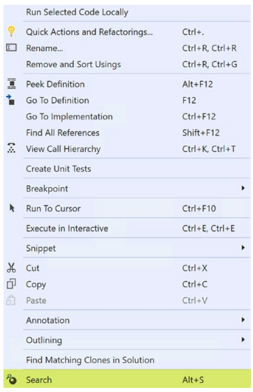   
그림 4-02 Search 명령어

이 확장 기능을 개발하는 것 외에도 다음을 배우게 됩니다.
* 내 확장에서 Visual Studio에 의해 이미 노출된 서비스/API를 어떻게 사용합니까?
* 사용자 지정 명령에 아이콘을 추가하려면 어떻게 합니까?
* 사용자 지정 명령에 키보드 단축키를 할당하려면 어떻게 합니까?
* 내 확장의 옵션을 어떻게 사용합니까?
* Visual Studio 자동화 모델을 이해하는 방법을 배우려면 어떻게 해야 합니까?

시작하겠습니다.

- ### a. 확장 시작하기
    이것이 우리의 첫 번째 실제 확장이기 때문에 각 단계에 대한 근거와 접근 방식을 이해할 수 있도록 단계를 자세히 논의합니다. 이 확장을 만드는 단계는 다음과 같습니다.

    - **1.새 프로젝트 생성**  
        Visual Studio 2019에서 새 VSIX 프로젝트를 만듭니다. 이름을 "ExternalSearch"로 지정하겠습니다. 이는 그림 4-3에 나와 있습니다.

        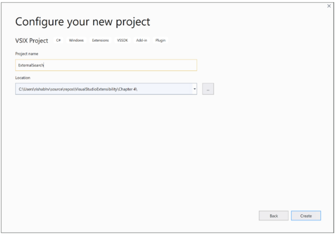   
        그림 4-03 새 프로젝트 생성

    - **2. vsixmanifest 수정**  
        무엇보다도 새로운 확장에 대한 의미 있는 메타데이터 정보를 제공하여 vsixmanifest 파일을 업데이트하겠습니다. 솔루션 탐색기에서 source.extension.vsixmanifest 파일을 두 번 클릭하면 멋진 편집 창이 열립니다.  
        vsixmanifest에서 지정하는 설명, 이름, 아이콘 등은 확장 프로그램 브랜딩을 담당하므로 확장 프로그램에 전문적인 터치를 제공하고 이러한 값이 항상 업데이트되도록 합니다.  
        설명 텍스트는 새 사용자에게 확장 프로그램을 설명해야 하므로 확장 프로그램이 하는 일을 적절하고 정확하고 명확하게 설명해야 합니다. 
        
        우리는 2장의 앞부분에서 vsixmanifest 파일에 대해 간략하게 논의했으므로 각 필드에 대해 자세히 다루지는 않을 것입니다. 그러나 요점은 이 파일이 확장의 브랜딩에 직접적인 영향을 미치므로 항상 업데이트되어야 한다는 것입니다. 다음은 이 파일을 업데이트하기 위한 몇 가지 지침입니다.

        - **a. 작성자 및 버전**  
            작성자 및 버전이 미리 채워져 있습니다. 그러나 확장에 대한 업데이트를 릴리스할 때마다 이 버전 번호가 증가하는지 확인하십시오(예: 1.1, 1.2 등). 여기에는 여러 가지 이유가 있습니다. 첫째, 이전 버전의 확장이 설치된 경우 제거하지 않고 사용자가 확장을 업데이트할 수 있습니다. 그렇지 않으면 VSIX 설치 프로그램에서 확장이 이미 설치되어 있다고 불평합니다. Visual Studio Marketplace에서 확장을 공유한 경우 새 기능이 포함된 업데이트된 버전을 업로드할 때 관리되는 확장의 기본 아키텍처는 업데이트 설정에 따라 마켓플레이스에서 새 버전의 확장을 사용할 수 있음을 식별합니다. , 알림이 표시되거나 확장 프로그램이 자동으로 업데이트됩니다. 모든 사용자에 대해 설치된 확장은 자동 업데이트할 수 없으므로 자동 업데이트 설정이 없습니다. 확장 프로그램 관리 창에서 확장 프로그램의 업데이트 설정은 그림 4-4와 같습니다.

            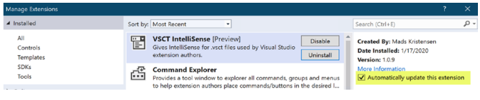   
            그림 4-04 확장 자동 업데이트
            
        - **b. 라이선스**              
            확장을 제공하거나 공유할 계획이라면 프로젝트에 서식 있는 텍스트 파일(.rtf) 또는 텍스트 파일을 추가한 다음 매니페스트의 라이선스 섹션에서 찾아 라이선스 정보를 포함할 수 있습니다. 이 책에서는 라이선스에 대해 논의하지 않지만 다양한 유형의 라이선스와 그 범위를 이해하는 것이 좋습니다.

        - **c. 아이콘 및 미리보기 이미지**                          
            확장의 아이콘 및 미리 보기 이미지를 제공하기 위해 고유한 이미지를 사용하거나 Visual Studio와 함께 제공되는 이미지 모니커를 사용할 수 있습니다. Visual Studio와 함께 제공되는 이미지를 사용하려면 알려진 모니커스 탐색기 확장이 큰 도움이 될 수 있으므로 Extensibility Essentials 2019 확장 팩의 일부로 이미 설치했습니다. 이 확장을 사용하려면 Visual Studio의 기본 메뉴로 이동한 다음 보기 ➤ 기타 Windows ➤ KnownMonikers Explorer로 이동합니다. 그러면 우리가 사용할 수 있는 알려진 모든 이미지 모니커를 나열하는 도구 창이 열립니다. 확장에 사용할 이미지를 선택하십시오. 이 확장 프로그램에서 검색할 것이기 때문에 검색을 나타내는 이미지를 사용합니다. 이는 그림 4-5에 나와 있습니다. 이미지를 마우스 오른쪽 버튼으로 클릭하면 이미지를 내보내는 기능을 제공하는 컨텍스트 메뉴가 나타납니다. 여기에서 이미지를 내보내고 해당 이미지를 아이콘에 사용하고 vsix 매니페스트 파일의 미리보기 이미지를 사용할 수 있습니다.

            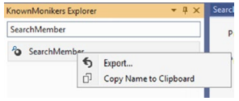   
            그림 4-05 모니커 탐색기
            
        - **d. 업데이트된 vsixmanifest** 
            태그, 릴리스 정보, 시작 안내서 등과 같은 다른 필드는 간단하며 필요에 따라 업데이트할 수 있습니다. 이러한 세부 정보를 입력한 후 vsixmanifest는 그림 4-6에 표시된 것과 같습니다.

            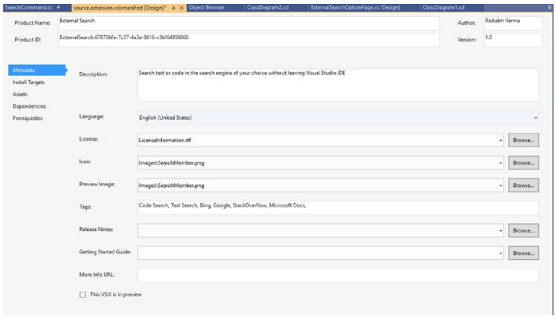   
            그림 4-06 업데이트된 vsixmanifest

        - **e. preview체크**             
            "This VSIX is in preview"를 선택하면 확장이 미리 보기 상태로 표시되고 [미리 보기]에 확장 이름이 표시됩니다. 확장 프로그램을 dogfood하기 위해 수행할 수 있습니다. VSCT IntelliSense 확장은 이 장을 작성하는 시점에 미리 보기 상태이며 그림 4-7과 같이 마켓플레이스와 확장 관리 대화 상자에서 쉽게 식별할 수 있습니다.

            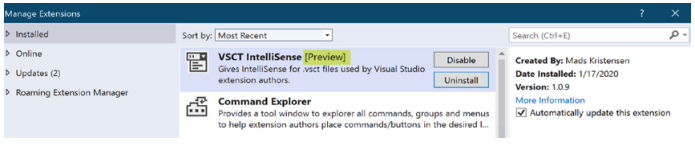   
            그림 4-07 확장 기능 미리보기 버전

        - **f. 설치 대상**             
            vsixmanifest 디자이너에서 대상 설치는 이것이 우리의 확장이 작동할 Visual Studio 버전을 설명하는 것이기 때문에 알아야 할 중요한 섹션입니다. 그림 4-8은 vsixmanifest의 설치 대상 섹션을 보여줍니다. 설치 유형이 Visual Studio Extension임을 보여줍니다. 대상 식별자는 Visual Studio Community이며 지원되는 버전 범위는 [16.0, 17.0)입니다. Visual Studio 2019에서 작동하는 배송 확장의 경우 괜찮지만 더 넓은 범위의 버전을 대상으로 하려는 경우 이러한 값을 편집해야 할 수 있습니다.

            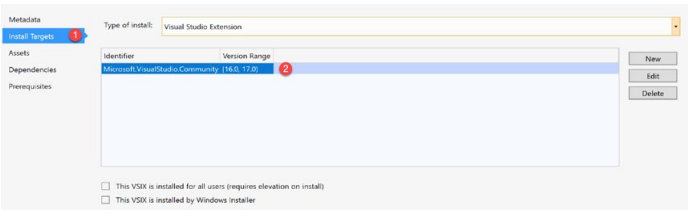   
            그림 4-08 버전 범위

            2장에서는 Visual Studio 2019에 해당하는 Visual Studio 16.0의 버전 및 제품 이름 매핑에 대해 논의했으며 17.0은 Visual Studio의 향후 버전을 나타냅니다. "[]"(대괄호)는 값이 포함됨을 지정합니다. "()"(괄호)는 배타적 값을 나타냅니다. 버전 범위에는 두 가지 값이 있습니다. 첫 번째는 "버전에서"를 나타내고 두 번째 것은 "버전으로"를 지정합니다. (16.0, 17.0)을 종합하면 버전 16.0(16.0 포함)부터 버전 17.0(17.0 제외)까지 지원됩니다. 식별자와 버전 범위를 추가, 편집 및 삭제할 수 있습니다. 커뮤니티 버전에서 확장을 지원하는 경우 Enterprise 등 모든 상위 버전에서 지원되지만 그 반대의 경우는 지원되지 않습니다.

            버전 범위에 대한 상세하고 정교한 토론은 버전 범위에 대한 이 유익한 블로그를 읽으십시오.  
            https://devblogs.microsoft.com/visualstudio/visual-studio-extensions-andversion-ranges-demystified/
            
    - **3. 새 command 추가**   
        솔루션 탐색기에서 프로젝트를 마우스 오른쪽 버튼으로 클릭합니다. 이 메뉴에서 "새 항목 추가"를 클릭합니다. 또는 프로젝트를 클릭하여 선택하고 Ctrl Shift A를 누를 수 있습니다. 그러면 '새 항목 추가' 대화상자가 열립니다. 확장성 범주(왼쪽 패널의 VSPackage 하위 범주)에서 명령 항목(Command) 템플릿을 클릭하여 프로젝트에 추가합니다. 그림 4-9와 같이 이 새 명령 클래스의 이름을 SearchCommand.cs로 지정했습니다.

        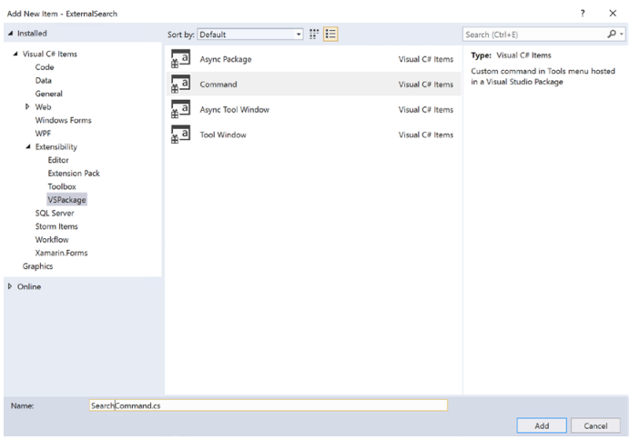   
        그림 4-09 새 아이템 추가

        그러면 몇 가지 새 파일(.cs, .vsct, .png)과 참조가 추가됩니다. 우리는 이미 지난 장에서 이러한 파일에 대해 논의했습니다.

- ### b. 메뉴에 명령 추가하기        
    이전 장에서 우리는 또한 명령을 추가한 후 확장을 실행할 수 있고 새 명령이 Visual Studio의 최상위 메뉴중 도구 항목에 추가된다는 것을 알고 있습니다. 코드 창에서 텍스트/코드를 선택한 다음 도구 메뉴로 이동하여 명령을 클릭하는 인체공학적 디자인이 아니므로 이번에는 도구 메뉴에서 이 명령을 원하지 않습니다.  
    텍스트/코드 조각을 쉽게 선택하고 이 명령을 클릭하여 검색을 수행할 수 있도록 이 명령을 코드 편집기 창의 상황에 맞는 메뉴 항목으로 사용하는 것이 좋습니다. 따라서 이 명령은 코드를 편집하는 코드 편집기 창에 나타나야 합니다. 또한 확장을 사용하는 개발자가 코드 창에서 코드 텍스트를 선택하고 키 조합을 눌러 검색을 수행할 수 있도록 이 명령에 대한 키보드 지원을 원합니다. 
    
    새로 추가된 명령어의 위치는 .vsct 파일의 Groups 섹션, 특히 그림 4-10에서와 같이 Parent 요소의 id 속성에 지정되어 있음을 기억하십시오.

    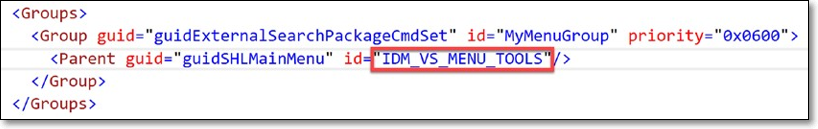   
    그림 4-10 Parent Id는 명령어의 위치를 결정한다 

    - **1. 어떤 Parent id 값을 넣어야 하나**       
        이 명령의 위치를 도구 메뉴에서 코드 창으로 변경할 수 있도록 Group 요소 아래에 있는 Parent 요소의 id 속성을 수정해야 합니다. 이제 질문이 떠오릅니다. 이를 달성하려면 어떤 id 값을 업데이트해야 합니까? 이를 위한 몇 가지 접근 방식에 대해 논의할 것입니다. 그러나 마지막 접근 방식은 다른 새로운 시나리오에서도 따를 수 있는 일반적인 접근 방식입니다. 접근 방식은 다음과 같습니다.

        - **a. 인텔리센스 확장 사용하기**  
            이 장의 앞부분에서 Extensibility Essentials 2019 확장 팩을 설치했습니다. 이 팩의 일부인 확장 중 하나는 VSCT IntelliSense입니다. 이렇게 하면 vsct 파일에서 IntelliSense 지원이 활성화됩니다. 이제 vsct 파일에서 id 값을 편집하고 코드(코드 창용)를 입력하면 다음 그림과 같이 코드가 포함된 유효한 id 값 집합이 표시됩니다.  
            값 그룹에서 IDM_VS_CTXT_CODEWIN은 코드 창의 컨텍스트 메뉴처럼 들리므로 우리 시나리오에 가장 적합합니다. 온라인에서 검색해보니 실제로 코드 창에 대한 올바른 ID입니다. 그러나 이것은 히트 앤 트라이얼 접근 방식이며 다른 시나리오에서는 확장되지 않을 수 있습니다. IntelliSense가 올바른 값을 입력하도록 안내하지만 여전히 올바른 위치에 명령을 배치하도록 안내하지 못할 수 있습니다. 아마도 도구 설명이나 해당 위치 글리프가 도움이 될 것입니다. 그림 4-11을 참조하십시오.
            
            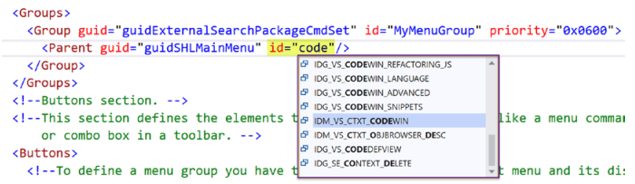   
            그림 4-11 .vsct파일에서 인텔리센스 지원

        - **b. 명령어 탐색기 확장 사용하기 - 일반적이고 권장**  
            이것은 Extensibility Essentials 2019 확장 팩의 일부로 설치됩니다. 코드 창 상황에 맞는 메뉴에 명령을 추가하고 싶기 때문에 먼저 코드 창의 상황에 맞는 메뉴에 어떤 명령이 있는지 살펴보겠습니다. 코드 창 컨텍스트 메뉴에 있는 명령은 그림 4-12에서 볼 수 있습니다.

            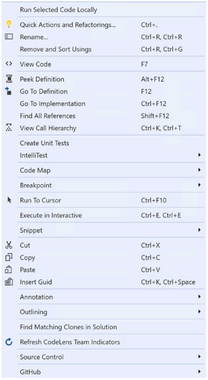   
            그림 4-12 코드 창 컨텍스트 메뉴

        - **c. dddd**  
            그런 다음 Visual Studio 상단 메뉴로 이동하고 탐색 보기 ➤ 기타 창 ➤ 명령 탐색기를 따릅니다. 명령 탐색기 도구 창이 시작됩니다. Visual Studio IDE에서 제공하는 모든 명령을 표시합니다. 명령 이름을 입력하여 명령을 검색하거나 확인란을 선택하여 검사 모드에서 이 확장을 사용할 수 있습니다. 확인란을 선택하면 Ctrl Shift 키를 누른 후 명령을 실행할 수 있습니다. 그러면 그림 4-13과 같이 명령을 가로채서 명령 탐색기 창에 세부정보가 표시됩니다. 여기에서 그룹 섹션에서 컨텍스트 메뉴의 ID를 찾을 수 있습니다.

            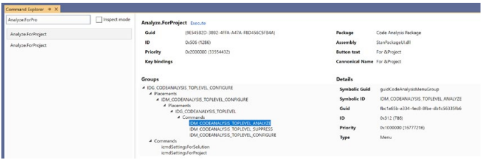   
            그림 4-13 명령어 탐색기

            이 접근 방식은 명령의 적절한 배치에 대한 ID를 찾는 데 사용할 수 있습니다.

            ```note
            이 장을 작성하는 시점에서 명령 탐색기 확장에 그룹 섹션이 채워지지 않고 표시되지 않는 문제가 있습니다. 그러나 이 문제가 곧 해결되고 이 확장 기능이 독자들이 이 접근 방식을 활용하는 데 도움이 되기를 바랍니다. 또는 이 문제가 해결될 때까지 모든 요구 사항에 가장 적합한 두 컨설턴트(Bing 및 Google)의 서비스를 활용하여 적절한 메뉴의 ID를 찾을 수 있습니다.
            ```
            
            이제 명령이 코드 창 컨텍스트 메뉴에 배치됩니다. 그러나 전문적이고 사용자 친화적으로 만들기 위해 아이콘과 키보드 지원을 제공해야 합니다.

- ### c. 아이콘과 키보드 지원 추가
    예, 기본 아이콘이 할당되어 있지만 더 잘하고 싶습니다. Visual Studio는 높은 DPI를 지원하고 원활하게 통합되며 Visual Studio IDE의 모든 색상 테마와 잘 어울리는 3,790개 이상의 아이콘 및 이미지와 함께 제공됩니다. 다음으로 확장 프로그램에서 이러한 아이콘을 활용하는 방법을 살펴보겠습니다.

    - **1. ㅏㅏ**       
        vsct 파일에서 상위 2개의 Extern 요소 바로 뒤에 Include href 속성이 KnownImageIds.vsct로 설정된 새 요소를 추가합니다. href 값에 K를 입력하는 즉시 IntelliSense가 정확한 파일 이름을 표시하므로 정확한 이름을 기억할 필요가 없습니다. 이 파일에는 그림 4-14와 같은 이미지 기호가 포함되어 있습니다.

        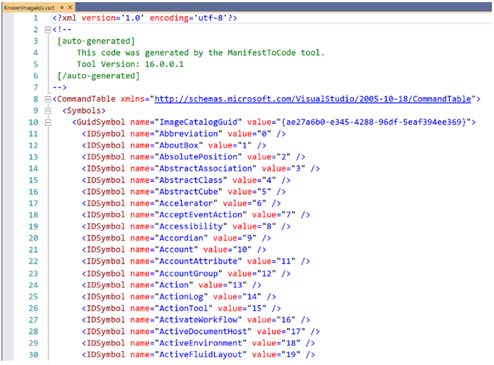   
        그림 4-14 vsct파일중 알려진 이미지 id 

        GuidSymbol 요소의 이름은 모든 이미지 기호 이름과 값을 포함하는 ImageCatalogGuid입니다. 이 정도면 충분하며 IntelliSense가 지원되므로 사용하려는 이미지 이름의 일부만 입력하면 IntelliSense가 글리프와 함께 유효한 값의 적절한 목록을 표시합니다. 예를 들어 확장 프로그램은 외부 검색 엔진에서 텍스트 검색을 수행하므로 적절한 검색 아이콘이 필요합니다. 따라서 Button 요소 아래에서 Icon 요소 속성을 편집합니다. 먼저 Icon 요소의 GUID 속성을 변경합니다. IntelliSense는 GUID 속성의 값을 ImageCatalogGuid로 편집하는 데 도움이 되며 id 속성에 search를 입력하면 그림 4-15와 같이 올바른 이미지를 선택하는 데 도움이 됩니다.

        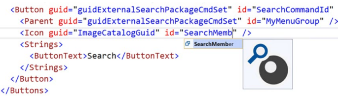   
        그림 4-15 아이콘 편집 - 인텔리센스 지원과 글리프

        Visual Studio 이미지 카탈로그의 기본 제공 이미지를 사용하고 있으므로 솔루션에 .png 파일이 필요하지 않습니다. 따라서 vsct 파일에 정의된 Bitmaps 요소와 해당 기호가 필요하지 않습니다. vsct 파일에서 이러한 모든 요소를 제거합니다.

    - **2. ㅏㅏ**   
        그러나 이것은 그대로 작동하지 않습니다. CommandFlag 요소(Icon 요소 뒤에)를 추가하고 해당 값을 ImageIsMoniker로 지정하여 아이콘이 명령에 표시되도록 해야 합니다. 위의 단계를 통해 Visual Studio 이미지 카탈로그의 일부로 제공되는 이미지를 사용할 수 있지만 공식 Microsoft Visual에는 Visual Studio의 이미지, 모니커, 이미지 서비스 및 이미지 렌더링 아키텍처에 대한 풍부한 정보가 있습니다. Studio 확장성 문서  
        https://docs.microsoft.com/en-us/visualstudio/extensibility/image-service-and-catalog?view=vs-2019

        나는 독자들에게 이 훌륭한 자료를 읽고 이해할 것을 강력히 추천합니다.

    - **3. ㅏㅏ**   
        다음으로 버튼 텍스트를 검색으로 수정하여 명령이 컨텍스트 메뉴에 검색으로 표시되도록 합니다.

    - **4. ㅏㅏ**   
        명령에 키보드 지원을 추가하기 위해 Commands 노드 바로 뒤에 KeyBindings 노드를 만든 다음 Tab 키를 눌러 KeyBindings의 스니펫을 채웁니다. 이제 이 명령에 대한 키보드 단축키를 지정하려면 먼저 이 명령에 사용하는 키보드 단축키가 이미 사용되고 있지 않은지 확인해야 합니다. 이렇게 하려면 그림 4-16과 같이 도구 ➤ 옵션 ➤ 키보드로 이동합니다. 여기에 도달하려면 옵션 대화 상자에서도 검색하거나 Visual Studio의 상단 검색 텍스트 상자에 키보드를 직접 입력하고 탐색할 수 있습니다.

        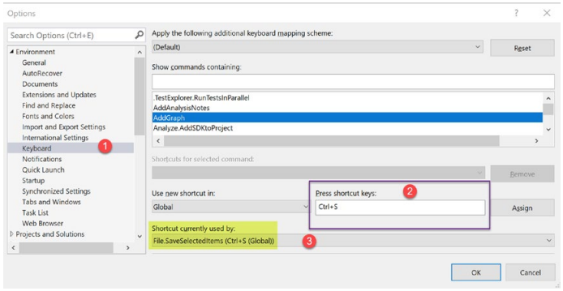   
        그림 4-16 키보드 단축키

    - **5. ㅏㅏ**   
        "Press Shortcut keys" 텍스트 상자(그림 4-16에서 #2로 표시)에서 사용하려는 키 조합을 누르고 사용 중인지 확인합니다. 데모 목적으로 Ctrl S를 눌렀습니다(문서를 저장하는 데 사용한다는 것을 알고 있습니다). 이 키 조합으로 텍스트 상자가 업데이트됩니다. 이 텍스트 상자 바로 아래에는 "현재 사용 중인 바로 가기" 필드가 있으며 이 필드는 업데이트되고 이 키 조합이 File.SaveSelectedItems 명령에서 사용됨을 보여줍니다. 이런 식으로 사용자 지정 명령에 키 조합을 사용할 수 있는지 여부를 확인할 수 있습니다. 같은 연습을 통해 내 Visual Studio의 다른 명령에서 Alt S를 사용하지 않는다고 말할 수 있으므로 검색 명령에 적합한 키 조합인 것 같습니다. 
        
    - **6. ㅏㅏ**       
        Alt S의 키 조합을 명령에 할당하기 위해 KeyBindings 요소는 그림 4-17과 같이 표시됩니다.

        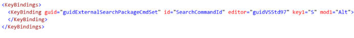   
        그림 4-17 키 바인딩

        IntelliSense는 GUID, id(명령과 일치해야 함), 편집기, key1, key2, mod1 및 mod2에 대한 올바른 값을 제공하는 데 도움이 됩니다. Alt와 S만 키 조합으로 사용하고 있으므로 key2와 mod2를 제거했습니다.

- ### d. 검색 기능 작성
    위의 단계로 모든 vsct 파일 변경이 완료됩니다. 코드 창 컨텍스트 메뉴에 연결된 새 명령이 있습니다. 명령에는 아이콘이 연결되어 있으며 이 명령에도 키보드 단축키가 할당되어 있습니다.

    이제 이 검색 명령 클릭 이벤트를 처리하는 코드를 작성해야 합니다.
    코드 창에서 텍스트/코드 조각을 선택한 다음 마우스 오른쪽 버튼을 클릭하고 검색 명령을 실행한다는 점을 기억하십시오. 또는 텍스트를 선택하고
    Alt + S를 눌러 검색을 시작하므로 검색 명령의 이벤트 핸들러에서 다음을 수행해야 합니다.
        a. 선택한 텍스트를 가져옵니다.
        b. 이 텍스트를 인코딩하여 검색 엔진에 전달하십시오.
        c. 브라우저에 검색 결과를 표시합니다.

    질문은 다음과 같습니다. 이벤트 핸들러에서 선택한 텍스트를 어떻게 얻습니까? 여기서 핵심 Visual Studio 자동화의 최상위 개체인 DTE가 등장합니다.
    Visual Studio는 Visual Studio 구성 요소 및 확장에서 사용할 수 있는 여러 서비스를 사용하고 노출합니다. DTE a.k.a. 문서 도구 확장성은 문서를 확장하고 자동화하는 데 사용할 수 있는 속성과 API를 제공합니다.
    프로젝트 등. DTE, 중요한 속성 및 방법을 빠르게 살펴보겠습니다.
    DTE의 클래스 다이어그램은 그림 4-18에 나와 있으며 장의 끝 부분에 있는 "클래스 참조" 섹션에는 DTE의 속성과 메서드가 요약되어 있습니다. 같은 내용을 온라인(https://docs.microsoft.com/en-us/dotnet/api/envdte.dte?view=visualstudiosdk-2017&viewFallbackFrom=visualstudiosdk-2019)에서 볼수 있다.

    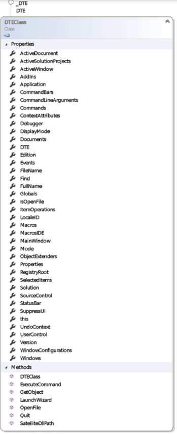   
    그림 4-18 DTE 클래스 다이어그램

    따라서 DTE가 여러 가지를 달성하는 데 도움이 될 수 있음을 알 수 있습니다. 다음으로 해야 할 일은 DTE에 액세스하는 것입니다.

    - **1. ㅏㅏ**           
        AsyncPackage 클래스는 유형을 지정하여 서비스에 대한 참조를 가져오는 데 사용할 수 있는 GetServiceAsync라는 이전에 논의한 API를 노출합니다. DTE 개체에 액세스하기 위해 그림 4-19와 같이 이 API를 사용합니다. 이 API는 확장을 개발하는 동안 서비스에 대한 참조를 얻는 데 매우 유용하고 자주 사용됩니다. 이것은 비동기 API이므로 비차단 방식으로 올바르게 사용하기 위해 await 키워드를 사용했습니다. await 키워드를 사용하려면 이벤트 핸들러 메서드 서명에서도 async 키워드를 사용해야 합니다. 그러나 async void 메서드는 권장되지 않으므로 이미 비동기인 InitializeAsync 메서드에서 DTE에 액세스하도록 코드를 이동해야 합니다. 같은 페이지에 있기 위해 이 코드는 SearchCommand.cs 파일로 이동합니다.
        
        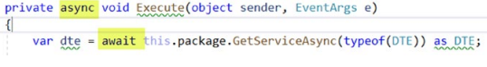   
        그림 4-19 GetServiceAsync 사용

        서비스를 DTE로 캐스팅한 줄의 물결선을 확인하십시오. 이것은 잠재적인 함정과 버그를 피하기 위해 Visual Studio가 개발에서 제공하는 훌륭한 경험을 보여줍니다. 모든 확장성 프로젝트 템플릿은 기본 분석기 지원과 함께 제공됩니다. 분석기는 코드를 분석하고 DTE는 기본 UI 스레드에서만 액세스해야 함을 확인하고 물결선을 통해 경고를 표시합니다.
    
        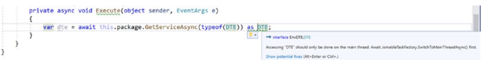   
        그림 4-20 작동중인 분석기

        물결선 위로 마우스를 가져가면 다음과 같은 오류 메시지가 표시됩니다. "DTE" 액세스는 기본 스레드에서만 수행되어야 합니다. 먼저 JoinableTaskFactory.SwitchToMainThreadAsync()를 기다립니다. 이는 그림 4-20에 나와 있습니다. 그것을 고치는 것은 간단합니다. Ctrl 키를 누르면 됩니다. 또는 Alt Enter. 이렇게 하면 전구 스타일의 작업이 DTE에 액세스하기 전에 기본 스레드로 전환하는 코드 조각을 추가합니다. 이제 새 코드 스니펫이 그림 4-21과 같이 표시됩니다.

        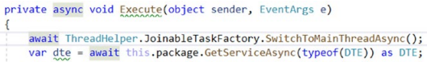   
        그림 4-21 수정된 코드

        그러나 이 코드를 변경한 후에도 여전히 Execute 메서드 이름에 물결선이 보입니다. "Execute" 메서드는 이벤트 핸들러이므로 반환 유형이 void인 고정된 미리 정의된 서명이 있기 때문입니다. 비동기 void 메서드는 예외 처리에 문제가 있고 충돌을 일으킬 수 있으므로 권장되지 않습니다. 따라서 이 코드의 올바른 위치는 SearchCommand 클래스의 InitializeAsync 메서드에 있습니다. 이렇게 하면 SwitchToMainThreadAsync API를 사용할 필요가 없습니다.
        
    - **2. ㅏㅏ**              
        이제 DTE 개체에 대한 참조가 있지만 선택한 텍스트를 어떻게 얻습니까? 이를 위해 Visual Studio의 활성 문서를 반환하는 DTE의 ActiveDocument라는 속성을 사용해야 합니다. 이 속성은 문서 유형입니다. 이 속성을 사용하기 전에 문서 유형에 의해 노출되는 속성과 메서드를 살펴보겠습니다. Document의 클래스 다이어그램은 그림 4-22와 같다.

        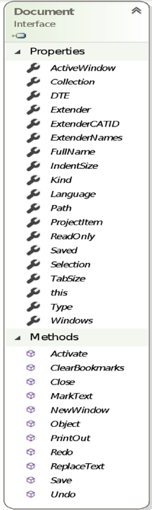   
        그림 4-22 문서 타입
        
        Document 인터페이스의 속성과 메소드는 이 장의 끝에 있는 "클래스 참조" 섹션에 요약되어 있습니다. 문서 유형에 대한 문서는 온라인(https://docs.microsoft.com/en-us/dotnet/api/envdte.document?view=visualstudiosdk2017&viewFallbackFrom=visualstudiosdk-2019)에서 읽을 수 있습니다.

        Document에 Selection이라는 속성이 있다는 것을 알 수 있습니다. 이 속성은 문서에서 선택 항목을 가져오는 데 도움이 됩니다. EnvDTE 어셈블리는 텍스트 선택을 처리하는 TextSelection이라는 형식을 노출합니다. 그것들을 사용하여 우리는 선택된 텍스트를 얻을 수 있습니다. Extension을 작성할 때 TextSelection 유형은 다양한 요구에 도움이 될 수 있으므로 추가 코드를 작성하기 전에 TextSelection 유형의 클래스 다이어그램, 속성 및 메서드를 살펴보겠습니다. Microsoft 공식 문서의 TextSelection 속성 및 메서드에 대한 높은 수준의 요약은 "클래스 참조" 섹션에 나열되어 있습니다. 설명서는 Microsoft 설명서 사이트에서 온라인(https://docs.microsoft.com/en-us/dotnet/api/envdte.textselection?view=visualstudiosdk-2017)으로 보고 읽을 수 있습니다.

        이를 통해 이제 문서 및 텍스트 선택 작업에 사용할 수 있는 API 및 속성을 알게 되었습니다. 이 지식을 행동으로 옮기자.

    - **3. ㅏㅏ**  
        DTE의 ActiveDocument 속성에서 Selection 속성을 가져온 다음 TextSelection 형식으로 캐스팅할 수 있는지 확인합니다. 텍스트 선택이 null이면 검색할 항목이 없으므로 Visual Studio의 StatusBar 또는 OutputWindow에서 사용자에게 메시지를 표시할 수 있습니다. 텍스트 선택이 있는 경우 브라우저에서 URL을 열어 검색 엔진에서 검색할 URL을 구성할 수 있습니다. 이 전체 코드 흐름은 그림 4-23에 나와 있습니다.

        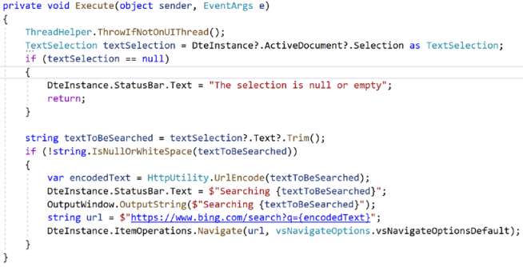   
        그림 4-23 빙에서 선택된 텍스트를 검색하기 위해 메쏘드 실행

        이 코드가 보여주는 몇 가지 두드러진 요점과 개념에 대해 논의해 보겠습니다.
        
        a. 위에서 설명한 것처럼 DTE 개체에 대한 참조를 가져오는 코드가 InitializeAsync 메서드로 이동되었으므로 정적 DteInstance 속성을 사용하여 DTE를 사용합니다. 우리는 이미 MainThread에서 DTE에 액세스해야 하고 Main 스레드로 전환하는 방법을 보았습니다. 이 스니펫은 실행 중인 스레드가 기본 UI 스레드가 아닌 경우 API가 예외를 throw하는 것을 보여줍니다.  

        b. DTE에는 Visual Studio 상태 표시줄에 텍스트, 애니메이션, 진행률 등을 표시하는 데 사용할 수 있는 StatusBar 속성이 있습니다. 이 속성을 사용하여 검색하는 동안 또는 선택한 텍스트가 비어 있을 때 사용자에게 짧은 상태 메시지를 표시할 수 있습니다. 

        c. 이 그림은 또한 OutputWindow에 텍스트를 표시하는 방법을 보여줍니다. OutputString 메서드를 사용하여 출력 창에 텍스트를 쓸 수 있습니다. 그러나 먼저 OutputWindow에 대한 참조를 가져와야 합니다. 이것은 Visual Studio의 서비스 인프라를 사용하고 GetServiceAsync API를 호출하여 수행됩니다. 이것은 SearchCommand 클래스의 InitializeAsync 메서드에서 수행됩니다. Visual Studio는 그림 4-24와 같이 일반 출력 창의 참조를 가져오는 데 직접 사용할 수 있는 VsGeneralOutputWindowPane을 통해 일반 출력 창을 표시합니다.

        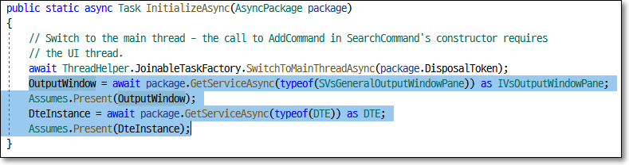   
        그림 4-24 InitializeAsync 메쏘드

        d. 가정은 서비스 인스턴스에 대한 가정을 확인하기 위해 API를 노출하는 정적 도우미 클래스입니다. Present 메서드는 값이 null이 아닌지 확인합니다. 그렇지 않으면 예외가 발생합니다. 

        e. DTE에는 파일 작업 및 파일 열기, 파일이 열려 있는지 확인, 프로젝트에 새 항목 추가, 프로젝트에 기존 항목 추가 또는 URL 탐색과 같은 작업을 수행하는 데 사용할 수 있는 ItemOperations라는 속성이 있습니다. ItemOperations의 Navigate 메서드를 사용하여 검색 엔진 URL로 이동했습니다.

- ### e. 확장 테스트하기
    위의 단계를 통해 확장의 첫 번째 초안이 준비되었습니다. 

    - **1. F5 키를 누르고 디버깅 시작**      
        그러면 ExternalSearch 확장이 설치된 Visual Studio의 새로운 실험적 인스턴스가 시작됩니다. 그런 다음 기존 C# 프로젝트를 열고 코드 창에서 편집할 C# 파일 중 하나를 엽니다. 
    
    - **2. 팝업 메뉴**      
        코드 창에서 코드 조각/텍스트를 선택하고 마우스 오른쪽 버튼을 클릭합니다. 그러면 새로운 사용자 지정 명령이 포함된 상황에 맞는 메뉴가 표시됩니다. 그림 4-25와 같이 검색 명령의 아이콘, 이름 및 키보드 단축키를 확인하십시오.

        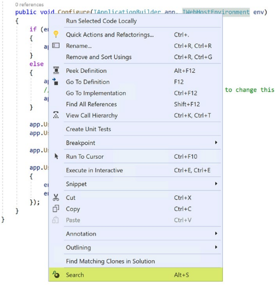   
        그림 4-25 검색 명령어

    - **3. 팝업 메뉴에서 Search 명령어 선택**      
        검색 명령을 클릭하거나 Alt S 키 조합을 누릅니다. 그러면 Bing 검색에서 선택한 텍스트가 검색되고 그림 4-26과 같이 Visual Studio 브라우저에 결과가 표시됩니다.
    
        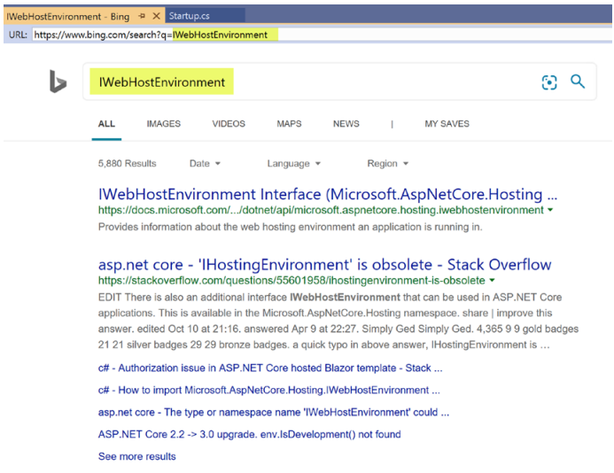   
        그림 4-26 Visual Studio 브라우저에서 Bing 검색

        이를 통해 Visual Studio 내에서 Bing의 코드/텍스트를 검색하는 데 사용할 수 있는 작동하는 Visual Studio 확장이 있습니다. 그러나 일부 사용자는 Google, StackOverflow, Microsoft 문서 또는 기타 검색 엔진에서 검색하는 것을 선호할 수 있으므로 커뮤니티와 공유할 준비가 되지 않았습니다. 우리의 확장은 사용자에게 이러한 유연성을 제공할 수 있어야 합니다. 어떻게 할 수 있습니까? 구성은 우리의 마음에 오는 것입니다. 내가 사용하고 싶은 검색 엔진을 구성할 수 있다면 이 경우를 해결할 수 있을 것입니다. Visual Studio 확장에는 사용자가 필요에 따라 기능/확장을 사용자 지정하도록 구성할 수 있는 옵션 페이지에 대한 지원이 있습니다. 다음 단계에서는 externalSearch 확장에 대한 옵션 페이지를 활용하여 확장을 구성할 수 있는 방법에 대해 설명합니다.
        
    - **4. 옵션 페이지 추가**              
        옵션 페이지를 추가하려면 먼저 프로젝트에 새 클래스를 추가하고 이름을 ExternalSearchOptionPage.cs로 지정합니다. 
    
    - **5. 클래스 설명**  
        클래스는 DialogPage 클래스에서 파생되어야 합니다. DialogPage 클래스의 클래스 다이어그램은 그림 4-27과 같습니다. 공식 Microsoft 문서 사이트의 DialogPage 속성 및 메서드는 "클래스 참조" 섹션에 요약되어 있습니다. DialogPage에 대한 문서는 매우 상세하며 DialogPage 작업에 대한 많은 통찰력을 공유합니다. 독자들이 다음 위치(https://docs.microsoft.com/en-us/dotnet/api/microsoft.visualstudio.shell.dialogpage?view=visualstudiosdk-2017)에서 이 문서를 읽을 것을 적극 권장합니다.

        DialogPage에는 레지스트리와 파일 시스템에 설정을 저장하고 로드하는 API가 있으며 속성은 저장소 위치를 노출합니다. 이 클래스는 상속될 수 있으므로 기본 구현을 변경하기 위해 메서드를 재정의할 수 있습니다. 우리의 경우 간단한 속성을 다룰 때 DialogPage의 기본 구현으로 충분합니다. DialogPage 클래스의 클래스 다이어그램은 그림 4-27과 같습니다.

        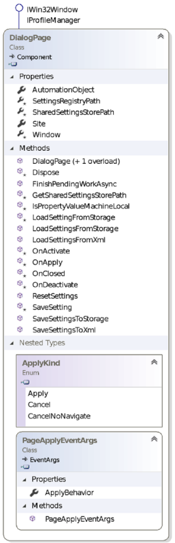   
        그림 4-27 다이알로그페이지

        이제 DialogPage에 의해 노출되는 API를 알았으므로 사용하겠습니다. 
    
    - **6. guid 삽입**  
        새로 생성된 ExternalSearchOptionPage 클래스를 확장의 옵션 페이지로 고유하게 식별하려면 GUID 특성을 통해 이 클래스에 GUID를 할당해야 합니다. Extensibility Essentials 2019 확장 팩의 일부로 GUID 삽입 확장이 설치되어 있으므로 코드 창을 마우스 오른쪽 버튼으로 클릭한 다음 상황에 맞는 메뉴에서 GUID 삽입을 클릭하거나 Ctrl K, Ctrl Space 키 조합을 눌러 삽입할 ​​수 있습니다. ExternalSearchOptionPage 클래스 위에 있는 GUID 특성의 GUID입니다. 
    
    - **7. 속성 정의**  
        다음으로 구성하려는 속성을 정의합니다. 이것은 대부분의 일반적인 옵션 페이지 시나리오에서 수행해야 하는 작업입니다. 속성 및 TypeConverters로 정의하고 장식하는 속성은 기본 인프라에 의해 확장의 옵션 대화 상자 페이지에 표시됩니다. 요점은 옵션 페이지의 가장 일반적인 시나리오는 DialogPage에서 클래스를 상속하고 속성을 정의하고 속성 및 TypeConverters로 장식하여 쉽게 처리할 수 있다는 것입니다. 먼저 코드를 보고 각 속성과 속성의 목적에 대해 논의하고 이해하겠습니다. ExternalSearchOptionPage의 코드는 다음과 같습니다.

        ```cs
        [Guid("02a61dc8-086a-486e-852b-9d1d360282bd")]
        public sealed class ExternalSearchOptionPage : DialogPage
        {
            private const string defaultUrl = "https://www.bing.com/search?q={0}";
            private static Dictionary<SearchEngines, string> allEngines = new Dictionary<SearchEngines, string>()
            {
                {SearchEngines.Bing, defaultUrl },
                {SearchEngines.Google, "https://www.google.com/search?q={0}" },
                {SearchEngines.MSDN, "https://docs.microsoft.com/enin/search/?search={0}&category=All" },
                {SearchEngines.StackOverflow, "https://stackoverflow.com/search?q={0}" }
            };

            [DisplayName("Use Visual Studio Browser")]
            [DefaultValue(true)]
            [Category("General")]
            [Description("A value indicating whether search should be displayed in Visual Studio browser or external browser")]
            public bool UseVSBrowser { get; set; }

            [DisplayName("Search Engine")]
            [DefaultValue("Bing")]
            [Category("General")]
            [Description("The Search Engine to be used for searching")]
            [TypeConverter(typeof(EnumConverter))]
            public SearchEngines SearchEngine { get; set; } = SearchEngines.Bing;
            [DisplayName("Url")]
            [Category("General")]
            [Description("The Search Engine url to be used for searching")]
            [Browsable(false)]
            public string Url
            {
                get
                {
                    var selectedEngineUrl = allEngines.FirstOrDefault(j => j.Key == SearchEngine).Value;
                    return string.IsNullOrWhiteSpace(selectedEngineUrl) ? defaultUrl : selectedEngineUrl;
                }
            }
        }
        ```

        파일에는 하나의 정적 필드와 세 개의 속성만 있습니다. 정적 필드 SearchEngines는 키로 SearchEngines 열거형의 사전이고 값으로 문자열입니다. URL이 있는 다른 검색 엔진이 사전에 추가됩니다. System.ComponentModel 네임스페이스는 속성에 적용할 수 있는 여러 특성을 정의합니다. 이러한 속성은 이전 코드 목록에서 굵게 강조 표시되어 있습니다. 이러한 속성의 목적은 표 4-1에 요약되어 있습니다.
    
        표4-1 System.ComponentModel에 정의된 속성들
        ```
        멤버            설명
        -------------   -----------------------------------------------------------------------------------------
        DisplayName     속성에 이름을 할당합니다.
        DefaultValue    속성에 기본값을 할당합니다.
        Category        속성에 범주를 할당합니다.
        Description     속성에 설명을 할당합니다.
        TypeConverter   값을 한 유형에서 다른 유형으로 변환합니다. 예를 들어 EnumConverter는 열거형을 문자열로 또는
                        그 반대로 변환합니다. TypeConverter에서 클래스를 상속하고 형식을 변환하는 메서드를 재정의하여
                        모든 형식에 대한 사용자 지정 형식 변환기를 만들 수 있습니다. 
                        TypeConverters 및 해당 API에 대한 문서는 다음에서 볼수 있습니다.
                        https://docs.microsoft.com/en-us/dotnet/api/system.componentmodel.typeconverter?view=netframework-4.8
        Browsable       PropertyGrid에 속성을 표시할지 여부를 지정합니다.
        ```

        외부 브라우저에서 검색 결과를 보고 싶어하는 확장 프로그램 사용자가 있을 수 있습니다. 이를 위해 UseVSBrowser 속성이 추가됩니다. 기본값은 true입니다. 즉, 기본적으로 Visual Studio 브라우저가 사용됩니다. 다른 속성은 최종 사용자가 선택하도록 검색 엔진을 노출하는 SearchEngine의 속성입니다. 따라서 사용자는 Bing, Google, StackOverflow 또는 Microsoft Docs를 유연하게 선택할 수 있습니다. 검색 엔진의 기본값은 Bing이고 TypeConverter 속성은 열거형의 모든 값이 속성 그리드에 드롭다운으로 표시되도록 합니다. 사용자가 검색 엔진을 선택하면 해당 URL을 사용해야 하므로 정적 사전에서 조회를 수행하여 선택한 검색 엔진의 URL을 가져와야 합니다. 이것은 URL 속성에서 수행됩니다. 사용자가 편집하는 것을 원하지 않으므로 읽기 전용입니다(속성만 가져오기). 또한 한 번 검색 엔진이 선택되면 URL을 변경할 수 없으므로 사용자에게 보여 주는 의미가 없습니다. false 매개변수가 있는 Browsable 속성은 이 속성을 숨깁니다. 
        
        이것으로 간단한 PropertyGrid 기반 DialogPage에 대한 코딩이 완료되었습니다. DialogPage 인프라가 처리하므로 값을 유지하거나 값을 로드하는 것에 대해 걱정할 필요가 없습니다. 그러나 옵션 페이지에 사용자 정의 UI를 표시해야 하는 경우가 있습니다. UIElementDialogPage(DialogPage 대신)에서 옵션 페이지 클래스를 상속하고 적절한 UI가 있는 UserControl을 만들어 이 사용자 지정 UI 시나리오를 달성할 수 있습니다. 우리가 개발하는 후속 확장에서 이 시나리오가 실제로 실행되는 것을 보게 될 것입니다. 
        


    현재 확장으로 돌아가서 여전히 패키지와 연결한 다음 확장 코드의 옵션에 액세스하여 사용자가 제공한 값을 존중해야 합니다. 다음 단계에서 이러한 변경을 수행할 것입니다.

- **1. 옵션 페이지 연결**  
    패키지 클래스로 돌아가서 속성 ProvideOptionPage를 추가하여 이 패키지와 옵션 페이지를 연결합니다. 다음 코드 목록은 이 속성을 보여줍니다.

    ```cs
    [ProvideOptionPage(typeof(ExternalSearchOptionPage), "ExternalSearch", "General"
        , 1, 1, true, new string[] { "External Search Options"})]
    public sealed class ExternalSearchPackage : AsyncPackage
    ```

- **2. 옵션 속성 사용**  
    이제 옵션 페이지에 액세스한 다음 확장의 옵션 속성을 사용해야 합니다. 그렇게 하려면 먼저 옵션 페이지에 액세스해야 합니다. 패키지 클래스의 GetDialogPage API를 사용하여 옵션을 가져옵니다. 옵션에 액세스하면 해당 속성을 사용하고 외부 브라우저 또는 VS 브라우저와 구성된 검색 엔진을 사용할 수 있습니다. 옵션을 통합한 Execute 메서드의 전체 코드 목록은 다음과 같습니다.

    ```cs
    private void Execute(object sender, EventArgs e)
    {
        ThreadHelper.ThrowIfNotOnUIThread();
        var options = this.package.GetDialogPage(typeof(ExternalSearchOptionPage)) as ExternalSearchOptionPage;
        // 옵션 얻기
        var textSelection = DteInstance?.ActiveDocument?.Selection as TextSelection;
        if (textSelection == null)
        {
            DteInstance.StatusBar.Text = "The selection is null or empty";
            return;
        }
        string textToBeSearched = textSelection?.Text?.Trim();
        if (!string.IsNullOrWhiteSpace(textToBeSearched))
        {
            var encodedText = HttpUtility.
            UrlEncode(textToBeSearched);
            DteInstance.StatusBar.Text = $"Searching{textToBeSearched}";
            OutputWindow.OutputString($"Searching{textToBeSearched}");
            string url = string.Format(options.Url, encodedText);
            if (options.UseVSBrowser)
            {
                DteInstance.ItemOperations.Navigate(url,
                vsNavigateOptions.vsNavigateOptionsDefault);
            }
            else
            {
                System.Diagnostics.Process.Start(url);
            }
        }
        else
        {
            DteInstance.StatusBar.Text = "The selection is null or empty";
        }
    }
    ```

- **3. 프로젝트 디버그**  
    이제 프로젝트를 디버그하면 Visual Studio의 새로운 실험적 인스턴스가 열립니다. 도구 ➤ 옵션 페이지로 이동한 다음 외부 검색을 검색합니다. 외부 검색 옵션 대화 상자가 표시됩니다. 외부 검색 옵션 대화 상자는 그림 4-28과 같습니다.
    
    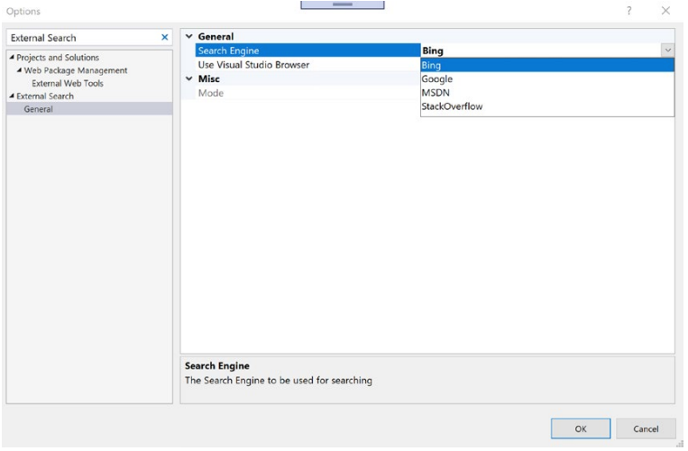   
    그림 4-28 외부 검색 옵션 페이지

- **4. 검색 엔진 변경**  
    이제 검색 엔진을 Google이나 다른 검색 엔진으로 변경하면 그림 4-29와 같이 다음 검색에 사용되는 검색 엔진이 Google로 변경된 것을 볼 수 있습니다.

    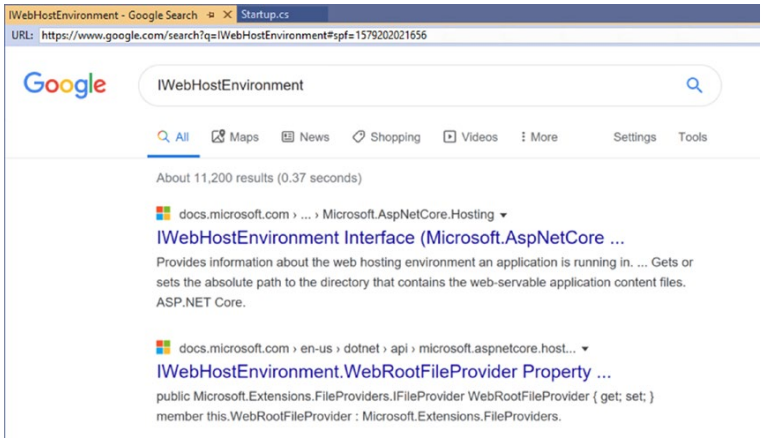   
    그림 4-29 구글 검색 사용하기

이제 확장 기능이 다른 사용자와 공유하기에 충분해 보입니다. 축하합니다! 우리는 다른 사용자와 공유할 준비가 거의 된 작업 확장을 완료했습니다(물론 테스트 후).  
Microsoft 확장성에는 GitHub (https://github.com/microsoft/VSSDK-Extensibility-Samples/tree/master/Options)에서 볼 수 있는 옵션 페이지 사용법을 보여주는 훌륭한 샘플이 있습니다. 

기본 클래스와 모델을 노출하여 옵션 페이지를 만듭니다. 스레드로부터 안전한 방식으로 옵션 페이지의 복잡성을 보여주는 또 다른 샘플은 https://github.com/madskristensen/OptionsSample입니다. 솔루션 탐색기 창이나 속성 창과 같은 일부 사용자 지정 UI를 사용하여 Visual Studio에 창을 표시해야 하는 확장 프로그램을 개발해야 하는 경우가 있습니다. 이를 개발하기 위해 Visual Studio에는 AsyncToolWindow라는 기본 제공 항목 템플릿이 있습니다. 다음 섹션에서는 Visual Studio용 간단한 도구 창 확장을 개발하는 방법을 살펴보겠습니다.
    