# 첫 번째 확장 개발
지난 몇 장에서 많은 이론, 개념 및 기본 사항을 살펴보았다. 이제 이 이론을 실천할 때이다. 이번에는 몇 가지 의미 있고 유용한 실제 확장애드온을 단계별로 개발할 것이다. 

***
## <font color='dodgerblue' size="6">1) VS 확장 프로그램 개발을 지원하는 확장 프로그램</font>
Visual Studio에 사용자 지정 명령을 추가하려면 vsct 파일을 수정해야 한다.  
하지만 Visual Studio에는 vsct 파일 편집에 대한 IntelliSense 지원이 없기에 불편하다. 마찬가지로 확장 기능을 개발하는 동안 Visual Studio에 이미 있는 명령어을 사용해야 할 수도 있지만 정확한 명령을 모르기도 하다. Visual Studio는 확장애드온 작성자가 사용할 수 있는 수천 개의 이미지와 함께 제공된다. 그러나 우리는 확장 기능에서 이 역시 사용하는 방법을 모른다.  
고맙게도 Mads Kristensen은 Visual Studio 확장 작성자가 더 빠르고 쉽고 만들기 위한 Extensibility Essentials 2019라는 확장기능 팩을 개발했다.  
이 확장 팩에는 겉보기에 어려운 작업을 쉽게 수행할 수 있는 확장 기능 모음이 포함되어 있고 이 책을 집필하는 현재 이 확장 팩에는 아래의 확장이 포함되어 있다.

- **MEF 구성 요소 캐시 정리**  
  캐시 손상 문제를 해결하기 위해 Visual Studio MEF(Managed Extensibility Framework) 구성 요소 캐시를 지웁니다.
- **명령어 탐색기**  
  확장 작성자가 원하는 위치에 명령/버튼을 배치할 수 있도록 모든 명령어, 그룹 및 메뉴를 탐색할 수 있는 ToolWindow을 제공
- **확장성 로그**  
  확장성 로그를 보는 가장 빠르고 쉬운 방법입니다.
- **이미지 매니페스트 도구**  
  Visual Studio 확장에 대한 .imagemanifest 파일을 더 쉽게 만들고 유지 관리할 수 있습니다.
- **Image Optimizer**  
  업계 표준 도구를 사용하여 JPEG, PNG 및 GIF - 애니메이션 GIF 포함. 손실 및 무손실 최적화를 모두 수행할 수 있습니다.
- **GUID 삽입**  
  편집기 및 입력 필드에 새 GUID를 매우 쉽게 삽입할 수 있습니다.
- **알려진 모니커스 탐색기**  
  Visual Studio 확장 작성자가 KnownMonikers 이미지 컬렉션을 탐색할 수 있는 ToolWindow입니다.
- **Pkgdef 언어**  
  .pkgdef 및 pkgundef 파일.
- **설정 저장소 탐색기**  
  VS 설정 저장소의 내용을 보고 편집하기 위한 ToolWindow입니다.
- **VSCT IntelliSense**  
  Visual Studio 확장 작성자가 사용하는 .vsct 파일에 대한 IntelliSense를 제공합니다.
- **VSIX 동기화 프로그램**  
  관리 코드에서 .vsixmanfest 및 .vsct 파일에 대한 코드 숨김 파일을 생성하여 나머지 확장 프로그램에서 정보를 쉽게 사용할 수 있도록 하는 기능을 제공

이러한 각 확장에 대한 세부 정보는 <a href="https://marketplace.visualstudio.com/" target="_blank">Visual Studio Marketplace 사이트</a>의 해당 확장 페이지에서 읽을 수 있다.  
Mads는 이 패키지에 있는 각 확장의 GitHub URL을 공유했다. Visual Studio 2019 확장 개발을 시작하기 전에 독자에게 이 확장 팩을 설치하는 것을 권장.  확장은 <a href="https://marketplace.visualstudio.com/items?itemName=MadsKristensen.ExtensibilityEssentials2019" target="_blank">Visual Studio Marketplace 사이트</a>
에서 다운로드한 다음 설치할 수 있다.   
또는 Visual Studio 상위 메뉴 확장 ➤ 확장 관리로 이동할 수 있습니다. 그런 다음 그림 4-1과 같이 Extensibility Essentials 2019를 검색.

   
그림 4-01 Visual Studio 유저 인터페이스

확장팩이 나타나면 다운로드를 클릭합니다. Visual Studio가 닫히면 확장 팩이 설치를 시작합니다. 이 확장 팩이 설치되면 확장 코딩을 시작할 준비가 되었습니다. 이 장에서 개발할 첫 번째 확장은 코드/텍스트 검색을 수행합니다.

## <font color='dodgerblue' size="6">2) 검색을 수행하는 Visual Studio 확장 만들어보기</font>
**만들 기능 설명** :  
개발중에 궁금한 정보를 얻기위해서는 보통은 코드중 일부를 복사하고 브라우저에서 검색 엔진(예: Bing)을 열고 붙여넣기 한후 필요한 정보를 검색한다. 검색 결과중 가장 관련성이 높은 링크를 읽어서 최종정보를 얻는다.  

외부 브라우저를 열지 않고도 Visual Studio에서 직접 콘텐츠를 검색하고 결과를 볼 수 있다면 좋지 않을까? 이것이 바로 우리가 새로 만드는 확장기능의 로직이다.

이 섹션에서는 Bing, Google, Microsoft Docs, stackOverflow 등과 같은 검색 엔진에서 Visual Studio의 코드 편집기에 작성된 코드중 일부를 검색하고 결과를 비주얼 스튜디오내의 인터넷 브라우저에 표시하도록 하는  Visual Studio 확장기능을 개발할 것이다. 이 확장의 목적은 파일 전송을 통해 또는 시장에 업로드하여 다른 사용자에게 제공할 수 있는 확장을 만드는 단계별 절차를 보여 주는 것입니다. 그림 4-2와 같이 코드 창에서 선택한 텍스트를 검색하는 컨텍스트 메뉴 명령이 있는 확장을 상상해보자.

   
그림 4-02 Search 명령어

이 확장 기능을 개발하는 것 외에도 다음을 배우게 됩니다.
* 확장에서 Visual Studio에 의해 이미 노출된 서비스/API를 어떻게 사용하는지
* 사용자 지정 명령에 아이콘을 추가하려면 어떻게 하는지
* 사용자 지정 명령에 키보드 단축키를 할당하려면 어떻게 하는지
* 옵션이 지정할수 있는 경우 어떻게 만드는지
* Visual Studio 자동화 모델을 이해하는 방법을 배우려면 어떻게 해야 하는지


- ### A. 확장 시작하기
    이것이 우리의 첫 번째 확장이기 때문에 각 단계를 이해할 수 있도록 단계를 자세히 논의한다.

    - **1. 새 프로젝트 생성**  
        Visual Studio 2019에서 새 VSIX 프로젝트를 만듭니다. 이름을 "ExternalSearch"로 지정하겠습니다. 이는 그림 4-3에 나와 있습니다.

           
        그림 4-03 새 프로젝트 생성

    - **2. vsixmanifest 수정**  
        무엇보다도 새로운 확장에 대한 의미 있는 메타데이터 정보를 제공하여 vsixmanifest 파일을 업데이트하겠습니다. 솔루션 탐색기에서 source.extension.vsixmanifest 파일을 두 번 클릭하면 멋진 편집 창이 열립니다.  
        vsixmanifest에서 지정하는 설명, 이름, 아이콘 등은 확장 프로그램 브랜딩을 담당하므로 확장 프로그램에 전문적인 터치를 제공하고 이러한 값이 항상 업데이트되도록 합니다.  
        설명 텍스트는 새 사용자에게 확장 프로그램을 설명해야 하므로 확장 프로그램이 하는 일을 적절하고 정확하고 명확하게 설명해야 합니다. 
        
        우리는 2장의 앞부분에서 vsixmanifest 파일에 대해 간략하게 논의했으므로 각 필드에 대해 자세히 다루지는 않을 것입니다. 그러나 요점은 이 파일이 확장의 브랜딩에 직접적인 영향을 미치므로 항상 업데이트되어야 한다는 것입니다. 다음은 이 파일을 업데이트하기 위한 몇 가지 지침입니다.

        - **a. 작성자 및 버전**  
            작성자 및 버전이 미리 채워져 있습니다. 그러나 확장에 대한 업데이트를 릴리스할 때마다 이 버전 번호가 증가하는지 확인하십시오(예: 1.1, 1.2 등). 여기에는 여러 가지 이유가 있습니다. 첫째, 이전 버전의 확장이 설치된 경우 제거하지 않고 사용자가 확장을 업데이트할 수 있습니다. 그렇지 않으면 VSIX 설치 프로그램에서 확장이 이미 설치되어 있다고 불평합니다. Visual Studio Marketplace에서 확장을 공유한 경우 새 기능이 포함된 업데이트된 버전을 업로드할 때 관리되는 확장의 기본 아키텍처는 업데이트 설정에 따라 마켓플레이스에서 새 버전의 확장을 사용할 수 있음을 식별합니다. , 알림이 표시되거나 확장 프로그램이 자동으로 업데이트됩니다. 모든 사용자에 대해 설치된 확장은 자동 업데이트할 수 없으므로 자동 업데이트 설정이 없습니다. 확장 프로그램 관리 창에서 확장 프로그램의 업데이트 설정은 그림 4-4와 같습니다.

               
            그림 4-04 확장 자동 업데이트
            
        - **b. 라이선스**              
            확장을 제공하거나 공유할 계획이라면 프로젝트에 서식 있는 텍스트 파일(.rtf) 또는 텍스트 파일을 추가한 다음 매니페스트의 라이선스 섹션에서 찾아 라이선스 정보를 포함할 수 있습니다. 이 책에서는 라이선스에 대해 논의하지 않지만 다양한 유형의 라이선스와 그 범위를 이해하는 것이 좋습니다.

        - **c. 아이콘 및 미리보기 이미지**                          
            확장의 아이콘 및 미리 보기 이미지를 제공하기 위해 고유한 이미지를 사용하거나 Visual Studio와 함께 제공되는 이미지 모니커를 사용할 수 있다. 
            
            Visual Studio와 함께 제공되는 이미지를 사용하기 위해서는 Extensibility Essentials 2019 확장 팩의 일부로 이미 설치한 KnownMonikers Explorer 확장기능이 큰 도움이 될 수 있다. 이 확장기능은 사용하려면 Visual Studio의 보기 ➤ 기타 Windows ➤ KnownMonikers Explorer로 이동에서 볼수 있다.  이 확장 프로그램에서 검색할 것이기 때문에 검색을 나타내는 이미지를 사용합니다. 이는 그림 4-5에 나와 있습니다. 이미지를 마우스 오른쪽 버튼으로 클릭하면 이미지를 내보내는 기능을 제공하는 컨텍스트 메뉴가 나타납니다. 여기에서 이미지를 내보내고 해당 이미지를 아이콘에 사용하고 vsix 매니페스트 파일의 미리보기 이미지를 사용할 수 있습니다.

               
            그림 4-05 모니커 탐색기
            
        - **d. 업데이트된 vsixmanifest**  
            태그, 릴리스 정보, 시작 안내서 등과 같은 다른 필드는 간단하며 필요에 따라 업데이트할 수 있습니다. 이러한 세부 정보를 입력한 후 vsixmanifest는 그림 4-6에 표시된 것과 같습니다.

               
            그림 4-06 업데이트된 vsixmanifest

        - **e. preview체크**             
            "This VSIX is in preview"를 선택하면 확장이 미리 보기 상태로 표시되고 [미리 보기]에 확장 이름이 표시됩니다. 확장 프로그램을 dogfood하기 위해 수행할 수 있습니다. VSCT IntelliSense 확장은 이 장을 작성하는 시점에 미리 보기 상태이며 그림 4-7과 같이 마켓플레이스와 확장 관리 대화 상자에서 쉽게 식별할 수 있습니다.

               
            그림 4-07 확장 기능 미리보기 버전

        - **f. 설치 대상**             
            vsixmanifest 디자이너에서 대상 설치는 이것이 우리의 확장이 작동할 Visual Studio 버전을 설명하는 것이기 때문에 알아야 할 중요한 섹션입니다. 그림 4-8은 vsixmanifest의 설치 대상 섹션을 보여줍니다. 설치 유형이 Visual Studio Extension임을 보여줍니다. 대상 식별자는 Visual Studio Community이며 지원되는 버전 범위는 [16.0, 17.0)입니다. Visual Studio 2019에서 작동하는 배송 확장의 경우 괜찮지만 더 넓은 범위의 버전을 대상으로 하려는 경우 이러한 값을 편집해야 할 수 있습니다.

               
            그림 4-08 버전 범위

            2장에서는 Visual Studio 2019에 해당하는 Visual Studio 16.0의 버전 및 제품 이름 매핑에 대해 논의했으며 17.0은 Visual Studio의 향후 버전을 나타냅니다. "[]"(대괄호)는 값이 포함됨을 지정합니다. "()"(괄호)는 배타적 값을 나타냅니다. 버전 범위에는 두 가지 값이 있습니다. 첫 번째는 "버전에서"를 나타내고 두 번째 것은 "버전으로"를 지정합니다. (16.0, 17.0)을 종합하면 버전 16.0(16.0 포함)부터 버전 17.0(17.0 제외)까지 지원됩니다. 식별자와 버전 범위를 추가, 편집 및 삭제할 수 있습니다. 커뮤니티 버전에서 확장을 지원하는 경우 Enterprise 등 모든 상위 버전에서 지원되지만 그 반대의 경우는 지원되지 않습니다.

            버전 범위에 대한 상세하고 정교한 토론은 버전 범위에 대한 이 <a href="https://devblogs.microsoft.com/visualstudio/visual-studio-extensions-andversion-ranges-demystified/" target="_blank">유익한 블로그</a>를 읽어.  
            
            
    - **3. 새 command 추가**   
        솔루션 탐색기에서 프로젝트를 마우스 오른쪽 버튼 / 추가 / 새 항목 클릭.  
        또는 프로젝트를 클릭하여 선택하고 Ctrl Shift A를 누를 수 있다. 그러면 '새 항목 추가' 대화상자가 열리는데 왼쪽에서 Visual C# 항목 / Extensibility / VSPackage / Command 선택하고 이름을 SearchCommand.cs로 지정.

           
        그림 4-09 새 아이템 추가

        그러면 몇 가지 새 파일(.cs, .vsct, .png)과 참조가 추가됩니다. 파일들의 자세한 설명은 3장에서 했음..

- ### B. 메뉴에 명령 추가하기        
    이전 장에서 우리는 또한 명령어를 추가한 후 확장기능을 실행할 수 있고 기본 템플릿의 명령어가 Visual Studio의 최상위 메뉴중 **도구** 메뉴 아래 추가된다는 것을 배웠다. 하지만 매번 이렇게 찾아가는 것은 인체공학적 디자인이 아니기 때문에 이번에는 도구 메뉴에는 추가 하지 않겠다.  

    텍스트를 선택하고 코드 편집기에서 오른쪽 마우스를 클릭해서 나오는 팝업메뉴를 사용하거나 코드를 선택 후 바로가기 키를 눌러 검색을 수행하는 것이 편리하니까 이 기능도 지원하도록 하자.
    
    새로 추가된 명령어가 표시될 위치는 .vsct 파일에서 Groups 섹션, 특히 그림 4-10에서와 같이 Parent 요소의 id값에 지정해야 한다.

       
    그림 4-10 Parent Id는 명령어의 위치를 결정한다 

    - **1. 어떤 Parent id 값을 넣어야 하나**       
        이 명령어의 위치를 도구 메뉴쪽에서 코드 편집기쪽으로 이동할 수 있도록 Group 요소 아래에 있는 Parent 요소의 id 속성값을 수정해야 한다. 당장은 어떤 id 값으로 바꿔야 하는지 모르지만 이를 알기 위한 몇 가지 접근 방법이 있다. 이 중 마지막은 다른 새로운 시나리오에서도 따를 수 있는 일반적인 방법이다.  
        
        방법리스트는 다음과 같다.

        - **a. 인텔리센스 확장 사용하기**  
            Extensibility Essentials 2019 확장 팩 중 하나인 VSCT IntelliSense를 이용해보자. vsct 파일에서 IntelliSense 지원이 활성화된다. 이제 vsct 파일에서 id 값을 편집하기 위해 텍스트를 입력하면 다음 그림과 같이 코드가 포함된 유효한 id 값 집합이 표시된다.  
            값 목록중 IDM_VS_CTXT_CODEWIN은 코드 창의 컨텍스트 메뉴처럼 들리므로 우리 시나리오에 가장 적합하다. 온라인에서 검색해보니 실제로 코드 창에 대한 올바른 ID가 맞다. 그러나 이것은 히트 앤 트라이얼 접근 방식이며 다른 시나리오에서는 적합하지 않을 수 있다. IntelliSense가 올바른 값을 입력하도록 안내하지만 정확한 값을 찾지 못할 수도 있다. 아마도 도구 설명이나 해당 위치 글리프가 도움이 될 것이다. 그림 4-11을 참조하십시오.
            
               
            그림 4-11 .vsct파일에서 인텔리센스 지원

        - **b. Commander Explorer(명령어 탐색기 확장) 사용하기 - 일반적으로 권장**  
            

            코드 편집기에서 오른쪽 마우스를 클릭하면 나오는 컨텍스트 창에 명령어를 추가하고 싶기 때문에 먼저 코드 편집기에 맞는 어떤 적절한 명령어들이 있는지 살펴보자. 코드 창 컨텍스트 메뉴에 있는 명령은 그림 4-12에서 볼 수 있다.

               
            그림 4-12 코드 창 컨텍스트 메뉴

            Extensibility Essentials 2019 확장 팩의 일부인 Commander Explorer를 사용하자. 
            
            **현재는 이 확장기능이 제거됨. 책 작성 시점이후에 없어진거 같음.**

            ~~Visual Studio의 메뉴중 보기 ➤ 다른 창 ➤ Commander Explorer(명령어 탐색기)를 열자. Visual Studio IDE에서 제공하는 모든 명령을 표시된다. 명령어 이름을 입력하여 검색하거나 확인란을 선택하여 검사 모드에서 이 확장을 사용할 수 있습니다. 확인란을 선택하면 Ctrl Shift 키를 누른 후 명령을 실행할 수 있습니다. 그러면 그림 4-13과 같이 명령을 가로채서 명령 탐색기 창에 세부정보가 표시됩니다. 여기에서 그룹 섹션에서 컨텍스트 메뉴의 ID를 찾을 수 있다.~~
            

- ### C. 아이콘과 키보드 지원 추가
    기본 아이콘도 괜찮지만 더 좋은것을 사용하고 싶다. Visual Studio는 높은 DPI를 지원하고 모든 색상 테마와 잘 어울리는 3,790개 이상의 아이콘 및 이미지와 함께 제공한다. 이번에는 확장 프로그램에서 이러한 아이콘을 활용하는 방법을 살펴보자.

    - **1. 이미지 include세팅**       
        vsct 파일에서 상위 2개의 Extern 요소 바로 뒤에 Include 요소를 추가하고 href 속성이 KnownImageIds.vsct로 되게하자. href 값에 K를 입력하는 즉시 IntelliSense가 정확한 파일 이름을 표시하므로 정확한 이름을 기억할 필요가 없다. 
        
           
        그림 4-14_0 새로Include항목추가
        
        
        이 파일에는 그림 4-14와 같은 이미지 기호가 포함되어 있다.

           
        그림 4-14 vsct파일중 알려진 이미지 id 

        KnownMonikers모음은 모든 이미지 기호 이름과 값을 포함하고 있고 Guid Symbol값은 ImageCatalogGuid 이다. 이후 id에 필요한 이미지 이름을 지정해야 하는데 몇글자만 쳐도 IntelliSense가 지원되므로 적절한 목록을 표시한다. Button 요소 아래에서 Icon 요소의 id속성 값을 search만 쳐서 SearchMember를 찾자. 그림 4-15와 같이 올바른 이미지를 선택하는 데 도움이 됩니다.

           
        그림 4-15 아이콘 편집 - 인텔리센스 지원과 글리프

        Visual Studio 이미지 카탈로그의 제공 이미지를 사용하고 있으므로 기본 템플릿이 만든 .png 파일은 더 이상 필요 없다. 따라서 vsct 파일에 이미 정의된 Bitmaps 요소와 해당 기호를 뒤에서 제거할 것이다.

    - **2. 추가작업**   
        그러나 이것은 그대로 작동하지 않는다.  
        Icon 요소 뒤에 CommandFlag 요소를 추가하고 해당 값을 IconIsMoniker를 사용하여 명령어에 해당하는 아이콘을 설정 해야 한다. 위의 단계를 통해 Visual Studio 이미지 카탈로그의 일부로 제공되는 이미지를 사용할 수 있지만 공식 <a href="https://docs.microsoft.com/en-us/visualstudio/extensibility/image-service-and-catalog?view=vs-2019" target="_blank">Visual Studio의 이미지, 모니커, 이미지 서비스 및 이미지 렌더링 아키텍처</a>에 에 대한 풍부한 정보가 있다. 

        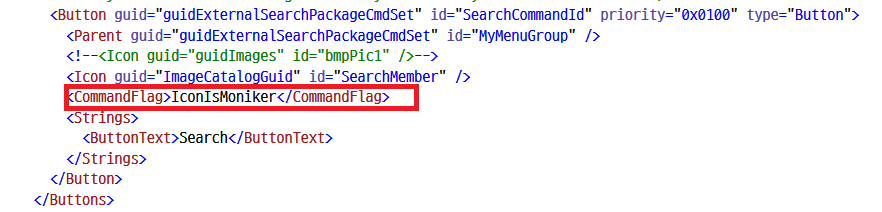   
        그림 4-15_1 CommandFlag 지정

    - **3. 명령어 표시**   
        다음으로 ButtonText 요소를 Search으로 수정하여 컨텍스트 메뉴에 Search 으로 표시되도록 한다.

    - **4. 단축키 지정**   
        명령에 키보드 지원을 추가하기 위해 Commands 노드 바로 뒤에 KeyBindings 노드를 추가한다. 이제 이 명령에 대한 키보드 단축키를 지정하려면 먼저 이 명령에 사용하는 키보드 단축키가 이미 사용되고 있지 않은지 확인해야 한다. 이렇게 하려면 그림 4-16과 같이 도구 ➤ 옵션 ➤ 환경 ➤ 키보드로 이동. 여기에 도달하려면 옵션 대화 상자에서도 검색하거나 Visual Studio의 상단 검색 텍스트 상자에 키보드를 직접 입력하고 탐색할 수 있습니다.

           
        그림 4-16 키보드 단축키

    - **5. 비어있는 단축키 확인**   
        "바로 가기 키 누르기" 텍스트 상자(그림 4-16에서 #2로 표시)에서 사용하려는 키 조합을 누르고 사용 중인지 확인한다. 데모 목적으로 Ctrl S를 눌렀습니다(우리는 문서를 저장하는 데 사용한다는 것을 이미 알고 있다). 이 키 조합으로 텍스트 상자가 업데이트되며 텍스트 상자 바로 아래에는 "이 바로 가기 키를 사용하는 명령" 필드가 있으며 이 필드는 업데이트되고 이 키 조합이 File.SaveSelectedItems 명령에서 사용됨을 보여준다. 이런 식으로 사용자 지정 명령에 키 조합을 사용할 수 있는지 여부를 확인할 수 있고 Alt S는 미사용 조합 키임을 알수 있다. 
        
    - **6. 단축키 최종지정**       
        Alt S의 키 조합을 명령에 할당하기 위해 KeyBindings 요소는 그림 4-17과 같이 표시됩니다.

           
        그림 4-17 키 바인딩

        IntelliSense는 GUID, id(명령과 일치해야 함), 편집기, key1, key2, mod1 및 mod2에 대한 올바른 값을 제공하는 데 도움이 됩니다. Alt와 S만 키 조합으로 사용하고 있으므로 key2와 mod2를 제거했습니다.

- ### D. 검색 기능 작성
    위의 단계로 모든 vsct 파일 변경이 완료되었다. 이제 코드 편집기 컨텍스트 메뉴에 연결된 새 명령어를 가지게 되었다. 명령어에는 아이콘이 연결되어 있으며 또한  키보드 단축키가 할당되어 있다.

    이제 이 검색 명령 클릭 이벤트를 처리하는 코드를 작성해야 한다.
    코드 편지기 창에서 텍스트를 선택한 후 마우스 오른쪽 버튼을 클릭하고 검색 명령을 실행한다는 점을 기억하자.  
    또는 텍스트를 선택하고 Alt + S를 눌러 검색을 시작하므로 검색 명령의 이벤트 핸들러에서 다음을 수행해야 한다.

        - a. 선택한 텍스트를 가져온다.
        - b. 이 텍스트를 인코딩하여 검색 엔진에 전달.
        - c. 브라우저에 검색 결과를 표시.

    그럼 이벤트 핸들러에서 선택한 텍스트를 어떻게 얻을까? 
    
    여기서 핵심 Visual Studio 자동화의 최상위 개체인 DTE가 등장한다.
    이는 Visual Studio 구성 요소 및 확장기능에서 사용할 수 있는 여러 서비스를 사용하고 노출한다. DTE 또는 문서 도구 확장성이라 불리는 기능은 문서를 확장하고 자동화하는 데 사용할 수 있는 속성과 API들을 제공한다.

    DTE의 중요한 속성 및 방법을 빠르게 살펴보자.  
    DTE의 클래스 다이어그램은 그림 4-18에 나와 있으며 이번 장 끝 부분에 있는 "클래스 레퍼런스" 섹션에는 DTE의 속성과 메서드가 요약되어 있다. 같은 내용을 
    <a href="https://docs.microsoft.com/en-us/dotnet/api/envdte.dte?view=visualstudiosdk-2017&viewFallbackFrom=visualstudiosdk-2019" target="_blank">온라인</a>에서 볼수 있다.

       
    그림 4-18 DTE 클래스 다이어그램

    따라서 DTE가 여러 가지를 달성하는 데 도움이 될 수 있음을 알 수 있다. 다음으로 해야 할 일은 DTE에 액세스하는 것이다.

    - **1. DTE 서비스가져오기**           
        AsyncPackage 클래스는 type을 지정하여 서비스에 대한 참조를 가져오는 데 사용할 수 있는 GetServiceAsync라는 API를 노출한다. DTE 개체에 액세스하기 위해 그림 4-19와 같이 이 API를 이용해 만들것이다.  
        이 API는 확장을 개발하는 동안 서비스에 대한 참조를 얻는 데 매우 유용하고 자주 사용되고 이것은 비동기 API이므로 비차단 방식으로 올바르게 사용하기 위해 await 키워드를 사용했다. await 키워드를 사용하려면 이벤트 핸들러 메서드 서명에서도 async 키워드를 사용해야 한다. 그러나 async void 메서드는 권장되지 않으므로 비동기인 InitializeAsync 메서드에서 DTE에 액세스하도록 코드를 이동하자. SearchCommand.cs 파일의 InitializeAsync메쏘드쪽으로 이 코드를 이동하자.
        
           
        그림 4-19 GetServiceAsync 사용

        서비스를 DTE로 캐스팅한 줄의 물결선을 확인하십시오. 이것은 잠재적인 함정과 버그를 피하기 위해 Visual Studio가 개발에서 제공하는 훌륭한 경험을 보여줍니다. 모든 확장성 프로젝트 템플릿은 기본 분석기 지원과 함께 제공된다. 분석기는 코드를 분석하고 DTE는 기본 UI 스레드에서만 액세스해야 함을 확인하고 물결선을 통해 경고를 표시해주는 것이다.
    
           
        그림 4-20 작동중인 분석기

        물결선 위로 마우스를 가져가면 다음과 같은 오류 메시지가 표시됩니다. "DTE" 액세스는 기본 스레드에서만 수행되어야 합니다. 먼저 JoinableTaskFactory.SwitchToMainThreadAsync()를 await합니다. 그림 4-20에 나와 있다. 이것을 고치는 것은 간단하며 Ctrl + . 키를 누르면 된다. 첫번째를 선택하면 이렇게 하면 전구 스타일의 작업이 DTE에 액세스하기 전에 기본 스레드로 전환하는 코드 조각을 추가한다. 이제 새 코드 스니펫이 그림 4-21과 같이 표시됩니다.

           
        그림 4-21 수정된 코드

        그러나 이 코드를 변경한 후에도 여전히 Execute 메서드 이름에 물결선이 보인다. "Execute" 메서드는 이벤트 핸들러이므로 반환 유형이 void인 고정된 미리 정의된 서명이 있기 때문이다. 비동기 void 메서드는 예외 처리에 문제가 있고 충돌을 일으킬 수 있으므로 권장되지 않기도 하다. 따라서 위에서 언급한 것처럼 이 코드의 올바른 위치는 SearchCommand 클래스의 InitializeAsync 메서드쪽이다. 이렇게 하면 SwitchToMainThreadAsync API를 사용할 필요가 없습니다.
        옮기자.

        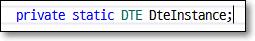   
        
        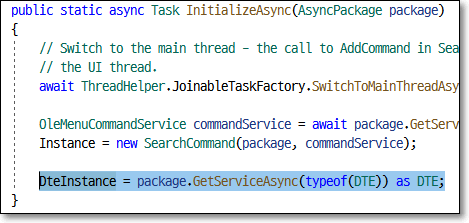   


        
    - **2. 선택한 텍스트 얻기**              
        이제 DTE 개체에 대한 참조가 있기에 선택한 텍스트를 얻기 위해 Visual Studio의 활성 Document를 반환하는 DTE의 ActiveDocument라는 속성을 사용해야 한다. 이 속성은 Document 유형. 이 속성을 사용하기 전에 Document 유형에 의해 노출되는 속성과 메서드를 살펴보자. Document의 클래스 다이어그램은 그림 4-22.

           
        그림 4-22 문서 타입
        
        Document 인터페이스의 속성과 메소드는 이 장의 끝에 있는 "클래스 참조" 섹션에 요약되어 있다. 자세한 내용은 <a href="https://docs.microsoft.com/en-us/dotnet/api/envdte.document?view=visualstudiosdk2017&viewFallbackFrom=visualstudiosdk-2019" target="_blank">온라인</a>

        Document에 Selection이라는 속성이 있다는 것을 알 수 있다. 이 속성은 문서에서 선택 항목을 가져오는 데 기본적으로 object 형식이며 TextSelect형식으로 변환해서 사용하자. EnvDTE 어셈블리는 텍스트 선택을 처리하는 TextSelection이라는 형식을 노출한다. 그것들을 사용하여 우리는 선택된 텍스트를 얻을 수 있다. 
        
        Extension을 작성할 때 TextSelection 유형은 다양한 요구에 도움이 될 수 있으므로 추가 코드를 작성하기 전에 TextSelection 유형의 클래스 다이어그램, 속성 및 메서드를 살펴보겠다. 
        
        Microsoft 공식 문서의 TextSelection 설명서는 Microsoft 설명서 사이트에서 
        <a href="https://docs.microsoft.com/en-us/dotnet/api/envdte.textselection?view=visualstudiosdk-2017" target="_blank">온라인</a>

        이를 통해 이제 문서 및 텍스트 선택 작업에 사용할 수 있는 API 및 속성을 알게 되었다.

    - **3. 텍스트 가공**  
        DTE의 ActiveDocument 속성에서 Selection 속성을 가져온 다음 TextSelection 형식으로 캐스팅할 수 있는지 확인한다. 텍스트 선택이 null이면 검색할 항목이 없으므로 Visual Studio의 StatusBar 또는 OutputWindow에서 사용자에게 메시지를 표시할 수 있다. 텍스트 선택이 있는 경우 브라우저에서 URL을 열어 검색 엔진에서 검색할 URL을 구성한다.

        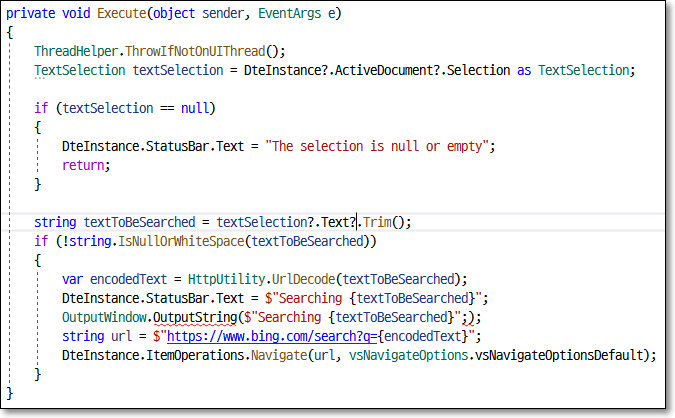   
        그림 4-23 빙에서 선택된 텍스트를 검색하기 위해 메쏘드 실행

        이 코드가 보여주는 몇 가지 두드러진 요점과 개념에 대해 논의해 보겠다.
        
        a. 우리는 이미 MainThread에서 DTE에 액세스해야 하고 Main 스레드로 전환하는 방법을 보았. (ThreadHelper.ThrowIfNotOnUIThread) 이 스니펫은 실행 중인 스레드가 기본 UI 스레드가 아닌 경우 API가 예외를 throw하는 것을 보여줍니다.  

        b. DTE에는 Visual Studio 상태 표시줄에 텍스트, 애니메이션, 진행률 등을 표시하는 데 사용할 수 있는 StatusBar 속성이 있다. 이 속성을 사용하여 검색하는 동안 또는 선택한 텍스트가 비어 있을 때 사용자에게 짧은 상태 메시지를 표시할 수 있다. 

        c. 이 그림은 또한 OutputWindow에 텍스트를 표시하는 방법을 보여준다. OutputString 메서드를 사용하여 출력 창에 텍스트를 쓸 수 있다. 그러나 먼저 OutputWindow에 대한 참조를 가져와야 한다. 이것은 Visual Studio의 서비스 인프라를 사용하여 GetServiceAsync API를 호출하여 수행다. 이것은 SearchCommand 클래스의 InitializeAsync 메서드에서 수행된다. Visual Studio는 그림 4-24와 같이 일반 출력 창의 참조를 가져오는 데 직접 사용할 수 있는 VsGeneralOutputWindowPane을 통해 일반 출력 창을 표시한다.

           
        그림 4-24 InitializeAsync 메쏘드

        d. Assumes은 서비스 인스턴스에 대한 가정을 확인하기 위해 API를 노출하는 정적 도우미 클래스입니다. Present 메서드는 값이 null이 아닌지 확인합니다. 그렇지 않으면 예외가 발생합니다. 

        e. DTE에는 파일 작업 및 파일 열기, 파일이 열려 있는지 확인, 프로젝트에 새 항목 추가, 프로젝트에 기존 항목 추가 또는 URL 탐색과 같은 작업을 수행하는 데 사용할 수 있는 ItemOperations라는 속성이 있습니다. ItemOperations의 Navigate 메서드를 사용하여 검색 엔진 URL로 이동했습니다.

- ### E. 확장 테스트하기
    위의 단계를 통해 확장의 첫 번째 초안이 준비되었습니다. 

    - **1. F5 키를 누르고 디버깅 시작**      
        그러면 ExternalSearch 확장이 설치된 Visual Studio의 새로운 실험적 인스턴스가 시작됩니다. 그런 다음 기존 C# 프로젝트를 열고 코드 창에서 편집할 C# 파일 중 하나를 엽니다. 
    
    - **2. 팝업 메뉴**      
        코드 창에서 코드 조각/텍스트를 선택하고 마우스 오른쪽 버튼을 클릭합니다. 그러면 새로운 사용자 지정 명령이 포함된 상황에 맞는 메뉴가 표시됩니다. 그림 4-25와 같이 검색 명령의 아이콘, 이름 및 키보드 단축키를 확인하십시오.

           
        그림 4-25 검색 명령어

    - **3. 팝업 메뉴에서 Search 명령어 선택**      
        검색 명령을 클릭하거나 Alt S 키 조합을 누릅니다. 그러면 Bing 검색에서 선택한 텍스트가 검색되고 그림 4-26과 같이 Visual Studio 브라우저에 결과가 표시됩니다.
    
           
        그림 4-26 Visual Studio 브라우저에서 Bing 검색

        이를 통해 Visual Studio 내에서 Bing으로 검색하는 데 사용할 수 있는 작동하는 Visual Studio 확장을 만들게 되었습니다. 그러나 일부 사용자는 Google, StackOverflow, Microsoft 문서 또는 기타 검색 엔진에서 검색하는 것을 선호할 수 있습니다. 우리의 확장은 사용자에게 이러한 유연성을 제공할 수 있어야 합니다. 어떻게 할 수 있습니까? 구성은 우리의 마음에 오는 것입니다. 내가 사용하고 싶은 검색 엔진을 구성할 수 있다면 이 경우를 해결할 수 있을 것입니다. Visual Studio 확장에는 사용자가 필요에 따라 기능/확장을 사용자 지정하도록 구성할 수 있는 옵션 페이지에 대한 지원이 있습니다. 다음 단계에서는 externalSearch 확장에 대한 옵션 페이지를 활용하여 확장을 구성할 수 있는 방법에 대해 설명합니다.
        
    - **4. 옵션 페이지 추가**              
        옵션 페이지를 추가하려면 먼저 프로젝트에 새 클래스를 추가하고 이름을 ExternalSearchOptionPage.cs로 지정합니다. 
    
    - **5. 클래스 설명**  
        클래스는 DialogPage 클래스에서 파생되어야 합니다. DialogPage 클래스의 클래스 다이어그램은 그림 4-27과 같습니다. 공식 Microsoft 문서 사이트의 DialogPage 속성 및 메서드는 "클래스 참조" 섹션에 요약되어 있습니다. DialogPage에 대한 문서는 매우 상세하며 DialogPage 작업에 대한 많은 통찰력을 공유합니다. 독자들이 다음 위치(https://docs.microsoft.com/en-us/dotnet/api/microsoft.visualstudio.shell.dialogpage?view=visualstudiosdk-2017)에서 이 문서를 읽을 것을 적극 권장합니다.

        DialogPage에는 레지스트리와 파일 시스템에 설정을 저장하고 로드하는 API가 있으며 속성은 저장소 위치를 노출합니다. 이 클래스는 상속될 수 있으므로 기본 구현을 변경하기 위해 메서드를 재정의할 수 있습니다. 우리의 경우 간단한 속성을 다룰 때 DialogPage의 기본 구현으로 충분합니다. DialogPage 클래스의 클래스 다이어그램은 그림 4-27과 같습니다.

           
        그림 4-27 다이알로그페이지

        이제 DialogPage에 의해 노출되는 API를 알았으므로 사용하겠습니다. 
    
    - **6. guid 삽입**  
        새로 생성된 ExternalSearchOptionPage 클래스를 확장의 옵션 페이지로 고유하게 식별하려면 GUID 특성을 통해 이 클래스에 GUID를 할당해야 합니다. Extensibility Essentials 2019 확장 팩의 일부로 GUID 삽입 확장이 설치되어 있으므로 코드 창을 마우스 오른쪽 버튼으로 클릭한 다음 상황에 맞는 메뉴에서 GUID 삽입을 클릭하거나 Ctrl K, Ctrl Space 키 조합을 눌러 삽입할 ​​수 있습니다. ExternalSearchOptionPage 클래스 위에 있는 GUID 특성의 GUID입니다. 
    
    - **7. 속성 정의**  
        다음으로 구성하려는 속성을 정의합니다. 이것은 대부분의 일반적인 옵션 페이지 시나리오에서 수행해야 하는 작업입니다. 속성 및 TypeConverters로 정의하고 장식하는 속성은 기본 인프라에 의해 확장의 옵션 대화 상자 페이지에 표시됩니다. 요점은 옵션 페이지의 가장 일반적인 시나리오는 DialogPage에서 클래스를 상속하고 속성을 정의하고 속성 및 TypeConverters로 장식하여 쉽게 처리할 수 있다는 것입니다. 먼저 코드를 보고 각 속성과 속성의 목적에 대해 논의하고 이해하겠습니다. ExternalSearchOptionPage의 코드는 다음과 같습니다.

        ```cs
        [Guid("02a61dc8-086a-486e-852b-9d1d360282bd")]
        public sealed class ExternalSearchOptionPage : DialogPage
        {
            private const string defaultUrl = "https://www.bing.com/search?q={0}";
            private static Dictionary<SearchEngines, string> allEngines = new Dictionary<SearchEngines, string>()
            {
                {SearchEngines.Bing, defaultUrl },
                {SearchEngines.Google, "https://www.google.com/search?q={0}" },
                {SearchEngines.MSDN, "https://docs.microsoft.com/enin/search/?search={0}&category=All" },
                {SearchEngines.StackOverflow, "https://stackoverflow.com/search?q={0}" }
            };

            [DisplayName("Use Visual Studio Browser")]
            [DefaultValue(true)]
            [Category("General")]
            [Description("A value indicating whether search should be displayed in Visual Studio browser or external browser")]
            public bool UseVSBrowser { get; set; }

            [DisplayName("Search Engine")]
            [DefaultValue("Bing")]
            [Category("General")]
            [Description("The Search Engine to be used for searching")]
            [TypeConverter(typeof(EnumConverter))]
            public SearchEngines SearchEngine { get; set; } = SearchEngines.Bing;

            [DisplayName("Url")]
            [Category("General")]
            [Description("The Search Engine url to be used for searching")]
            [Browsable(false)]  //이 속성을 보여주지 않음
            public string Url
            {
                get
                {
                    var selectedEngineUrl = allEngines.FirstOrDefault(j => j.Key == SearchEngine).Value;
                    return string.IsNullOrWhiteSpace(selectedEngineUrl) ? defaultUrl : selectedEngineUrl;
                }
            }
        }

        public enum SearchEngines
        {
            Bing = 0,
            Google,
            MSDN,
            StackOverflow
        }
        ```

        파일에는 하나의 정적 필드와 세 개의 속성이 있습니다.  
        정적 필드 allEngines는 **Dictionary<SearchEngines, string>**형태이며 열거형 SearchEngines가 키, 문자열이 값인 Dictionary입니다. URL에 다른 검색 엔진이  추가됩니다. System.ComponentModel 네임스페이스는 속성에 적용할 수 있는 여러 특성을 정의합니다. 이러한 속성은 이전 코드 목록에서 굵게 강조 표시되어 있습니다. 이러한 속성의 목적은 표 4-1에 요약되어 있습니다.
    
        표4-1 System.ComponentModel에 정의된 속성들
        ```
        멤버            설명
        -------------   -----------------------------------------------------------------------------------------
        DisplayName     속성에 이름을 할당합니다.
        DefaultValue    속성에 기본값을 할당합니다.
        Category        속성에 범주를 할당합니다.
        Description     속성에 설명을 할당합니다.
        TypeConverter   값을 한 유형에서 다른 유형으로 변환합니다. 예를 들어 EnumConverter는 열거형을 문자열로 또는
                        그 반대로 변환합니다. TypeConverter에서 클래스를 상속하고 형식을 변환하는 메서드를 재정의하여
                        모든 형식에 대한 사용자 지정 형식 변환기를 만들 수 있습니다. 
                        TypeConverters 및 해당 API에 대한 문서는 다음에서 볼수 있습니다.
                        https://docs.microsoft.com/en-us/dotnet/api/system.componentmodel.typeconverter?view=netframework-4.8
        Browsable       PropertyGrid에 속성을 표시할지 여부를 지정합니다.
        ```

        외부 브라우저에서 검색 결과를 보고 싶어하는 확장 프로그램 사용자가 있을 수 있습니다. 이를 위해 UseVSBrowser 속성이 추가됩니다. 기본값은 true입니다. 즉, 기본적으로 Visual Studio Browser가 사용됩니다. 
        
        다른 속성은 최종 사용자가 검색 엔진을 선택하도록 노출하는 SearchEngine의 속성입니다. 따라서 사용자는 Bing, Google, StackOverflow 또는 Microsoft Docs중 하나를 선택할 수 있다. 검색 엔진의 기본값은 Bing이고 TypeConverter 속성은 열거형의 모든 값이 속성 그리드에 드롭다운으로 표시되도록 합니다. 사용자가 검색 엔진을 선택하면 해당 URL을 사용해야 하므로 static Dictionary에서 조회를 수행하여 선택한 검색 엔진의 URL을 가져와야 한다. 이것은 Url 속성에서 수행된다. 사용자가 편집하는 것을 원하지 않으므로 읽기 전용(속성만 가져오기). 또한 한 번 검색 엔진이 선택되면 URL을 변경할 수 없으므로 사용자에게 보여 주는 의미가 없다. Browsable 속성에 false를 지정해 이 속성을 숨긴다. 
        
        이것으로 간단한 PropertyGrid 기반 DialogPage에 대한 코딩이 완료되었습니다. 값을 유지하거나 값을 로드하는 것에 대해 DialogPage 인프라가 처리하므로 걱정할 필요가 없다. 그러나 옵션 페이지에 사용자 정의 UI를 표시해야 하는 경우가 있습니다. UIElementDialogPage(DialogPage 대신)에서 옵션 페이지 클래스를 상속하고 적절한 UI가 있는 UserControl을 만들어 이 사용자 지정 UI 시나리오를 달성할 수 있다. 우리가 개발하는 후속 확장에서 이 시나리오가 실제로 실행되는 것을 보게 될 것이다. 

    현재 확장으로 돌아가서 여전히 패키지와 연결한 다음 확장 코드의 옵션에 액세스하여 사용자가 제공한 값을 존중해야 합니다. 다음 단계에서 이러한 변경을 수행할 것입니다.

- **1. 옵션 페이지 연결**  
    패키지 클래스로 돌아가서 속성 ProvideOptionPage를 추가하여 이 패키지와 옵션 페이지를 연결합니다. 다음 코드 목록은 이 속성을 보여줍니다.

    ```cs
    [ProvideOptionPage(typeof(ExternalSearchOptionPage), "ExternalSearch", "General"
        , 1, 1, true, new string[] { "External Search Options"})]
    public sealed class ExternalSearchPackage : AsyncPackage
    ```

- **2. 옵션 속성 사용**  
    이제 옵션 페이지에 액세스한 다음 확장의 옵션 속성을 사용해야 합니다. 그렇게 하려면 먼저 옵션 페이지에 액세스해야 합니다. 패키지 클래스의 GetDialogPage API를 사용하여 옵션을 가져옵니다. 옵션에 액세스하면 해당 속성을 사용하고 외부 브라우저 또는 VS 브라우저와 구성된 검색 엔진을 사용할 수 있습니다. 옵션을 통합한 Execute 메서드의 전체 코드 목록은 다음과 같습니다.

    ```cs
    private void Execute(object sender, EventArgs e)
    {
        ThreadHelper.ThrowIfNotOnUIThread();
        var options = this.package.GetDialogPage(typeof(ExternalSearchOptionPage)) as ExternalSearchOptionPage;   // 옵션 얻기
        var textSelection = DteInstance?.ActiveDocument?.Selection as TextSelection;
        if (textSelection == null)
        {
            DteInstance.StatusBar.Text = "The selection is null or empty";
            return;
        }
        string textToBeSearched = textSelection?.Text?.Trim();
        if (!string.IsNullOrWhiteSpace(textToBeSearched))
        {
            var encodedText = HttpUtility.UrlEncode(textToBeSearched);
            DteInstance.StatusBar.Text = $"Searching{textToBeSearched}";
            OutputWindow.OutputString($"Searching{textToBeSearched}");
            string url = string.Format(options.Url, encodedText);
            if (options.UseVSBrowser)
            {
                DteInstance.ItemOperations.Navigate(url,
                vsNavigateOptions.vsNavigateOptionsDefault);
            }
            else
            {
                System.Diagnostics.Process.Start(url);
            }
        }
        else
        {
            DteInstance.StatusBar.Text = "The selection is null or empty";
        }
    }
    ```

- **3. 프로젝트 디버그**  
    이제 프로젝트를 디버그하면 Visual Studio의 새로운 실험적 인스턴스가 열립니다. 도구 ➤ 옵션 페이지로 이동한 다음 "External Search"로 검색합니다. 외부 검색 옵션 대화 상자가 표시됩니다. 외부 검색 옵션 대화 상자는 그림 4-28과 같습니다.
    
       
    그림 4-28 외부 검색 옵션 페이지

- **4. 검색 엔진 변경**  
    이제 검색 엔진을 Google이나 다른 검색 엔진으로 변경하면 그림 4-29와 같이 다음 검색에 사용되는 검색 엔진이 Google로 변경된 것을 볼 수 있습니다.

       
    그림 4-29 구글 검색 사용하기

축하합니다! 우리는 다른 사용자와 공유할 준비가 거의 된 확장을 만들었습니다(물론 테스트 후).  
Microsoft 확장성 샘플로 GitHub (https://github.com/microsoft/VSSDK-Extensibility-Samples/tree/master/Options)에서 볼 수 있는 옵션 페이지 사용법을 보여주는 훌륭한 예제들이 있습니다. 

기본 클래스와 모델을 노출하여 옵션 페이지를 만들어 봤습니다.  

스레드로부터 안전한 방식으로 옵션 페이지의 복잡성을 보여주는 또 다른 샘플은 https://github.com/madskristensen/OptionsSample입니다. 솔루션 탐색기 창이나 속성 창과 같은 일부 사용자 지정 UI를 사용하여 Visual Studio에 별도 Window를 표시해야 하는 확장 프로그램을 개발해야 하는 경우가 있다.  
이를 개발하기 위해 Visual Studio에는 AsyncToolWindow라는 기본 제공 항목 템플릿이 있다. 다음 섹션에서는 Visual Studio용 간단한 도구 창 확장을 개발하는 방법을 살펴본다.

## <font color='dodgerblue' size="6">3) DTE 오브젝트 보여주기 위한 도구 윈도우 확장</font>
마지막 섹션에서 확장에 대한 옵션 페이지를 개발했으며 내부적으로 DialogPage 창이 PropertyGrid 컨트롤을 사용한다는 것을 이해했다. 이번 섹션에서는 속성 그리드 컨트롤에 DTE 개체를 표시하는 도구 창 확장애드온을 개발할 것이다. 

도구 창(Tool Window) 확장애드온은 Visual Studio IDE에 창을 표시한다. 이 확장애드온은  Custom Command가 포함한 솔루션과 패키지 구조가  유사하다. 그런 다음 Command, vsct 파일 및 도구창을 표시하기 위해 AsyncToolWindow 클래스를 추가한다. 이때 Command는 도구창을 시작하는 방법을 제공한다. 도구창은 선택한 UI를 표시하도록 디자인할 수 있는 WPF 사용자 정의 컨트롤을 호스팅한다.  
이 확장에서는 사용자 정의 컨트롤에 속성 그리드 컨트롤을 추가하고 Visual Studio IDE에서 DTE 개체의 속성을 표시한다.

- ### A. 확장 시작하기
    개발을 시작해보자. 단계는 다음과 같다.

    - **1.새 VSIX 프로젝트 생성**      
        Visual Studio 2019에서 새 VSIX 만들자. 이름은 "PropertiesToolWindow".
    
    - **2. 업데이트 vsixmanifest**      
        이 장의 앞부분에서 설명한 대로 적절하고 의미 있는 값으로 vsixmanifest 파일을 업데이트해라. 업데이트된 vsixmanifest 파일은 그림 4-30에 나와 있습니다.

        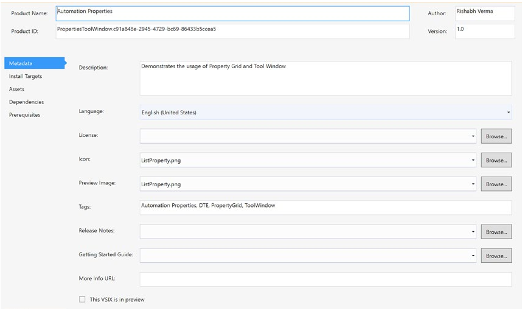   
        그림 4-30 업데이트된 vsixmanifest 파일

    - **3. Async Tool Window 템플릿 추가**  
        이제 도구 창을 추가하자. 이렇게 하려면 솔루션 탐색기에서 프로젝트를 마우스 오른쪽 버튼으로 클릭한 다음 상황에 맞는 메뉴에서 추가 ➤ 새 항목을 클릭다. 그러면 새 항목 추가 대화 상자가 열리는데 왼쪽 창의 Extensibility 범주에서 Async Tool Window를 클릭하고 클래스 이름을 ToolWindow로 지정합니다. 그러면 AsyncPackage에서 호스팅할 수 있는 도구 창과 이 창을 비동기식으로 로드하는 명령이 추가된다.  
        이는 그림 4-31에 나와 있습니다.
        
        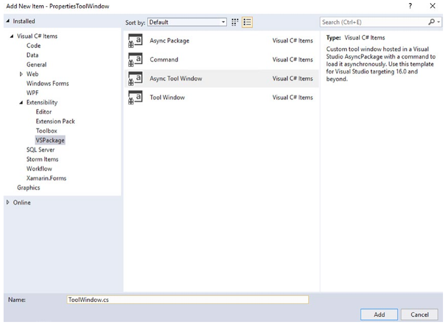   
        그림 4-31 Async Tool Window 템플릿 선택

        그러면 도구 창에 대한 기본 구현이 있는 ToolWindowPane 클래스에서 파생된 ToolWindow 클래스가 추가됩니다. ToolWindowPane 클래스에서 파생하면 ToolWindow 클래스가 도구 창을 만듭니다.
        
- ### B. ToolWindwPane 추가
    ToolWindowPane의 클래스 다이어그램은 속성, 메서드 및 이벤트를 나열하는 그림 4-32에 나와 있습니다.  
    다이어그램은 또한 ToolWindowPane 자체가 WindowPane 클래스에서 파생되고 IVsWindowSearch 인터페이스를 구현함을 보여줍니다.  
    ToolWindowPane의 속성, 메서드 및 이벤트는 목적과 함께 "클래스 참조" 섹션에 요약되어 있습니다. 전체 문서는 다음에서 온라인으로 읽을 수 있습니다.  
    https://docs.microsoft.com/en-us/dotnet/api/microsoft.visualstudio.shell.toolwindowpane?view=visualstudiosdk2017&viewFallbackFrom=visualstudiosdk-2019.

    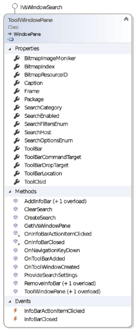   
    그림 4-32 ToolWindowPane 클래스

    이 멤버들을 살펴보면 Search, ToolBar 및 InfoBar와 관련된 몇 가지 멤버를 볼 수 있습니다. Search 및 Toolbar는 직관적이며 이전에 어느 정도 논의되었습니다. 설명은 이러한 구성원을 포괄적으로 만듭니다. 그러나 우리가 논의하지 않은 InfoBar와 관련된 멤버는 거의 없습니다. 중요한 알림이 편집기 상단에 표시되기 때문에 Visual Studio에서 InfoBar를 본 적이 있을 것입니다. Visual Studio에서 성능이 느린 확장을 감지하거나 일부 확장이 충돌하는 경우 Visual Studio는 해당 확장을 비활성화하고 그림 4-33과 같이 확장과 관련된 정보가 InfoBar에 표시됩니다.
    
    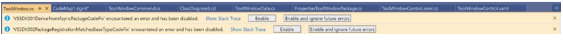   
    그림 4-33 인포바

- ### C. 확장 작성
    다음 장에서 InfoBar를 표시하고 해당 작업을 처리하는 방법을 보여주는 확장 프로그램을 개발할 것입니다.

    - **1. 프로젝트 파일들**       
        솔루션 탐색기를 보면 프로젝트에 다음 파일(ToolWindow 클래스 제외)이 추가된 것을 볼 수 있습니다.

        - **a. vsct파일**  
        vsct 파일, 도구 창을 로드하는 데 사용할 수 있는 명령을 노출하는 명령 클래스입니다.  

        - **b. WPF 사용자 정의 컨트롤**        
        Visual Studio에서 자체적으로 호스팅되는 도구 창에서 호스팅할 WPF 사용자 정의 컨트롤입니다.

        이 단계에서도 확장애드온은 작동 가능하다.  
        이 프로젝트를 실행/디버그하면 Visual Studio IDE의 새로운 실험 인스턴스가 열리고 보기 ➤ 다른 창 ➤ ToolWindow 창으로 이동하면 버튼이 있는 도구 창이 표시된다. 해당 버튼을 클릭하면 심플한 메시지 상자가 표시된다.  
        이제부터는 요구 사항에 맞게 코드를 사용자 지정해야 하니 이미지와 적절한 텍스트 및 키보드 단축키를 명령에 할당하도록 vsct 파일을 수정하자.  
        그림 4-34는 업데이트된 .vsct 파일의 코드 조각이다. 쉽게 식별할 수 있도록 변경 사항이 강조 표시해두었다.   

        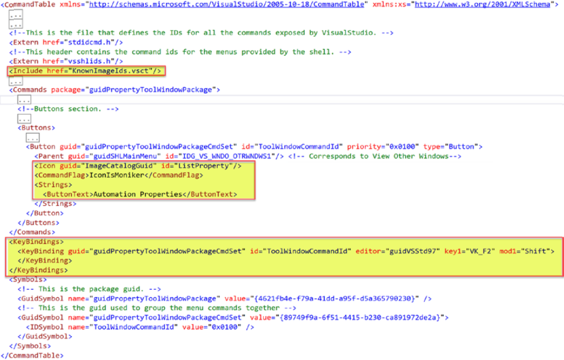   
        그림 4-34 업데이트된 .vsct 파일
        
        guidSHLMainMenu id는 Visual Studio 상위 메뉴의 **보기 ➤ 기타 Windows** 메뉴에 해당하는 **IDG_VS_WDO_OTRWNDWS1**에 해당하는 기본값 설정됨. 이 위치를 변경하려면 이 장의 앞부분에서 설명한 대로 이 ID를 변경해야 합니다. Shift F2의 키보드 조합이 명령에 할당된다.

    - **2. PropertyGrid 컨트롤 추가**  
        다음으로, DTE 개체의 속성을 표시하는 속성 그리드를 갖도록 WPF 사용자 정의 컨트롤을 수정합니다.  
        
        불행히도 기본 WPF 도구 상자에는 PropertyGrid 컨트롤이 없다. Windows Forms에는 있다. 그러나 WPF용 PropertyGrid 컨트롤이 있는 몇 가지 타사 패키지가 있고 여기서는 Exceed의 Extended.WPF.Toolkit을 사용한다. 프로젝트의 참조에서 마우스 우 클릭한 다음 NuGet 패키지 관리를 클릭하고 찾아보기 섹션에서 그림 4-35와 같이 프로젝트의 Extended.WPF.Toolkit 패키지를 검색하여 설치한다.

        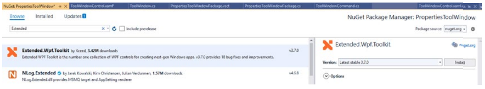   
        그림 4-35 Extended.Wpf.Toolkit
        
    - **3. xaml수정**  
        패키지가 설치되면 그림 4-36과 같이 사용자 제어 XAML 파일을 수정한다.

        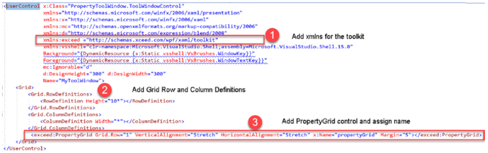   
        그림 4-36 업데이트된 XAML

        다음 변경 사항이 적용된다.

        a. UserControl 요소의 툴킷에 대한 xmlns를 추가.  
        b. Grid의 행 및 열 정의를 정의.  
        c. PropertyGrid 컨트롤이 추가되었다.

    - **4. 코드업데이트**  
        다음으로 사용자 컨트롤의 파일 뒤에 있는 코드를 업데이트하겠습니다. 사용자 컨트롤의 UI는 간단합니다. PropertyGrid 컨트롤만 있다. 따라서 코드 숨김 파일에서 이 컨트롤에 바인딩하려는 데이터를 전달해야 한다. 엔터티 또는 모델(바인딩할 데이터가 포함된 클래스)을 매개변수로 사용하는 사용자 정의 컨트롤에 대한 새 생성자를 정의해 보겠습니다. 해당 클래스의 이름을 ToolWindowData로 지정하겠습니다. 데이터가 있으면 속성 그리드에 바인딩하기만 하면 됩니다. 이것은 그림 4-37에 나와 있습니다.

        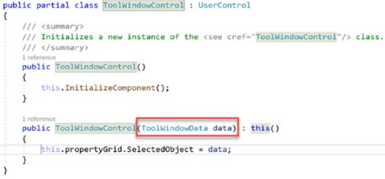   
        그림 4-37 사용자 컨트롤 코드 비하인드

    - **5. ToolWindowData 클래스 작성**          
        ToolWindowData에 대한 더미 클래스가 생성되으니 도구창에 표시할 속성을 추가해 보자. DTE 개체를 보고 싶으므로 DTE에 대한 속성을 추가한다. AsyncPackage 클래스에 무엇이 있는지 살펴보겠습니다. AsyncPackage에 대한 속성 하나를 추가한 다음 마지막으로 PropertyGrid의 기능을 보기 위해 WPF 컨트롤 중 하나에 대한 속성을 추가합니다. 이전에 옵션 페이지에서 했던 것처럼 속성으로 속성을 장식할 것입니다. ToolWindowData의 코드는 다음과 같습니다.

        ```cs
        [DisplayName("Tool Window Data")]
        public class ToolWindowData
        {
            [DisplayName("DTE Instance")]
            [Category("General")]
            [Description("The DTE Instance")]
            [EditorBrowsable(EditorBrowsableState.Always)]
            [TypeConverter(typeof(ExpandableObjectConverter))]
            public DTE DTE { get; set; }

            [DisplayName("Async Package")]
            [Category("General")]
            [Description("The Package")]
            [EditorBrowsable(EditorBrowsableState.Always)]
            [TypeConverter(typeof(ExpandableObjectConverter))]
            public AsyncPackage Package { get; set; }

            [DisplayName("Text Box")]
            [Category("General")]
            [Description("The TextBox")]
            [EditorBrowsable(EditorBrowsableState.Always)]
            [TypeConverter(typeof(ExpandableObjectConverter))]
            public TextBox TextBox { get; set; }
        }
        ```
        
        나는 독자들이 위에서 사용된 속성, 특히 PropertyGrid 컨트롤에서 데이터가 표시되는 방식에서 중추적인 역할을 하는 TypeConverters를 자세히 살펴보기를 적극 권장합니다. 여기에서는 확장 가능 또는 동적 개체를 다른 유형으로 변환하는 데 사용할 수 있는 ExpandableObjectConverter를 사용했다.

    - **6. dd**                  
        AsyncToolWindow 템플릿에서 추가한 코드는 도구창에서 호스팅하는 WPF 사용자 정의 컨트롤을 추가한다. 도구창은 여전히 존재하는 사용자 정의 컨트롤의 매개변수 없는 생성자를 호출한다. 
            
            ToolWindowPackage.InitializeAsync
                ToolWindowCommand.InitializeAsync
                ToolWindowCommand.ToolWindowCommand(package, commandService)
                ToolWindowCommand.Execute(object sender, EventArgs e)
                    this.package.FindToolWindow(typeof(ToolWindow), 0, true)    기본 ToolWindow()생성자
                        Content = new ToolWindowControl()  <-- 여기
        
        그러나 ToolWindowData를 매개 변수로 사용하는 생성자를 추가했으며 이 생성자가 도구 창에서 호출되기를 원합니다. 이를 위해 ToolWindow.cs 파일을 수정하고 ToolWindowData를 매개변수로 사용하는 생성자를 추가합니다. ToolWindow의 코드 목록은 다음과 같습니다.

        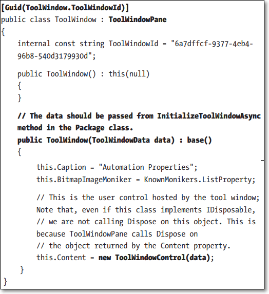   

        우리가 주목해야 할 중요한 사항은 굵게 표시되어 있다. 각 도구창은 ToolWindowPane에서 파생되며 고유한 식별자(Guid)가 할당된다. Visual Studio는 이 식별자를 사용하여 설정 저장소에 있는 도구 창의 크기, 위치, 상태 등을 유지한다. ToolWindows는 탭, 연결, 부동, MDI 등과 같은 여러가지 Window 상태로 존재할 수 있다. 도구창을 어떤 상태로 만들 것인지는 패키지 클래스에서 설정할 수 있다. 이는 향후 단계에서 곧 보게 될 것이다. 
        
        도구창에 대한 흥미로운 점은 Visual Studio가 닫히지 않는 한 한 번 만들어지면 절대 파괴되지 않는다는 것이다. 도구 창을 닫아도 실제로는 닫히지 않고 숨겨져 있다. 이는 ToolWindow 생성자에 중단점을 지정하여 확인해봐도 생성자는 한 번만 호출된다.
        
        ToolWindowData를 매개변수로 받는 생성자를 만들었지만 이 생성자에게 매개변수와 함께 호출이 되어야 한다. 어떻게 합니까? 전달해야 하는 개체의 인스턴스를 반환하도록 Package 클래스에서 InitializeToolWindowAsync라는 메서드를 재정의해야 합니다. 생성자에서 이미 논의한 Caption, BitmapImageMoniker 및 Content 속성을 설정합니다. 여기서는 문자열을 직접 사용했지만 상수를 사용하는 것이 좋습니다.

    - **7. ToolWindow 특성 수정**            
        이제 Package 클래스로 이동하겠습니다. ToolWindow를 호스팅하는 클래스입니다. 무엇보다도 먼저 ToolWindow가 문서처럼 탭 상태여야 하므로 다음과 같이 Package 클래스에서 ProvideToolWindow 특성(이 패키지가 도구 창을 소유하고 있음을 Visual Studio에 등록하고 알려줌)을 업데이트합니다. 

        ```cs
        [ProvideToolWindow(typeof(ToolWindow), Style = VsDockStyle.Tabbed, Orientation = ToolWindowOrientation.none, 
            Window="DocumentWell")]
        ```

        우리는 스타일 특성을 추가했다. 그것은 enum이며 다음값을 가질수 있다.  
            none, MDI, Float, Linked, Tabbed, AlwaysFloat 

        다음 속성은 Orientation이며 열거형이고 다음 값 가능  
            none, Top, Left, Right, Bottom

        Window특성은 모든 문서가 열림을 나타내는 DocumentWell로 탭형태가 되어야 함을 지정한다.
        
        ProvideToolWindowAttribute는 중요한 속성이며 해당 속성이 ToolWindow의 운명을 결정하므로 공식 Microsoft 문서에서 이 속성이 노출하는 속성을 이해하도록 합시다. 문서는 온라인으로도 읽을 수 있습니다.  
        https://docs.microsoft.com/en-us/dotnet/api/microsoft.visualstudio.shell.providetoolwindowattribute?view=visualstudiosdk-2017&viewFallbackFrom=visualstudiosdk-2019

        표4-2 ProvideToolWindowAttribute 속성
        ```
        멤버                설명
        ------------------  ---------------------------------------------------------------------------
        DockedHeight        도킹된 경우 ToolWindow의 기본 높이를 가져오거나 설정합니다.
        DockedWidth         도킹된 경우 ToolWindow의 기본 너비를 가져오거나 설정합니다.
        DocumentLikeTool    동작 및 수명이 문서와 같은 ToolWindow을 원하는 경우 이 속성을 true로 설정하십시오. 
                            ToolWindow은 MDI 또는 부동 상태일 뿐이며 사용자가 수동으로 닫을 때까지 모든 레이아웃 
                            변경에 걸쳐 해당 위치에 계속 표시됩니다. 
                            이 플래그는 DontForceCreate 및 파괴적인 다중 인스턴스를 의미합니다.
        Height              ToolWindow의 기본 높이를 가져오거나 설정합니다.

        MultiInstance**       ToolWindow의 여러 인스턴스가 허용되는지 여부를 결정합니다.
        
        Orientation         Window 속성으로 지정된 창을 기준으로 ToolWindow의 기본 방향을 가져오거나 설정합니다.
        PositionX           ToolWindow의 왼쪽 상단 모서리의 기본 수평 값을 가져오거나 설정합니다.
        PositionY           ToolWindow의 왼쪽 상단 모서리의 수직 값을 가져오거나 설정합니다.
        Style               ToolWindow의 기본 도킹 스타일을 가져오거나 설정합니다.
        ToolType            ToolWindow의 유형을 가져오거나 설정합니다.
        
        Transient**            IDE를 다시 시작할 때 ToolWindow을 다시 열지 않아야 하는지 여부를 가져오거나 설정합니다.
        
        TypeId              RegistrationAttribute 파생 클래스가 
                            System.ComponentModel.TypeDescriptor.GetAttributes(...)와  함께 작동하도록 하려면 
                            TypeID 속성을 재정의합니다. 이 속성에서 파생된 속성은 클래스에 적용할 수 있는 
                            인스턴스에 대한 더 나은 제어가 필요한 경우에만 이 속성을 재정의해야 합니다.
        Width               ToolWindow의 기본 너비를 가져오거나 설정합니다.
        Window              ToolWindow이 도킹되어야 하는 기본 창의 GUID를 가져오거나 설정합니다.
        ```    

        중요 표시된 속성(**)은 ToolWindow의 동작을 크게 변경한다. Transient(임시) 속성은 IDE가 다시 시작될 때 ToolWindow이 자동으로 열리지 않아야 하는지 여부를 결정. 독자들이 이러한 속성을 가지고 놀고 ToolWindow의 모양에 어떤 변화를 가져오는 속성을 탐색하도록 권장한다.

    - **8. 메서드 재정의**  
        다음으로 Package 클래스에서 GetAsyncToolWindowFactory 및 InitializeToolWindowAsync등 몇 가지 메서드를 재정의해야 한다. 매개 변수를 허용하도록 ToolWindow 생성자를 사용자 지정했기 때문에 재정의해야 합니다. 매개변수가 없는 기본 생성자를 사용했다면 이 두 메서드를 재정의할 필요가 없습니다. GetAsyncToolWindowFactory에서 기본 인프라에 현재 Package 클래스를 팩토리로 사용하도록 지시하고 이것이 발생하면 동일한 클래스에서 재정의된 InitializeToolWindowAsync 메서드가 호출됩니다. 여기에서 ToolWindowData 개체를 구성하고 ToolWindow 생성자에 전달되도록 반환합니다. 재정의된 이 두 메서드의 코드는 그림 4-38과 같습니다.
    
        
        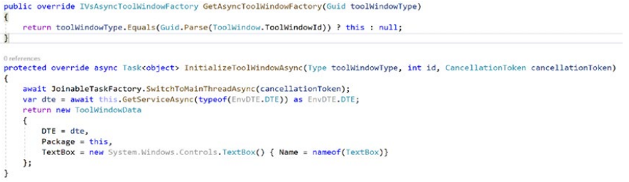   
        그림 4-38 ToolWindowData 개체를 ToolWindow 생성자에 전달하는 재정의된 메서드

    - **9. dd**  
        이것으로 모든 코드 변경이 이루어집니다. 그러나 프로젝트에 추가된 클래스가 하나 더 있는데 우리가 보거나 수정하지 않았습니다. 이 클래스는 ToolWindowCommand 클래스입니다. 이 클래스의 코드는 사용자 지정 명령을 추가하는 것과 동일하므로 여기서 논의할 새로운 내용은 없습니다. 이 클래스는 실행될 때 ToolWindow을 시작하는 명령을 노출합니다. 
        
        이 명령은 보기 > 기타 Windows 메뉴. ToolWindow을 표시하는 역할을 하는 이 클래스의 실행 메소드를 살펴보겠습니다. Execute 메소드의 코드는 다음과 같습니다.

        ```cs
        private void Execute(object sender, EventArgs e)
        {
            this.package.JoinableTaskFactory.RunAsync(async delegate
            {
                ToolWindowPane window = await this.package.ShowToolWindowAsync(typeof(ToolWindow), 0, true, 
                this.package.DisposalToken);

                if ((null == window) || (null == window.Frame))
                {
                    throw new NotSupportedException("Cannot create tool window");
                }
            });
        }
        ```

        ToolWindowPane window로 시작하는 줄은 ToolWindow을 표시하는 역할을 합니다. 여기서 주의해야 할 몇 가지 중요한 사항이 있습니다.

        a. Execute는 동기식 이벤트 핸들러 메서드입니다. ToolWindow을 표시하는 코드가 RunAsync 블록 안에 래핑되어 있는지 확인하세요. 이것은 동기 메서드에서 비동기 작업을 실행하는 방법을 보여줍니다.

        b. 메서드 호출이 비동기식이므로 ToolWindow은 비동기식으로 로드됩니다. 이것이 AsyncToolWindow라고 불리는 이유입니다.  

        c. ShowToolWindowAsync 메서드는 4개의 매개변수를 사용합니다. 먼저 생성할 ToolWindow의 유형입니다. 두 번째는 ToolWindow의 인스턴스 ID를 지정하는 식별자입니다. 세 번째 매개변수는 ToolWindow이 존재하지 않는 경우 작성해야 하는지 여부를 결정하는 부울입니다. 이 매개변수가 false이고 ToolWindow이 존재하지 않으면 창은 null로 설정됩니다. 네 번째 매개변수는 비동기 작업을 취소하는 데 사용할 수 있는 취소 토큰입니다.

- ### D. 확장 실행
    - **1. 실행해보기**     
        F5 키를 누릅니다. 열리는 새 Visual Studio 인스턴스에서 그림 4-39와 같이 보기 ➤ 기타 창 ➤ 자동화 속성으로 이동합니다.

        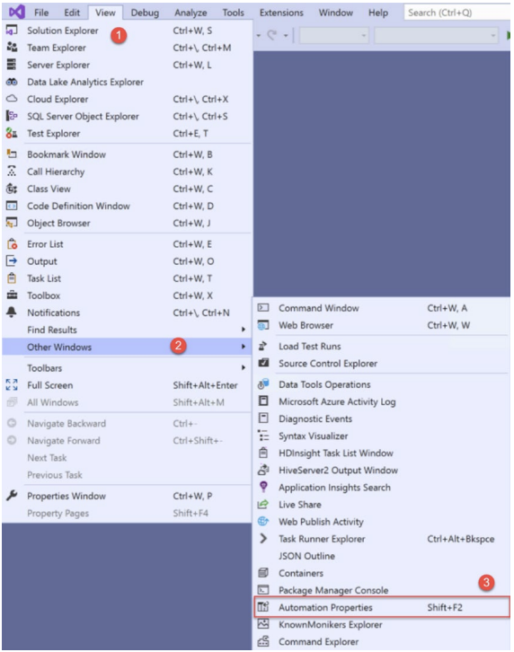   
        그림 4-39 Automation Properties 확장 탐색하기

    - **2. dd**            
        그림 4-40에서처럼 한개의 도구창이 열린다.

        PropertyGrid 컨트롤에서 AsyncPackage, DTE 및 Textbox 컨트롤의 속성을 표시하는 작업 ToolWindow 확장이 있습니다. 확장 정보가 저장되는 ApplicationRegistryRoot 경로, UserDataPath 및 UserRegistryRoot 경로의 값을 확인하는 것이 좋습니다. DTE 개체 속성에서 Edition, 버전, 명령줄 인수 등을 볼 수 있습니다. 또한 XAML을 디자인하는 동안 속성 창에서 보는 것과 같은 방식으로 Textbox 컨트롤의 속성이 표시됩니다. 따라서 ToolWindow 확장을 개발하는 방법을 배우는 것 외에도 DTE, 패키지 개체 속성 및 해당 라이브 값을 보고 PropertyGrid 컨트롤에 대한 노출도 얻었습니다. 확장 코드의 코드 맵 다이어그램은 그림 4-41에 나와 있습니다.
        
        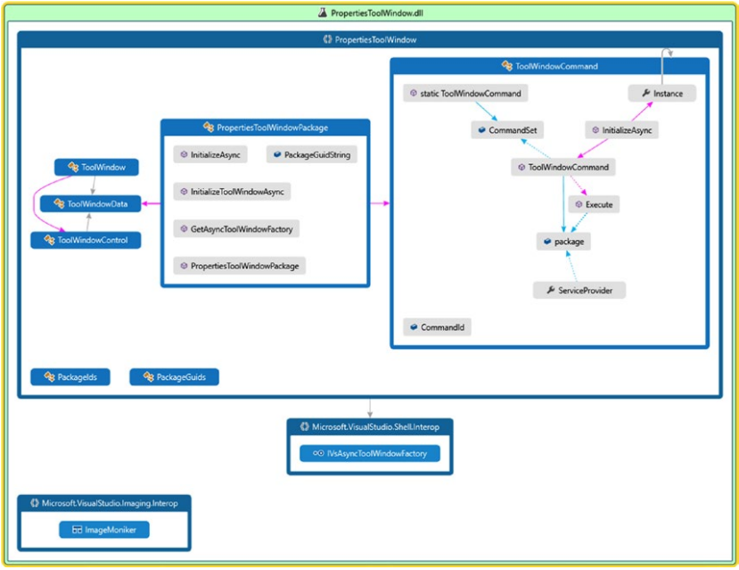   
        그림 4-40 도구창 확장의 코드맵 다이어그램

        이것으로 챕터를 마칩니다. Visual Studio 확장성 팀에는 GitHub의 비동기 ToolWindow 샘플도 있습니다. 다음 URL에서 볼 수 있습니다.

        https://github.com/microsoft/VSSDK-ExtensibilitySamples/tree/master/AsyncToolWindow


## <font color='dodgerblue' size="6">4) 요약</font>        
이 장에서 우리는 유용하고 의미 있는 몇 가지 확장을 개발하고 그 과정에서 몇 가지 중요한 개념을 배웠습니다. 사용자 지정 명령을 추가하고 이벤트 처리기를 사용자 지정 명령에 연결하는 방법에 대한 그림을 보았습니다. 우리는 명령의 위치를 변경하고, 확장에서 Visual Studio에 의해 노출된 서비스에 액세스하고, 자동화 모델의 속성과 API를 이해하고, 옵션 페이지에 대한 지원을 추가하고 확장에서 사용하는 방법을 배웠습니다. 또한 ToolWindow 확장을 개발하는 방법과 사용자 지정 WPF UI 기반 사용자 정의 컨트롤을 ToolWindow에 표시하는 방법을 배웠습니다. 또한 ToolWindow에 데이터를 전달하는 방법도 배웠습니다. 다음 장에서 우리는 이러한 추진력을 계속해서 코드 생성, 정보 표시줄 및 코드 분석 및 수정을 위한 확장을 개발할 것입니다.

***
연습

다음 활동을 통해 이 장에서 논의한 기본 사항을 더 깊이 이해할 수 있습니다.

1. 여러 유형의 속성을 가진 클래스를 만듭니다. 이 형식에 대한 사용자 지정 형식 변환기를 만들고 PropertyGrid 컨트롤에 이 개체의 인스턴스를 표시합니다. WinForms 도구 상자에는 PropertyGrid가 있습니다.

2. 사용자 지정 명령의 가시성을 변경하는 방법을 탐색합니다. 어떤 방법을 사용해야 합니까? 힌트: https://docs.microsoft.com/en-us/visualstudio/extensibility/visibilityitemement?view=vs-2019.

3. vsixmanifest 파일의 Assets, Dependencies 및 Prerequisite 섹션을 읽고 탐색하고 배우십시오. https://docs.microsoft.com/en-us/visualstudio/extensibility/vsix-manifestdesigner?view=vs-2019 읽어보세요.

4. 설정 저장소 탐색기 확장을 사용하고 확장 옵션이 저장되는 위치를 찾으십시오.

5. Visual Studio IDE에서 열려 있는 문서 및 창의 속성을 표시하는 ToolWindow 확장을 만듭니다.

6. 동적 ToolWindow을 탐색합니다. https://docs.microsoft.com/en-us/visualstudio/extensibility/opening-a-dynamic-toolwindow?view=vs-2019 읽어보세요.

7. 비동기 도구 창, ImageMonikers, 명령 및 도구 창에 상황에 맞는 메뉴 표시에 대해 이해하고 자세히 알아보려면 다음 확장의 코드를 살펴보세요.

    a. Command Explorer - https://github.com/madskristensen/CommandTableInfo  
    b. KnownMonikers Explorer - https://github.com/madskristensen/KnownMonikersExplorer

## <font color='dodgerblue' size="6">5) Class Reference</font>        
- ### A. DTE

    ```
    프로퍼티 이름             설명
    ----------------------  -----------------------------------------------------------------------------------------
    ActiveDocument          활성 창을 가져온다
    ActiveSolutionProjects  현재 선택된 프로젝트들의 배열을 가져온다.
    ActiveWindow            현재 활성화 창을 가져오기. 만약 활성 창이 없다면 최상위 창을 가져온다
    AddIns                  사용 가능한 AddIns 컬렉션을 가져오기. 하지만 사용만료 기능이므로 AddIns 및 매크로가 더 이상 사용되지 않으므로 
                            NotImplementedexception이 발생.
    Application             Microsoft 내부 사용 전용
    CommandBars             개발환경 명령 바에 대한 참조 얻기
    CommandLineArguments    명령줄 인수를 나타내는 문자열을 가져오기.
    Commands                명령어 컬렉션 가져오기
    ContextAttributes       자동화 클라이언트가 동적 도움말 창에서 현재 선택된 항목에 새 속성을 추가하고 추가 속성에 대한 상황별 
                            도움말을 제공할 수 있도록 하는 속성 모음을 가져옵니다.
    Debugger                디버거 객체 가져오기
    DisplayMode             MDI 또는 탭 문서의 표시 모드를 가져옵니다.
    Documents               IDE에서 열려 있는 문서 모음을 가져옵니다.
    DTE                     탑레벨 확장성 객체 가져오기
    Edition                 환경의 에디션에 대한 설명을 가져옵니다.
    Events                  이벤트 객체에 대한 참조 가져오기
    FileName                내부적으로 Microsoft 전용 사용
    Find                    전역 텍스트 찾기 작업을 나타내는 Find 개체를 가져옵니다.
    FullName                개체 파일의 전체 경로와 이름을 가져옵니다.
    Globals                 솔루션(.sln)파일, 프로젝트 파일 또는 사용자 프로필 데이터에 저장할 수 있는 값이 포함된 Globals 개체를 가져옴.
                            Globals 개체는 Visual Studio 환경의 각 세션 기간과 VariablePersists 속성을 사용하는 세션 간에 데이터를
                            저장하기 위한 캐시.
    IsOpenFile              내부적으로 Microsoft 전용 사용
    ItemOperations          일반적인 파일 작업을 수행하기 위한 개체를 가져옵니다.
    LocaleID                개발 환경이 실행 중인 로케일의 ID를 가져옵니다.
    Macros                  매크로 개체를 가져옵니다. 
                            Visual Studio 2019에서는 매크로 및 추가 기능이 더 이상 사용되지 않으므로 NotImplementedException이 발생.
    MacrosIDE               Macros IDE 자동화 모델의 루트를 가져옵니다.
    MainWindow              기본 개발 환경 창을 나타내는 창 개체를 가져옵니다.
    Mode                    개발 환경의 모드(디버그 또는 디자인)를 가져옵니다.
    Name                    최상위 자동화 개체의 이름을 가져오거나 설정합니다.
    ObjectExtenders         자동화 개체에 대한 액세스를 제공하는 개체를 가져옵니다.
    Properties              도구 메뉴의 옵션 대화 상자에 포함된 사용 가능한 모든 범주 및 하위 범주를 나타내는 속성 컬렉션을 반환.
        [String,String]
    RegistryRoot            Visual Studio 레지스트리 설정의 루트에 대한 경로가 있는 문자열을 가져옵니다.
    SelectedItems           환경에서 현재 선택된 항목을 포함하는 컬렉션을 가져옵니다.
    Solution                환경의 현재 인스턴스에서 열려 있는 모든 프로젝트를 나타내고 빌드 개체에 대한 액세스를 
                            허용하는 솔루션 개체를 가져옵니다.
    SourceControl           개체 뒤에 있는 파일의 소스 코드 제어 상태를 조작할 수 있는 SourceControl 개체를 가져옵니다.
    StatusBar               기본 개발 환경 창의 상태 표시줄을 나타내는 StatusBar 개체를 가져옵니다.
    SuppressUI              자동화 코드 실행 중에 UI를 표시할지 여부를 가져오거나 설정합니다.
    UndoContext             Visual Studio에서 열려 있는 모든 참가 문서에서 수행되는 모든 작업을 단일 트랜잭션으로 나타내는 
                            전역 UndoContext 개체를 가져온다. SetAborted() 메서드가 호출되면 개체를 연 이후의 모든 변경 사항이 삭제됨.
    UserControl             환경이 사용자 또는 자동화에 의해 시작되었는지 여부를 나타내는 값을 설정하거나 가져옵니다.
    Version                 호스트 응용 프로그램의 버전 번호를 가져옵니다.
    WindowConfigurations    환경을 위해 생성된 모든 사용 가능한 명명된 창 구성을 나타내는 컬렉션을 가져온다.
    Windows                 개체에 표시되는 창을 포함하는 Windows 컬렉션을 가져옵니다.
    ```

    ```
    메쏘드 이름             설명
    ----------------------  -----------------------------------------------------------------------------------------
    ExecuteCommand          지정된 명령을 실행. 이 방법은 확장 개발자 툴킷의 맨 위 서랍에서 위치를 쉽게 찾을 수 있다. 
        (String, String)    이 메서드는 실행 중에 명령을 적용할 수 있는 경우 Visual Studio의 기존 명령을 실행하기 위해 확장에서 
                            사용 가능. 또한 휠을 재발견하는 대신 이미 사용 가능한 명령을 기반으로 하여 많은 기능을 달성하는 데 도움이 됨.
    GetObject(String)       DTE 개체에 늦게 바인딩되며 런타임 중 이름으로 액세스할 수 있는 인터페이스 또는 개체를 가져옵니다.
    LaunchWizard            제공된 파라메터로 마법사 실행
        (String,Object[])
    OpenFile(String,String) Microsoft 내부 전용        
    Quit()                  환경 닫기
    SatelliteDllPath        지역화된 리소스를 포함하는 DLL의 설치 디렉터리 및 파일 이름이 제공되면 위성 DLL에 대한 계산된 경로를 반환.
        (String,String)
    ```

- ### B. Document 인터페이스

    ```
    프로퍼티 이름             설명
    ----------------------  -----------------------------------------------------------------------------------------
    ActiveDocument          현재 활성 창을 가져오거나 다른 창이 활성화되어 있지 않으면 최상위 창을 가져옴. 
                            열려 있는 창이 없으면 null을 반환.
    Collection              편집을 위해 열린 환경에서 문서를 나타내는 개체를 포함하는 컬렉션을 가져옵니다.
    DTE                     최상위 확장성 객체 가져오기
    Extender                이 개체에 사용할 수 있는 경우 요청된 Extender를 반환합니다.
    ExtenderCATID           개체의 Extender 카테고리 ID(CATID)를 가져옵니다.
    ExtenderNames           개체의 사용가능한 Extender 카테고리 리스트 가져옵니다.
    FullName                개첵의 파일 명과 전체 경로 가져오기
    IndentSize              Microsoft 내부 전용
    Kind                    개체의 종류 또는 유형을 나타내는 GUID 문자열을 가져옵니다.
    Language                Microsoft 내부 전용
    Name                    문서의 이름 가져오기
    Path                    파일명이 제외된 Document 디렉토리의 경로 가져오기.
    ProjectItem             Document 개체와 연결된 ProjectItem 개체를 가져옵니다.
    ReadOnly                Microsoft 내부 전용
    Saved                   객체가 마지막으로 저장되거나 열린 이후 수정되지 않은 경우 true를 반환합니다.
    Selection*              문서에서 현재 선택 항목을 나타내는 개체를 가져옵니다.
    TabSize                 Microsoft 내부 전용
    Type                    Microsoft 내부 전용
    Windows                 개체에 표시되는 창을 포함하는 Windows 컬렉션을 가져옵니다.
    ```

    ```
    메쏘드 이름              설명
    ---------------------   -------------------------------------------------------------------------------
    Activate                현재 항목으로 포커스를 이동합니다.
    ClearBookmarks          Microsoft 내부 전용
    Close                   열려 있는 문서를 닫고 선택적으로 저장하거나 창을 닫고 제거합니다.
    MarkText                Microsoft 내부 전용
    NewWindow               문서를 볼 수 있는 새 창을 만듭니다.
    Object                  런타임에 이름으로 액세스할 수 있는 인터페이스 또는 개체를 반환합니다.
    PrintOut                Microsoft 내부 전용
    Redo                    Undo() 메서드 또는 사용자에 의해 실행 취소된 마지막 작업을 다시 실행합니다.
    ReplaceText             Microsoft 내부 전용
    Save                    document 저장.
    Undo                    문서 사용자가 마지막으로 수행한 작업을 되돌립니다.
    ```

- ### C. TextSelection

    ```
    프로퍼티 이름             설명
    ----------------------  -----------------------------------------------------------------------------------------
    ActivePoint             선택 항목의 현재 끝점을 가져옵니다.
    AnchorColumn            Microsoft 내부 전용
    AnchorPoint             선택의 원점을 가져옵니다.
    BottomLine              Microsoft 내부 전용
    BottomPoint             선택의 끝에서 점을 가져옵니다.
    CurrentColumn           Microsoft 내부 전용
    CurrentLine             Microsoft 내부 전용
    DTE                     최상위 확장성 객체 가져오기
    IsActiveEndGreater      활성 포인트가 하단 포인트와 같은지 여부를 가져옵니다.
    IsEmpty                 앵커 포인트가 활성 포인트와 같은지 여부를 가져옵니다.
    Mode                    마우스 끌기가 스트림 또는 블록 모드에서 선택하는지 여부를 결정하는 값을
                            가져오거나 설정.
    Parent                  TextSelection 개체의 바로 위 부모 개체를 가져옵니다.
    Text                    TextSelection을 가져오거나 설정
    Textpane                TextSelection을 포함하는 텍스트 영역을 가져옵니다.
    TextRanges              선택 항목의 각 행 또는 부분 행에 대해 하나의 TextRange 객체가 있는 TextRanges 컬렉션을 가져온다.
    TopLine                 Microsoft 내부 전용
    TopPoint                선택 항목의 상단을 가져옵니다.
    ```

    ```
    메쏘드 이름              설명
    ---------------------   -------------------------------------------------------------------------------
    Backspace               Microsoft 내부 전용
    Cancel                  Microsoft 내부 전용
    ChangeCase              선택된 텍스트 대소문자 변경
    CharLeft                개체를 지정된 문자 수만큼 왼쪽으로 이동.
    CharRight               개체를 지정된 문자 수만큼 오른쪽으로 이동.
    ClearBookmark           현재 텍스트 버퍼 라인에서 이름이 지정되지 않은 책갈피를 지웁니다.
    Collapse                텍스트 선택을 활성 지점으로 축소합니다.
    Copy                    선택된 텍스트 클립보드에 복사
    Cut                     선택된 텍스트 클립보드에 복사하고 원래위치에서 삭제
    Delete                  선택 텍스트 삭제
    DeleteLeft              활성 포인트의 왼쪽에 지정된 수의 문자를 삭제합니다.
    DeleteWhitespace        텍스트 버퍼의 현재 위치 주변의 빈 문자(공백)를 수평 또는 수직으로 삭제합니다.
    DestructiveInsert       텍스트를 삽입하여 기존 텍스트를 덮어씁니다.
    EndOfDocument           개체를 문서의 끝으로 이동.
    EndOfLine               개체를 현재 라인의 끝으로 이동.
    FindPattern             활성 지점에서 문서 끝까지 지정된 패턴을 검색합니다.
    FindText                활성 지점에서 문서 끝까지 주어진 텍스트를 검색합니다.
    GotoLine                표시된 줄의 시작 부분으로 이동하고 요청 시 해당 줄을 선택합니다.
    Indent                  지정된 들여쓰기 수준만큼 선택한 줄을 들여씁니다.
    Insert                  현재 삽입 지점에 지정된 문자열을 삽입합니다.
    InsertFromFile          지정된 파일의 내용을 버퍼의 현재 위치에 삽입합니다.
    LineDown                텍스트 선택 영역의 삽입점을 지정된 줄 수만큼 아래로 이동.
    LineUp                  텍스트 선택 영역의 삽입점을 지정된 줄 수만큼 위로 이동.
    MoveTo                  Microsoft 내부 전용
    MoveToAbsoluteOffset    활성 포인트를 지정된 1 기반의 절대 문자 오프셋으로 이동.
    MoveToDisplayColumn     활성 지점을 표시된 표시 열로 이동합니다.
    MoveToLineAndOffset     활성 포인트를 지정된 위치로 이동합니다.
    MoveToPoint             활성 포인트를 지정된 위치로 이동합니다.
    NewLine                 활성 지점에 줄 바꿈 문자를 삽입합니다.
    NextBookmark            문서의 다음 책갈피 위치로 이동합니다.
    OutlineSection          현재 선택을 기반으로 개요 섹션을 만듭니다.
    PadToColumn             버퍼의 현재 행을 빈 문자(공백)로 지정된 열까지 채웁니다.
    PageDown                보기를 스크롤하면서 문서에서 지정된 페이지 수만큼 활성 지점을 아래로 이동합니다.
    PageUp                  보기를 스크롤하면서 문서에서 지정된 페이지 위로 활성 지점을 이동합니다.
    Paste                   현재 위치에 클립보드 내용을 삽입합니다.
    PreviousBookmark        텍스트 선택을 문서의 이전 책갈피 위치로 이동합니다.
    ReplacePattern          전체 텍스트 문서에서 일치하는 텍스트를 바꿉니다.
    ReplaceText             Microsoft 내부 전용
    SelectAll               전체 문서를 선택.
    SelectLine              활성 지점이 포함된 줄 선택.
    SelectBookmark          버퍼의 현재 줄에 이름 없는 책갈피를 설정합니다.
    SmartFormat             현재 언어를 기반으로 선택한 텍스트 줄의 서식을 지정합니다.
    StartOfDocument         삽입 지점을 문서의 시작 부분으로 이동합니다.
    StartOfLine             개체를 현재 줄의 시작 부분으로 이동합니다.
    SwapAnchor              활성 및 앵커 포인트의 위치를 교체.
    Tabify                  탭 설정에 따라 선택 항목의 공백을 탭으로 변환합니다.
    Unindent                지정된 들여쓰기 수준 수만큼 텍스트 선택 항목에서 들여쓰기를 제거합니다.
    Untabify                사용자의 탭 설정에 따라 선택 항목의 탭을 공백으로 변환합니다.
    WordLeft                텍스트 선택 영역을 지정된 단어 수만큼 왼쪽으로 이동합니다.
    WordRight               텍스트 선택 영역을 지정된 단어 수만큼 오른쪽으로 이동합니다.
    ```

- ### D. DialogPage

    ```
    프로퍼티 이름             설명
    ----------------------  -----------------------------------------------------------------------------------------
    AutomationObject        다이얼로그 페이지 클래스의 주어진 인스턴스를 위한 DTE 자동화 모델 객체 얻기.
    SettingsRegistryPath    다이얼로그 페이지의 세팅을 저장하는 Visual Studio 버전 지향 root아래의 서브키들 얻거나 지정.
    SharedSettingsStorePath 공유 세팅 저장에서 저장되는 세팅들의 위치를 얻기. AutomationObject에서 SharedSettingsAttribute에
                            기반하거나 아니면 특성이 지정되지 않는 경우의 전체 타입 이름.
    Site                    컴포넌트에서 상속되는 구현하는 오버라이드. 다이얼로그 페이지의 사이트를 얻거나 지정.
    Window                  다이얼로그 페이지의 사용자 인터페이스로서 사용되는 창을 얻는다.
    ```    

    ```
    메쏘드 이름                 설명
    --------------------------- ---------------------------------------------------------------------------------
    Dispose                     dialog page 다이얼로그 페이지 클래스에서 사용되는 언매니지드 리소스 해제. 
                                부모 class, 컴포넌트 같은 언매니지드 리소스를 지원하는 매니지드 리소스 해제.
    GetSharedSettingsStorePath  주어진 속성 공유 세팅 저장소 경로 얻기.
    IsPropertyValueMachineLocal AutomationObject의 속성 값들이 이 머신에서는 로컬인지 다른 머신으로 로밍 가능한지 를 결정.
    LoadSettingFromStorage      저장소의 속성 설명자의 세팅 로드.
    LoadSettingsFromStorage     Called by Visual Studio to load the settings of a dialog page from local storage, generally the registry.
    LoadSettingsFromXml         Called by Visual Studio to load the settings of a dialog page from the Visual Studio settings storage on disk.
    OnActivate                  Handles Windows Activate messages from the Visual Studio environment.
    OnApply                     Handles Apply messages from the Visual Studio environment.
    OnClosed                    Handles Close messages from the Visual Studio environment.
    OnDeactivate                Handles Deactivate messages from the Visual Studio environment.
    ResetSettings               Should be overridden to reset settings to their default values.
    SaveSetting                 Saves the setting of given property descriptor in the storage.
    SaveSettingsToStorage       로컬 스토리지, 전통적으로는 레지스트리에 다이얼로그 페이지의 세팅을 저장하기 위해 Visual Studio에 의해 호출됨.
    SaveSettingsToXml           디스크에 있는 Visual Studio 세팅 저장소에 다이얼로그 페이지 세팅을 저장하기 위해 Visual Studio에 의해 호출됨.
    ```

- ### E. ToolWindowPane

    ```
    프로퍼티 이름             설명
    ----------------------  -----------------------------------------------------------------------------------------
    BitmapImageMoniker      도구 윈도우 용 아이콘을 위한 ImageMoniker 얻거나 지정.
                            이 속성은 DPI 지향성 아이콘을 허용하기 위하여 BitmapResource와 BitmapIndex 대신에 사용되어야 한다.
    BitmapIndex             윈도우 프레임 아이콘을 위해 사용하기 위해 비트맵 스트립에서 이미지의 인덱스를 얻거나 지정.
    BitmapResourceID        윈도우 프레임 아이콘을 얻는것에서 비트 스트립을 위한 리소스 ID 얻거나 지정.
    Caption                 도구 윈도우의 캡션을 얻거나 지정.
    Content                 도구 윈도우의 내용을 얻거나 지정.
    Frame                   Gets or sets the type that provides access to behaviors and properties of environment window frames, 
                            for both tool and document windows, which host the ToolWindowPane.
    Package                 도구 윈도우를 소유하고 있는 package를 얻거나 세팅.
    SearchCategory          도구 창에 대한 창 검색 구현이 가장 최근에 사용된 검색 문자열을 지원하는 경우 MRU 항목을 저장하는 데 
                            사용되는 검색 범주를 가져옵니다. 기본적으로 도구 창 GUID는 검색 범주에 사용됩니다.
    SearchEnabled           윈도우에서 검색을 지원하고자 한다면 이 프로퍼티를 오버라이드한다.
                            IVsWindowSearch 인터페이스, like CreateSearch 등등의 다른 함수들을 오버라이드 역시 해야 한다..
    SearchFiltersEnum       도구 윈도우가 검색 필터를 지원하려면 이 프로퍼티를 오버라이드. WindowSearchFilterEnumerator클래스는 
                            IVsWindowSearchFilter 인터페이스를 구현하는 검색 필터들의 배열상에서 enumerator를 구축하기 위하여 사용될수 있다. 
    SearchHost              도구 윈도우와 연관된 검색 호스트 구현체를 얻는다.
    SearchOptionsEnum       도구 윈도우가 검색 옵션을 지원하는 경우 이 함수를 오버라이드한다.
                            T:Microsoft.VisualStudio.PlatformUI.WindowSearchOptionEnumerator 클래스는 
                            IVsWindowSearchOption 인터페이스를 구현하는 검색 옵션들의 배열상에서 enumerator를 건설하기 위해 사용될 수 있다.
    ToolBar                 숫자 명령어 ID와 GUID 메뉴 그룹 식별자로 구성되어 있는 고유 명령어 식별자를 얻는다.
    ToolBarCommandTarget    도구 윈도우가 툴바를 가지는 경우 이 속성은 명령어 타겟을 커스터마이징하기 위해 사용될수 있다.
                            값이 널이면 도구 윈도우의 윈도우 프레임은 툴바를 위한 명령어 타겟으로 사용된다. 다른 툴바 관련 속성처럼 이 속성은
                            필수 설정 값. 
    before the initialization of the ToolWindowPane is complete.
    ToolBarDropTarget       툴바 드롭타겟을 얻거나 지정.
    ToolBarLocation         도구 윈도우에서 툴바의 위치를 얻거나 지정.
    ToolClsid               도구 윈도우에 사용되는 도구의 CLSID를 얻거나 지정.
    
    ```    

    ```
    메쏘드 이름              설명
    --------------------------- -----------------------------------------------------------------------------------
    AddInfoBar                  ToolWindowPane에 인포바 추가. 인포바는 프레임이 스크린에 나타날때 영역 프레임의 상단에 보여질것이다.
    ClearSearch                 Clears the pane of the results from a previously completed or partial search.
    CreateSearch                Override at least this function 도구윈도우가 검색을 지원하는 경우 최소한 이 함수를 오버라이드.
    GetIVsWindowPane            도구 윈도우와 연관된 IVsWindowPane 얻기.
    OnInfoBarActionItemClicked  Called when an action item on an info bar added via AddInfoBar is clicked. 이 메쏘드가 오버라이드 된 경우, 
                                the base 구현체 must be called to raise the InfoBarActionItemClicked event.
    OnInfoBarClosed             Called when an info bar added via AddInfoBar is closed. If this method is overridden, the base implementation
                                must be called to raise the InfoBarClosed event.
    OnNavigationKeyDown         Allows the pane to intercept certain keys after a search is started, and to navigate between the results 
                                or select one of the results displayed    in the pane.
    OnToolBarAdded              Called when a toolbar is added to the tool window.
    OnToolWindowCreated         This method can be overridden by the derived class to execute any code that must run after the creation of IVsWindowFrame.
    ProvideSearchSettings       기본 검색 세팅의 오버라드를 허용. 기본적으로, 검색이 지연되어 시작되며 무한정 진행됩니다.
                                재정의할 수 있는 속성의 이름은 SearchSettingsDataSource, PropertyNames 클래스에 정의되어 있습니다.
                                IVsUIObject 인터페이스를 구현하는 값들은 Microsoft.Internal.VisualStudio.PlatformUI.BuiltInPropertyValue 클래스를 
                                사용하여 공통 타입을 위해 건설될수 있거나 또는 데이터 소스에 값을 설정하기 위해 
                                Microsoft.Internal.VisualStudio.PlatformUI.Utilities.SetValue(
                                Microsoft.VisualStudio.Shell.Interop.IVsUIDataSource, System.String ,System.Object) 같은 헬퍼 함수들을 사용할수 있다. 

    RemoveInfoBar               Removes an info bar from this ToolWindowPane.
    ToolWindowPane              ToolWindowPane의 생성자. 하나의 오버로드된 생성자 중 하나는 ServiceProvider를 매개변수로 받는다.
                                이것은 Visual Studio에서 호출됩니다.
    ```    

    ```
    이벤트 이름                  설명
    ------------------------    -------------------------------------------------------------------------------
    InfoBarActionItemClicked    정보 표시줄의 버튼 또는 하이퍼링크가 이 ToolWindowPane과 연결될 때 발생하는 이벤트.
    InfoBarClosed               ToolWindowPane와 연관된 인포바가 닫힐때 발생하는 이벤트.
    ```
