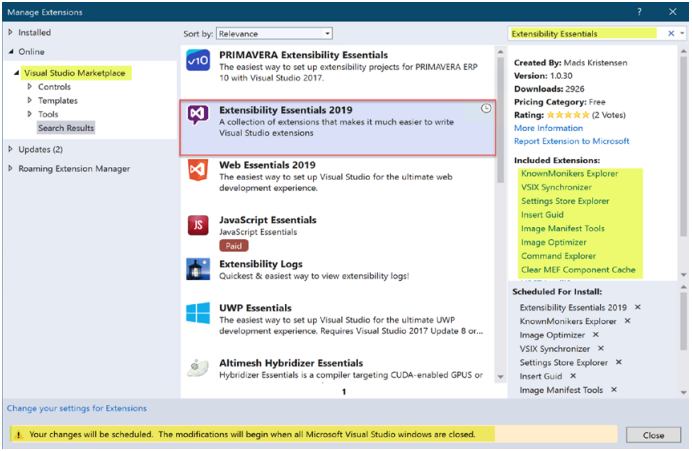

# 첫 번째 확장 개발
지난 몇 장에서 Visual Studio 확장을 구축하는 데 필요한 많은 이론, 개념 및 기본 사항을 살펴보았습니다. 이제 이 이론을 실천할 때입니다. 이 장에서는 몇 가지 의미 있고 유용한 실제 Visual Studio 확장을 단계별로 개발할 것입니다. 이 과정에서 Visual Studio Marketplace로 제공되거나 더 많은 사람들과 공유할 수 있는 Visual Studio 확장을 개발하기 위한 핵심 기본 사항, 개념 및 요령도 배우게 됩니다.

***
## 1) VS 확장 프로그램 개발을 지원하는 확장 프로그램
지난 장에서 Visual Studio에 사용자 지정 명령을 추가하려면 vsct 파일을 수정해야 한다는 것을 발견했습니다. 기본적으로 Visual Studio 2019에는 vsct 파일 편집에 대한 IntelliSense 지원이 없으므로 빠르고 정확하게 편집하는 데 몇 가지 문제가 있습니다. 마찬가지로 확장 기능을 개발하는 동안 Visual Studio에 이미 있는 명령을 사용해야 할 수도 있지만 정확한 명령을 모릅니다. Visual Studio는 확장 작성자가 사용할 수 있는 수천 개의 이미지와 함께 제공됩니다. 그러나 우리는 확장 기능에서 시각화하고 사용하는 방법을 모릅니다. 고맙게도 Mads Kristensen은 이러한 문제에 대해 생각하고 Visual Studio 확장 작성자가 확장 개발 경험을 더 빠르고 쉽고 빠르게 만들기 위해 사용할 수 있는 Extensibility Essentials 2019라는 확장 팩을 개발했습니다. 이 확장 팩에는 겉보기에 어려운 작업을 쉽게 수행할 수 있는 확장 기능 모음이 포함되어 있습니다. 이 장을 작성하는 현재 이 확장 팩에는 다음 확장이 포함되어 있습니다.

* MEF 구성 요소 캐시 정리 - 캐시 손상 문제를 해결하기 위해 Visual Studio MEF(Managed Extensibility Framework) 구성 요소 캐시를 지웁니다.
* 명령 탐색기 - 확장 작성자가 원하는 위치에 명령/버튼을 배치할 수 있도록 모든 명령, 그룹 및 메뉴를 탐색할 수 있는 도구 창을 제공합니다.
* 확장성 로그 - 확장성 로그를 보는 가장 빠르고 쉬운 방법입니다.
* 이미지 매니페스트 도구 - Visual Studio 확장에 대한 .image 매니페스트 파일을 더 쉽게 만들고 유지 관리할 수 있습니다.
* Image Optimizer - 업계 표준 도구를 사용하여 JPEG, PNG 및 GIF - 애니메이션 GIF 포함. 손실 및 무손실 최적화를 모두 수행할 수 있습니다.
* GUID 삽입 - 편집기 및 입력 필드에 새 GUID를 매우 쉽게 삽입할 수 있습니다.
* 알려진 모니커스 탐색기 - Visual Studio 확장 작성자가 KnownMonikers 이미지 컬렉션을 탐색할 수 있는 도구 창입니다.
* Pkgdef 언어 - .pkgdef 및 pkgundef 파일.
* 설정 저장소 탐색기 - VS 설정 저장소의 내용을 보고 편집하기 위한 도구 창입니다.
* VSCT IntelliSense - Visual Studio 확장 작성자가 사용하는 .vsct 파일에 대한 IntelliSense를 제공합니다.
* VSIX 동기화 프로그램 - 관리 코드에서 .vsixmanfest 및 .vsct 파일에 대한 코드 숨김 파일을 생성하여 나머지 확장 프로그램에서 정보를 쉽게 사용할 수 있도록 하는 기능을 제공합니다.

이러한 각 확장에 대한 세부 정보는 Visual Studio Marketplace 사이트(https://marketplace.visualstudio.com/) 의 해당 확장 페이지에서 읽을 수 있습니다.  
또 뭔데? Mads는 이 팩에 있는 각 확장의 GitHub URL을 공유했습니다. 이것은 확장의 프로젝트 세부 정보 섹션에서 볼 수 있으므로 호기심 많은 독자는 이러한 각 확장이 마법을 어떻게 쓰는지 정확히 알 수 있습니다. Visual Studio 2019 확장 개발을 시작하기 전에 독자에게 이 확장 팩을 설치하는 것이 좋습니다. 확장은 Visual Studio Marketplace(https://marketplace.visualstudio.com/items?itemName=MadsKristensen.ExtensibilityEssentials2019)에서 다운로드한 다음 설치할 수 있습니다. 또는 Visual Studio 상위 메뉴 확장 ➤ 확장 관리로 이동할 수 있습니다. 그런 다음 그림 4-1과 같이 Extensibility Essentials 2019를 검색합니다.

   
그림 4-01 Visual Studio 유저 인터페이스

확장팩이 나타나면 다운로드를 클릭합니다. Visual Studio가 닫히면 확장 팩이 설치를 시작합니다. 이 확장 팩이 설치되면 확장 코딩을 시작할 준비가 되었습니다. 이 장에서 개발할 첫 번째 확장은 코드/텍스트 검색을 수행합니다.

## 2) 검색을 수행하는 Visual Studio 확장
많은 경우 새 코드를 작성하거나 기존 코드를 검토/수정하는 동안 확실하지 않은 주석, 키워드, 유형 또는 API를 발견하고 인터넷에서 더 자세히 살펴보고 싶어합니다. 따라서 지식 탐색에서 일반적으로 전체 텍스트/코드 조각을 복사하고 선택한 브라우저를 열고 선호하는 검색 엔진(예: Bing)으로 이동한 다음 복사된 콘텐츠를 검색합니다. 우리는 결과를 보고 검색 결과에서 가장 관련성이 높은 링크를 읽은 다음 작업을 재개합니다.
일반적으로 괜찮지만 Visual Studio에서 브라우저로 컨텍스트 전환을 수행해야 합니다. 브라우저로 전환하면 Pandora의 상자가 열립니다. 즉, 검색 엔진을 탐색하는 동안 흥미로운 뉴스나 광고를 발견하면 검색에서 벗어나 인터넷에서 예상보다 더 많은 시간을 보낼 수 있습니다.
외부 브라우저를 열지 않고도 Visual Studio에서 직접 콘텐츠를 검색하고 결과를 볼 수 있다면 좋지 않을까요? 이것이 바로 우리가 새로운 확장으로 할 일입니다.

이 섹션에서는 Bing, Google, Microsoft Docs, stackOverflow 등과 같은 검색 엔진에서 Visual Studio의 코드 편집기에 작성된 코드/텍스트를 검색하고 결과를 표시하는 데 도움이 되는 Visual Studio 확장을 개발할 것입니다. 비주얼 스튜디오 브라우저. 이 확장의 목적은 파일 전송을 통해 또는 시장에 업로드하여 다른 사용자에게 제공할 수 있는 확장을 만드는 단계별 절차를 보여 주는 것입니다. 그림 4-2와 같이 코드 창에서 선택한 텍스트를 검색하는 컨텍스트 메뉴 명령이 있는 확장을 상상합니다.

   
그림 4-02 Search 명령어

이 확장 기능을 개발하는 것 외에도 다음을 배우게 됩니다.
* 내 확장에서 Visual Studio에 의해 이미 노출된 서비스/API를 어떻게 사용합니까?
* 사용자 지정 명령에 아이콘을 추가하려면 어떻게 합니까?
* 사용자 지정 명령에 키보드 단축키를 할당하려면 어떻게 합니까?
* 내 확장의 옵션을 어떻게 사용합니까?
* Visual Studio 자동화 모델을 이해하는 방법을 배우려면 어떻게 해야 합니까?

시작하겠습니다.

- ### a. 확장 시작하기
    이것이 우리의 첫 번째 실제 확장이기 때문에 각 단계에 대한 근거와 접근 방식을 이해할 수 있도록 단계를 자세히 논의합니다. 이 확장을 만드는 단계는 다음과 같습니다.

    - **1.새 프로젝트 생성**  
        Visual Studio 2019에서 새 VSIX 프로젝트를 만듭니다. 이름을 "ExternalSearch"로 지정하겠습니다. 이는 그림 4-3에 나와 있습니다.

           
        그림 4-03 새 프로젝트 생성

    - **2. vsixmanifest 수정**  
        무엇보다도 새로운 확장에 대한 의미 있는 메타데이터 정보를 제공하여 vsixmanifest 파일을 업데이트하겠습니다. 솔루션 탐색기에서 source.extension.vsixmanifest 파일을 두 번 클릭하면 멋진 편집 창이 열립니다. vsixmanifest에서 지정하는 설명, 이름, 아이콘 등은 확장 프로그램 브랜딩을 담당하므로 확장 프로그램에 전문적인 터치를 제공하고 이러한 값이 항상 업데이트되도록 합니다. 설명 텍스트는 새 사용자에게 확장 프로그램을 설명해야 하므로 확장 프로그램이 하는 일을 적절하고 정확하고 명확하게 설명해야 합니다. 우리는 2장의 앞부분에서 vsixmanifest 파일에 대해 간략하게 논의했으므로 각 필드에 대해 자세히 다루지는 않을 것입니다. 그러나 요점은 이 파일이 확장의 브랜딩에 직접적인 영향을 미치므로 항상 업데이트되어야 한다는 것입니다. 다음은 이 파일을 업데이트하기 위한 몇 가지 지침입니다.

        - **a. Manifest정보**  
            작성자 및 버전이 미리 채워져 있습니다. 그러나 확장에 대한 업데이트를 릴리스할 때마다 이 버전 번호가 증가하는지 확인하십시오(예: 1.1, 1.2 등). 여기에는 여러 가지 이유가 있습니다. 첫째, 이전 버전의 확장이 설치된 경우 제거하지 않고 사용자가 확장을 업데이트할 수 있습니다. 그렇지 않으면 VSIX 설치 프로그램에서 확장이 이미 설치되어 있다고 불평합니다. Visual Studio Marketplace에서 확장을 공유한 경우 새 기능이 포함된 업데이트된 버전을 업로드할 때 관리되는 확장의 기본 아키텍처는 업데이트 설정에 따라 마켓플레이스에서 새 버전의 확장을 사용할 수 있음을 식별합니다. , 알림이 표시되거나 확장 프로그램이 자동으로 업데이트됩니다. 모든 사용자에 대해 설치된 확장은 자동 업데이트할 수 없으므로 자동 업데이트 설정이 없습니다. 확장 프로그램 관리 창에서 확장 프로그램의 업데이트 설정은 그림 4-4와 같습니다.

               
            그림 4-04 확장 자동 업데이트
            
        - **b. Manifest정보**              
            확장을 제공하거나 공유할 계획이라면 프로젝트에 서식 있는 텍스트 파일(.rtf) 또는 텍스트 파일을 추가한 다음 매니페스트의 라이선스 섹션에서 찾아 라이선스 정보를 포함할 수 있습니다. 이 책에서는 라이선스에 대해 논의하지 않지만 다양한 유형의 라이선스와 그 범위를 이해하는 것이 좋습니다.

        - **c. Manifest정보**                          
            확장의 아이콘 및 미리 보기 이미지를 제공하기 위해 고유한 이미지를 사용하거나 Visual Studio와 함께 제공되는 이미지 모니커를 사용할 수 있습니다. Visual Studio와 함께 제공되는 이미지를 사용하려면 알려진 모니커스 탐색기 확장이 큰 도움이 될 수 있으므로 Extensibility Essentials 2019 확장 팩의 일부로 이미 설치했습니다. 이 확장을 사용하려면 Visual Studio의 기본 메뉴로 이동한 다음 보기 ➤ 기타 Windows ➤ KnownMonikers Explorer로 이동합니다. 그러면 우리가 사용할 수 있는 알려진 모든 이미지 모니커를 나열하는 도구 창이 열립니다. 확장에 사용할 이미지를 선택하십시오. 이 확장 프로그램에서 검색할 것이기 때문에 검색을 나타내는 이미지를 사용합니다. 이는 그림 4-5에 나와 있습니다. 이미지를 마우스 오른쪽 버튼으로 클릭하면 이미지를 내보내는 기능을 제공하는 컨텍스트 메뉴가 나타납니다. 여기에서 이미지를 내보내고 해당 이미지를 아이콘에 사용하고 vsix 매니페스트 파일의 미리보기 이미지를 사용할 수 있습니다.

               
            그림 4-05 모니커 탐색기
            
        - **d. Manifest정보** 
            태그, 릴리스 정보, 시작 안내서 등과 같은 다른 필드는 간단하며 필요에 따라 업데이트할 수 있습니다. 이러한 세부 정보를 입력한 후 vsixmanifest는 그림 4-6에 표시된 것과 같습니다.

               
            그림 4-06 업데이트된 vsixmanifest

            