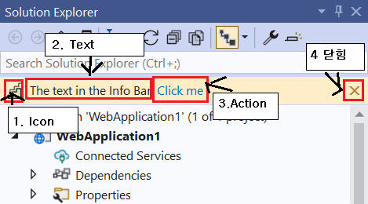

# 리얼월드 확장 개발
이번 장에서는 인포바(정보 표시줄)을 표시하고 사용자 정의 코드를 생성하기 위한 새로운 확장 세트를 개발할 것입니다. 이러한 확장을 개발하는 동안 우리는 지식을 발전시키고 Visual Studio의 새로운 측면과 개념을 배울 것입니다.
지난 장에서 우리는 ToolWindowPane 클래스가 인포바 API를 노출하는 것을 보았다. 그러기에 이러한 API를 사용하여 정보 표시줄을 표시하는 방법을 살펴보다.
***
## <font color='dodgerblue' size="6">1) 인포바 표시위한 비주얼 스튜디오 확장기능</font>
정보 표시줄은 Visual Studio에서 실행 가능한 알림 및 경고를 표시하는 데 사용하는 여러 방법 중 하나입니다. 정보 표시줄은 문서 창이나 도구 창에 배치할 수 있으므로 중요한 상황별 알림을 관심 영역에 더 가깝게 표시해야 하는 시나리오에서는 정보 표시줄을 사용하는 것이 좋습니다. Visual Studio 설명서에서는 Visual Studio에서 제공하는 기타 알림 및 경고 메커니즘에 대해 자세히 논의하는 것 외에도 정보 표시줄의 사용 시나리오, 해야 할 일과 하지 말아야 할 일에 대해 설명합니다.

https://docs.microsoft.com/enus/visualstudio/extensibility/ux-guidelines/notifications-and-progress-forvisual-studio?view=vs-2019#BKMK_Infobars 참조.

구현할 인포바의 핵심기능.
**가능한 시나리오**  
    - 중요한 개념적 논블로킹 메시지들 표시하기
    - 감지된 문제에 대해 사용자에게 경고하기 위해 확장 또는 성능 문제를 일으키는 확장에서 충돌이 발생합니다.
    - 탭과 공백이 혼합된 편집기가 감지한 파일과 같은 시나리오에서 사용자가 쉽게 작업할 수 있는 방법을 제시.
    - UI가 기록 디버깅과 같은 상호작용에 영향을 미치는 특정 상태에 있음을 사용자에게 알리기 위해.

```
해야 할것                                                       하지 말아야 할 것
--------------------------------------------------------------  -------------------------------------------------------------------------------
Infobar 메시지가 짧고 요점을 명확하게 전달하는지 확인.          툴바에 위치해야만 하는 표준 명령어를 제공하기 위해 인포바 사용
텍스트 링크와 버튼은 간결하고 명확하게 작성하세요.              모달 다이얼로그의 위치에 인포바 사용
사용자에게 최소의 정말 필요한 액션만 표시하기 위해 제공된       윈도우 밖으로 플로팅 메시지 만들기
액션만 유지하기
                                                                같은 창의 여러 위치에 다중 인포바 사용
```
    표 5-1. 해야할것과 하지 말야할 것들

       
    그림 5-01 인포바와 섹션

- ### A. 인포바 확장기능 시작하기

- ### B. 인포바 표시하기
    - **1. 인포바 디스플레이 클래스 작성하기**  
    - **2. 이벤트 핸들러 수정하기**  
- ### C. 확장기능 실행하기

## <font color='dodgerblue' size="6">2) 코드 생성을 위한 비주얼 스튜디오 확장기능</font>

- ### A. 코드 생성 확장기능 시작하기

- ### B. 코드 생성
    - **1. 코드 생성 클래스 만들기**  
    - **2. Command 클래스 업데이트**  

- ### C. 확장기능 실행하기

## <font color='dodgerblue' size="6">3) 요약</font>

## <font color='dodgerblue' size="6">4) Class Reference</font>        
- ### A. Infobar Type System
    - **1. IVsInfoBarHost**  
        정보 표시줄을 배치하는 방법을 알고 있는 호스트 컨트롤을 정의합니다. 이것은 일반적으로 도구 창 또는 정보 표시줄을 호스팅하는 Visual Studio의 기본 창입니다. 다음 메소드를 노출합니다.

        ```
        메쏘드 이름             설명
        ----------------------  -----------------------------------------------------------------------------------------
        AddInfoBar              이 메서드는 호스트가 표시할 정보 표시줄을 추가합니다. 정보 표시줄은 호스트에 추가된
                                순서대로 표시됩니다. 
                                이 메소드는 IVsInfoBarUIElement가 파생되는 매개변수로 IVsUIElement를 사용합니다.
        RemoveInfoBar           정보 표시줄 호스트 컨트롤에서 정보 표시줄을 제거한다. 이 메서드는 IVsUIElement도 매개변수로 사용.
        ```

    - **2. IVsInfoBarUIElement**  
        이름에서 알 수 있듯이 이 유형은 InfoBar의 UI 요소를 정의한다. IVsInfoBarUIElement에 의해 노출되는 메서드는 다음과 같음.

        ```
        메쏘드 이름             설명
        ----------------------  -----------------------------------------------------------------------------------------
        AddInfoBar              이 메서드는 호스트가 표시할 정보 표시줄을 추가합니다. 정보 표시줄은 호스트에 추가된
                                순서대로 표시됩니다. 
                                이 메소드는 IVsInfoBarUIElement가 파생되는 매개변수로 IVsUIElement를 사용합니다.
        RemoveInfoBar           정보 표시줄 호스트 컨트롤에서 정보 표시줄을 제거한다. 이 메서드는 IVsUIElement도 매개변수로 사용.
        ```

    - **3. IVsInfoBarUIFactory**  

    - **4. IVsInfoBar**  

    - **5. InfoBarModel**  

    - **6. IVsInfoBarUIEvents**  

    - **7. IVsInfoBarTextSpan**  

    - **8. IVsInfoBarActionItem**  

    - **9. IVsInfoBarActionItemCollection**  

    - **10. IVsInfoBarTextSpanCollection**  


- ### B. Code Generation Types
    - **1. BaseCodeGenerator**  

        ```
        프로퍼티 이름             설명
        ----------------------  -----------------------------------------------------------------------------------------
        FileNamespace           파일의 네임스페이스를 가져온다.
        InputFilePath           입력 파일의 파일 경로를 가져온다.
        ```

        ```
        메쏘드 이름             설명
        ----------------------  -----------------------------------------------------------------------------------------
        GenerateCode            입력파일에서 코드생성 작업을 수행
        GenerateErrorCallback   이 메서드는 코드 생성 시 오류가 발생하는 경우 쉘 콜백 메커니즘을 통해 오류를 전달합니다.
        GetDefaultExtension     이 메서드는 이 코드 생성기에서 생성된 출력 파일의 기본 확장자를 가져옵니다.
        ```    

    - **2. BaseCodeGeneratorWithSite**  

    - **3. ProvideCodeGeneratorAttribute**  

    - **4. ProvideCodeGeneratorExtensionAttribute**

    - **5. ProvideCodeGeneratorExtensionAttribute**
        