# 비주얼 스튜디오 편집기용 리얼월드 확장 개발
지금까지는 개발자가 가장 자주 사용하는 Visual Studio의 핵심 부분인 코드 편집기를 확장하지 않았습니다. Visual Studio 편집기는 다양한 확장 지점 집합을 제공하며 대부분의 부분은 MEF(Managed Extensibility Framework)를 통해 확장할 수 있습니다. 사실, 편집기가 노출한 확장성 포인트가 너무 많아서 각각을 자세히 다루려면 책 한 권이 필요합니다. 다행스럽게도 Microsoft는 이미 이러한 확장성 지점과 기능을 매우 깊이 있게 문서화했습니다. 이 장에서는 Visual Studio 편집기의 확장성 포인트에 대해 논의하고 코드 분석, 수정 및 리팩토링을 위한 확장을 개발합니다. Visual Studio 편집기 확장을 시작하기 전에 편집기, 해당 하위 시스템, 기능 및 확장성 지점을 이해하는 것이 중요합니다. 다음 섹션에서는 편집기에 대해 논의한 다음 확장에 대해 자세히 설명합니다.

***

## 1) 비주얼 스튜디오 에디터
Visual Studio 편집기는 아마도 Visual Studio에서 가장 자주 사용되는 구성 요소일 것입니다. 여기에서 개발자가 지원되는 언어 중 하나로 코드를 작성, 보기, 편집 및 디버그할 수 있습니다. 그림 6-1은 C# 언어용 Visual Studio 편집기와 그 여러 부분을 보여줍니다. 다른 부품에는 쉽게 참조하고 식별할 수 있도록 번호가 매겨져 있습니다. 번호가 매겨진 항목은 다음에 논의됩니다. 그것들은 다음과 같습니다:

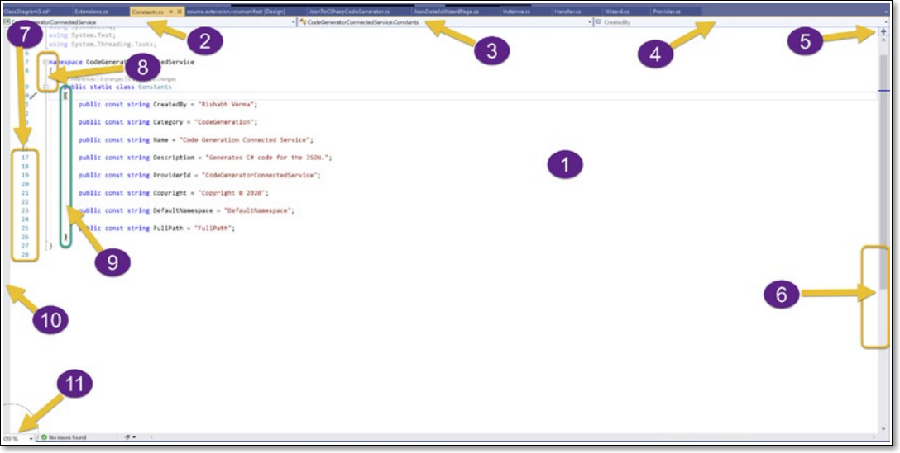   
그림 6-01 Visual Studio 코드 편집기

  - **1. 코드 편집기**  
    문서가 편집되고 표시되는 핵심 편집기 영역입니다. IntelliSense의 핵심 기능도 이 지역에서 등장합니다. 이 영역을 마우스 오른쪽 버튼으로 클릭하면 이전 장에서 이미 보고 논의한 컨텍스트 메뉴가 표시됩니다.

  - **2. 프로젝트 드랍다운**  
    이 드롭다운은 파일이 열려 있는 활성 프로젝트를 표시합니다. Visual Studio에서 고아 파일을 열면 이 드롭다운에 기타 파일이 표시됩니다.

  - **3. 타입 드랍다운**  
    이 드롭다운에는 활성 문서에 정의된 모든 유형이 나열됩니다. 이 드롭다운은 선택한 값을 편집 중이거나 활성화된 유형, 즉 커서가 있는 위치로 표시합니다.

  - **4. 멤버 드랍다운**  
    선택또는 활성 타입의 모든 멤버(생성자, 필드, 속성, 메쏘드)가 나열.

  - **5. 윈도우 분할**  
        코드 편집기 창을 분할하기 위해.

  - **6. 스크롤바**  
        코드 창의 특정 섹션으로 쉽게 이동하고 창의 섹션을 보기 위해 사용합니다. 그림 6-1은 수직 스크롤바를 보여줍니다. 코드에 따라 편집기 하단에 가로 스크롤 막대가 표시될 수도 있습니다.

  - **7. 줄 번호**  
        파일에서 줄번호 표시

  - **8. 선택 마진**  
        이것은 라인 번호와 아웃라인 표시기 사이의 위치입니다. 코드를 수정할 때 해당 행은 코드 편집기의 왼쪽에 있는 색상으로 강조 표시됩니다. 선택 여백은 코드 변경 사항을 표시하는 데 사용되며 클릭 한 번으로 전체 코드 줄을 선택할 수 있습니다.

  - **9. 중괄호 완성**  
        편집기는 중괄호 완성 기능을 제공하고 해당 개구부를 강조 표시합니다.

  - **10. 표시기 여백**  
        이것은 편집기의 왼쪽에 있는 얇은 회색 영역입니다. 코드 줄에 대해 중단점과 책갈피가 표시되는 영역입니다.

  - **11. 확대 레벨**  
        이것은 코드 편집기를 확대하거나 축소하여 편집기에서 더 크거나 작은 글꼴 크기를 보는 데 사용할 수 있습니다.

이제 우리는 Visual Studio 편집기의 높은 수준의 개요를 보았습니다. 이제 편집기의 하위 시스템에 대해 논의할 시간입니다.

***

- ### A. 에디터 서브시스템
    Visual Studio 편집기는 사용자 인터페이스 계층과 편집기에 바인딩된 데이터(텍스트) 계층, 그리고 양쪽 계층을 분리해서 처리하는 다양한 모듈 또는 하위 시스템으로 구성되어진다.  
    그림 6-2는 Visual Studio 편집기의 상위 수준 하위 시스템 4개를 보여주고 있다. 당신이 웹개발을 해보았다면 MVC(모델 보기 컨트롤러) 디자인 패턴과 유사하게 생각하면 이러한 하위 시스템들을 쉽게 기억할 수 있다. 일반적으로 4개의 하위 시스템이 있다.

    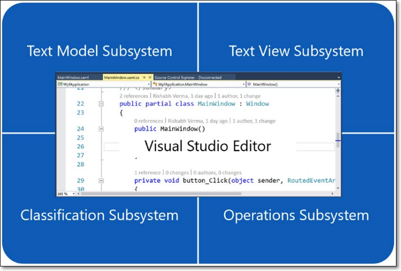   
    그림 6-02 Visual Studio 코드 편집기

    - **1. 텍스트 모델 서브시스템**  
        편집기에 표시할 데이터 모델을 나타낸다. 이 서브시스템은 편집기에 표시될 텍스트의 조작 및 투영을 담당한다. 이 하위 시스템은 다음 기능에 대한 유형을 제공한다.

        - 텍스트를 파일과 연결하고 파일 시스템에서 파일 읽기 및 쓰기를 관리하는 서비스.
        - 두 개체 시퀀스 간의 차이를 최소한의 차이을 찾는 차이점 서비스.
        - 여러 텍스트 버퍼의 텍스트를 결합하는 방법을 제공하는 프로젝션 시스템.
    
        그림 6-3은 이전 기능을 설명하는 유형이 포함된 네임스페이스를 보여줍니다.

        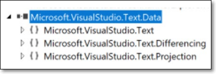   
        그림 6-03 텍스트, 차이점, 프로젝션

        그림 6-3에서 우리가 참조하는 모든 클래스가 Microsoft.VisualStudio.Text.Data.dll에 있다는 것을 알 수 있다. 위에서 논의한 측면을 처리하는 세 가지 다른 네임스페이스가 있다. 이러한 네임스페이스를 확장하면 여러 유형이 포함되어 있음을 알 수 있다. 각각에 대해 논의하는 것은 이 책의 범위를 벗어난다.  
        
        Microsoft.VisualStudio.Text 네임스페이스에서 볼 수 있는 몇 가지 중요한 유형은 ITextChange, ITextChange2, ITextChange3, ITextEdit, ITextVersion, ITextVersion2, ITextSnapshot, IUndoEditTag, IDeletedTag 및 ITextBuffer 등이 있는데 텍스트 데이터를 조작, 정렬, 추적하는 메쏘드들을 보유한다. 그림 6-4는 텍스트 모델 하위 시스템을 구성하는 몇 가지 클래스를 보여준다.

        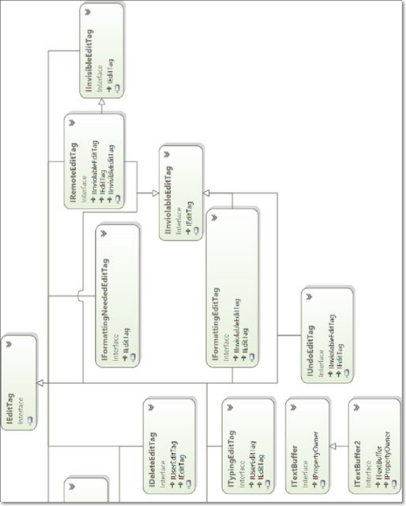
        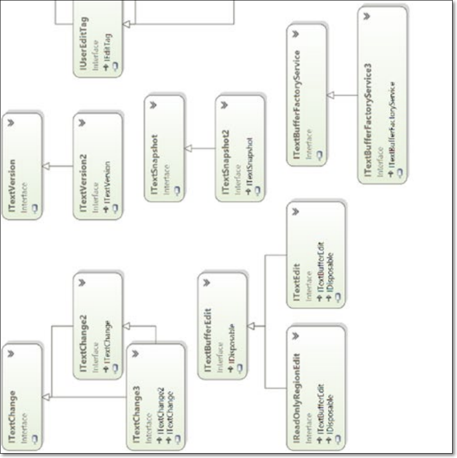   
        
        이 장의 끝에 있는 "클래스 참조" 섹션은 텍스트 모델 하위 시스템의 중요한 구성원에 대한 높은 수준의 개요를 제공한다.

        이러한 모든 유형은 .NET 프레임워크 기본 클래스 및 MEF에 따라 다르다. 마찬가지로, Differencing 및 Projection 네임스페이스에도 다양한 유형이 있지만 여기서는 자세히 다루지 않을 것이다. 그러나 필요할 경우에는 유형의 세부 사항을 살펴 볼 것이다.

        Visual Studio에서 파일로 작업할 경우 파일의 종류를 알고 있다. C# 코드 파일 또는 XML 파일, JSON 파일 또는 csproj 파일, vb 코드 파일 등이 될 수 있다. 이를 식별하는 한 가지 방법은 파일 확장자이다. 확장자를 보면 파일 형식을 식별할 수 있다. 그러나 확장성 관점에서 새로운 사용자 지정 파일 형식(예: .verma 파일)을 추가한 후 Visual Studio에서 이를 지원해야 한다면 이 파일 형식에 대한 C# IntelliSense 지원은 어떻게 할수 있을까?

        Visual Studio는 이러한 시나리오를 처리할 수 있는 ContentType이라는 것을 정의한다. 콘텐츠 유형은 텍스트, 코드, 데이터, 바이너리 등과 같은 다양한 유형의 콘텐츠를 정의하는 기술이다. 또는 C#, JSON, XML 등과 같은 기술 유형이다. 많은 편집기 기능과 확장성 지점이 콘텐츠 유형에 연결됩니다. 예를 들어 편집기에서 C# 파일을 열면 상단에 프로젝트, 유형 및 멤버에 대한 3개의 드롭다운이 표시되지만 JSON, XML 또는 텍스트 파일을 열면 사라진다. 마찬가지로 구문 강조 표시, 색상 지정 및 IntelliSense도 이러한 모든 파일 형식에 대해 다르다. 콘텐츠마다 다른 처리가 필요하고 콘텐츠 유형을 기반으로 이러한 확장 기능을 정의하여 처리하기 때문이다.

        "클래스 참조" 섹션에는 문서 URL과 함께 콘텐츠 유형을 구성하는 중요한 유형이 요약되어 있다.

    - **2. 텍스트 뷰 서브시스템**  
        이 하위 시스템은 편집기에서 텍스트의 서식을 지정하고 표시하는 역할을 한다. MVC 비유의 관점에서 보면 텍스트 뷰는 편집기의 프레젠테이션 계층을 구성하는 보기 부분이다. 편집기에서 볼 수 있는 것은 WPF(Windows Presentation Foundation) 엘리멘트뿐이다. 이것은 본질적으로 텍스트를 표시하는 편집기의 UI 하위 시스템이다. 이 하위 시스템의 형식은 Microsoft.VisualStudio.Text.UI.dll 및 Microsoft.VisualStudio.Text.UI.Wpf.dll에 존재한다. WPF로 끝나는 어셈블리 이름에는 WPF 요소가 포함되고 다른 하나에는 플랫폼 독립적 요소가 포함된다. 따라서 이 시스템의 유형은 WPF와 플랫폼 독립의 두 계층으로 나뉩니다. 그림 6-5는 텍스트 보기 하위 시스템의 네임스페이스를 보여줍니다.
        
        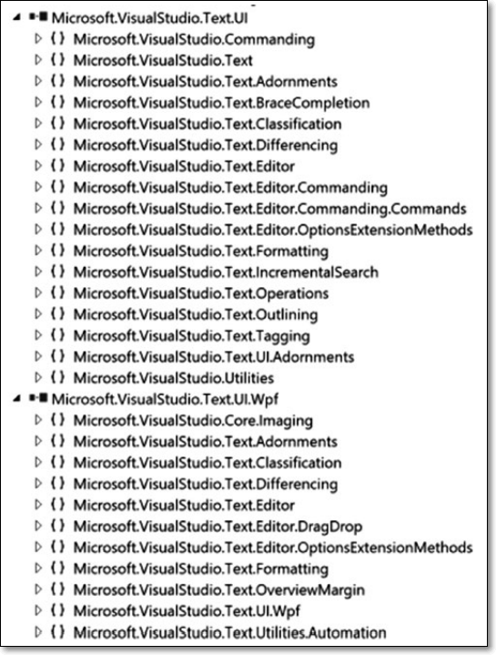   
        그림 6-05 텍스트뷰 서브시스템의 네임스페이스

        이 두 어셈블리 모두에서 몇 가지 네임스페이스가 공통인것에 주목하자. 하나는 플랫폼 독립적 구현을 포함하고 다른 하나는 WPF 특정 구현을 포함할 것으로 예상됩니다. 이 하위 시스템의 몇 가지 중요한 유형은 Microsoft.VisualStudio.Text.Editor 네임스페이스에 있는 ITextView 및 IWpfTextView이다. 또한 형식 지정, 삽입, 검색, 개요, 중괄호 완성, 태깅, 스크롤 등의 유형들이 있다. 
        
        "클래스 참조" 섹션에는 텍스트 보기 하위 시스템의 몇 가지 중요한 유형이 요약되어 있다.

    - **3. 분류(Classification) 서브시스템**  
        Visual Studio 편집기에서 C# 코드를 입력할 때 키워드, 주석, 기본 클래스, using 지시문 등을 서로 다른 색상을 할당하여 분리하는 훌륭한 작업을 수행한다. 이것은 텍스트를 다른 클래스로 분류하고 텍스트를 글꼴 속성에 매핑하는 편집기의 분류 서브 시스템때문에 가능한 것이다. 텍스트 범위에 마커를 추가하는 방법인 태깅 유형도 이 하위 시스템에서 정의된다. 이 하위 시스템의 유형은 그림 6-6과 같이 Microsoft.VisualStudio.Text.Logic.dll에 정의되어 있습니다.

        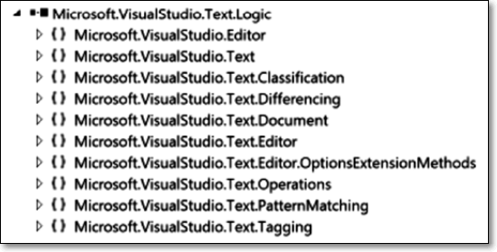   
        그림 6-06 분류 서브시스템의 타입들
        
        분류 하위 시스템의 정보는 뷰 하위 시스템에서 텍스트 형식을 지정하고 분류 형식에서 매핑된 글꼴로 표시하는 데 사용됩니다.

    - **4. operation 서브시스템**  
        이름에서 알 수 있듯이 이 하위 시스템은 모든 편집기 작업, 명령 및 동작을 담당한다. 이 하위 시스템의 유형은 여러 어셈블리에 정의되어 있으며 그 중 일부는 앞에서 본 것입니다. 
        
    
    다음 섹션에서 편집기 기능과 확장성 포인트에 대해 논의해 보겠습니다.

- ### B. 에디터 기능들
    Visual Studio 편집기는 매우 풍부하고 다양한 기능을 제공합니다. 편집기 기능은 확장 가능하도록 훌륭하게 설계되었습니다. 이를 위해 각 기능에는 추상화 및 구현이 있습니다. 몇 가지 중요한 기능과 간략한 논의가 다음에 요약되어 있습니다.

    - **1. Tags**  
        텍스트 범위에 태그를 지정하거나 표시하는 데 사용됩니다. 태깅은 텍스트에 강조 표시, 색상 지정, 개요 또는 밑줄을 긋거나 그래픽 또는 팝업을 표시하여 시각적으로 표시됩니다. 예를 들어 구문 강조 표시는 분류자를 통해 수행되므로 일종의 태그입니다. 태깅을 사용하여 컴파일 오류와 같은 오류를 표시할 수도 있습니다. 태그 지정에 사용되는 몇 가지 유형은 다음과 같습니다.

        - **TextMarkerTag**
          텍스트 하이라이팅 용도 
        - **OutliningRegionText**
          아웃라인 표시 
        - **ErrorTag**
          에러 표시용. 편집기의 많은 기능들이 태그에 기반. 그림 6-7은 강조된 구불구불 에러 태그 표시

        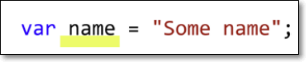   
        그림 6-07 에러 태그 작동

    - **2. 분류기(Classifier)**  
        분류기는 이름에서 알 수 있듯이 텍스트를 카테고리하거나 분류합니다. 분류기는 여러 분류 또는 범주가 있을 수 있으므로 IClassifier 인터페이스를 구현하여 콘텐츠 유형에 대해 정의됩니다. 그것들은 IClassificationType 인터페이스에 의해 정의됩니다. 분류기는 코드 텍스트를 주석, 키워드 또는 식별자로 분류할 수 있습니다.
        영어 알파벳을 모음, 자음 등으로 분류합니다. 분류기 형태의 인스턴스를 classification(분류)라고 한다. 그런 다음 다음 역할을 하는 분류기 집계기가 있습니다.
        분류기는 텍스트를 분류 세트로 나눕니다. 편집기의 텍스트 형식은 텍스트 분류를 기반으로 합니다. 텍스트는 키워드, 리터럴, 주석, 식별자 등으로 분류되며, 텍스트 보기 하위 시스템은 분류에 따라 텍스트의 서식을 지정하고 강조 표시하고 색상을 지정합니다. 그림 6-8은 C# 코드의 다른 부분을 표시하는 데 사용되는 다양한 색상을 보여줍니다. 이것은 분류를 통해 발생합니다.

        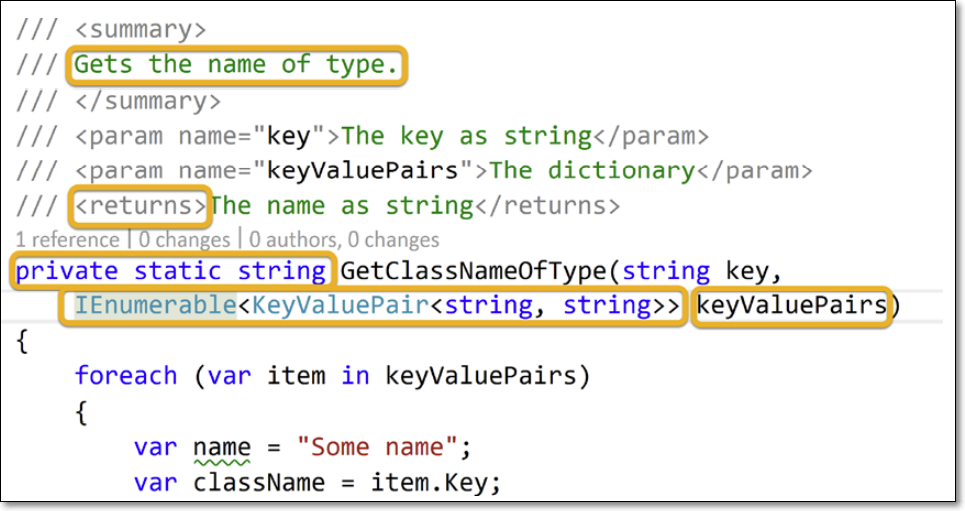   
        그림 6-08 다른 분류와 다른 색깔

    - **3. Adornments**  
        장식이라는 단어의 문자적 의미는 꾸미기 또는 장식입니다. 마찬가지로 Visual Studio 편집기의 컨텍스트에서 텍스트의 글꼴 및 색상을 제외한 모든 텍스트 장식 또는 그래픽을 장식이라고 합니다. 오류 및 경고에 대한 코드 조각의 빨간색과 녹색 물결선은 장식의 좋은 예입니다. 툴팁은 또 다른 장식품입니다. WPF 기반의 편집기 UI에 표시되기 때문에 모든장식은 UIElement에서 파생되고 ITag를 구현해야 합니다. 그림 6-9는 편집기에서 string 키워드 위로 마우스를 가져갈 때 string에 대한 도구 설명 장식을 보여줍니다.

        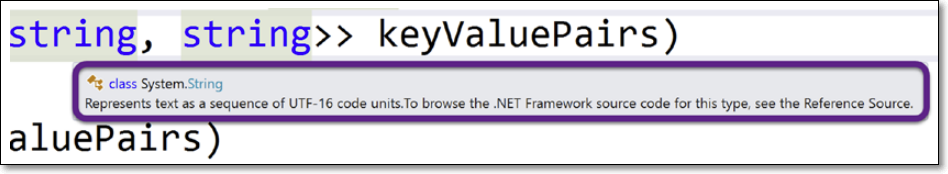   
        그림 6-09 툴팁 꾸미기

    - **4. Projection**  
        투영은 여러 텍스트 버퍼의 텍스트를 결합하고 다른 텍스트 버퍼를 구성하는 기술입니다. 따라서 투영을 사용하여 다른 버퍼의 텍스트를 결합하여 버퍼의 전체 텍스트를 표시하거나 텍스트의 일부만 표시하고 다른 부분은 숨길 수 있습니다. Visual Studio 편집기의 개요 기능을 사용할 때 코드 섹션을 축소하거나 확장할 수 있습니다. 이것은 텍스트 버퍼의 투영에 의해 달성됩니다. 그림 6-10은 투영을 통해 내부적으로 수행되는 축소된 코드 조각을 보여줍니다.

        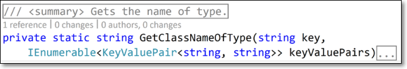   
        그림 6-10 코드 블록 축소
        
    - **5. 윤곽선(Outlining)**  
        이것은 편집기의 알려진 기능입니다. 편집기에서 코드 블록의 섹션을 확장하거나 축소할 수 있습니다. 아웃라이닝은 장식품과 마찬가지로 일종의 태그로 정의됩니다. OutliningRegionTag는 확장하거나 축소할 수 있는 텍스트 영역을 정의합니다. IOutliningManagerService 유형은 Visual Studio 편집기에서 코드 섹션을 확장하거나 축소하기 위해 ICollapsible 개체가 나타내는 다양한 텍스트 블록을 열거, 확장 또는 축소할 수 있는 IOutliningManager를 제공합니다. 이는 그림 6-11에 나와 있습니다. 강조 표시된 부분은 접을 수 있는 윤곽선입니다.
        
        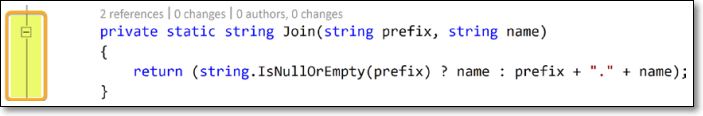   
        그림 6-11 비주얼 스튜디오 편집기에서 아웃라이닝

    - **6. Operations**  
        이름에서 알 수 있듯이 이것은 편집기의 상호 작용을 자동화하는 데 사용됩니다. 이전 버전의 Visual Studio는 편집기를 포함하여 Visual Studio에서 반복적인 작업을 자동화하는 데 선호되는 방식이었던 매크로를 지원했었다. 편집기와의 상호 작용을 자동화하기 위해 먼저 IEditorOperationsFactoryService를 가져와 텍스트 뷰의 작업에 액세스합니다. 그런 다음 이 개체를 사용하여 선택 항목을 수정하거나 필요에 따라 스크롤 막대 위치 등을 변경할 수 있습니다. 그림 6-12는 스크롤바, 분할 창, 캐럿 및 도구 설명이 작동하는 모습을 보여줍니다.

        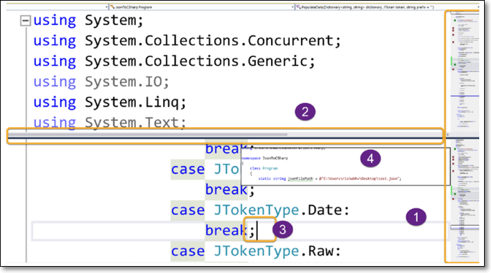   
        그림 6-12 스크롤바, 스플릿 윈도우, 카렛, 툴팁이 작동중(번호 순으로)

    - **7. IntelliSense**  
        Visual Studio 편집기에서 가장 많이 사용되는 기능을 살펴보면 IntelliSense가 확실히 상위권에 포함될 것입니다. 기본적으로 명령문 완성, 서명 도움말, 빠른 정보 및 전구 스타일 리팩토링을 지원하는 편집기의 상황에 맞는 지능형 센스쟁이이다. 명령문 완성 기능은 컨텍스트에서 적용 가능한 메서드 이름, API 또는 기타 마크업 요소에 대한 가능한 완성 목록을 제공합니다. IntelliSense는 사용자가 마침표(.) 또는 (Ctrl .)를 입력할 때 호출되며, 이는 잠재적인 완료 목록을 표시하는 완료 세션을 시작합니다. 사용자는 그 중 하나를 선택하거나 목록을 모두 닫을 수 있습니다. ICompletionBroker 유형은 지정된 세션에 대해 ICompletionSource 유형으로 계산된 CompletionSet 유형에 포함된 항목의 가능한 목록을 표시하는 ICompletionSession을 만들고 트리거하는 역할을 합니다. 그림 6-13은 자동 완성을 보여줍니다.
        
        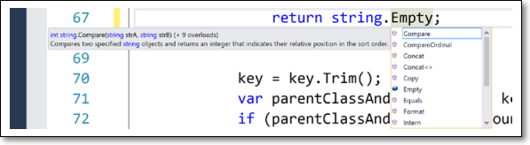   
        그림 6-13 자동완성

        그림 6-14는 Visual Studio의 전구 스타일 리팩토링을 보여줍니다. 이 장의 뒷부분에서 이러한 기능을 모두 구현하는 방법을 배웁니다.

        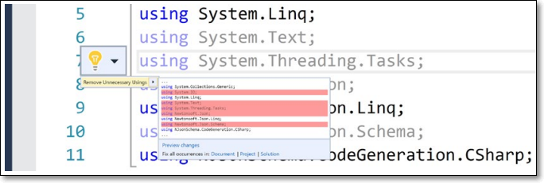   
        그림 6-14 밝은 전구 형태의 리팩토링

        이러한 모든 기능과 그 이상은 온라인 Visual Studio 편집기 설명서에 매우 잘 설명되어 있으며 독자들이 시간을 할애하여 https에서 자세한 설명서를 읽을 것을 적극 권장합니다.  
        
        https://docs.microsoft.com/en-us/visualstudio/extensibility/inside-the-editor?view=vs-2019.

    다음으로 Visual Studio 편집기에서 제공하는 다양한 확장성 지점을 살펴보겠습니다.

## 2) 에디터 확장성
Visual Studio 편집기는 확장성이 뛰어나며 편집기를 MEF(Managed Extensibility Framework) 구성 요소 부분으로 확장하는 데 사용할 수 있는 확장 지점을 제공합니다. 지난 섹션에서 논의한 편집기 기능은 모두 확장 가능합니다. 이러한 기능 중 일부의 경우 Visual Studio 확장성 템플릿이 직접 항목 템플릿을 제공하는 반면, 일부 기능의 경우 수동으로 클래스를 추가하고 올바른 인터페이스 및 클래스에서 파생하여 사용자 지정 코딩을 수행해야 합니다. Visual Studio는 분류자, 여백, 장식 및 뷰포트 장식을 위한 확장성 항목 템플릿을 제공합니다. 이것은 확장성 프로젝트에 항목을 추가하고 그림 6-15와 같이 새 항목 추가 대화 상자의 왼쪽 패널에서 확장성 ➤ 편집기를 선택하면 볼 수 있습니다.

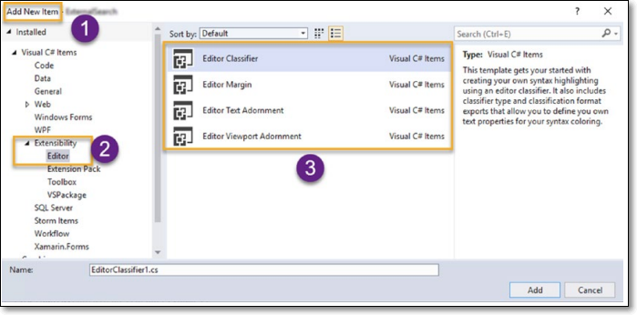   
그림 6-15 에디터 확장성 아이템 템플릿

이러한 항목 템플릿 중 하나를 선택한 다음 확장을 빌드 및 디버그/배포하면 편집기 기능 확장을 시연하는 작업 확장이 있습니다. 이러한 항목 템플릿을 추가하면 코드 파일 추가, 참조 추가, vsixmanifest에 MefComponent 유형의 자산 노드 추가 등과 같이 백그라운드에서 많은 작업을 수행합니다.
그러나 요구 사항에 따라 기능을 사용자 지정하려면 코드를 수정해야 하지만 기능을 확장하고 이러한 템플릿을 연결하는 방법을 확인하는 것만으로도 좋은 시작입니다. 모든 독자가 이러한 각 템플릿을 사용해 보고 MEF 내보내기 및 가져오기가 유형에 어떻게 장식되고 모든 것이 연결되는지 확인하도록 권장합니다. 이러한 기능 외에도 템플릿이 제공되지 않는 다른 기능이 많이 있습니다. 이러한 확장성 포인트 각각을 다루려면 책 자체가 필요하므로 이 책의 범위를 벗어납니다. 하지만 좋은 소식은 이러한 모든 기능을 확장하는 것이 매우 잘 문서화되어 있으며
편집기 기능을 확장하는 프로세스는 필요에 따라 제공됩니다. 독자들에게 언어 및 편집기 서비스 확장에 대한 다음 Visual Studio 문서를 읽을 것을 적극 권장합니다.

https://docs.microsoft.com/en-us/visualstudio/extensibility/language-service-and-editor-extension-points?view=vs-2019.

다음 섹션에서는 C# 편집기에서 라이브 코드 진단 분석기를 실행하고 위반 시 빨간색 물결선을 표시하고 코드 수정을 제안하는 확장을 개발합니다.

- ### A. 코드 교정기능이 있는 진단 분석기
    라이브 진단 분석기가 필요한 이유에 대한 질문이 떠오를 수 있습니다. Visual Studio에는 수많은 코드 분석 및 진단 분석기가 내장되어 있으므로 진단 분석기를 이미 알고 사용했을 수 있습니다. 이전 장에서 확장 프로그램을 개발하는 동안 그림 6-16과 같이 기본 UI 스레드에서 코드를 실행해야 할 때마다 코드 아래에 구불구불한 자국이 있음을 기억하십시오.
    
    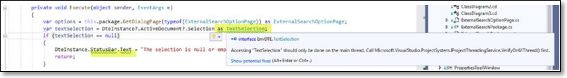   
    그림 6-16 작동중인 진단분석기

    이것은 이제 우리가 사용한 VSIX 프로젝트 템플릿에 기본적으로 제공되는 분석기를 통해 수행됩니다. 물결선 위로 마우스를 가져가면 도구 팁과 전구가 보입니다. 이것은 본질적으로 코드 수정입니다. 전구 옆에 있는 아래쪽 마커를 클릭하면 문제를 해결하기 위한 제안이 표시됩니다. 제안을 클릭하면 문제가 해결됩니다. 제안은 또한 그림 6-17과 같이 문서, 프로젝트 또는 솔루션에서 논의 중인 메서드의 코드 수정 미리 보기 또는 이러한 모든 경우의 수정을 표시하도록 제안합니다.

    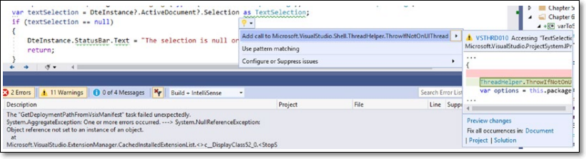   
    그림 6-17 코드 교정

    미리 보기 변경 사항을 클릭하면 코드 수정 사항이 추가된 후 코드가 어떻게 보일지 보여주는 멋진 대화 상자가 표시됩니다. 코드 변경 사항에 만족하면 적용을 클릭하거나 취소 버튼을 클릭하여 취소할 수 있습니다. 이는 그림 6-18에 나와 있습니다.

    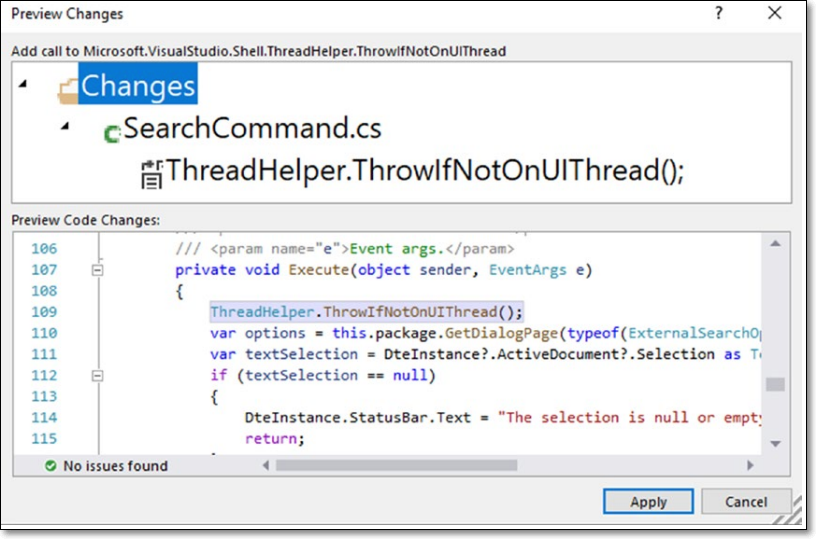   
    그림 6-18 코드 교정 변경사항 미리보기

    솔루션 탐색기에서 확장 프로젝트(VSIX 템플릿에서 생성)를 연 다음 참조, 분석기 노드를 차례로 확장하면 프로젝트에서 세 개의 분석기를 볼 수 있습니다. 세 가지 분석기는 다음과 같습니다.

    - Microsoft.CodeAnalysis.CSharp.BannedApiAnalyzers
    - Microsoft.VisualStudio.SDK.Analyzers
    - Microsoft.VisualStudio.Threading.Analyzers

    그림 6-19는 확장된 규칙 집합과 함께 VSIX 템플릿에 포함된 세 가지 분석기를 표시합니다.

    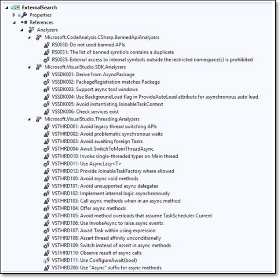   
    그림 6-19 VSIX프로젝트에서 코드 분석기

    분석기가 제공하는 실시간 피드백을 활용하여 코딩하는 동안 우리 개발자는 그렇지 않으면 포착되지 않거나 코드 검토에서 걸리거나 프로덕션에서 더 악화될 수 있는 많은 문제를 피할 수 있습니다. 따라서 진단 분석기는 특히 대규모 팀에서 모범 사례, 코딩 표준 및 팀 지침을 보다 쉽게 채택할 수 있습니다. 각 규칙의 심각도는 규칙 작성자가 결정할 수 있습니다.

    이전의 FxCop과 같은 다른 정적 코드 분석 도구와 달리 분석기의 또 다른 장점은 피드백을 제공하기 위해 생성하기 위해 코드를 컴파일하고 어셈블할 필요가 없다는 것입니다. 한편으로는 오래된 정적 분석 도구가 제공하는 피드백이 늦거나 지연되었기 때문에 여러 번 팀은 FxCop을 포기하라는 힘든 요청을 받아들여야 했습니다.

    분석기는 NuGet 패키지 또는 Visual Studio 확장으로 배포할 수 있습니다. 따라서 분석기를 쉽게 찾을 수 있습니다. NuGet 갤러리 또는 Visual Studio Marketplace에서 검색하고 설치할 수 있습니다. 사실, 모든 Visual Studio 프로젝트의 속성에는 코드 분석 탭이 있습니다. 이를 사용하여 그림 6-19와 같이 소스 코드 분석기 또는 바이너리 분석기를 구성할 수 있습니다. 그림 6-20에서 번호가 표시되면 #1은 프로젝트 속성 페이지의 코드 분석 탭을 나타냅니다. 프로젝트 속성 페이지는 솔루션 탐색기에서 프로젝트를 마우스 오른쪽 버튼으로 클릭한 다음 상황에 맞는 메뉴에서 속성을 클릭하여 볼 수 있습니다(또는 프로젝트가 선택된 상태에서 Alt Enter 키를 누름). 숫자 2는 소스 분석기를 표시합니다. 이 페이지는 권장되는 분석기 패키지도 표시하고 설치된 버전을 표시하는 UI와 새 분석기를 제거/설치하는 옵션을 제공합니다. 또한 빌드 시 분석기를 실행하고 라이브 분석 시 실행하는 옵션도 표시합니다. 소스 코드 분석기의 이점을 보여주는 링크도 있습니다. 한 번 이상 읽어야 합니다. 3번은 더 이상 사용되지 않는 바이너리 분석기 섹션을 보여줍니다. 또한 빌드 시 분석기를 실행하는 옵션을 제공합니다. 그리고 #4는 필요에 따라 규칙을 선택/선택 해제할 수 있는 활성 규칙 집합을 구성하는 방법을 표시합니다. 그림 6-21은 규칙 집합을 구성하는 화면을 표시합니다. (여기에는 수정할 수 없는 Microsoft 규칙 집합이 표시되어 있으므로 수정 후 이 규칙 집합을 다른 이름으로 저장하고 프로젝트에서 참조할 수 있습니다).

    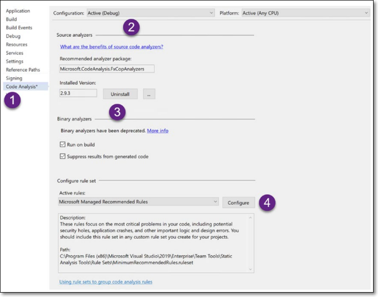   
    그림 6-20 프로젝트 등록정보에서 분석기 구성
    
    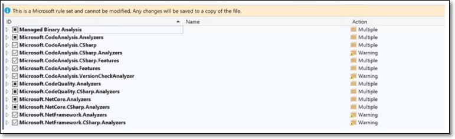   
    그림 6-21 분석기 룰셋 구성

- ### B. 코드 픽스와 진단 코드 분석기 만들기
    - **1. 프로젝트 셋업**  
    - **2. SupportedDiagnostics**  
    - **3. Initialize**  
    - **4. 진단 분석기 코딩**  
    - **5. 진단 분석기 실행**  
    - **6. 코드 픽스 만들기**  
    - **7. 확장도구 테스트**  
    - **8. 확장도구 배포**  

## 3) 코드 리팩토링 확장도구
- ### A. 확장도구 코딩
- ### B. 리팩토링 테스팅

## 4) 인텔리센스

## 5) 인텔리코드

## 6) 요약

## 7) 클래스 레퍼런스

    